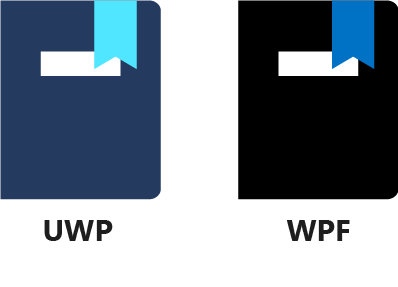

In this module, you learned how to enhance the UIs of your Universal Windows Platform (UWP) or Windows Presentation Foundation (WPF) apps by:

- Providing navigation methods and passing data between application views.
- Displaying online and offline HTML content by using a web control.
- Playing media, like audio and video, by using a `MediaElement` control.

From here, it's time to take these skills to the next level. More advanced platform features like data binding let you integrate the features of your UI with actions a user takes in your app. These are the features that make Windows 10 desktop applications so productive and powerful.

Before moving on, take this quiz to see what you've learned.
