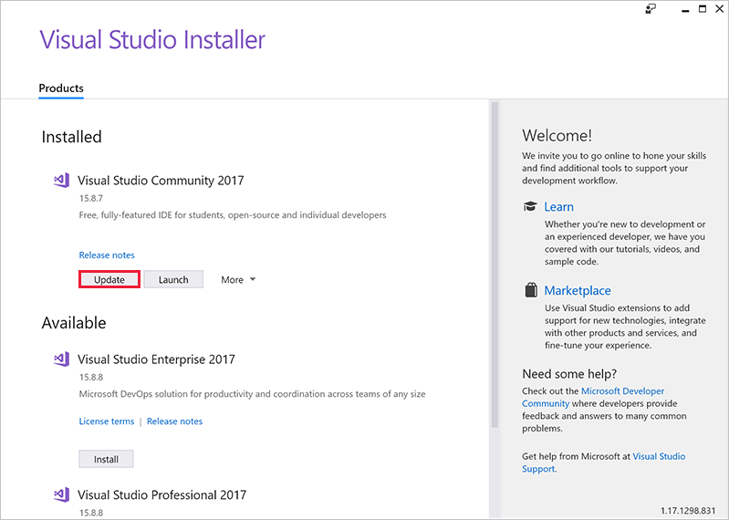
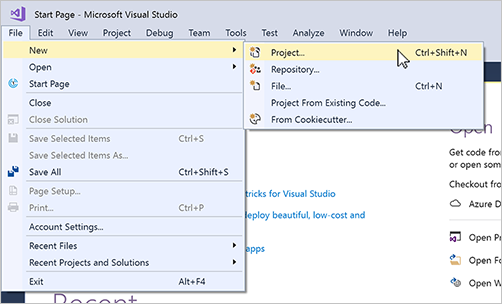
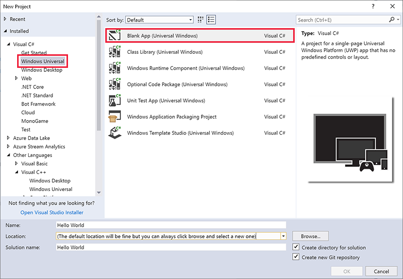
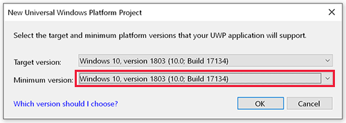
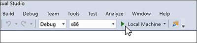
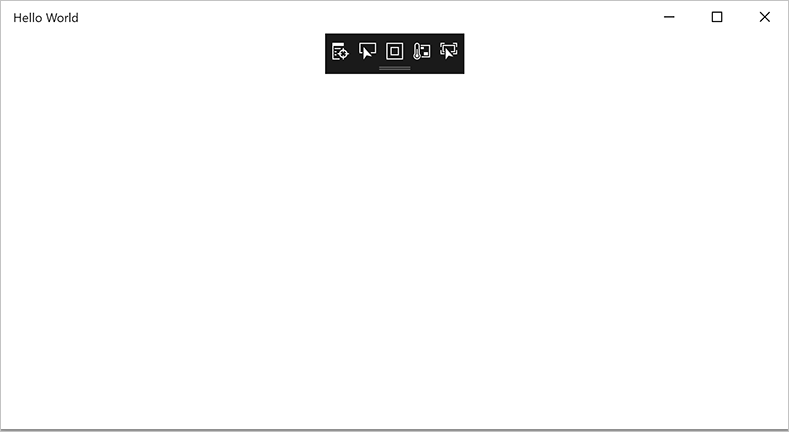

## Welcome to Visual Studio

> [!VIDEO https://www.microsoft.com/videoplayer/embed/RE2MhKX]

Visual Studio is a complete Integrated Development Environment (IDE) that you can use to develop applications for Windows, the web, and other platforms. It consists of a source code editor, designer, compiler, and debugger.

There are three editions of Visual Studio 2017: Community, Professional, and Enterprise. Visual Studio Community is free, and it's the edition we'll use in this module. If you're using a different edition, the screen images might look slightly different.

You can download and install Visual Studio directly from the [Visual Studio](https://www.visualstudio.com) website. For more complete instructions and some automated scripts to make it even easier, check out the *Introduction to Windows 10* module.

> [!NOTE]
> Don't confuse Visual Studio with Visual Studio Code. [Visual Studio Code](https://code.visualstudio.com) is a standalone editor.
>
> There's also Visual Studio for Mac. This module doesn't cover Mac development, but you can view [Visual Studio for Mac](https://visualstudio.microsoft.com/vs/mac/) for more information.

## Install or update Visual Studio

Before you start this module, you need to have Visual Studio installed. If you've already installed Visual Studio, it's a good idea to make sure you're using the latest release by running the Visual Studio Installer.

1. On the **Start** menu, select **Visual Studio Installer**.

1. If the **Update** button appears, as in the following image, select it. Visual Studio will download and install any updates.

## Some definitions

### Project

Your first apps will consist of a single *project*. Your project will consist of your source code (for example, C# and XAML), any resources your app needs (images and sounds), and other Visual Studio information.

### Solution

A *solution* can encompass more than one project. Why? Maybe your app uses another project for some key functionality. Or maybe your app runs on different types of devices and needs to be built in slightly different ways. A solution brings all these projects together into one place.

### IntelliSense

IntelliSense is a set of features that displays information about your code directly in the editor and, in some cases, writes small bits of code for you. It's like having basic documentation inline in the editor, which saves you from having to look up everything elsewhere.

## A quick tour of Visual Studio

Here's a look at the Visual Studio UI with a solution open:

*Solution Explorer* (top right) lets you view, navigate, and manage your code files. Solution Explorer can help organize your code by grouping the files into solutions and projects.

The *editor window* (center), where you'll likely spend a majority of your time, displays file contents. This is where you can edit code or design a user interface, like a window with buttons and text boxes.

The *Output window* (bottom center) is where Visual Studio sends notifications like debugging and error messages, compiler warnings, publishing status messages, and more. Each message source has its own tab.

*Team Explorer* (bottom right) lets you track work items and share code with others by using version control technologies like Git.

The previous image shows C# code, but you can also design the appearance of your app in the editor window. If you select a XAML file (for example, MainPage.xaml), the editor shows something like this:

This view shows the preview of your UI in the upper window, and the XAML used to define it underneath. You can switch between views by using the arrow button in the border between the Design and Code views near the words **Design** and **XAML**. When you make changes in the XAML file, the preview changes, and vice versa.

In this view, you can open the Toolbox (on the far left) and select controls to drag into your app's window.

> [!Important]
> If you make a change to the XAML that violates formatting rules (for example, if you mistype the name of a control, or leave out a closing > symbol), Design view will display an **Invalid Markup** message and won't be able to display the preview. If you don't immediately see a way to fix the mistake, you can step back (**Edit** > **Undo**) until the preview is working again.

## Creating a project with Visual Studio

Now that you have Visual Studio ready and waiting to go, let's quickly create a project to test everything.

1. Open Visual Studio.

2. Create a new project by selecting  **File** > **New** > **Project**.

   

3. In the list of project types, select **Installed** > **Visual C#** > **Windows Universal** > **Blank App (Universal Windows)**.

   

4. Enter **Hello World** for the name of your app. You don't need to change the **Location** and **Solution name** default values.

5. Select **OK**.

6. You'll be asked to set a **Target version** and **Minimum version** for your app. For the exercises to come, you need to set the **Minimum version** to **Windows 10, version 1803** or later.

  

   Your project will be created. The project won't be entirely empty: some files and settings are created for you.

7. Make sure your settings are the same as those shown in the following screenshot, and then select the green **Run** button in the middle of the menu bar to build and run your app (or select F5).

   

8. Soon you'll see an empty window. This is your app running. (The small black rectangle containing icons at the top of your app's window is added by Visual Studio to help debugging. It won't be in your final app.)

   

10. Stop your app by selecting the red square on the menu bar.