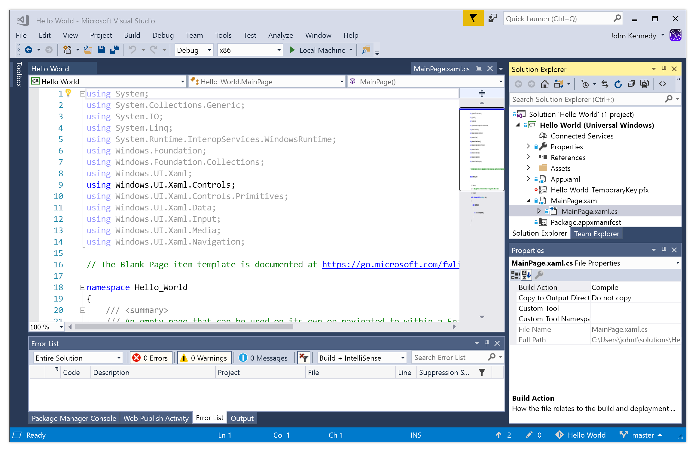
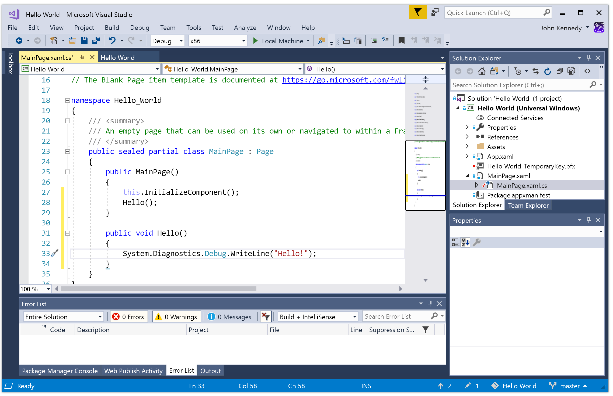
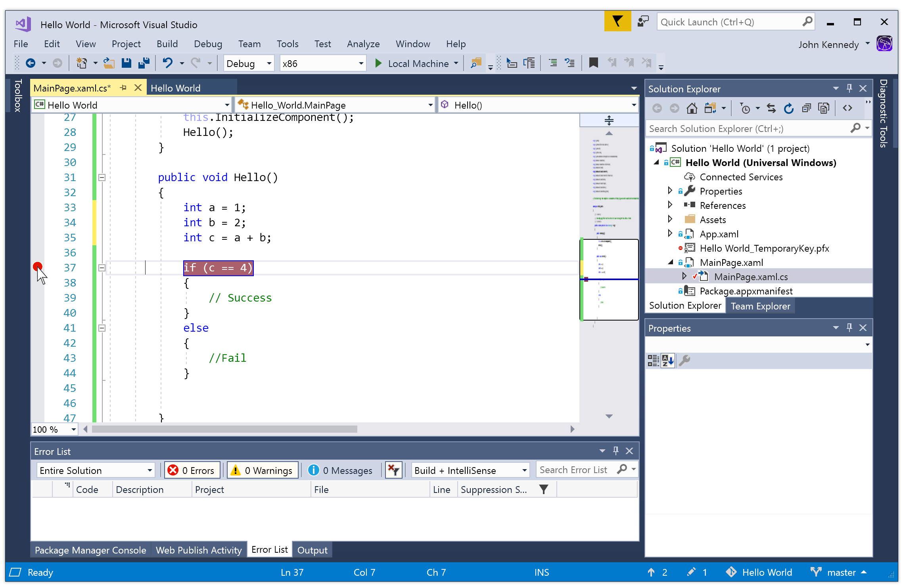
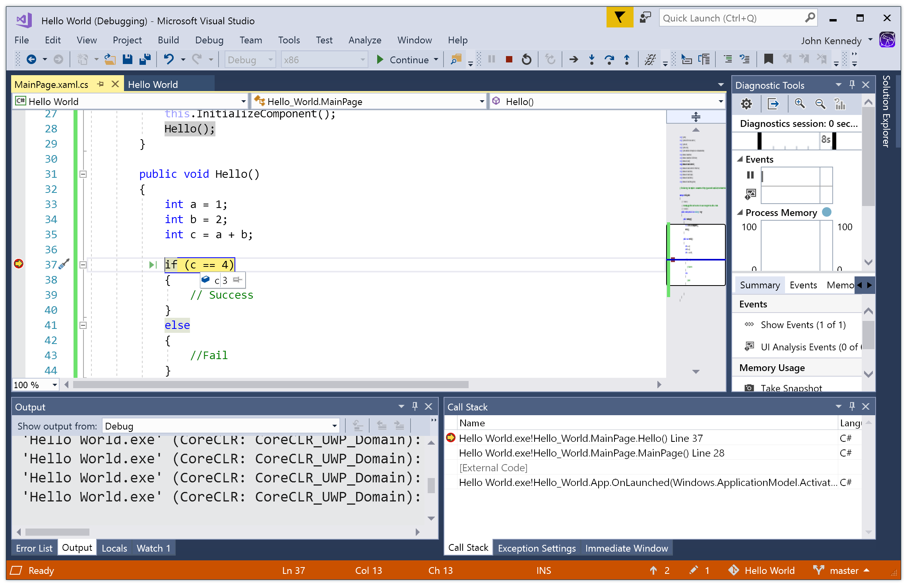
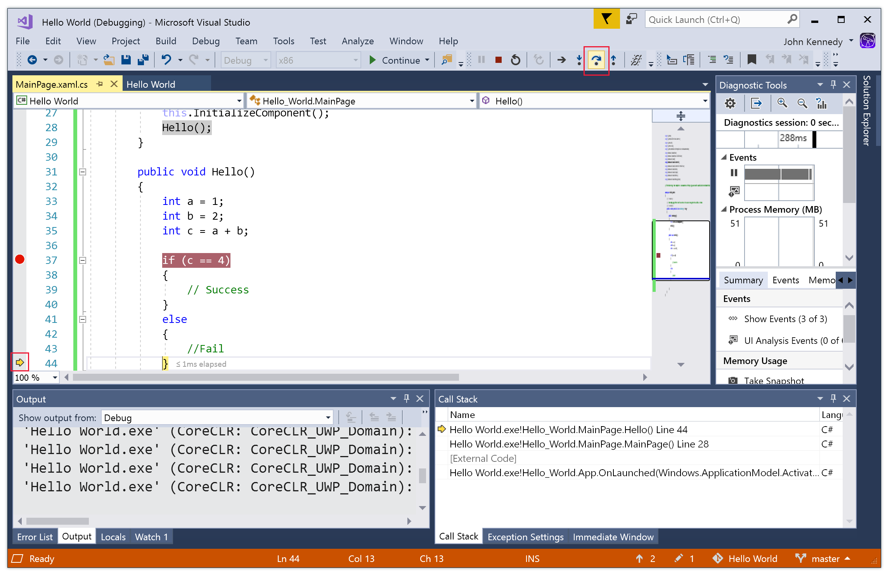

## Debugging basics

It's difficult to write error-free code the first time. Or even the second time. Here are some ways to use Visual Studio to find those pesky little bugs in your code (or great big ones).

## Simple debugging

The easiest way to debug an app is to simply add some `print` statements in your project so you can see which code is actually running. It's surprising how often bugs are caused when code that you thought was running, well, isn't. But littering your project with messages isn't recommended for anything but the simplest cases.

Here's how to add these messages to the Universal Windows Platform (UWP) project you created in the previous unit.

1. In the Solution Explorer view on the right, select **MainPage.xaml** to expand it, and then select **MainPage.xaml.cs**. This is the C# code that's associated with the main window that your app will display.



2. Scroll down the source code editor window until you find this code:

```csharp
public MainPage()
{
    this.InitializeComponent();
}
```

Change it so it looks like this code:

```csharp
public MainPage()
{
    this.InitializeComponent();
    Hello();
}

public void Hello()
{
    System.Diagnostics.Debug.WriteLine("Hello!");
}
```

Now Visual Studio will look like this: 



3. To run the project, select F5 or select the green **Run** button. After a few seconds, your app will open as a large, empty window. Minimize the window to bring Visual Studio back into view.

4. To see the message, you need to make the Visual Studio *Output window* visible. Select Ctrl+W and then O, or on the menu select **View** > **Output**, and you'll see the greeting.

> [!NOTE]
> You can also use this process to display debug text in WPF and Windows Forms apps.

## Better debugging

Now we'll use breakpoints to stop an app in its tracks and find out what's going on inside it.

1. Stop the app and update the `Hello()` method to look like this:

```csharp
public void Hello()
{
    int a = 1;
    int b = 2;
    int c = a + b;

    if (c == 4)
    {
        // Success
    }
    else
    {
        // Fail
    }
}
```

This app really wants to get the value 4. Unfortunately, there's a bug because a + b is currently equal to 3. Let's add a breakpoint to examine what's happening.

2. Click in the margin at the far left side of the screen, next to the code `int c = a + b;`. A red dot will appear. This is your *breakpoint*. Here's how it will look:



3. Press F5 or select **Run** again. This time the app will immediately stop and bring Visual Studio back to the foreground. A small yellow arrow will appear in the margin, and a line of code will be highlighted in yellow. The highlight shows you the line of code that will run next.

4. Hover over the variable `c`. A little pop-up window will show you its current value. It's 3, not 4 like our code expected! Looks like we found the bug!



5. While your program is paused, you can step through it line by line by using the **Step into**, **Step over**, and **Step out** buttons on the toolbar. Try it now. Select **Step over** and watch the yellow arrow as it follows the flow of control.



6. If you move your pointer down to hover near one of the closing braces, a little green arrow will appear. This lets you keep running the app until that location is reached, which can be useful. Try it out.

## The philosophy of debugging

A quick word on debugging. Knowing the tools at your disposal is half the battle, but understanding why things aren't working can take experience, coffee, patience, and a degree of luck. Here are some tips when things seem bleak:

- Understand that your code is doing exactly what you asked it to do, but you asked it to do the wrong thing.
- Explain your code, line by line, to a friend or even a stuffed toy. Saying things out loud can help.
- Break up your code (a form of refactoring) into smaller and smaller sections, and confirm that each section is working.
- Sometimes it can help to take a walk and clear your mind.
