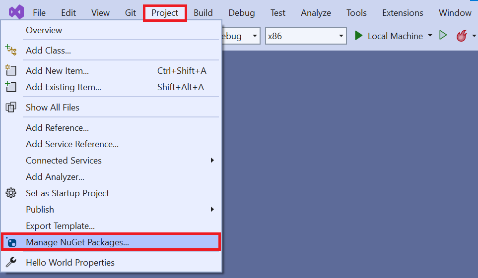
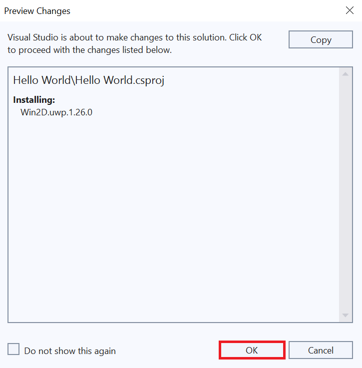
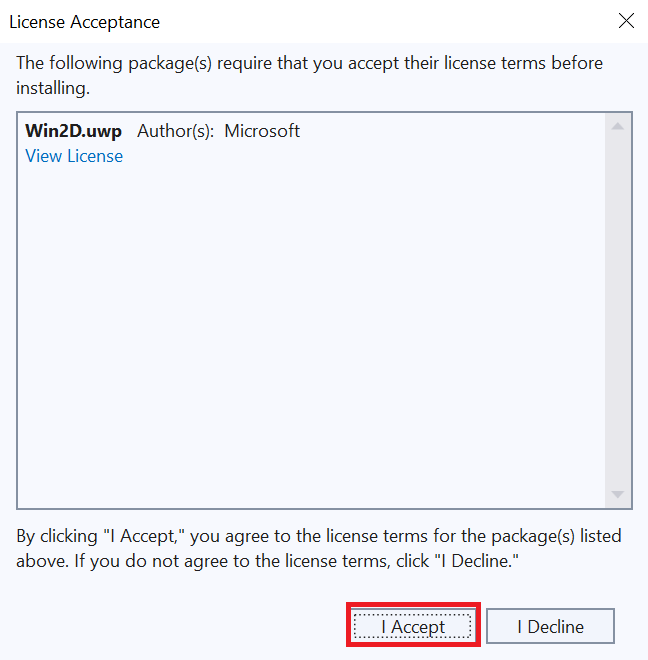
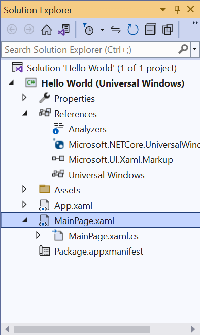
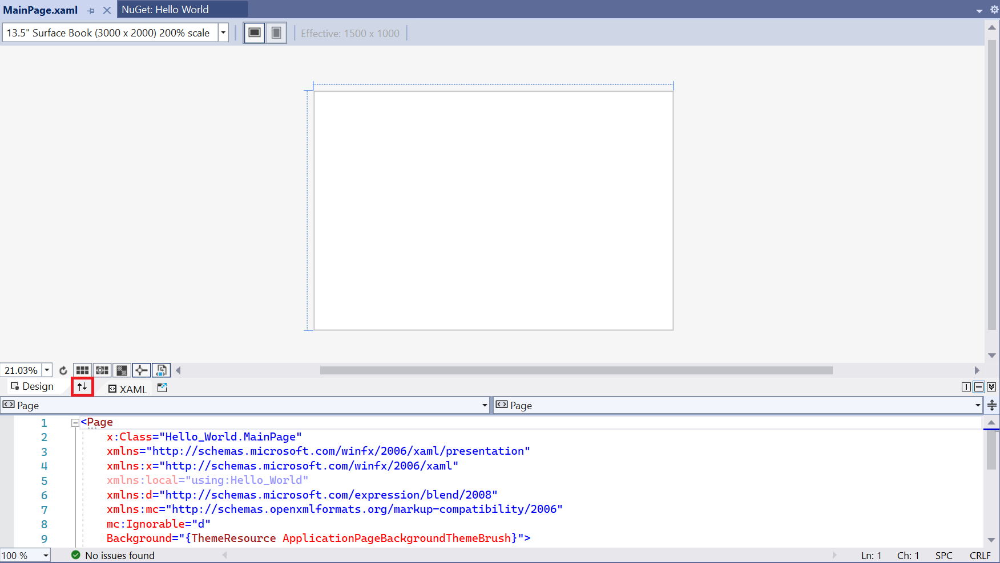

## NuGet and packages

Developers share libraries and resources by bundling their work into *packages*. A package can be pulled into Visual Studio to provide extra functionality to projects (for example, to add support for JSON or add animation routines to XAML).

NuGet is the *package manager* for .NET and UWP projects (as well as Windows Forms and WPF projects). Browse the package catalog with NuGet to install, update, or delete packages from your project. NuGet is built into Visual Studio, so you don't have to leave the IDE.

## Installing a NuGet package

Let's use NuGet to install new XAML animation features from the Win2D package:

1. Click **Project** and select **Manage NuGet Packages**.

    

2. Click **Browse** (upper-left), type **Win2D** in the search box, and press *Enter*. A list of available packages is displayed.

    

3. Select **Win2D.uwp** from the list and click the **Install** button. The package begins installing.

    

    With the package installed, we can call a feature directly in the XAML code to define our main page.

    > [!NOTE]
    > If you get an error during installation, you may not have set the correct minimum version.
    >
    > Select **Project** and click **Hello World Properties**. Change the **Min version** (use **Windows 10, version 1809** or later).

4. A *Preview Changes* window appears. Click **OK**.

    

5. A *License Acceptance* window appears. To agree to the license terms, click **I Accept**.

    

6. Double click **MainPage.xaml** in the Solution Explorer to open it in design view.

    

7. Use the **Arrows** button to expand the editing view.

    

8. Replace *all* of the XAML code in **MainPage.xaml** with this code:

    ```xml
    <Page
        x:Class="Hello_World.MainPage"
        xmlns="http://schemas.microsoft.com/winfx/2006/xaml/presentation"
        xmlns:x="http://schemas.microsoft.com/winfx/2006/xaml"
        Background="{ThemeResource ApplicationPageBackgroundThemeBrush}"
        xmlns:canvas="using:Microsoft.Graphics.Canvas.UI.Xaml">
        <Grid>
            <canvas:CanvasControl Draw="CanvasControl_Draw" ClearColor="CornflowerBlue"/>
        </Grid>
    </Page>
    ```

9. Replace all of the C# code in **MainPage.xaml.cs** with this code:

    ```csharp
    using Windows.UI;
    using Windows.UI.Xaml.Controls;
    using Microsoft.Graphics.Canvas.UI.Xaml;

    namespace Hello_World
    {
        public sealed partial class MainPage : Page
        {
            public MainPage()
            {
                this.InitializeComponent();
            }

            void CanvasControl_Draw(CanvasControl sender, CanvasDrawEventArgs args)
            {
                args.DrawingSession.DrawEllipse(155, 115, 80, 30, Colors.White, 3);
                args.DrawingSession.DrawText("Hello world!", 100, 100, Colors.White);
            }
        }
    }

    ```

    This XAML code includes a reference to the package we installed earlier.

10. Run your program to see the results.

    

    You should an elipse circling the text "Hello World!" on a blue background.

    
