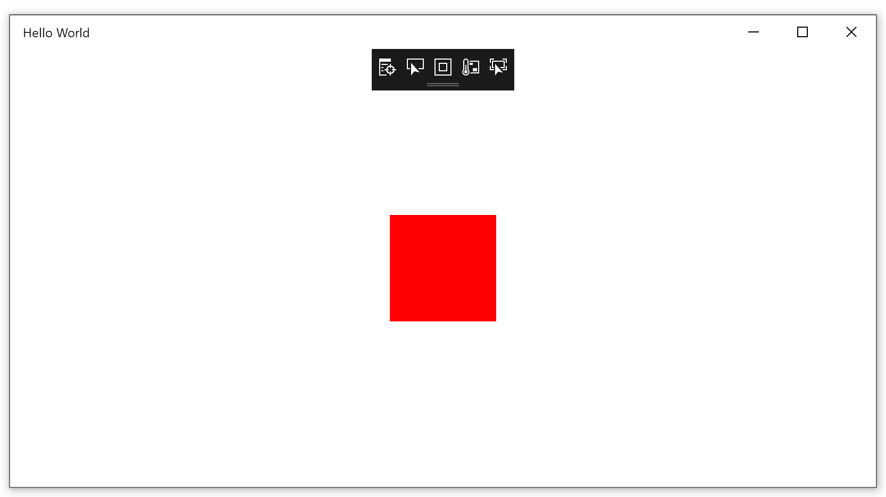

## NuGet and packages

One way developers share code libraries and resources is to bundle their work into a *package*. Packages can be pulled into Visual Studio to provide extra functionality to projects. For example, you might use a package to add more support for JSON or add animation routines to XAML.

NuGet is the *package manager* for .NET (including Windows Forms and WPF) and UWP projects. With NuGet, you can browse the package catalog and install, update, or delete packages from your project. NuGet is built right into Visual Studio, so you don't even need to leave the IDE.

## Installing a NuGet package

Let's use NuGet to install some features from the Windows Community Toolkit. Specifically, let's install some new XAML animation features.

1. On the menu, select **Project** > **Manage NuGet Packages**, and then select **Browse**.
 

1. In the search box, enter **microsoft.toolkit.uwp** to get a list of the available toolkit packages. The Windows Community Toolkit is split into several packages, and we'll install only the one we need.
 

1. Scroll down and select **Microsoft.Toolkit.Uwp.UI.Animations** from the list, and then select the arrow or **Install** button. During the installation process, you'll need to select **OK** and **Accept**.

> [!NOTE]
> If you see an error when the package is installed, your project might have defaulted to an older version of the Windows SDK when it was created. Go to **Project** > **Hello World Properties** and set the **Min version** to **Windows 10, version 1803** or later.

1. Now that the package is installed, we're going to call a feature directly in the XAML that defines our MainPage. Select **MainPage.xaml** in Solution Explorer to open in it Design view. You can use arrows to expand the XAML editing view.

1. Replace all the XAML in MainPage.xaml with this XAML:

```XAML
<Page
    x:Class="Hello_World.MainPage"
    xmlns="http://schemas.microsoft.com/winfx/2006/xaml/presentation"
    xmlns:x="http://schemas.microsoft.com/winfx/2006/xaml"
    xmlns:local="using:Hello_World"
    xmlns:d="http://schemas.microsoft.com/expression/blend/2008"
    xmlns:mc="http://schemas.openxmlformats.org/markup-compatibility/2006"
    mc:Ignorable="d"
    Background="{ThemeResource ApplicationPageBackgroundThemeBrush}"
    xmlns:interactivity="using:Microsoft.Xaml.Interactivity"
    xmlns:behaviors="using:Microsoft.Toolkit.Uwp.UI.Animations.Behaviors">
 
    <Grid>
        <Rectangle Fill="Red" Width="100" Height="100">
            <interactivity:Interaction.Behaviors>
                <behaviors:Rotate x:Name="RotateBehavior"
                              Value="360"
                              CenterX="50.0"
                              CenterY="50.0"
                              Duration="1000"
                              Delay="200"
                              EasingType="Linear"
                              AutomaticallyStart="True"/>
            </interactivity:Interaction.Behaviors>
        </Rectangle>
    </Grid>
    </Page>
```

1. This XAML includes a reference to the toolkit package. It then creates a red rectangle to which it applies the new rotation behavior. When you run the program, you'll see what happens!

 
