# Advanced Visual Studio features

It could take years to master all that Visual Studio has to offer. Here's are some highlights you might find useful.

## Themes

The Visual Studio IDE has light themes and dark themes with lots of variation between. Try switching to a dark theme:

1. Click **Tools**, hover over **Theme** and select **Dark** to apply the *Dark theme*.

    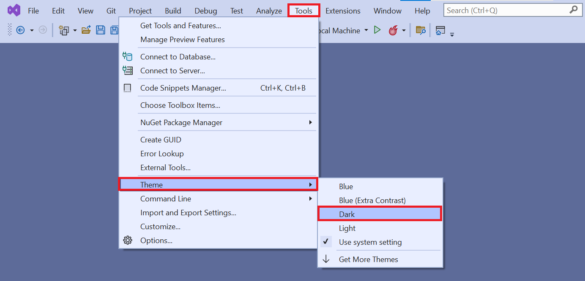

    Visual Studio with *Dark theme*:

    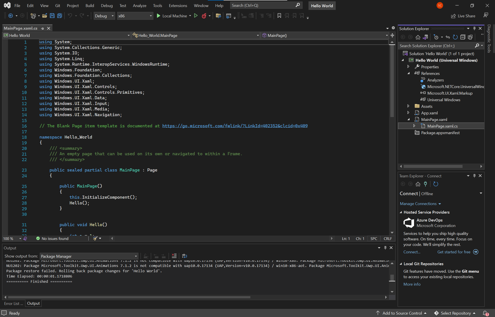

Feel free to choose your preferred theme.

## Refactoring

Visual Studio has powerful refactoring tools that apply changes to your source code in intelligent ways. For example, you can highlight a piece of code, use the refactoring tool to extract it, and turn it into a method. The tool is also great for re-naming variables.

Try it out in your project:

1. Open the **MainPage.xaml.cs** file by selecting it in the **Solution Explorer**.

    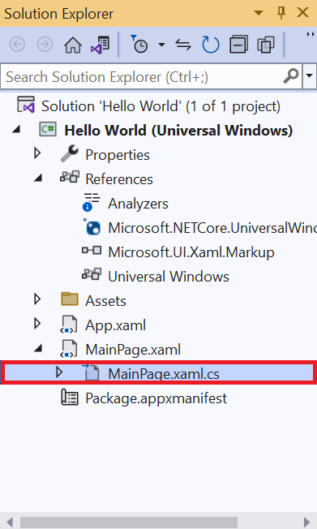

2. Hover over the method called `Hello()` nested inside of the `MainPage()` method. Right click the method and select **Rename**.

    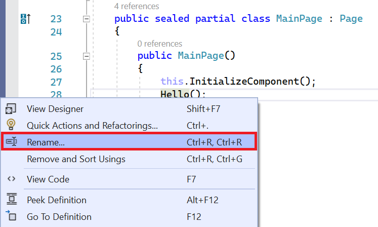

3. Type a new name and select **Apply**. Notice that the name changes everywhere it occurs.

    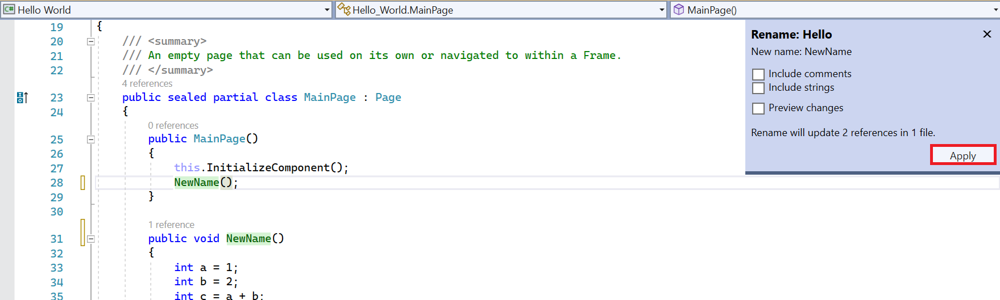

## Code snippets

Code snippets are pre-defined pieces of code that Visual Studio can add into your project. They save you a lot of typing once you've gotten familiar with them.

Use a snippet to quickly insert a `do/while` loop:

1. Open the **MainPage.xaml.cs** file by selecting it in *Solution Explorer*.

    

2. Add a new line in the `MainPage()` method.

3. Hold *Ctrl*, press *K*, and then press *X* to open the **Insert Snippet** window.

    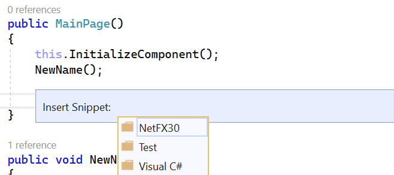

4. Click **Visual C#** and select **do** from the list. Your `MainPage()` method should look like this:

    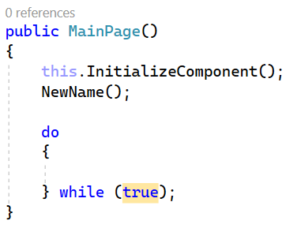

5. Enter missing information (the **do** loop requires a condition. The loop continues for as long as that condition is true).

## GitHub

GitHub is a service and website used to store code (including projects created in Visual Studio). It offers several benefits:

- *Security*: Your code is stored remotely. (What if something bad happened to your computer?)
- *Source code management*: GitHub uses Git (which makes it easy to "undo" changes and try new ideas).
- *Sharing*: GitHub makes it easy to share projects, collobarate, and use code from other developers.

Download a project from GitHub directly in Visual Studio:

1. Find the example project ([Windows coloring book sample](https://github.com/Microsoft/Windows-appsample-coloringbook)) in GitHub:

    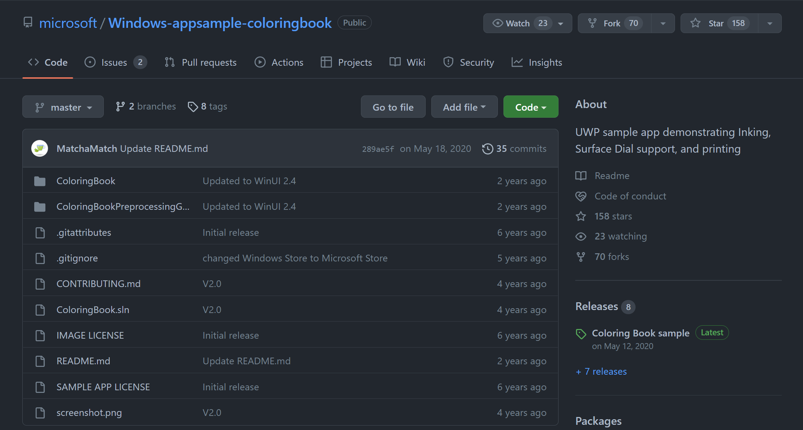

2. Click the green **Code** button. The URL for the project is displayed. Select the **clipboard icon** to copy it.

    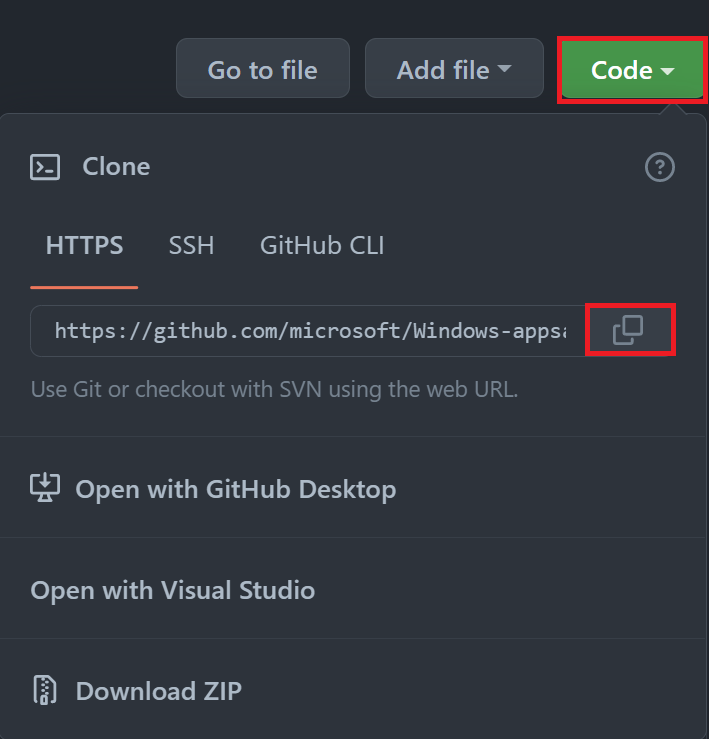

3. Open Visual Studio. Click **Git** and select **Clone Repository**.

    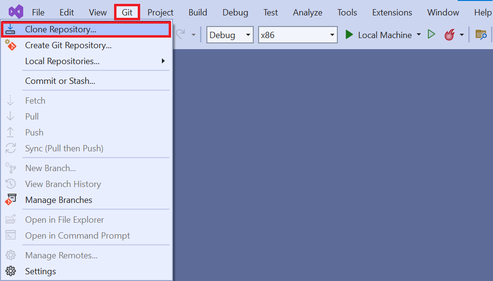

    The solution will be cloned (downloaded) to your computer.

    > [!NOTE]
    > When you first load a project you've cloned from GitHub, you may need to set the default project. This is due to the fact that solutions can contain multiple projects. You may need to specify *this* particular project as the one Visual Studio should build and run.
    >
    > You'll have to set that option manually. For this example, right-click **ColoringBook (Universal Windows)** in the *Solution Explorer* and select **Set as Startup Project**. Visual Studio will now run this project by default.

    

4. Select the **Run**(green triangle) button.

    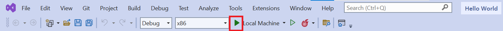

    Visual Studio may ask you to download additional components. After you confirm these downloads, the app will begin building. A loading screen displays:

    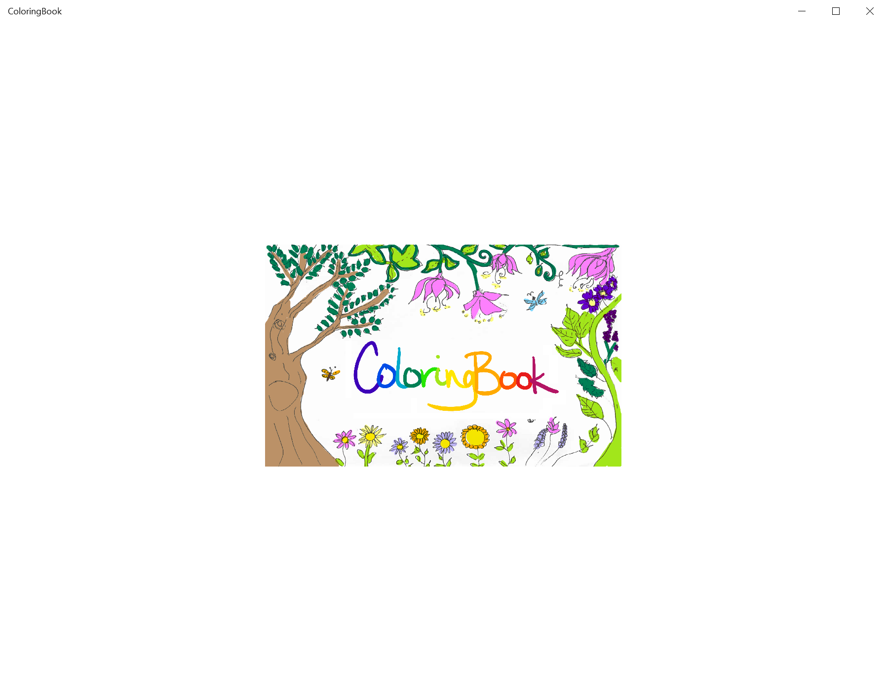

    After a few moments, a page selection screen displays:

    

### ARM, x86, or x64?

Visual Studio builds apps for different types of hardware:

- Advanced RISC Machine (ARM)-based systems.
- Computers running the 32-bit or 64-bit version of Windows.

Projects loaded from GitHub may provide the incorrect default value for system architecture (for example, it may default to `ARM` if you have an Intel computer). Check that the architecture listed next to the **Run** button matches your hardware (usually **x86**).

### Other ways to use GitHub

You can download a project from GitHub as a zip file, unzip the project, and open it directly in Visual Studio. This is a good approach if you're not planning to submit changes to the project repository or share code with other developers.

### Using Git on a daily basis

Every developer knows that tracking changes in projects can be difficult. What if you try something out, realize it was a mistake, and need revert to a previous version? What if you're working with a friend and you both make changes to the same files? These are the kinds of issues Git was designed to address.
