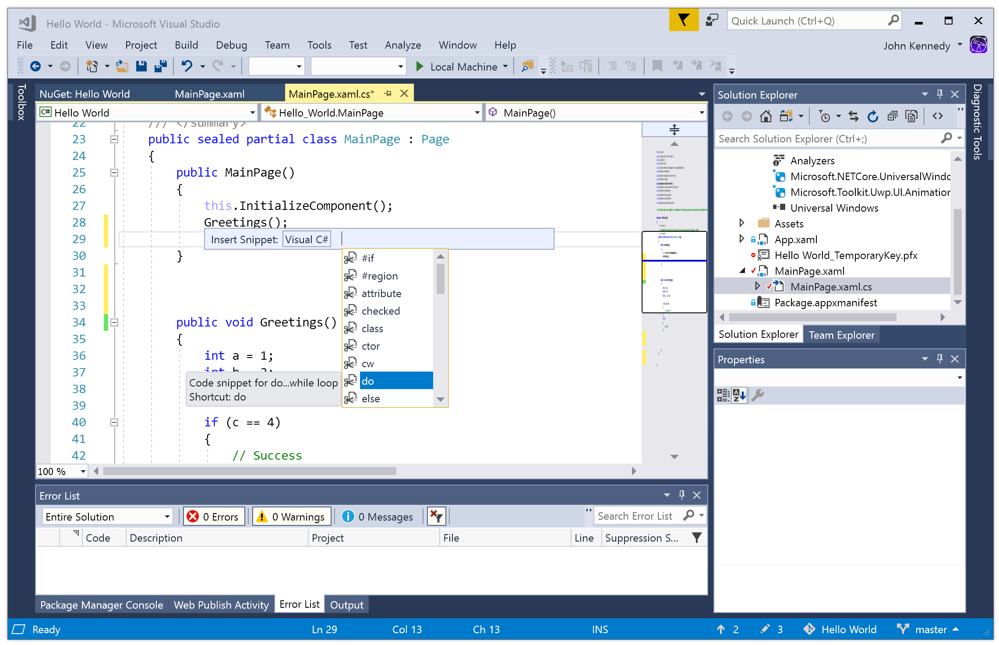
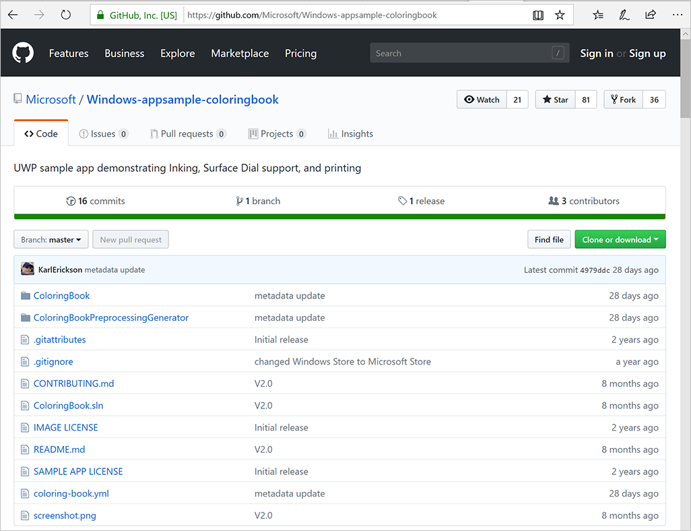
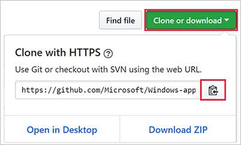
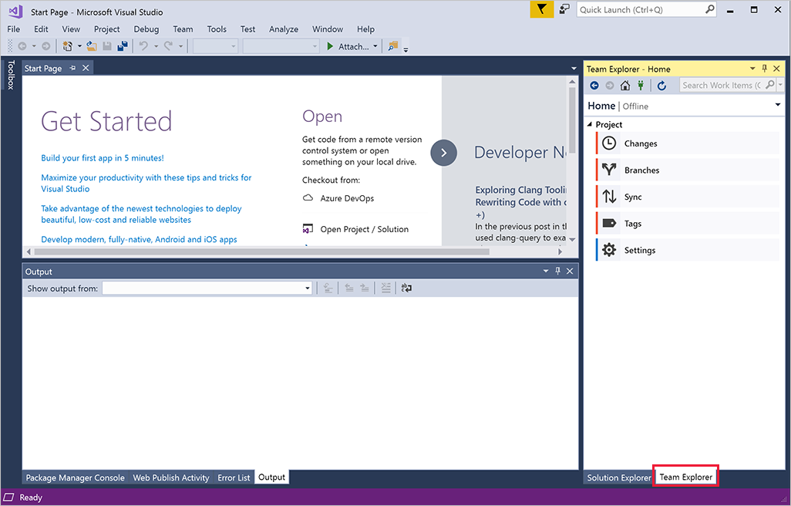
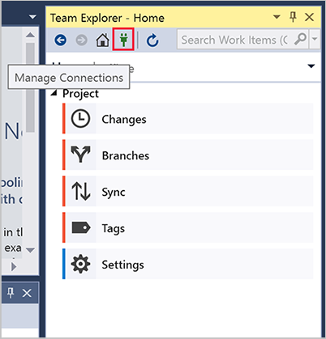
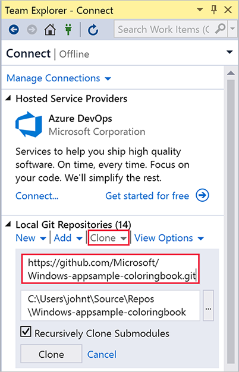
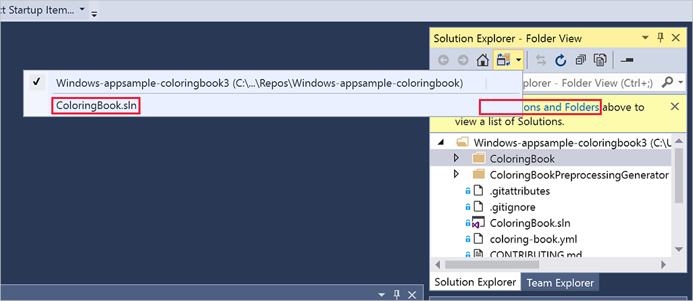

It could take years to master all that Visual Studio has to offer, but here's a quick review of some highlights you might find useful.

## Themes

The Visual Studio IDE can switch between light themes, dark themes, and lots of variations in between. Let's try switching to a dark theme:

1. On the menu bar, select **Tools** > **Options**.

1. On the **Environment** > **General** options page, change the **Color theme** selection to **Dark**, and then select **OK**.

Like it? If not, try some others! 

## Refactoring

Visual Studio has powerful refactoring tools that let you apply changes to your source code in an intelligent way. For example, you can highlight a piece of code and then use the refactoring tool to extract it and turn it into a method. The refactoring tool is also great for renaming variables.

Try it out on the project you created in the previous unit.

1. Open the **MainPage.xaml.cs** file by selecting it in Solution Explorer.

2. Hover over the method called `Hello()` in `MainPage()`.

3. Right-click and select **Rename**.

4. With the **Rename** window visible, type a new name and select **Apply**. Notice how the name changes everywhere it occurs.

## Code snippets

Code snippets are predefined pieces of code that Visual Studio can add to your project. Once you get to know them, they can save you a lot of typing.

Let's use a snippet to quickly add a `do/while` loop to our project.

1. Open the **MainPage.xaml.cs** file by selecting it in Solution Explorer.

2. Add a new line in the `MainPage()` method.

3. Select Ctrl+K and then X to open the **Insert Snippet** window.

4. Select **Visual C#** and then select **do** from the list.
 

5. Now you can enter any missing information. For example, the **do** loop requires a condition. If it's true, the loop will continue.

## GitHub

GitHub is a service and website that's used to store code projects, including projects created by Visual Studio. Here are some of the many advantages of using GitHub:

* Security. Your code is stored remotely. (What if something bad happened to your computer?)
* Source code management. GitHub uses Git, which means it's easy to "undo" or to try new ideas.
* Sharing. Best of all, GitHub makes it easy to share and collaborate on projects, and to use other developers' code.

Here's how to download a project from GitHub directly into Visual Studio:

1. Find the example project in GitHub. Select this link to [open the Windows coloring book sample](https://github.com/Microsoft/Windows-appsample-coloringbook) in GitHub.

2. Look for the green **Clone or download** button and select it. The URL for the project is listed. Select the clipboard icon to copy it.

3. Open Visual Studio. In the column on the right side, select the **Team Explorer** tab.

4. Select the **Manage Connections** icon.

5. Under **Local Git Repositories**, select **Clone**. Paste in the URL path into the upper box, where the **Enter the URL of a Git repo to clone** prompt appears.

6. If necessary, change the default location listed underneath the path you just entered. Your local copy of the project will be stored there.

7. Select **Clone**.

The solution will be cloned (downloaded) to your computer. Note that loading a project in this way might not set the default project. Because a Visual Studio solution can contain multiple projects, Visual Studio might need to be configured to use *this* particular project as the one that's built and run. You'll have to set that option manually.

8. Select the link to **Solutions and Folders**, and then select **ColoringBook.sln**.

9. Select the **Run** button

Visual Studio might try to download additional components. After you confirm that these downloads are OK, the app will build.  

### ARM or x86 or x64?

Visual Studio can build apps for many types of hardware, including Advanced RISC Machine (ARM)-based systems, and computers running both 32-bit and 64-bit versions of Windows. When you load a project from GitHub, the default value for this system architecture might be incorrect. For example, it might default to ARM when you have an Intel-based computer. Make sure that the architecture listed beside the **Run** button matches your hardware: usually this will be set to **x86**.

### Other ways to use GitHub

You can also download a project from GitHub as a zip file. You then un-archive it and open it directly in Visual Studio. This is a good approach if you don't think you're ever going send improvements back to the project or share versions with other developers on GitHub.

### Using Git on a day-to-day basis

Every developer knows that keeping track of changes in projects can be difficult. What if you try something out and then realize it was a mistake and need to go back to a previous version? Or what if you're working with a friend and you both make changes to the same files? These are exactly the kinds of situations Git can manage.