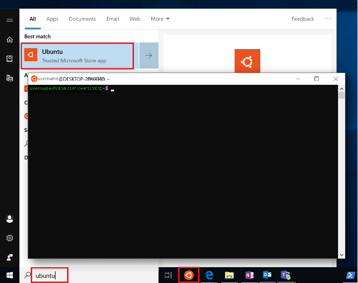
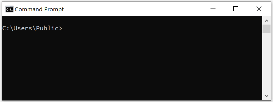
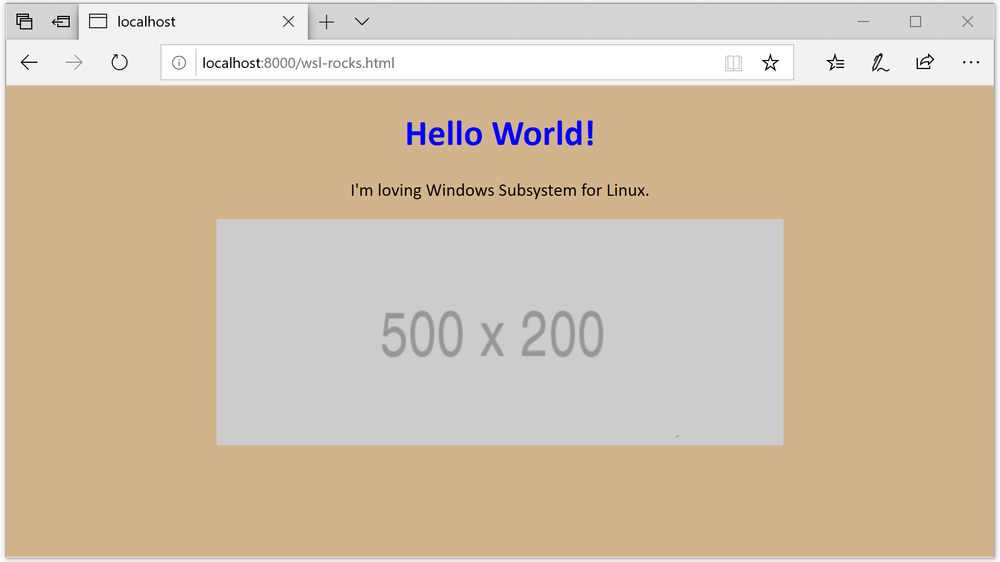

Now that you've enabled WSL and installed a Linux distribution, we'll try a few basic Linux commands, experiment with moving between the Windows and Linux file systems, and use a few of the built-in tools.

## Try a few basic Linux commands

Open the Ubuntu command line. *This is sometimes referred to as Bash shell, Terminal, Console, Command-line interface (CLI), or, more frequently for Windows, command prompt. These terms are all commonly used interchangeably.*



Let's try a few basic Linux commands.

1. Check which directory you're in by entering `pwd` (print working directory).

   This command gives us the absolute path, which means the path that starts from the root. The root is the base of the Linux file system. It's denoted by a forward slash( / ). The user directory is usually something like `/home/username`.

1. Enter `ls` to see what files are in the directory of your current path. You can see the hidden files by using the command `ls -a`.

   Displaying the hidden files will reveal the `.bash_history` file, which stores a list of commands you've used recently. (Run the command: `history` to view this list.) You can also use the hidden `.bash_logout` file to clean up tasks when you log out. Finally, you can use the `.bashrc` and `.profile` files to customize how your command line appears, declare variables, create aliases or shortcuts, and more.

1. Move to a suitable directory for our experiments. If you're using Ubuntu, a good way to move to a suitable location would be `cd /home/user`, where `user` is the name you picked when you first installed WSL.

1. Create a directory called `LearnWSL` by entering `mkdir LearnWSL`. Go to that directory by entering `cd LearnWSL`.

1. Create a file called `wsl-rocks.html` by entering `touch wsl-rocks.html`.  To see that you've successfully created the file, enter `ls`.

1. Open the `wsl-rocks.html` file by using one of the built-in text editors, like Nano or Vim. Vim can be tough for beginners, so let's use Nano. Open your `wsl-rocks.html` file with Nano by using `nano wsl-rocks.html`. The Nano text editor will open within your command window and display a list of commands at the bottom of its screen.

   > [!TIP]
   > Selecting the Tab key after you type a few characters will autocomplete a file name or path for you. So to edit the file, you could also enter `nano w` and then select Tab to complete the line.

   > [!TIP]
   > If you open Vim accidentally, exit by pressing <kbd>Ctrl+C</kbd>, and then `:q`, or `:wq` if you want to save and quit.

1. In Nano, enter some basic HTML in your `wsl-rocks.html` file:

   ```html
   <!DOCTYPE html>
   <html>
   <body style="background-color: tan; font-family: calibri; text-align: center">
   <h1 style="color: blue">My First Heading</h1>
   <p>My first paragraph.</p>
   
   </body>
   </html>
   ```

   > [!TIP]
   > Typical shortcut keys used to copy and paste (<kbd>Ctrl+C</kbd>, <kbd>Ctrl+V</kbd>) won't work in your WSL Bash shell. Instead, just right-click to paste after you've copied a piece of code.

1. Press <kbd>Ctrl+X</kbd> to exit back to the command line. Save what you wrote (Y, then press <kbd>Enter</kbd>), and then display the file contents by using `cat wsl-rocks.html`.

You'll find a link to more basic Linux commands at the end of this course. You can also use `man` to see the manual pages for a command (for example, `man tar`), or try running a command plus `--help` to see how the command can be used (for example, `nano --help`).

## Run some Linux commands by using the Windows command prompt

Running a Linux distribution on WSL shows how the file systems integrate for a seamless experience. You can call Windows binaries from the Linux command line and Linux binaries from the Windows command prompt.

Let's begin by opening the Windows command prompt (search for **cmd** in Windows search):



1. Enter `dir` to to see the files in the directory of your current path. Note that if you try the Linux equivalent of this command, `ls`, it won't work.

1. To use the Linux equivalent of the `dir` command in the Windows command prompt, enter `wsl ls`. You'll see that this Linux command now works in your Windows command prompt because you've invoked Linux.

1. You can also run your Linux distribution path right inside the Windows command prompt (or in PowerShell), by entering `wsl.exe` or `bash.exe`. These commands will switch to a display of the Linux command line, using the path for your current directory. This path will appear to be in a mounted folder, `/mnt/c`,  because we're now viewing your Windows C:\ drive folder from the Linux subsystem. You can access all of your local computer's file system from within the Linux shell by using this `/mnt/c` mounted file path.

1. Let's add another directory and file to the `LearnWSL` directory we created earlier from the Ubuntu command line. Enter `wsl.exe` to open the Bash shell if you haven't already. Because our file path is now in the `/mnt/c` C:\ drive of Windows, we'll need to determine where `LearnWSL` is located. Use `locate LearnWSL` to search for the directory. *(Oops! Notice that this attempt to locate the directory likely fails. Keep reading!)*

1. The `locate LearnWSL` command failed for a few reasons. First, the locate database runs only once a day and hasn't yet logged the new directory. You'll need to run `updatedb` to log your changes so you can locate them.

   Second, the `locate` command requires root administrative privilege, in other words, the `sudo` command.  

   So, to find the directory, you'll need to enter `sudo updatedb`, wait for the command to complete, and then enter `sudo locate LearnWSL`. These commands should return the path at which you can find the directory, probably something like `/home/user/LearnWSL` (where `user` is your user name).

1. Create a new directory with `mkdir /home/user/LearnWSL/temp` (replacing `user` with your user name).

1. To exit from the Linux shell and back to your Windows command prompt, enter `exit`. Open your Ubuntu command line now and check to see that the `temp` directory you created is there.

## Run Windows tools from WSL and mix commands

You can also mix Windows and Linux commands. Let's try it.

1. Run the Windows Notepad app from your open WSL command line by entering `notepad.exe`. Here's another useful one: try grabbing your Windows IP configuration with `ipconfig.exe`.

1. You can also run the Windows command prompt in your Ubuntu command line. Just enter `cmd.exe`. Jump up the path directory to C:\ by using `cd ../..`, and then enter `dir | findstr Users` to filter the directory listing results so that it displays only the `Users` directory. Exit the Windows command prompt by entering `exit`.

1. Try mixing Windows and Linux commands by using PowerShell. In PowerShell, enter `ipconfig.exe | grep IPv4` to use the Linux-based utility Grep to filter the IP config results so that only the IPv4 address is returned. You can see that the Windows-based `ipconfig.exe` tool works fine paired with the Linux-based `grep` command.

## Use Python with Ubuntu from PowerShell

The Python programming language is quickly growing in popularity, especially for data science, AI, and machine learning, but also for server-side web development with frameworks like Django and Flask. Python comes pre-installed with Ubuntu. Let's give it a try.

1. Open PowerShell. Enter the Ubuntu command line by using `bash.exe`.

1. Check to make sure that Python has come pre-installed with Ubuntu and to see which version is being used by entering `python3 --version`.

1. Try running a simple Python script. Enter `python3`. This command will open the Python shell inside your Ubuntu command line, which in turn is inside PowerShell. (Inception!)

1. Enter `print("Hello World")`. This is a simple Python script that will respond with "Hello World."

1. Let's try some math with Python. Try `x = 1` <kbd>Enter</kbd>, `y = 2` <kbd>Enter</kbd>, and then `x + y` <kbd>Enter</kbd>. The last command should return 3.

1. Exit from Python by entering `exit()`, or by pressing <kbd>Ctrl+D</kbd>.

1. Finally, let's try the simple HTTP local server module included with Python. We can view the `wsl-rocks.html` file that we created earlier with this local server.

   Enter `cd /home/user/LearnWSL` (replacing `user` with your user name) to open the `LearnWSL` directory you created earlier.

   Now enter `python3 -m http.server` and open a web browser.

   Go to `http://localhost:8000/wsl-rocks.html` in your web browser. You'll be able to see the HTML code that you wrote earlier running on a local server, on port 8000.  *Be sure to exit and stop your server from running by pressing <kbd>Ctrl+C</kbd>.* 

   > [!NOTE]
   > Windows might display a firewall warning the first time you launch the web server. This warning is expected. Just select **Allow access**.

   
