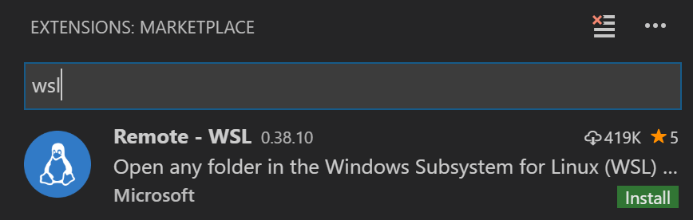
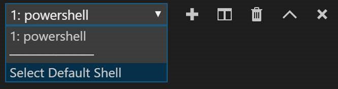
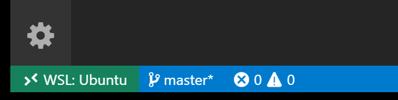
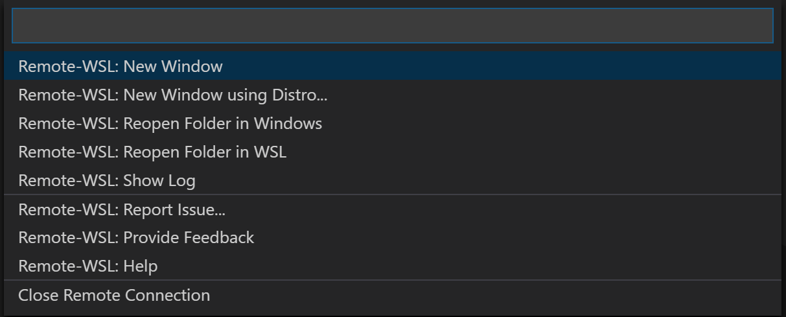

Visual Studio Code was voted the most popular web development environment in the 2018 Stack Overflow survey. It's free, available on Windows, Linux, and macOS, and has built-in Git support, an active support community, a rich gallery of extensions, and IntelliSense for autocompletion of code.

## Configure Visual Studio Code to work with WSL

Visual Studio Code contains a built-in command line that integrates with your WSL Linux distribution to establish a seamless workflow between your code editor and your Ubuntu and PowerShell tooling.  

### Install Visual Studio Code and Git for Windows

1) Download Visual Studio Code for Windows: [https://code.visualstudio.com](https://code.visualstudio.com). Visual Studio Code is also available for Linux, but we want to install the Windows version so we can edit project files from the Windows OS. You'll still be able to integrate with your Linux distribution's command line and tools.

2) When you open Visual Studio Code for the first time, you'll probably get an error: **Git not found. Install it or configure it using 'git.path' setting.** You need to install Git to power the Source Control panel in the Visual Studio Code workspace. Download and install Git for Windows from the git-scm website by using the included Install Wizard: [https://git-scm.com/download/win](https://git-scm.com/download/win).

## Install the Visual Studio Code Remote - WSL extension

In Visual Studio Code, open the Extensions view (select **View** > **Extensions** or Ctrl+Shift+X) and search for "wsl". Choose the **Remote – WSL** extension as seen below (it should be at the top of the list) and press **Install**.



The Remote - WSL extension lets you use the Visual Studio Code editor in the context of WSL with full support for language features such as IntelliSense, code navigation, debugging, and more. You can also choose to install the [Remote Development extension pack](https://marketplace.visualstudio.com/items?itemName=ms-vscode-remote.vscode-remote-extensionpack), which bundles all three Visual Studio Code remote extensions to support working over SSH and inside Docker containers in addition to WSL.

## Change the default terminal shell to WSL

In Visual Studio Code, select **View** > **Terminal** (or select Ctrl+`, using the backtick character). A command-line (or terminal shell) window will open at the bottom of your Visual Studio Code window. This window lets you run Node.js and other command-line tools without leaving Visual Studio Code. The default terminal is PowerShell.

To change the default Visual Studio Code terminal shell, open the terminal dropdown and pick **Select Default Shell**. A settings window with a list of available shells will open. Select **WSL Bash** in the list. *(You can also open the default terminal picker from the Command Palette, select the F1 key and enter **Terminal: Select Default Shell**.)*



## Where to store project files

As you learned in Unit 3 of this course, Windows and Linux files are stored in different directories. We recommend saving project files in your Windows user home directory. This setup allows Windows apps, including Visual Studio Code, to access and manipulate those files while still enabling you to access them from your Linux terminal.

Any files you have stored in `C:\Users\<windows-user-name>\` will map to this location in your WSL distro: `/mnt/c/Users/<windows-user-name>`.

> [!IMPORTANT]
> You should never edit files inside your WSL root from Windows apps.

## Update your Node.js app running on Linux and track changes with Git

Git is an open-source distributed control system. Basically a tool for storing files that maintains a history of changes, it lets multiple developers work on code in parallel. It also handles distribution of the files across local machines and a remote repository (GitHub). If you're interested in learning more about Git, see the link to more information in the resources at the end of this course.

1) From a Windows Command Prompt, create a directory for storing your project under your user home directory: `mkdir GitHub\HelloWorld`.

2) Navigate to the folder you created: `cd GitHub\HelloWorld`. Initialize the directory as a Git repo: `git init`.

3) Open your project in Visual Studio Code by running `code .` This starts a new instance of Visual Studio Code open to your folder in Windows. If you have Visual Studio Code already running, you can use the **File** > **Open Folder** menu command to open the HelloWorld folder.

4) Using the Visual Studio Code File Explorer or **File** > **New File**, create a `.gitignore` file with the contents below to prevent Git from tracking your project's Node.js dependency files and build output:

   ```
   bin
   node_modules
   ```

   You can learn more about `.gitignore` files from the [Git documentation](https://git-scm.com/docs/gitignore) and by reviewing [Node.gitignore](https://github.com/github/gitignore/blob/master/Node.gitignore), which adds other common Node.js files and folders that you may want to exclude.

   Save the file **File** > **Save** (Ctrl+S). Visual Studio Code's auto save feature (**File** > **Auto Save**) automatically saves changes after an adjustable delay (default 1000 ms).

5) With initial Git configuration done, reopen the folder in WSL using the Visual Studio Code Remote - WSL extension by running **Remote-WSL: Reopen Folder in WSL** from the Command Palette (F1). This will restart Visual Studio Code connected to WSL as indicated in the Status Bar.

   

   If you click on the Remote - WSL Status Bar indicator, it brings up a list of the **Remote-WSL** commands.

   

6) Open a new terminal in Visual Studio Code (**View** > **Terminal** Ctrl+`). Now that Visual Studio Code is running in the context of WSL, you'll see the terminal is using bash or your default Linux shell.

7) Create a web app with Express by entering `express --view=pug` and then `npm install`. Start the app on a local server by using `npm start`. Open your internet browser and go to **localhost:3000**.

8) Using the File Explorer, open the `index.pug` file in the `views` folder.

9) In Visual Studio Code, change the `index.pug` file to make it look like this code:

    ```html
    extends layout

    block content
      h1 #{title}
      p I'm over the moon!
      img(src="https://docs.microsoft.com/learn/media/crescent-timeline.png", alt="Moon Photo", srcset="")
    ```

   > [!NOTE]
   > *Optional:* Try adding another image by starting to type **img**. The Visual Studio Code *IntelliSense* feature will provide autocomplete options, including **img:srcset**. Select that option and enter **https://docs.microsoft.com/learn/media/Moon-full-minus1.png** as the source.

10) Save your changes, and then refresh your browser (F5). Your changes, including the image you added, should now appear. Any time you make additional changes to the file, save the file and refresh the browser. The changes will be reflected while your server is running.

11) Quit the http-server inside your terminal by selecting Ctrl+C.

12) Enter `git status` in your terminal to see all the files that have been created or changed in your project folder. You can find links to more information about how to use Git with Visual Studio Code in the resources section at the end of this course.
