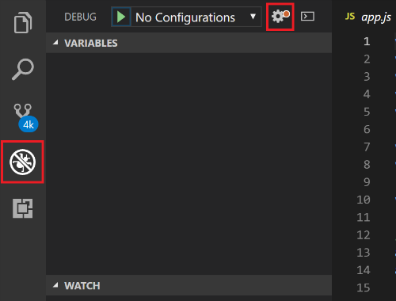
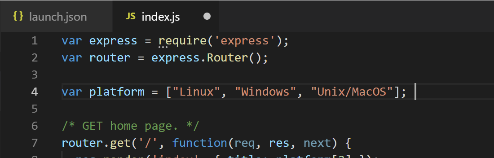
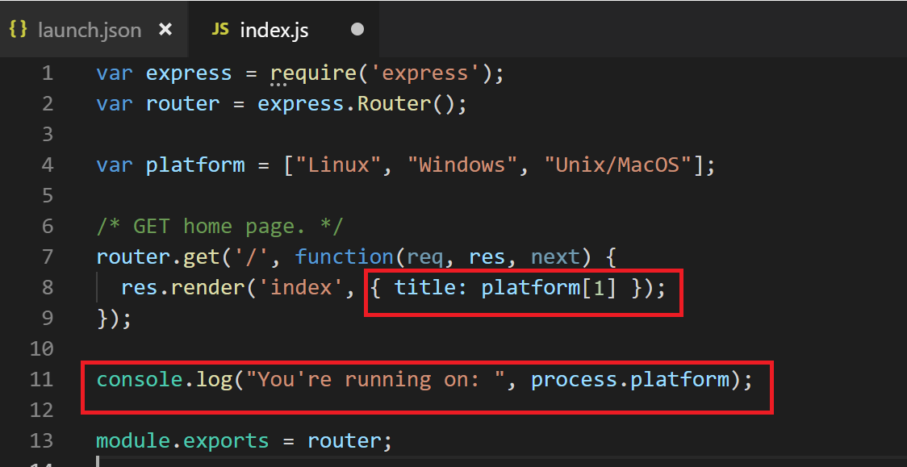
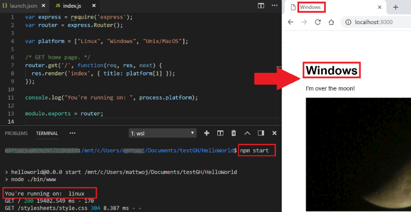
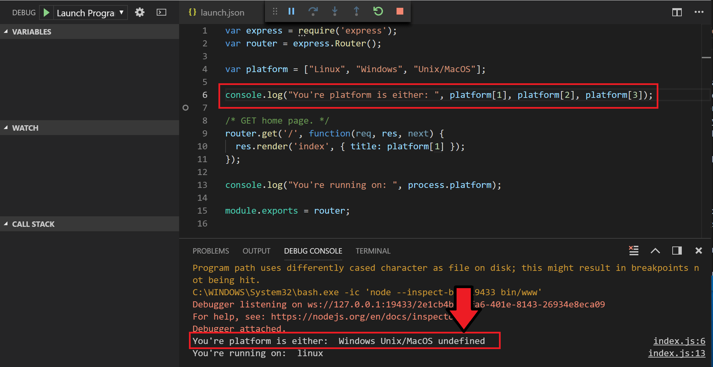
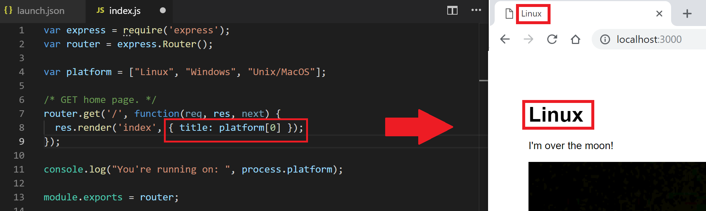

Visual Studio Code has built-in debugging support for the Node.js runtime and can debug JavaScript, TypeScript, and many other languages that are transpiled into JavaScript.

## IntelliSense

The built-in IntelliSense feature provides code completion, parameter info, member lists, and more. For example, you can require HTTP in your Node `app.js` file and get full IntelliSense against the http class as you type.

1) In Visual Studio Code, open the HelloWorld Express project from the last unit if you've closed it. Be sure that Visual Studio Code is connected to WSL by checking the Status Bar for "WSL: Ubuntu". If Visual Studio Code is running on Windows, you can run **Remote-WSL: Reopen Folder in WSL** to switch to WSL.

   Visual Studio Code remembers the state of your last session and will reopen your last folder in WSL, if that is where you were previously working. To start a new instance in Windows, you can either close the remote connection **File** > **Close Remote Connection** for an empty editor or run **Remote-WSL: Reopen Folder in Windows** to open the current project in Windows.

2) Open the `app.js` file from your Express project and hover over the word `express` on the line `var app = express();`. An IntelliSense pop-up window will point out that this function creates an Express application.

   

## Configure your project for debugging with a launch.json file

To begin debugging your Express app, you first need to create a debugger configuration file named `launch.json`. Visual Studio Code looks for a number of files when you open a directory. These files are used to customize the way Visual Studio Code behaves. `Launch.json` is one of the files used to customize the way the debugger is opened.

1) Select the **Debug** icon in the Visual Studio Code Activity Bar (on the left side) and then select the **Configure** icon (the gear) at the top of the Debug view. (Next to **No Configurations**, there should be a red dot indicating there is no configuration set up yet.) This will create a `launch.json` file inside a `.vscode` folder in the root directory of your project. (This file will probably be located at `./HelloWorld/.vscode/launch.json`.)

    

2) To start debugging, select **Start Debugging** or F5. Open the Debug Console window (Ctrl+Shift+Y) to view debug information. This window should now report that a debugger is attached.

   

3) Stop debugging. (Select Shift+F5 or the stop button in the menu.)

   Let's enter a bit of code to try a debugging test.

4) Open the `index.js` file in the `routes` folder of your project. You can see that the `index.js` file requires the Express module, sets a router, and then tells the router to `get` the home page (index) for your Express app and name it *Express*.

5) Define the variable `platform` and give it an array of values. Copy the following code and paste it between the lines where the router is defined and where it's used (as shown in the screenshot).

   ```JavaScript
   var platform = ["Linux", "Windows", "Unix/MacOS"];
   ```

   

6) Use the following code to change the title that the router displays. We want it to use variable 1 from our array:

   ```JavaScript
   /* GET home page. */
   router.get('/', function(req, res, next) {
     res.render('index', { title: platform[1] });
   });
   ```

7) Use the console log platform function to confirm which platform we're running on by adding this code:

   ```JavaScript
   console.log("You're running on: ", process.platform);
   ```

   

8) Save your changes, and then enter `npm start` in your terminal window. This will start your Express app. Open a browser and go to **localhost:3000** to see the home page of your running app.

   

   Oops! You can see that the console log tells us that we're running on Linux, but we've displayed that we're running on Windows with our code. Let's debug this and figure out what went wrong!

9) Select Ctrl+C to stop npm running your app in the terminal.

10) To better understand the problem, let's add another console log that lists the three options in the array of our `platform` variable:

    ```JavaScript
    console.log("Your platform is either: ", platform[1], platform[2], platform[3]);
    ```

11) Add the `console.log` after the `platform` variable is defined but before the router gets the home page. Place a breakpoint there so that the script will stop before rendering the home page. You can add a breakpoint by selecting the F9 key. You'll see a red dot next to the line where you added the breakpoint.

12) Run the debugger (F5). You'll see that the Debug Console window says the `platform` array contains **Windows, Unix/MacOS, undefined**.

    

    We've found our bug! JavaScript starts arrays at 0. We assumed that item 1 in our array list was Linux. This bug explains why our web app title was listed as Windows instead.  

13) Change the title-rendering code to the following code:

    ```JavaScript
    res.render('index', { title: platform[0] });
    ```

14) Run the app again from the terminal by using `npm start`. Open your browser and go to **localhost:3000**. (Refresh the browser if it's still open from before.) Now you should see the title of your web app update to **Linux**. Hurray!

    

You've successfully debugged a Node.js Express app running in a Linux Ubuntu distribution with Visual Studio Code on your Windows computer!
