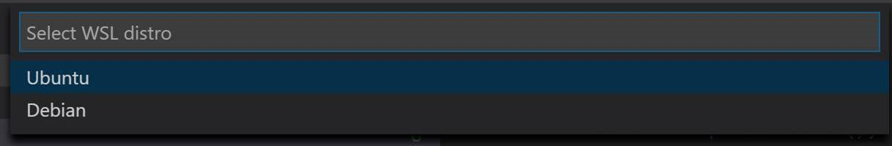

You don’t have to choose just a single Linux distribution. You can install as many of the distributions as you'd like and even run several at once. You’ll see a separate console window for each of them.

Each Linux distribution runs separately and independently, with its own separate file system and installed software. They can all access the host Windows file system, so you can share files among them.

The Linux environments use the same Windows networking stack, which means they can communicate with each other and with Windows applications. You could run an Apache web server on your Ubuntu instance, have that web server communicate with a database running on a SUSE Linux Enterprise Server instance, and then access the web server through a standard web browser installed on your Windows 10 computer. This all works without any additional firewall configuration because all the software is running on your computer, behind the firewall.

The following instructions walk through how to manage multiple Linux distributions, switch among them, and set a default distribution to work with `wsl.exe` and `wsl [command]` in PowerShell and Windows command prompt.

## WSL Config

WSL Config (`wslconfig.exe`) is a command-line tool for managing Linux distributions running on WSL. You can use it to list available distributions, set a default distribution, and uninstall distributions. To see the available options for WSL Config, enter `wslconfig.exe /?` in your Windows command prompt or in PowerShell.

## Install another Linux distribution and set a new default

1) To see a list of the Linux distributions you currently have installed, open PowerShell and enter `wslconfig.exe /list`. You will probably only see **Ubuntu (default)**.

2) Let's install another distribution from Microsoft Store. To install the distribution, go to [Debian GNU/Linux](https://www.microsoft.com/store/apps/9MSVKQC78PK6). Select the **Get** button, wait for the distribution to install, and then select **Launch**.

3) After the new distribution starts, it will prompt you to choose a new UNIX user name and password. After you do so, open PowerShell again and enter  `wslconfig.exe /list`. You should now see your multiple Linux distributions represented, including an indicator that your Ubuntu distribution is still set to be the default for use with commands in PowerShell, like `wsl.exe`.

4) Set the new Debian distribution to be the default when running WSL on the command line (or in PowerShell) by using `wslconfig.exe /setdefault Debian`. Run `wslconfig /list` again and make sure that Debian is now marked as the default.

   Now if you're using PowerShell and enter `wsl`, you'll open a Debian distribution command prompt rather than a Ubuntu command prompt.

5) If you no longer want the Debian distribution installed on your computer, you can unregister it by using `wslconfig.exe /unregister Debian`.

   **When you unregister a Linux distribution, all data, settings, and software associated with that distribution will be permanently lost. Reinstalling from Microsoft Store will install a clean copy.**

   > [!NOTE]
   > There are launch settings and configuration options that can be applied to WSL every time you launch the subsystem by using `wsl.conf`. To learn more, see the resources at the end of this course.

## Visual Studio Code multiple distro support

The Visual Studio Code Remote - WSL extension keeps track of the Linux distributions you have installed. When you reopen a folder in WSL (**Remote-WSL:Reopen Folder in WSL**) or open a new Window with the **Remote-WSL: New Window using Distro**, you see a picker with the available distros listed.

This lets you quickly switch distros without needing to set a new default with `wslconfig.exe`.
