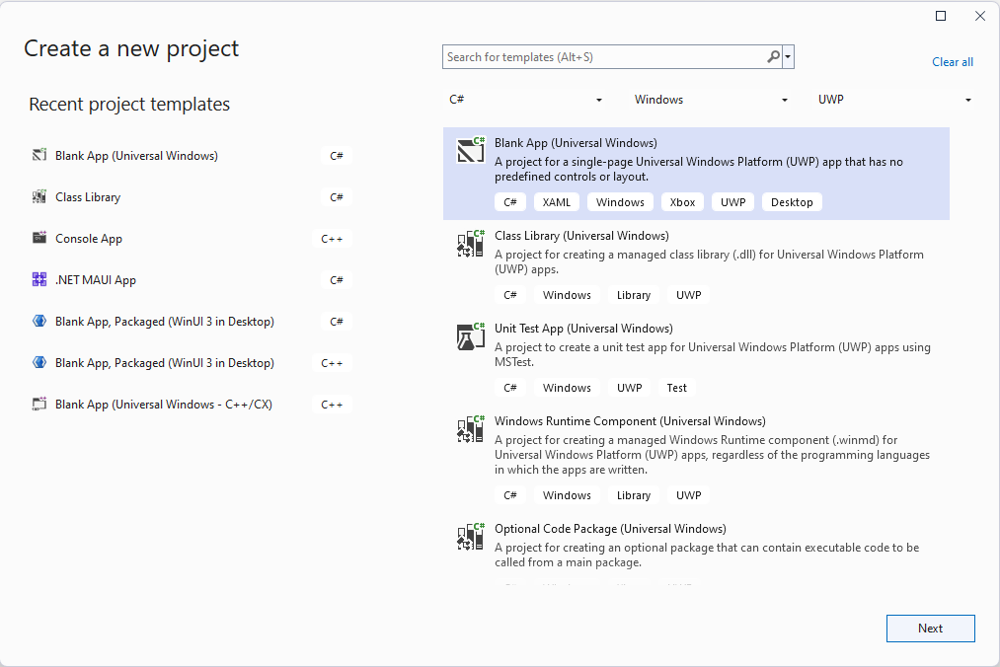
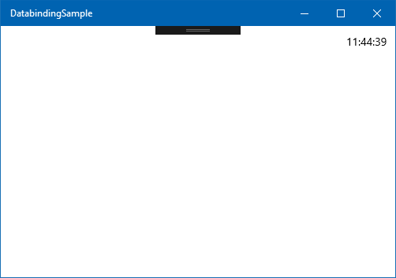
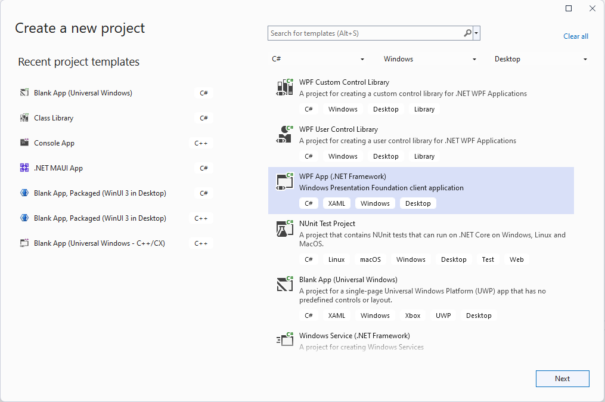
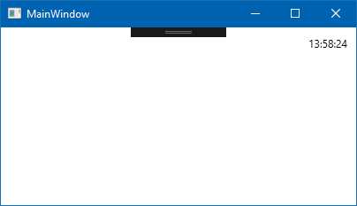

In this lesson, you learn how to create an app that shows the current time. The lesson introduces the fundamentals of data binding, getting data from the code to the UI of your app, and refreshing it to update the clock display on the UI. This lesson forms the basis for more complex data binding tasks in later lessons. So, let's get started!

::: zone pivot="uwp"


#### 1. Create the project

If it's not running already, open Visual Studio. Create a new C# Windows Universal project by using the **Blank App (Universal Windows)** template. Call it **DatabindingSample**. This project is the one you'll work with during the entire UI and Data module.



When you click **OK**, Visual Studio prompts you to enter the target and minimum Windows versions. This project is only an exercise project, and you're not planning on deploying it to computers running an older version of Windows. Therefore, you can select the most recent version of Windows for both the minimum and the target version, and then click **OK**.

#### 2. Add the TextBlock for the clock display

When the project has been fully initialized and loaded, open `MainPage.xaml` by double clicking it in the Solution Explorer.

> [!TIP]
> If you're running low on screen space, use the dropdown in the top left corner to switch the editor to simulate a lower resolution screen. We recommend using **13.3" Desktop (1280x720) 100% scale** for this module, but choose the one that feels the most comfortable.

Add the following line between the opening and closing tags of the `Grid` element.

```xml
<TextBlock HorizontalAlignment="Right" 
           Margin="10" 
           Text="{x:Bind CurrentTime}" />
```

This creates a new `TextBlock` on the top right-hand side of the window, with a 10-unit margin from the edge. Next, let's address the `Text` of the `TextBlock`.

The `Text={x:Bind CurrentTime}` part is your first encounter with data binding. `x:Bind` is an XAML markup extension that is compiled into C# code along with the rest of your app. Here, it connects the `Text` property of the `TextBlock` to the `CurrentTime` property. If you try to compile the project now, you receive the following error message:

*XamlCompiler error WMC1110: Invalid binding path 'CurrentTime' : Property 'CurrentTime' can't be found on type 'MainPage'*

This indicates that the compiler is missing a `CurrentTime` property from the `MainPage`. Once we create that property, its content is displayed in the `TextBlock` in the top right-hand corner.

> [!NOTE]
> UWP also supports an older data binding method, which looks like this: `Text={Bind CurrentTime}`. This older method works somewhat differently than `{x:Bind}`. Most notably, it doesn't offer compile time errors if you have a typo. In this module, we focus exclusively on the new `{x:Bind}` way of binding, which does provide compile-time error checking. However, `{x:Bind}` is less mature than `{Bind}`, and receives new features, which is why we've chosen to go with the latest Windows version for creating the project.

#### 3. Create the `CurrentTime` property

Open **MainPage.xaml.cs**, and add the following property definition to the `MainPage` class.

```cs
public string CurrentTime => DateTime.Now.ToLongTimeString();
```

If you're not familiar with the above syntax, it's called an *expression-bodied member*. It was introduced in C# 6.0, and is shorthand for the following:

```cs
public string CurrentTime 
{
    get { return DateTime.Now.ToLongTimeString(); }
}
```

#### 4. Run the app

If you launch the app now (by using the F5 key or the **Debug / Start Debugging** command in the menu), the app compiles and runs. What's even better is that it seems to work! The current time is displayed in the top right-hand corner.



However, something isn't right because the clock doesn't update. It's stuck at the time the app was first launched. How would the app know when to refresh the value in the `TextBlock`? We have to tell the UWP runtime to update it once per second.

#### 5. Specify binding modes

`{x:Bind}` bindings are highly optimized for performance. Meaning that they don't do anything that the developer hasn't explicitly asked for. So by default, an `{x:Bind}` binding only evaluates the binding source (in our case, the `CurrentTime` property) once. This kind of binding is called `OneTime` binding. If we want the UWP framework to keep updating the UI, we have to explicitly specify another binding mode: either `OneWay` or `TwoWay`.

`TwoWay` binding mode indicates a bi-directional binding between our C# code (the logic) and the UI. This type of binding will be useful later when we're binding to controls that the user can manipulate. But for a `TextBlock`, a `OneWay` binding is preferred because the data changes will only originate in the code, never on the UI.

To specify a `OneWay` binding mode for our `TextBlock`, change `{x:Bind CurrentTime}` to `{x:Bind CurrentTime, Mode=OneWay}`. The entire `TextBlock` tag within the `Grid` should now look like this markup.

```xml
<TextBlock HorizontalAlignment="Right" 
           Margin="10" 
           Text="{x:Bind CurrentTime, Mode=OneWay}" />
```

The binding instructs the UWP runtime to build the necessary infrastructure to track changes to the `CurrentTime` property, and reflect it in the `Text` of the `TextBlock`. This additional infrastructure takes up a tiny amount of memory and CPU cycles, and that's why it's not the default.

If you run the app now, the clock still won't update. We need to notify the system that the `CurrentTime` property has changed.

#### 6. Implement the `INotifyPropertyChanged` interface

This notification happens through the `INotifyPropertyChanged` interface. It's a simple interface with a single event.

```cs
public interface INotifyPropertyChanged
{
    event PropertyChangedEventHandler PropertyChanged;
}
```

Any class that has a simple C# property as the source of data binding must implement the `INotifyPropertyChanged` interface. The class must fire the `PropertyChanged` event when the UI should be updated. Let's go ahead and add the interface to the `MainPage` class declaration.

```cs
public sealed partial class MainPage : Page, INotifyPropertyChanged
```

We also have to implement the interface by adding the `PropertyChanged` event to the class.

```cs
public event PropertyChangedEventHandler PropertyChanged;
```

#### 7. Invoke the `PropertyChanged` event every second

All that's left is to invoke the `PropertyChanged` event every time we want to update the clock (that is, every second). To start, let's declare a `DispatcherTimer` object in the `MainPage` class.

```cs
private DispatcherTimer _timer;
```

Now let's set it up in the constructor (after the `InitializeComponent` call) so that it fires every second.

```cs
_timer = new DispatcherTimer { Interval = TimeSpan.FromSeconds(1) };

_timer.Tick += (sender, o) =>
    PropertyChanged?.Invoke(this, new PropertyChangedEventArgs(nameof(CurrentTime)));

_timer.Start();
```

The first line above creates the timer with a one-second interval, and the last line starts it. Let's examine what happens when the timer fires (in the second line).

`PropertyChanged?.Invoke` is shorthand for checking whether an event is null and, if not, invoking it. Like most events, the first argument is the sender (`this`). The second argument for the `PropertyChanged` event is a newly created `PropertyChangedEventArgs` object, which has a constructor expecting a string as the property name. So the subscribers to the `PropertyChanged` event (in this case, the UWP system) will receive the name of the updated property, and can act accordingly.

> [!TIP]
> Don't use string literals (such as `"CurrentTime"`) for the property name. Using the string itself is prone to typos, which can result in hard-to-debug issues when the UI is not being updated. Additionally, an innocent renaming of the property can also introduce errors if the string constants are not updated. It's a good practice to always use the `nameof` expression, which is immune to typos and can follow renamings.

The entire MainPage.xaml.cs should look like the following:

```cs
namespace DatabindingSample
{
    public sealed partial class MainPage : Page, INotifyPropertyChanged
    {
        private DispatcherTimer _timer;

        public MainPage()
        {
            this.InitializeComponent();
            _timer = new DispatcherTimer { Interval = TimeSpan.FromSeconds(1) };
            
            _timer.Tick += (sender, o) =>
                PropertyChanged?.Invoke(this, new PropertyChangedEventArgs(nameof(CurrentTime)));

            _timer.Start();
        }

        public string CurrentTime => DateTime.Now.ToLongTimeString();
        public event PropertyChangedEventHandler PropertyChanged;
    }
}
```

#### 8. Run the app

If you run the app now, the clock updates. Congratulations, you have created your first data binding!

#### 9. Summary

You now know how to use `{x:Bind`} to create a fast and automatic way of getting data from code to the UI of your UWP application. This technique is checked at the time of compiling. You have also become familiar with the `INotifyPropertyChanged` interface. This interface lets your application notify the UWP framework when a data bound property has changed and the UI should be updated.

::: zone-end

::: zone pivot="wpf"


#### 1. Create the project

If it's not running already, open Visual Studio. Create a new C# WPF project by using the **WPF Application** template. Call it **DatabindingSampleWPF**, and then select **OK**. This project is the one you'll work with during the entire UI and Data module.



#### 2. Create the Clock class

Because our task is to display the current time, it makes sense to create a `Clock` class first. Right-click the `DatabindingSampleWPF` project in **Solution Explorer**, select **Add / Class**, and enter `Clock` as the class' name.

Copy the following code into the newly created file:

```cs
using System;

namespace DatabindingSampleWPF
{
    public class Clock
    {
        public string CurrentTime => DateTime.Now.ToLongTimeString();
    }
}
```

If you're not familiar with the above syntax for the `CurrentTime` property, it's called an *expression-bodied member*. It was introduced in C# 6.0, and is shorthand for the following:

```cs
public string CurrentTime 
{
    get { return DateTime.Now.ToLongTimeString(); }
}
```

As you can see, all the `Clock` class has so far is a simple `string` property that returns the current time in a long time format. The next step is to display the time within the app itself.

#### 3. Add the TextBlock for the clock display

If you have `MainWindow.xaml` open in Visual Studio, select its tab. If not, you can open it by double-clicking it in the Solution Explorer.

Add the following line between the opening and closing tags of the `Grid` element.

```xml
<TextBlock HorizontalAlignment="Right" 
           VerticalAlignment="Top"
           Margin="10" 
           Text="{Binding CurrentTime}">
    <TextBlock.DataContext>
        <local:Clock/>
    </TextBlock.DataContext>
</TextBlock>
```

This markup will create a new `TextBlock` on the top right-hand side of the window, with a 10-unit margin from the edge.

The `Text="{Binding CurrentTime}"` part is your first encounter with data binding. `{Binding}` is an XAML markup extension. Here, it  connects the `Text` property of the `TextBlock` to the `CurrentTime` property - but the `CurrentTime` property of which object?

The object the data binding refers to is instantiated in the `DataContext` of the `TextBlock`. So, the above XAML code not only creates a `TextBlock` control, but also instantiates a `Clock` object. Further, the code binds the `Text` property of the `TextBlock` to the `CurrentTime` property of the `Clock` object it created. The `CurrentTime` property is called the binding's *source*, while the `Text` property is called the binding's *destination*.

#### 4. Run the app

If you launch the app now (by using the F5 key or the **Debug / Start Debugging** command in the menu), the app compiles and runs. What's even better is that it seems to work! The current time is displayed in the top right-hand corner.



However, something isn't right because the clock doesn't update. It's stuck at the time the app was first launched. How would the app know when to refresh the value in the `TextBlock`? We have to tell the WPF runtime to update it once per second.

In other words, we need to notify the system that the `CurrentTime` property has changed.

#### 5. Implement the `INotifyPropertyChanged` interface

This notification happens through the `INotifyPropertyChanged` interface. It's a simple interface with a single event.

```cs
public interface INotifyPropertyChanged
{
    event PropertyChangedEventHandler PropertyChanged;
}
```

Any class that has a simple C# property as the source of data binding must implement the `INotifyPropertyChanged` interface. The class must fire the `PropertyChanged` event when the UI should be updated. Let's go ahead and add the interface to the `Clock` class declaration.

```cs
using System.ComponentModel;

public class Clock : INotifyPropertyChanged
{
```

We also have to implement the interface by adding the `PropertyChanged` event to the class.

```cs
public event PropertyChangedEventHandler? PropertyChanged;
```

#### 6. Invoke the `PropertyChanged` event every second

All that's left is to invoke the `PropertyChanged` event every time we want to update the clock (that is, every second). To start, let's add the `System.Windows.Threading` namespace to the `using`s, and declare a `DispatcherTimer` object in the `Clock` class.

```cs
private DispatcherTimer _timer;
```

Now set it up in the constructor, so that it fires every second.

```cs
public Clock()
{
    _timer = new DispatcherTimer { Interval = TimeSpan.FromSeconds(1) };
    
    _timer.Tick += (sender, o) => PropertyChanged?.Invoke(this,
            new PropertyChangedEventArgs(nameof(CurrentTime)));
    
    _timer.Start();
}
```

The first line in the constructor creates the timer with a one-second interval, and the last line starts it. Let's examine what happens when the timer fires (in the second line).

`PropertyChanged?.Invoke` is shorthand for checking whether an event is null and, if not, invoking it. Like most events, the first argument is the sender (`this`). The second argument for the `PropertyChanged` event is a newly created `PropertyChangedEventArgs` object, which has a constructor expecting a string as the property name. So the subscribers to the `PropertyChanged` event (in this case, the WPF system) will receive the name of the updated property, and can act accordingly.

> [!TIP]
> Don't use string literals (such as `"CurrentTime"`) for the property name. Using the string itself is prone to typos, which can result in hard-to-debug issues when the UI is not being updated. Additionally, an innocent renaming of the property can also introduce errors if the string constants are not updated. It's a good practice to always use the `nameof` expression, which is immune to typos and can follow rename operations.

The entire `Clock.cs` should look like the following:

```cs
namespace DatabindingSampleWPF
{
    using System;
    using System.ComponentModel;
    using System.Windows.Threading;

    public class Clock : INotifyPropertyChanged
    {
        private DispatcherTimer _timer;

        public string CurrentTime => DateTime.Now.ToLongTimeString();

        public event PropertyChangedEventHandler PropertyChanged;

        public Clock()
        {
            // setup _timer to refresh CurrentTime
            _timer = new DispatcherTimer { Interval = TimeSpan.FromSeconds(1) };
            _timer.Tick += (sender, o) => PropertyChanged?.Invoke(this, new PropertyChangedEventArgs(nameof(CurrentTime)));
            _timer.Start();
        }
    }
}
```

#### 7. Run the app

If you run the app now, the clock updates. You have created your first data binding!

#### 8. Summary

You now know how to use `{Binding}` to create a fast and automatic way of getting data from code to the UI of your WPF application. You have also become familiar with the `INotifyPropertyChanged` interface. This interface lets your application notify the WPF framework when a data bound property has changed and the UI should be updated.

::: zone-end
