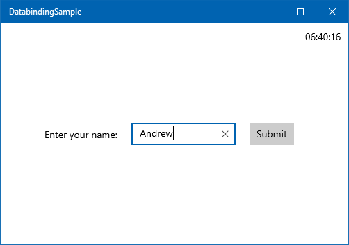
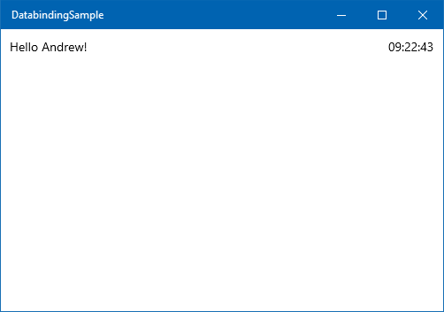
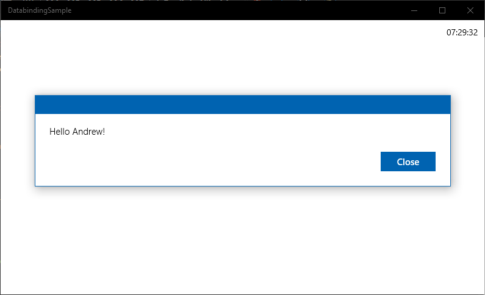
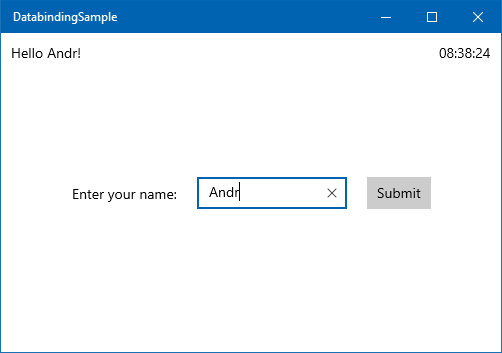
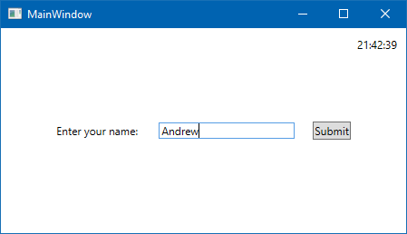
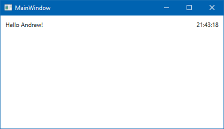
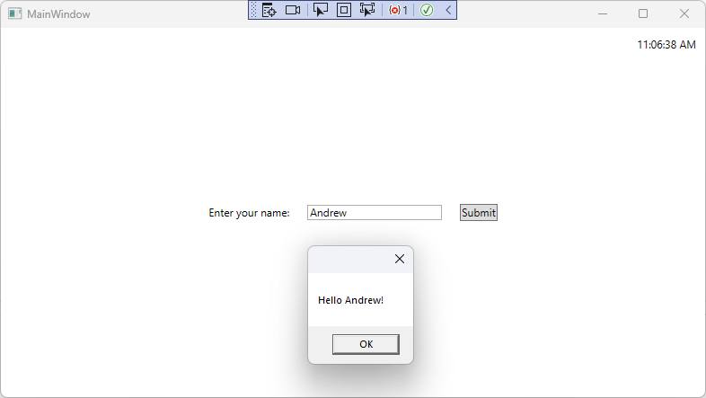
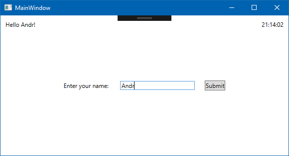

::: zone pivot="uwp"

:::image type="icon" source="../media/tech-uwp.png":::

In this lesson, we explore how you can use data binding for data entry, showing and hiding pieces of UI based on the app's state. You'll also get familiar with the full `INotifyPropertyChanged` pattern.

Let's expand our existing demo with a friendly greeting that looks like this.



When you select the **Submit** button, the app will display a simple greeting at the top.



#### 1. Open the solution

If you don't have Visual Studio open with the project you've created during the last lesson, open it now.

#### 2. Create the data entry UI

The data entry UI is simple: just a `TextBlock`, a `TextBox`, and a `Button`, in a single horizontal layout in the middle of the screen. The simplest way to horizontally place controls is to use a `StackPanel`, like this.

```xml
<StackPanel HorizontalAlignment="Center" 
            VerticalAlignment="Center" 
            Orientation="Horizontal">
    <TextBlock Margin="10" 
               VerticalAlignment="Center" 
               Text="Enter your name: "/>
    <TextBox Name="tbUserName" 
             Margin="10" 
             Width="150" 
             VerticalAlignment="Center"/>
    <Button Margin="10" 
            VerticalAlignment="Center" >Submit</Button>
</StackPanel>
```

Copy the preceding code, and paste it inside the `Grid` tag of MainPage.xaml, below the clock's `TextBlock`.

#### 3. Implement and bind the UserName property

Let's turn our attention to the code. Open up MainPage.xaml.cs (you can press F7 to switch to the code behind, and Shift+F7 to switch back to the XAML). Create a simple property called `UserName`.

```cs
public string UserName { get; set; }
```

Going back to the MainPage.xaml, we can create the data binding between this newly created property and the `TextBox` control. Change the `TextBox` control by adding the `Text` attribute, like this:

```xml
<TextBox Name="tbUserName" 
         Margin="10" 
         Width="150" 
         VerticalAlignment="Center" 
         Text="{x:Bind UserName, Mode=TwoWay}"/>
```

> [!NOTE]
> Be sure not to confuse the `TextBlock` and the `TextBox` controls here. They look very similar in XAML, but if you bind the `UserName` to the `TextBlock`'s text property instead of the `TextBox`, the app won't work.

With the preceding code, we've created a two-directional binding between the `Text` property of the `TextBox` and the `UserName` property in the code. This means that any time the user enters text (and moves the focus off the `TextBox`), the `UserName` property in the code will change. Also, the `TextBox`'s text is set to the value stored in the `UserName` property upon the app's start, or whenever we raise the `NotifyPropertyChanged` event with the `propertyName` parameter `"UserName"`. (We won't do that in this lesson.)

#### 4. Create the Submit button's click handler

Next, in the design surface, double-click the **Submit** button. This will automatically create and open up a `Button_Click` event in the code. `Button_Click` is not a particularly good name, so change the name of the method to a more expressive `OnSubmitClicked`. When you're finished typing, click the light bulb next to the `OnSubmitClicked` line. Select **Rename 'Button_Clicked' to 'OnSubmitClicked'** from the menu. Going back to the XAML, check that the button's XAML now looks like this.

```xml
<Button Margin="10" 
        VerticalAlignment="Center" 
        Click="OnSubmitClicked">Submit</Button>
```

Going back to the code behind, let's display a simple dialog box when the button has been pressed. Add the following code to the `OnSubmitClicked` method:

```cs
var dlg = new Windows.UI.Popups.MessageDialog($"Hello {UserName}!");
_ = dlg.ShowAsync();
```

If you're not familiar with the `$"Hello {Username}"` syntax, it is the equivalent of `"Hello " + UserName + "!"` or `String.Format("Hello {0}!", UserName)`. This more concise and readable feature is called [string interpolation](/dotnet/csharp/language-reference/tokens/interpolated), and was introduced in C# 6.

The `_` is a [discard](/dotnet/csharp/discards) variable. It is used to indicate that the return value of the `ShowAsync` method is not used. The `ShowAsync` method returns a `Task` object, which is a placeholder for a task that will be completed in the future. In our case, we don't need to wait for the task to complete, so we can discard the return value.

#### 5. Run the app

Let's check out what we did so far! Run the app by pressing F5 or Ctrl+F5. Enter your name, select the **Submit** button, and a dialog box should greet you.



#### 6. Implement the `IsNameNeeded` property

If you close the dialog box, you still see the name entry part of the UI displayed. This is not what we want. We need to hide the form once it's successfully filled. So let's do this as the next step by using data binding.

Open MainPage.xaml.cs, and create a property to indicate whether entering the user's name is still needed. Add the following code within the `MainPage` class:

```cs
private bool _isNameNeeded = true;
        
public bool IsNameNeeded
{
    get { return _isNameNeeded; }
    set
    {
        if (value != _isNameNeeded)
        {
            _isNameNeeded = value;
            PropertyChanged?.Invoke(
                this, new PropertyChangedEventArgs(nameof(IsNameNeeded)));
        }
    }
}
```

This is a pretty standard Boolean property with a backing field and a default value of `true`, until we get to the setter. The property setter first verifies whether the new value is the same as the old one. If it is, there's no need to do anything. If nothing has changed, you don't want to embark on a lengthy process of recalculating the layout and re-rendering controls. However, if the value of the property *has* changed, you do need to tell the UI about that, by using the `PropertyChanged` event.

In the preceding code, you can see the standard pattern of the **INotifyPropertyChanged** interface:

- Verify whether the value has changed.
- If it has, set the new value.
- Notify the UI.

After you've notified the UI (assuming the binding mode is set to `OneWay` or `TwoWay`), it calls the property's getter, receives the new value, and changes the UI accordingly.

#### 7. Hide the form after the Submit button has been selected

In our case, we want the name entry form to be visible only until the **Submit** button has been selected. Then it should disappear at the same time the greeting message is shown. Let's change the `OnSubmitClicked` method, by adding this code at the beginning:

```cs
if (string.IsNullOrEmpty(UserName))
{
    return;
}

IsNameNeeded = false;
```

First, a quick check is performed, as we no longer accept an empty username here. After a name has been entered,  `IsNameNeeded` is set to `false`, and the app proceeds with displaying the message dialog box. Setting the value of `IsNameNeeded` raises the `NotifyPropertyChanged` event and notifies the UI.

We are now done with the code to hide the UI. Let's head back to the XAML!

On the XAML side, we need to hide the `TextBlock`, the `TextBox`, and the `Button` when `IsNameNeeded` is false. Or we can just hide their container, the `StackPanel`, in one step. Just add the `Visibility` attribute to the `StackPanel`, like this:

```cs
Visibility="{x:Bind IsNameNeeded, Mode=OneWay}"
```

Run the app, enter your name into the `TextBox`, and verify that the entry form does indeed disappear when you select the **Submit** button.

#### 8. Use UI-to-UI binding to display the greeting

Let's replace the `MessageDialog` with a more permanent display: a `TextBlock` in the top left corner. Add a new `TextBlock` to the main `Grid` control in the XAML.

```xml
<TextBlock Text="{x:Bind sys:String.Format('Hello {0}!',  tbUserName.Text), Mode=OneWay}" 
           HorizontalAlignment="Left" 
           VerticalAlignment="Top" 
           Margin="10"/>
```

There's a lot of new things going on here. Let's dissect the `Text` attribute's binding!

To evaluate the value of the `Text` property on the `TextBlock`, the system calls the built-in `String.Format` method with the format string `"Hello {0}"`. The object to format will be `tbUserName.Text` (in other words, the `Text` property on the `tbUserName` control). The mode of the binding is defined as `OneWay`, meaning the `TextBlock` will receive data from the `TextBox`'s `Text` property.

This is called *UI-to-UI binding* because both the data binding's source and target are on the UI. To see it in action, you need to define the `sys` namespace (which contains the `System.Format` method). Add the following line to the root `Page` tag in the XAML:

```xml
xmlns:sys="using:System"
```

Now if you run the app, you'll see that the greeting gets updated with every keypress. You don't even need to remove the focus from the `TextBox` or select the **Submit** button!



In a real world app, displaying the user's name wouldn't happen through UI-to-UI binding. You'd probably bind to the `DisplayName` property of a `User` class, or something similar.

#### 9. Hide the greeting until Submit is selected

As cool as it looks to have the greeting update while typing, the **"Hello !"** text at startup may appear unprofessional. It would be preferable to have the greeting `TextBlock` stay invisible until the **Submit** button has been selected.

To calculate whether the greeting is visible, use a method called `GetGreetingVisibility`, and add it to the `MainPage` class.

```cs
public Visibility GetGreetingVisibility()
{
    return IsNameNeeded ? Visibility.Collapsed : Visibility.Visible;
}
```

You might notice that when hiding the `StackPanel`, we were binding a `bool` value to the `Visibility` property (which has a type of `UIElement.Visibility`). Binding the `Visibility` to a `bool` value is so common that Microsoft has created a default conversion between the two, and this is why we didn't get any type conversion errors earlier. However, this automatic conversion only works for properties, so the `GetGreetingVisibility()` method must return `UIElement.Visibility` instead of a Boolean value.

As with properties, we need to use the `PropertyChanged` event to notify the UI when we want it to re-evaluate the method. So let's add this line to the end of the `OnSubmitClicked` method.

```cs
PropertyChanged?.Invoke(this, 
    new PropertyChangedEventArgs(nameof(GetGreetingVisibility)));
```

As a final step, actually perform the binding by adding the `Visibility` attribute to the greeting `TextBlock`. In MainPage.xaml, edit the `TextBlock` so that it looks like this:

```xml
<TextBlock Text="{x:Bind sys:String.Format('Hello {0}!',  tbUserName.Text), Mode=OneWay}" 
           Visibility="{x:Bind GetGreetingVisibility(), Mode=OneWay}"
           HorizontalAlignment="Left" 
           VerticalAlignment="Top" 
           Margin="10"/>
```

Note that we didn't have to add any namespace references to the `GetGreetingVisibility()` call, because it's a member of the `MainPage` class itself.

Finally, to stop displaying the `MessageDialog`, comment out the following lines from the `OnSubmitClicked` method.

```cs
// var dlg = new Windows.UI.Popups.MessageDialog($"Hello {UserName}!");
// dlg.ShowAsync();
```

Now you're ready to run the app and enjoy your greeting messages.

#### Summary

In this lesson, you've seen how data binding makes it easier to transfer data between the UI and your code, or between two UI elements. However, there was a lot of code to write, especially when invoking the `PropertyChanged` event in the property setters. In the next lesson, you'll create a helper class to simplify the use of the `INotifyPropertyChanged` pattern.

::: zone-end

::: zone pivot="wpf"

:::image type="icon" source="../media/tech-wpf.png":::

In this lesson, we explore how you can use data binding for data entry, showing and hiding sections of UI based on the app's state. You'll also get familiar with the full `INotifyPropertyChanged` pattern, and learn more about `DataContext`.

Let's expand our existing demo with a friendly greeting that looks like this.



When you select the **Submit** button, the app will display a simple greeting at the top.



#### 1. Create a window-wide DataContext

If you don't have Visual Studio open with the project you've created during the last lesson, open it now.

In the previous lesson, we created a dedicated `Clock` class that was getting instantiated within the `TextBlock` that displayed the clock. This `Clock` class contained the business logic for the clock itself. However, you often need to encompass much more functionality for a screen, and it would be tedious to set the `DataContext` for each control on the UI.

Fortunately, `DataContext` is designed so that you can apply it to the entire XAML tree - or just a part of it. A key attribute of `DataContext` is that it is inherited throughout the XAML tree, but it can be overwritten at any point for a specific subtree.

Let's see this in practice. Create a new class named `MainWindowDataContext`, and make sure the class and its constructor are public:

```cs
namespace DatabindingSampleWPF
{
    public class MainWindowDataContext
    {
        public MainWindowDataContext()
        {
        }
    }
}
```

Now, set an instance of this class to be the `DataContext` for the entire `Window`. In MainWindow.xaml, add this right after the opening `Window` tag:

```xml
<Window.DataContext>
    <local:MainWindowDataContext />
</Window.DataContext>
```

At this point, Visual Studio may indicate that the class `DatabindingSampleWPF.MainWindowDataContext` doesn't exist. This is because the project has not been compiled since you've added this class. You can fix this error by compiling your project.

Let's review what we have so far. The `DataContext` is set at the `Window` (root) level. This object instance will be the `DataContext` for every control inside the `Window`. The only exception is the `TextBlock` displaying the clock, which already has its own `DataContext` set, thus overwriting the inherited global `DataContext`. If this `TextBlock` had further controls inside it in the hierarchy, those would also inherit the `Clock` object set on the `DataContext` of the `TextBlock`.

#### 2. Create the data entry UI

The data entry UI is simple: just a `TextBlock`, a `TextBox`, and a `Button` in a single horizontal layout in the middle of the screen. The simplest way to horizontally place controls is to use a `StackPanel`, like this.

```xml
<StackPanel HorizontalAlignment="Center" 
            VerticalAlignment="Center" 
            Orientation="Horizontal">
    <TextBlock Margin="10" 
               VerticalAlignment="Center" 
               Text="Enter your name:"/>
    <TextBox Name="tbName" 
             Margin="10" 
             Width="150" 
             VerticalAlignment="Center"/>
    <Button Margin="10" 
            VerticalAlignment="Center">Submit</Button>
</StackPanel>
```

Copy the preceding code, and paste it inside the `Grid` tag of MainPage.xaml, below the clock's `TextBlock`.

#### 3. Implement and bind the UserName property

Let's turn our attention to the code. Open `MainWindowDataContext.cs`, and create a new property called `UserName`.

```cs
public string? UserName { get; set; }
```

Going back to `MainWindow.xaml`, we can create the data binding between the `UserName` property and the `TextBox` control. Change the `TextBox` control by adding the `Text` attribute, like this:

```xml
<TextBox Name="tbUserName" 
         Margin="10" 
         Width="150" 
         VerticalAlignment="Center" 
         Text="{Binding UserName, Mode=TwoWay}"/>
```

> [!NOTE]
> Be sure not to confuse the `TextBlock` and the `TextBox` controls here. They look very similar in XAML, but if you bind the `UserName` to the `TextBlock`'s text property instead of the `TextBox`, the app won't work.

With the preceding code, we've created a **two-way binding** between the `Text` property of the `TextBox` and the `UserName` property in the code. This means that any time the user enters text (and moves the focus off the `TextBox`), the `UserName` property in the code will change. Also, the `TextBox`'s text will be set to the value stored in the `UserName` property upon the app's start, or whenever we raise the `NotifyPropertyChanged` event with the `propertyName` parameter `"UserName"`. (We won't do that in this lesson.)

> [!NOTE]
> In WPF, the binding mode is automatically determined for the most common situations. For example, if you're binding to the `Text` property of a `TextBox`, WPF sets the binding mode to `TwoWay` by default. This means that we could have even skipped specifying the binding mode here, and could've just written `Text={Binding UserName}`. Learn more about binding modes [here](/dotnet/api/system.windows.data.binding.mode).

#### 4. Create the Submit button's click handler

Next, in the design surface, double-click the **Submit** button. This will automatically create and a `Button_Click` event in `MainWindow.xaml.cs` and open the file. `Button_Click` is not a very descriptive name, so change the name of the method to `OnSubmitClicked`. When you're finished typing, click the *screwdriver* tip next to the `OnSubmitClicked` line, and select **Rename 'Button_Clicked' to 'OnSubmitClicked'** from the menu. Return to the XAML and check that the button's XAML now looks like this:

```xml
<Button Margin="10" 
        VerticalAlignment="Center" 
        Click="OnSubmitClicked">Submit</Button>
```

Going back to the code behind, let's display a simple dialog box when the button has been pressed. Add a convenience property to the top of the `MainWindow` class that allows us to easily access the `MainWindowDataContext` object that is set as the `DataContext` of the entire `MainWindow`.

```cs
private MainWindowDataContext DC => (MainWindowDataContext)DataContext;
```

Next, add the following code to the `OnSubmitClicked` method:

```cs
MessageBox.Show($"Hello {DC.UserName}!");
```

The value of the text entered in the `TextBox` is stored in the `MainWindowDataContext.UserName` property. The first line stores a reference to the `MainWindowDataContext` object in a temporary variable. The second line displays a message box with the greeting.

If you're not familiar with the `$"Hello {Username}"` syntax, it is the equivalent of `"Hello " + UserName + "!"` or `String.Format("Hello {0}!", UserName)`. This more concise and readable syntax is called [string interpolation](/dotnet/csharp/language-reference/tokens/interpolated) and was introduced in C# 6.

#### 5. Run the app

Let's test drive what we've done so far! Run the app by pressing F5 or Ctrl+F5. Enter your name, select the **Submit** button, and a dialog box should greet you.



#### 6. Implement the `IsNameNeeded` property

Notice that the name entry part of the UI is still displayed after the Submit button has been pressed. We need to hide the form after it's successfully filled. So let's do this as the next step by using data binding.

First, Open MainWindowDataContext.cs, and make `MainWindowDataContext` inherit from `INotifyPropertyChanged`, just like we did with the `Clock` class.

```cs
using System.ComponentModel;

public class MainWindowDataContext : INotifyPropertyChanged
{
    public event PropertyChangedEventHandler? PropertyChanged;
```

Next, create a property to indicate whether entering the user's name is still needed. Add the following code within the `MainWindowDataContext` class:

```cs
private bool _isNameNeeded = true;
        
public bool IsNameNeeded
{
    get { return _isNameNeeded; }
    set
    {
        if (value != _isNameNeeded)
        {
            _isNameNeeded = value;
            PropertyChanged?.Invoke(
                this, new PropertyChangedEventArgs(nameof(IsNameNeeded)));
        }
    }
}
```

This is a pretty standard Boolean property with a backing field and a default value of `true`, until we get to the setter. The property setter first verifies whether the new value is the same as the old one. If it is, there's no need to do anything. If nothing has changed, you don't want to embark on a lengthy process of recalculating the layout and re-rendering controls. However, if the value of the property *has* changed, you do need to tell the UI about that, by using the `PropertyChanged` event.

In the preceding code, you can see the standard pattern of the **INotifyPropertyChanged** interface:

- Verify whether the value has changed.
- If it has, set the new value.
- Notify the UI.

After you've notified the UI (assuming the binding mode is set to `OneWay` or `TwoWay`), it calls the property's getter, receives the new value, and changes the UI accordingly.

#### 7. Hide the form after the Submit button has been selected

In our case, we want the name entry form to be visible only until the **Submit** button has been selected. Then it should disappear at the same time the greeting message is shown. Let's change the `OnSubmitClicked` method, by adding this code at the beginning:

```cs
if (string.IsNullOrWhiteSpace(DC.UserName))
{
    return;
}

DC.IsNameNeeded = false;
```

First, a quick check is performed, as we no longer accept an empty username here. After a name has been entered, `IsNameNeeded` is set to `false`, and the app proceeds with displaying the message dialog box. Setting the value of `IsNameNeeded` raises the `NotifyPropertyChanged` event and notifies the UI.

We are now done with the code to hide the UI. Let's head back to the XAML!

On the XAML side, we need to hide the `TextBlock`, the `TextBox`, and the `Button` when `IsNameNeeded` is false. Or we can just hide their container, the `StackPanel`, in one step. Add the `Visibility` attribute to the `StackPanel`, like this:

```cs
Visibility="{Binding IsNameNeeded, Converter={StaticResource BooleanToVisibilityConverter}}"
```

This binding consists of two parts. The first part specifies the binding path, which points to the `IsNameNeeded` property of the `MainWindowDataContext` object that is set as the `DataContext` of the entire `Window`.

But the `IsNameNeeded` property is a Boolean, while `Visibility` is of type [System.Windows.Visibility](/dotnet/api/system.windows.visibility), which is an `enum`. We need to do a conversion between the two. This conversion is so common, WPF has a built-in helper class named `BooleanToVisibilityConverter`. We need to create an instance of this class, and reference it from the binding declaration.

We instantiate this class in XAML, as a resource of the `Window` object. Every `FrameworkElement` can have its own resource collection, with a key identifying every resource in the collection. The `BooleanToVisibilityConverter` in the preceding binding is this key, pointing to a `BooleanToVisibilityConverter` object inside the resource collection. You can define the resource collection by adding the following code to the `Window`, right after the opening tag:

```xml
<Window.Resources>
    <BooleanToVisibilityConverter x:Key="BooleanToVisibilityConverter"/>
</Window.Resources>
```

Run the app, enter your name into the `TextBox`, and verify that the entry form does indeed disappear when you select the **Submit** button.

#### 8. Use UI-to-UI binding to display the greeting

Let's replace the `MessageDialog` with a more permanent display: a `TextBlock` in the top left corner. Add a new `TextBlock` to the main `Grid` control in the XAML.

```xml
<TextBlock Text="{Binding Text, ElementName=tbName, StringFormat='Hello {0}!'}"
           HorizontalAlignment="Left" 
           VerticalAlignment="Top" 
           Margin="10"/>
```

There are several new things introduced in this new `TextBlock`. Let's dissect the `Text` attribute's binding!

To evaluate the value of the `Text` property on the `TextBlock`, the system calls the built-in **String.Format** method with the format string `"Hello {0}"`. The object to format will be `tbName.Text` (in other words, the `Text` property on the `tbName` control). The mode of the binding is automatically defined as `OneWay`, meaning the `TextBlock` will receive data from the `TextBox`'s `Text` property.

This is called *UI-to-UI binding* because both the data binding's source and target are on the UI. To see it in action, just run the app. Notice how the greeting gets updated with every keypress. You don't even need to remove the focus from the `TextBox` or select the **Submit** button!



In a real world app, displaying the user's name wouldn't happen through UI-to-UI binding. You'd probably bind to the `DisplayName` property of a `User` class, or another similar approach.

#### 9. Hide the greeting until Submit is selected

As cool as it looks to have the greeting update while typing, the **"Hello !"** text at startup may appear unprofessional. It would be preferable to have the greeting `TextBlock` stay invisible until the **Submit** button has been selected.

To calculate whether the greeting is visible, use a property called `GreetingVisibility`, and add it to the `MainWindowDataContext` class.

```cs
public Visibility GreetingVisibility => IsNameNeeded ? Visibility.Collapsed : Visibility.Visible;
```

You'll need to add the `System.Windows` namespace to the `using`s in `MainWindowDataContext` as well.

You might recall that earlier, when we were hiding the `StackPanel`, we were binding a `bool` value to the `Visibility` property (which has a type of `System.Windows.Visibility`). However, we can skip the `BooleanToVisibilityConverter` if the binding source is already of the correct data type.

As before, we need to use the `PropertyChanged` event to notify the UI when we want it to re-evaluate the `GreetingVisibility`. So let's add this line to the end of the `if` block in the `IsNameNeeded` setter.

```cs
PropertyChanged?.Invoke(
    this, new PropertyChangedEventArgs(nameof(GreetingVisibility)));
```

This ensures that whenever `IsNameNeeded` is changed, there will be two `PropertyChanged` events raised: one for the `IsNameNeeded` property itself, and one for the calculated property `GreetingVisibility`, which depends on `IsNameNeeded`.

As a final step, perform the binding by adding the `Visibility` attribute to the greeting `TextBlock`. In `MainWindow.xaml`, edit the `TextBlock` so that it looks like this:

```xml
<TextBlock Text="{Binding Text, ElementName=tbName, StringFormat='Hello {0}!'}"
           Visibility="{Binding GreetingVisibility}"
           HorizontalAlignment="Left" 
           VerticalAlignment="Top" 
           Margin="10"/>
```

Finally, to stop displaying the `MessageBox`, comment out the following line from the `OnSubmitClicked` method in `MainWindow.xaml.cs`.

```cs
// MessageBox.Show($"Hello {DC.UserName}!");
```

Now you're ready to run the app and enjoy your greeting messages.

#### Summary

In this lesson, you've seen how data binding makes it easier to transfer data between the UI and your code, or between two UI elements. However, there was a lot of code to write, especially when invoking the `PropertyChanged` event in the property setters. In the next lesson, you'll create a helper class to simplify the use of the `INotifyPropertyChanged` pattern.

::: zone-end
