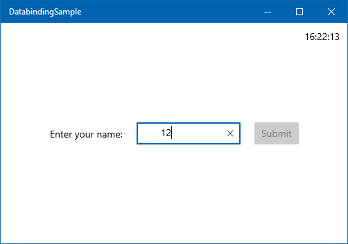
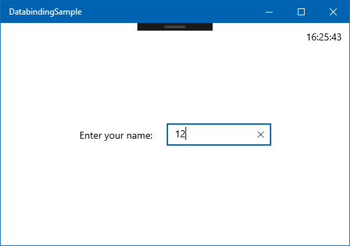
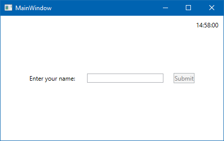

::: zone pivot="uwp"


In the previous lessons, you built a simple form UI, prompting the user to enter a name and, with a button, displayed a greeting. In this lesson, you make the form a bit more user-friendly by disabling or hiding the **Submit** button until at least three characters have been entered.

First, let's examine exactly when the `MainPageLogic.UserName` value is set through the binding.

#### 1. Place a breakpoint

Open `MainPageLogic.cs` file and find the line that contains the `UserName` property.

```cs
public string UserName { get; set; }
```

Set a breakpoint on the setter by moving the caret inside the `set` text and pressing F9. This can also be accomplished by right-clicking `set` and selecting **Breakpoint / Insert Breakpoint**.

#### 2. Run the app in debug mode

Next, run the app in debug mode (F5 or **Debug / Start Debugging**). Type something in the `TextBox` and notice that the breakpoint isn't hit. If you press the _Tab_ key, it moves the input focus to the next control (in our case, the button). Losing focus on the `TextBox` updates the binding, so the breakpoint is hit.

#### 3. Change the binding so that it updates on every keystroke

Stop debugging by pressing Shift+F5 or selecting **Debug / Stop Debugging**.

To provide accurate feedback on when the **Submit** button is enabled, we can't wait until focus is lost on the `TextBox`. Luckily, there's a way to change the behavior of the binding. You can force it to update the `UserName` property (which is the source, as we're talking about a `TwoWay` binding) whenever the text property changes. We need to change the `UpdateSourceTrigger` of the binding, which is set to `LostFocus` by default. `UpdateSourceTrigger` defines the circumstance that causes the source to be updated.

Open MainPage.xaml, and find the `TextBox`. Then, change the binding by adding `UpdateSourceTrigger=PropertyChanged`. The entire `TextBox` tag now should look like this:

```xml
<TextBox Name="tbUserName" 
         Margin="10" 
         Width="150" 
         VerticalAlignment="Center" 
         Text="{x:Bind Logic.UserName, Mode=TwoWay, UpdateSourceTrigger=PropertyChanged}"/>
```

If you debug the app now, you can see that the breakpoint gets hit with every keystroke and text change. Great!

You might recall that when we used UI-to-UI binding to display the greeting, every keystroke fired off the binding. In that case, the binding was defined on the `TextBlock`, and therefore the source was the `TextBox.Text` property, which does change with every keystroke. `UpdateSourceTrigger` affects data flow in the other direction. It flows from the binding source to the control on which the binding is defined (the binding target).

#### 5. Add the `IsSubmitAllowed` property

Next, you add a Boolean property that indicates whether submitting the form is allowed. Open MainPageLogic.cs, and add a new property to the `MainPageLogic` class.

```cs
public bool IsSubmitAllowed => UserName?.Trim().Length > 2;
```

This is a very simple validation: if the text entered, trimmed of leading and trailing white-space characters, contains more than two characters, we accept it as a username.

#### 6. Reevaluate `IsSubmitAllowed` after every change to `UserName`

We have to tell the UI framework when to reevaluate this property and reflect it on the UI. The best way to trigger this reevaluation is by calling `RaisePropertyChanged` in the setter of the `UserName` property. To be able to add code to the setter, it needs to be converted to a full property. Replace the `UserName` property with the following code:

```cs
private string _userName;
public string UserName
{
    get { return _userName; }
    set
    {
        _userName = value;
        RaisePropertyChanged(nameof(IsSubmitAllowed));
    }
}
```

We don't use `INotifyPropertyChanged` for this property because we don't yet have a situation where the `UserName` property is changed from the code. However, every time the text changes in the `TextBox`, we have to tell the UI that the `IsSubmitAllowed` property might have changed and should be reevaluated.

#### 7. Bind the `IsSubmitAllowed` property to the button's `IsEnabled` property

Now you're done with the code. Head back to MainPage.xaml and find the **Submit** button. Add the `IsEnabled` attribute so that the button's XAML now looks like this:

```xml
<Button Margin="10" 
        VerticalAlignment="Center" 
        Click="{x:Bind Logic.Submit}" 
        IsEnabled="{x:Bind Logic.IsSubmitAllowed, Mode=OneWay}">Submit</Button>
```

#### 8. Run the app

If you run the app now, you should see that the **Submit** button is disabled by default. It remains disabled if you type a few spaces, and only gets enabled when there are at least three non-white-space characters entered.

While this example performs some validation, UWP has a rich set of validation features that will be shown in a later module.



#### 9. Hide the Submit button

You or your designer might decide to go one step further, and actually hide the **Submit** button until it can be pressed. This is an easy change to make, so let's do it now. Just edit the XAML, and change `IsEnabled` to `Visibility`.



However, if you type a few characters, you see that the whole UI jumps. This is because the surrounding `StackPanel` is horizontally centered (`HorizontalAlignment="Center"`), and the width of the `StackPanel` is smaller when the `Button` is collapsed. To remedy this issue, you can put the `Button` in a 100 unit wide `Border`, like this.

```xml
<Border Width="100">
    <Button Margin="10" 
            VerticalAlignment="Center" 
            Click="{x:Bind Logic.Submit}" 
            Visibility="{x:Bind Logic.IsSubmitAllowed, Mode=OneWay}">Submit</Button>
</Border>
```

With this, the width of the `StackPanel` doesn't change when the `Button` inside the `Border` reappears.

### Summary

In this lesson, you have seen how binding can be debugged. You have learned about the `UpdateSourceTrigger` binding option, and have seen further examples of data binding. You have also seen an example of how the look and behavior of the UI can be changed without touching the C# code, if you're using data binding properly.

In the next lesson, we examine how you can use data binding to display multiple items in a list.

::: zone-end

::: zone pivot="wpf"


In the previous lessons, you created a simple form UI, prompting the user to enter a name and, with a button, displayed a greeting. In this lesson, you make the form a bit more user-friendly by disabling or hiding the **Submit** button until at least three characters have been entered.

First, let's examine exactly when the `MainWindowDataContext.UserName` value is set through the binding.

#### 1. Place a breakpoint

Open the `MainWindowDataContext.cs` file and find the line that contains the `UserName` property.

```cs
public string UserName { get; set; }
```

Set a breakpoint on the setter by moving the caret inside the `set` text, and pressing F9. This can also be accomplished by right-clicking `set`, and selecting **Breakpoint / Insert Breakpoint**.

#### 2. Run the app in debug mode

Next, run the app in debug mode (F5 or **Debug / Start Debugging**). Type something in the `TextBox` and notice that the breakpoint doesn't get hit. If you press the Tab key, it moves the input focus to the next control (in our case, the button). Losing focus on the `TextBox` updates the binding, so the breakpoint is hit.

#### 3. Change the binding so that it updates on every keystroke

Stop debugging by pressing Shift+F5 or selecting **Debug / Stop Debugging**.

To provide accurate feedback on when the **Submit** button is enabled, we can't wait until focus is lost on the `TextBox`. Luckily, there's a way to change the behavior of the binding. You can force it to update the `UserName` property (which is the source, as we're talking about a `TwoWay` binding) whenever the text property changes. We need to change the `UpdateSourceTrigger` of the binding, which is set to `LostFocus` by default. `UpdateSourceTrigger` defines the circumstance that causes the source to be updated.

Open `MainWindow.xaml`, and find the `TextBox`. Then, change the binding by adding `UpdateSourceTrigger=PropertyChanged`. The entire `TextBox` tag now should look like this:

```xml
<TextBox Name="tbName" 
         Margin="10" 
         Width="150" 
         VerticalAlignment="Center" 
         Text="{Binding UserName, Mode=TwoWay, UpdateSourceTrigger=PropertyChanged}"/>
```

If you debug the app now, you can see that the breakpoint gets hit with every keystroke and text change. Great!

You might recall that when we used UI-to-UI binding to display the greeting, every keystroke triggered the binding. In that case, the binding was defined on the `TextBlock`, and therefore the source was the `TextBox.Text` property, which does change with every keystroke. `UpdateSourceTrigger` affects data flow in the other direction. It flows from the binding source to the control on which the binding is defined (the binding target).

#### 5. Add the `IsSubmitAllowed` property

Next, you add a Boolean property that indicates whether submitting the form is allowed. Open `MainWindowDataContext.cs` and add a new property to the `MainWindowDataContext` class.

```cs
public bool IsSubmitAllowed => !string.IsNullOrWhiteSpace(UserName);
```

This property is doing a simple validation. If the text entered isn't null, empty, or solely white-space characters, we accept it as a username.

#### 6. Reevaluate `IsSubmitAllowed` after every change to `UserName`

We have to advise the UI framework when to reevaluate this property and reflect it on the UI. The best way to trigger this reevaluation is by calling `RaisePropertyChanged` in the setter of the `UserName` property. To be able to add code to the setter, it needs to be converted to a full property. Replace the `UserName` property with the following code:

```cs
private string? _userName;
public string? UserName
{
    get { return _userName; }
    set
    {
        _userName = value;
        RaisePropertyChanged(nameof(IsSubmitAllowed));
    }
}
```

We don't use `INotifyPropertyChanged` for this property because we don't have a situation where the `UserName` property is changed from the code. However, every time the text changes in the `TextBox`, we have to tell the UI that the `IsSubmitAllowed` property might have changed and should be reevaluated.

#### 7. Bind the `IsSubmitAllowed` property to the button's `IsEnabled` property

Now you're done with the code. Head back to `MainWindow.xaml` and find the **Submit** button. Add the `IsEnabled` attribute so that the button's XAML now looks like this:

```xml
<Button Margin="10" 
        VerticalAlignment="Center" 
        Click="OnSubmitClicked"
        IsEnabled="{Binding IsSubmitAllowed}">Submit</Button>
```

#### 8. Run the app

If you run the app now, you should see that the **Submit** button is disabled by default. It gets enabled as soon as you type something in it.

While this example performs some basic validation, WPF has a rich set of validation features that will be demonstrated in a subsequent module.



### Summary

In this lesson, you have seen how bindings can be debugged. You have learned about the `UpdateSourceTrigger` binding option, and have seen further examples of data binding. You have also seen an example of how, if you're using data binding properly, the look and behavior of the UI can be changed without touching the C# code.

In the next lesson, we examine how you can use data binding to display multiple items in a list.

::: zone-end
