::: zone pivot="uwp"

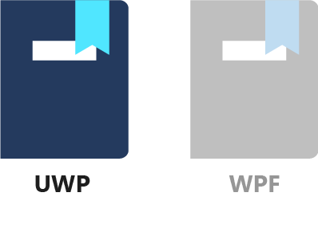

So far, you've only used data binding to display and edit the properties of a single object. In this lesson, you'll apply data binding concepts to display a collection of objects. To make things simple, these objects will be colors. More specifically, they'll be multiple instances of the `ColorDescriptor` class.

#### 1. Create the `ColorDescriptor` class

Let's create a class to represent a color. Right-click the `DatabindingSample` project in **Solution Explorer**, select **Add / Class**, and enter `ColorDescriptor` as the class name. Select **Add** to create the class.

`ColorDescriptor` contains two properties: the color itself as a `Windows.UI.Color` object, and a color name. It also has a constructor that fills these properties, a `ToString()` method that displays the color's name, and hex values for the R, G, and B color components. Here's the entire `ColorDescriptor` class.

```cs
using Windows.UI;

namespace DatabindingSample
{
    public class ColorDescriptor : ObservableObject
    {
        public ColorDescriptor(Color color, string name)
        {
            Color = color;
            Name = name;
        }

        public Color Color { get; private set; }

        public string Name { get; private set; }

        public override string ToString()
        {
            return $"{Name} (#{Color.R:X2}{Color.G:X2}{Color.B:X2})";
        }
    }
}
```

Replace the default contents of the ColorDescriptor.cs file with the preceding code.

#### 2. Create the ColorList.xaml page

To display the color list, we'll use a new XAML page. Right-click the `DatabindingSample` project in **Solution Explorer**, and select **Add / New Item**. Choose **Blank Page** from the list of available items, and then enter `ColorList` as the name. Select **Add** to create the page.

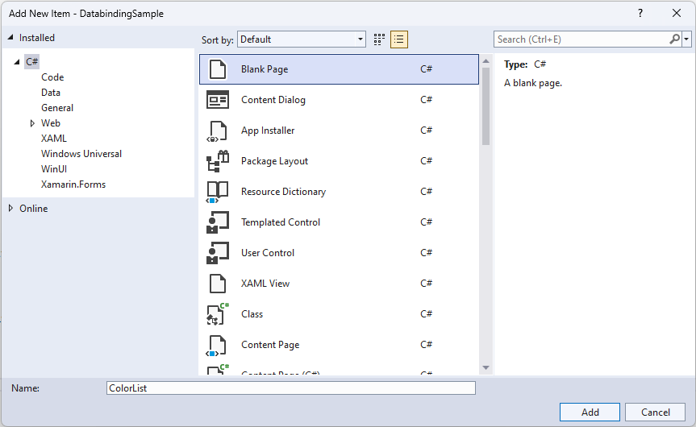

#### 3. Set the startup page

Now if you launch the application, it opens with the **MainPage** page. Because you're going to be working with the newly created ColorList.xaml page, it'd be nice to have that as the starting page. To make it happen, open App.xaml.cs, and find the line that navigates to **MainPage**.

```cs
rootFrame.Navigate(typeof(MainPage), e.Arguments);
```

Replace `MainPage` with `ColorList`, and verify that the **ColorList** page is launched when you start the app (press F5 or select **Debug / Start Debugging**).

#### 4. Create the logic for the color list

We'll continue the previously introduced best practice of creating a separate logic for the new page. So, go ahead and create a new class, called `ColorListLogic`.

Right-click the `DatabindingSample` project in **Solution Explorer**, select **Add / Class**, and then enter `ColorListLogic` as the class' name. Select **Add** to create the class, and paste the following into the file:

```cs
using System.Collections.Generic;
using System.Collections.ObjectModel;

using Windows.UI;

namespace DatabindingSample
{
    public class ColorListLogic : ObservableObject
    {
        public List<ColorDescriptor> LotsOfColors { get; private set; }

        public ColorListLogic()
        {
            LotsOfColors = new List<ColorDescriptor>
            {
               new ColorDescriptor(Colors.Red, "red"),
               new ColorDescriptor(Colors.White, "white"),
               new ColorDescriptor(Colors.Green, "green"),
               new ColorDescriptor(Colors.Yellow, "yellow"),
               new ColorDescriptor(Colors.Blue, "blue"),
               new ColorDescriptor(Colors.Black, "black")
            };

        }
    }
}
```

The `ColorListLogic` class is very simple (for now). It has a property called `LotsOfColors`, which is a `List` of `ColorDescriptor` objects. The list is filled with some colors in the class' constructor. And that's it.

#### 5. Display the colors in a `ListBox`

The next step is to display the colors in our app. First, let's make the `ColorListLogic` accessible from XAML. Open up `ColorList.xaml.cs`, and add this to the `ColorList` class:

```cs
public ColorListLogic Logic { get; } = new ColorListLogic();
```

We're using the same syntax here as we did for `MainPageLogic` earlier. It creates a get-only property, and initializes its value to a newly created `ColorListLogic` object.

Next, open ColorList.xaml and add the following XAML inside the `Grid` element.

```xml
<ListBox ItemsSource="{x:Bind Logic.LotsOfColors}" 
         Margin="20" 
         Width="200"
         HorizontalAlignment="Left" 
         VerticalAlignment="Top"/>
```

The interesting part here is the `ItemsSource` attribute. As the name suggests, it provides the source of the items displayed in the `ListBox`. And it's simply bound to the `ColorListLogic`'s `LotsOfColors` property.

If you run the app now, it shows the colors in a `ListBox`! But it's not too nice to look at. The `ListBox` seems to have invoked the `ToString()` method of the `ColorDescriptor`s stored in the `LotsOfColors` list.

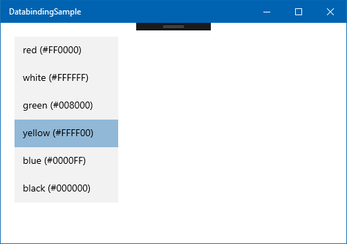

#### 6. Define a template for the items

It'd be nice to have a template that shows the actual color stored in the `ColorDescriptor.Color` property, and its name. Something like this:

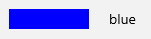

To code this in XAML, we can put a colored `Rectangle` and a `TextBlock` in a `StackPanel`.

```xml
<StackPanel Orientation="Horizontal">
    <Rectangle Width="80" Height="20">
        <Rectangle.Fill>
            <SolidColorBrush Color="Blue"/>
        </Rectangle.Fill>
    </Rectangle>
    <TextBlock Text="blue" Margin="20, 10, 0, 10"/>
</StackPanel>
```

This is one of the strengths of XAML and data binding. Almost every complex visual is based off of templates that you can redefine. To use the preceding `StackPanel` as a template, we need to put it inside a `DataTemplate`. A `DataTemplate` needs to define a `DataType`, which is the type of data the template can be applied to. In our case, it is the `ColorDescriptor` class. So, the `DataTemplate` looks like this:

```xml
<DataTemplate x:DataType="local:ColorDescriptor">
    <!-- template content comes here -->
</DataTemplate>
```

How data is rendered in a `ListBox` (and lots of other controls) is controlled by its `ItemTemplate`, which should be set to the `DataTemplate`. There are multiple ways to do this. In this lesson, we'll simply define the `DataTemplate` inside the `ListBox`, with the following syntax:

```xml
<ListBox ...>
    <ListBox.ItemsSource>
        <DataTemplate ...>
            ...
        </DataTemplate>
    </ListBox.ItemsSource>
</ListBox>
```

Later, you'll see how a `DataTemplate` can be reused in multiple places by defining it as a resource.

Now the whole `ListBox` looks like this (if you haven't followed along, replace the entire `<ListBox>` tag with the following XAML):

```xml
<ListBox ItemsSource="{x:Bind Logic.LotsOfColors}" 
         Margin="20" 
         Width="200"
         HorizontalAlignment="Left" 
         VerticalAlignment="Top">
    <ListBox.ItemTemplate>
        <DataTemplate x:DataType="local:ColorDescriptor">
            <StackPanel Orientation="Horizontal">
                <Rectangle Width="80" 
                           Height="20">
                    <Rectangle.Fill>
                        <SolidColorBrush Color="{x:Bind Color}"/>
                    </Rectangle.Fill>
                </Rectangle>
                <TextBlock Text="{x:Bind Name}" 
                           Margin="20, 10, 0, 10"/>
            </StackPanel>
        </DataTemplate>
    </ListBox.ItemTemplate>
</ListBox>
```

Note that because every item in the `ListBox` corresponds to a `ColorDescriptor` object, you only need to define the bindings inside the template within the context of this class. The compiler even checks that the `Logic.LotsOfColors` contains `ColorDescriptor` objects, and that `ColorDescriptor.Color` and `ColorDescriptor.Name` exist and are of the right type.

#### 7. Run the app

Run the app now by pressing F5 or by selecting **Debug / Start Debugging** in the menu. You should see the color list in all its glory. 

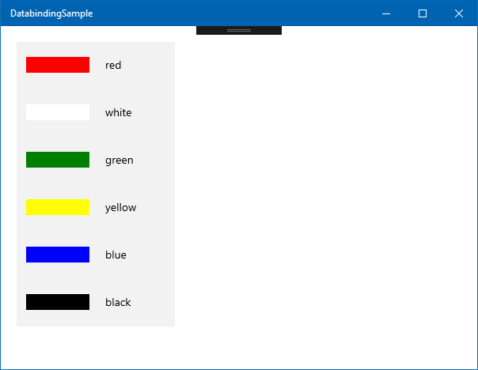

If you launch an XAML app in debug mode, you can take advantage of live XAML editing. You don't even need to stop the app or press save. Just change the XAML, and most of your changes are reflected instantly on the running app. Try it now. Change the `Width` and `Height` of the `Rectangle` inside the data template to 30, thus turning the color rectangles into squares.

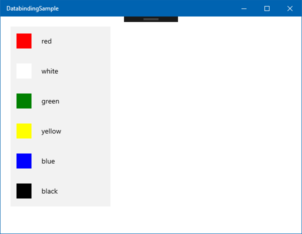

This is called [XAML Hot Reload](/visualstudio/xaml-tools/xaml-hot-reload), and it can be useful for fine-tuning the layout and animations in your app.

### Summary

This lesson showed you the basics of displaying multiple items in a `ListBox`. There are other controls available for similar purposes, such as `ItemsControl`, `ListView`, and `GridView`. But the basic principles are the same: bind your list (`IEnumerable`, `List<>`) of objects to the `ItemsSource` property, and define `DataTemplates` to control how the individual list items are displayed and behave. You can also redefine the layout of these items, and even the look of the container controls themselves (although this is beyond the scope of this module).

Note that the code never had to deal with the `ListBox` itself. It just created a collection of business objects (`ColorDescriptor`), and the XAML runtime took care of expanding the template for every item.

The next lesson illustrates how you can select items from a `ListBox` or a dropdown, and change the content of lists from code so that adding and removing elements are reflected on the UI.

::: zone-end

::: zone pivot="wpf"


So far, you've only used data binding to display and edit the properties of a single object. In this lesson, you'll apply data binding concepts to display a collection of objects. To make things simple, these objects will be colors. More specifically, they'll be multiple instances of a `ColorDescriptor` class.

#### 1. Create the `ColorDescriptor` class

Let's create the class to represent a color. Right-click the `DatabindingSampleWPF` project in **Solution Explorer**, select **Add / Class**, and enter `ColorDescriptor` as the class name. Select **Add** to create the class.

`ColorDescriptor` contains two properties: the color itself as a `System.Windows.Media.Color` object, and a color name. It also has a constructor that sets these properties, a `ToString()` method that displays the color's name, and hex values for the R, G, and B color components. Here's the entire `ColorDescriptor` class.

```cs
using System.Windows.Media;

namespace DatabindingSampleWPF
{
    public class ColorDescriptor : ObservableObject
    {
        public ColorDescriptor(Color color, string name)
        {
            Color = color;
            Name = name;
        }

        public Color Color { get; private set; }

        public string Name { get; private set; }

        public override string ToString()
        {
            return $"{Name} (#{Color.R:X2}{Color.G:X2}{Color.B:X2})";
        }
    }
}
```

Replace the default contents of the `ColorDescriptor.cs` file with the preceding code.

#### 2. Create the ColorList.xaml page

To display the color list, we'll use a new XAML file. Right-click the `DatabindingSampleWPF` project in **Solution Explorer**, and select **Add / New Item**. Choose **Window (WPF)** from the list of available items, and then enter `ColorList` as the name. Select **Add** to create the page.

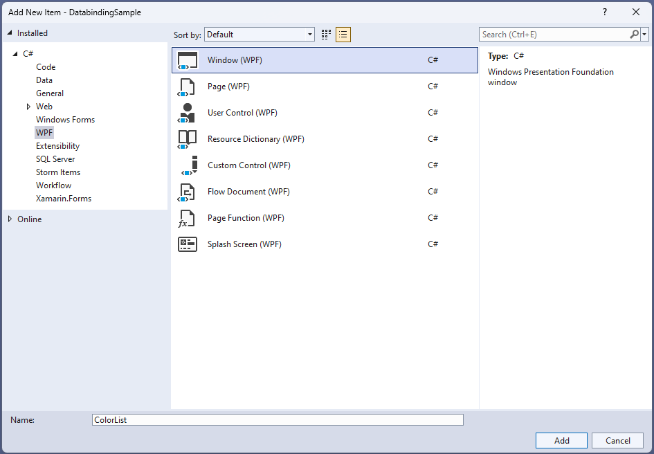

#### 3. Set the startup XAML file

Now if you launch the application, it opens with **MainWindow**. Because you're going to be working with the newly created `ColorList.xaml`, it'd be nice to have that display on startup. To make it happen, open `App.xaml`, and find the `StratupUri` attribute of the root `Application` element.

```xml
StartupUri="MainWindow.xaml"
```

Replace `MainWindow` with `ColorList`, and verify that the **ColorList** is shown when you start the app (press F5 or select **Debug / Start Debugging**).

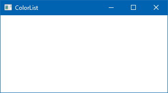

#### 4. Create the `DataContext` for the color list

We'll continue the previously introduced best practice of creating a separate `DataContext` class for the new XAML window. So, we'll go ahead and create a new class, called `ColorListDataContext`.

Right-click the `DatabindingSample` project in **Solution Explorer**, select **Add / Class**, and then enter `ColorListDataContext` as the class' name. Select **Add** to create the class, and paste the following into the file:

```cs
using System.Collections.ObjectModel;
using System.Collections.Generic;
using System.Windows.Media;

namespace DatabindingSampleWPF
{
    public class ColorListDataContext: ObservableObject
    {
        public List<ColorDescriptor> LotsOfColors { get; private set; }

        public ColorListDataContext()
        {
            LotsOfColors = new List<ColorDescriptor>
            {
               new ColorDescriptor(Colors.Red, "red"),
               new ColorDescriptor(Colors.White, "white"),
               new ColorDescriptor(Colors.Green, "green"),
               new ColorDescriptor(Colors.Yellow, "yellow"),
               new ColorDescriptor(Colors.Blue, "blue"),
               new ColorDescriptor(Colors.Black, "black")
            };
        }
    }
}
```

The `ColorListDataContext` class is very simple (for now). It has a property called `LotsOfColors`, which is a `List` of `ColorDescriptor` objects. The list is filled with some colors in the class' constructor. And that's it.

#### 5. Display the colors in a `ListBox`

The next step is to display the colors in our app. As before, we need to create an instance of the `ColorListDataContext` class in `ColorList.xaml`, and set it as the `DataContext` for the entire window. Open up `ColorList.xaml`, and add this right after the `<Window ...>` tag:

```xml
<Window.DataContext>
    <local:ColorListDataContext/>
</Window.DataContext>
```

You need to compile the code at this point, so that the XAML designer can resolve the newly defined `ColorListDataContext` class.

Then, copy the following XAML markup inside the `<Grid>` tag:

```xml
<ListBox ItemsSource="{Binding LotsOfColors}" 
         Margin="20" 
         Width="200"
         HorizontalAlignment="Left" 
         VerticalAlignment="Top"/>
```

The interesting part here is the `ItemsSource` attribute. As the name suggests, it provides the source of the items displayed in the `ListBox`. And it's simply bound to the `ColorListDataContext`'s `LotsOfColors` property.

If you run the app now, it shows the colors in a `ListBox`! But it's not too nice to look at. The `ListBox` seems to have invoked the `ToString()` method of the `ColorDescriptor`s stored in the `LotsOfColors` list.

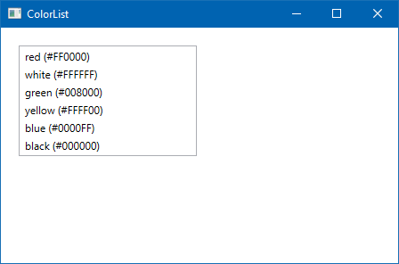

#### 6. Define a template for the items

It'd be nice to have a template that shows the actual color stored in the `ColorDescriptor.Color` property and its name. Something like this:


To code this in XAML, we can put a colored `Rectangle` and a `TextBlock` in a `StackPanel`.

```xml
<StackPanel Orientation="Horizontal">
    <Rectangle Width="80" Height="20">
        <Rectangle.Fill>
            <SolidColorBrush Color="Blue"/>
        </Rectangle.Fill>
    </Rectangle>
    <TextBlock Text="blue" Margin="20, 10, 0, 10"/>
</StackPanel>
```

This is one of the strengths of XAML and data binding. Almost every complex visual is based off of templates that you can redefine. To use the above `StackPanel` as a template, we need to put it inside a `DataTemplate`:

```xml
<DataTemplate>
    <!-- template content comes here -->
</DataTemplate>
```

How data is rendered in a `ListBox` (and lots of other controls) is controlled by its `ItemTemplate`, which should be set to the `DataTemplate` above. There are multiple ways to do this. In this lesson, we'll simply define the `DataTemplate` inside the `ListBox`, with the following syntax:

```xml
<ListBox ...>
    <ListBox.ItemsSource>
        <DataTemplate ...>
            ...
        </DataTemplate>
    </ListBox.ItemsSource>
</ListBox>
```

Later, you will see how a `DataTemplate` can be reused in multiple places by defining it as a resource.

Now, the markup for the entire `ListBox` looks like this (if you haven't followed along, replace the entire `<ListBox>` element with the following XAML):

```xml
<ListBox ItemsSource="{Binding LotsOfColors}" 
         Margin="20" 
         Width="200"
         HorizontalAlignment="Left" 
         VerticalAlignment="Top">
    <ListBox.ItemTemplate>
        <DataTemplate>
            <StackPanel Orientation="Horizontal">
                <Rectangle Width="80" 
                           Height="20">
                    <Rectangle.Fill>
                        <SolidColorBrush Color="{Binding Color}"/>
                    </Rectangle.Fill>
                </Rectangle>
                <TextBlock Text="{Binding Name}" 
                           Margin="20, 10, 0, 10"/>
            </StackPanel>
        </DataTemplate>
    </ListBox.ItemTemplate>
</ListBox>
```

Note that because every item in the `ListBox` corresponds to a `ColorDescriptor` object, you only need to define the bindings inside the template within the context of this class.

#### 7. Run the app

You should immediately see the color list in Visual Studio. Just to make sure, run the app now by pressing F5 or by selecting **Debug / Start Debugging** in the menu.

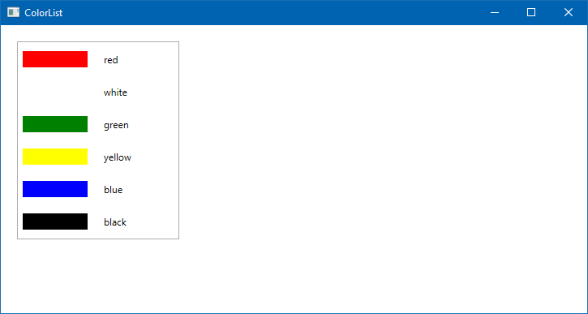

If you launch an XAML app in debug mode, you can take advantage of live XAML editing. You don't even need to stop the app or press save. Just change the XAML, and most of your changes are reflected instantly on the running app. Try it now. Change the `Width` and `Height` of the `Rectangle` inside the data template to 30, thus turning the color rectangles into squares.

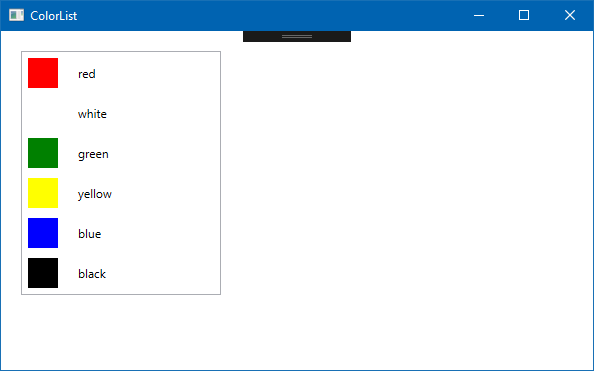

This is called [XAML Hot Reload](/visualstudio/xaml-tools/xaml-hot-reload), and it can be useful for fine-tuning the layout and animations in your app.

### Summary

This lesson walked through the basics of displaying multiple items in a `ListBox`. There are other controls available for similar purposes, such as `ItemsControl`, `ListView`, and `GridView`. But the basic principles are the same: bind your list (`IEnumerable`, `List<>`) of objects to the `ItemsSource` property, and define a `DataTemplate` to control how the individual list items are displayed and behave. You can also redefine the layout of these items, and even the look of the container controls themselves (although this is beyond the scope of this module).

Note that the logic code never had any knowledge of the `ListBox` control. It just created a collection of business objects (`ColorDescriptor`), and the XAML runtime handled the rendering of the template for each item.

The next lesson illustrates how you can select items from a `ListBox` or a `ComboBox`, and change the content of lists from code so that adding and removing elements is reflected on the UI.

::: zone-end
