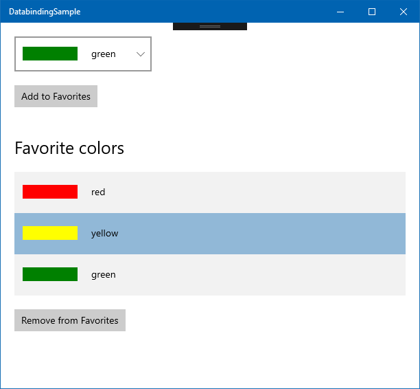
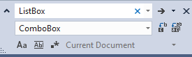
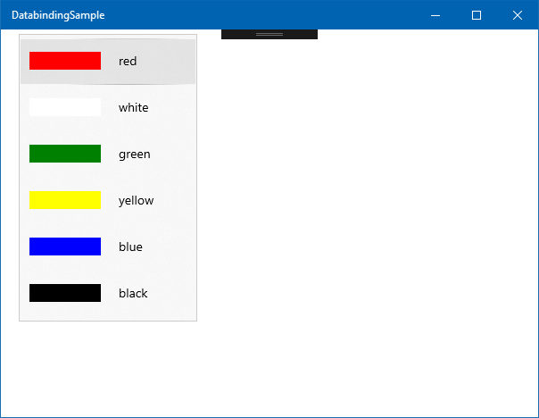
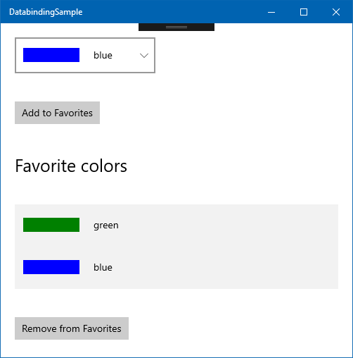
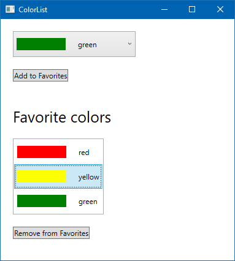
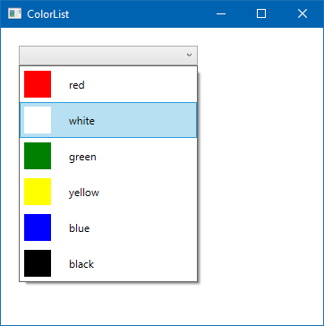
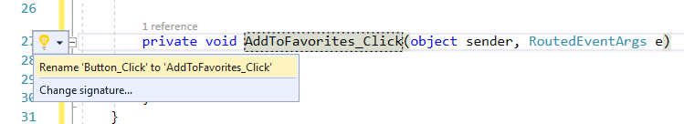
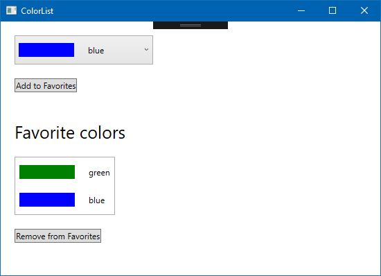

::: zone pivot="uwp"

:::image type="icon" source="../media/tech-uwp.png":::

In this lesson, the user will select favorite colors. The available colors are listed in a dropdown (a `ComboBox` control). The user selects a color, and adds it to your favorites by pressing a button. The favorite colors are displayed below. Selecting a favorite color also displays a button that allows the user to remove the selected color from their favorites.



First, add the ability to select a color from the `LotsOfColors` collection, and add it to the favorite colors` list.

#### 1. Create the `SelectedColor` property

Let's start with the code, and then we'll work our way through the UI.

We need a way to determine which item (that is, instance of the `ColorDescriptor` class) the user selects in the dropdown. The `ComboBox` control has a `SelectedItem` property, which gets and sets the currently selected item. So, we can bind this property to a property of type `ColorDescriptor` in our code.

Open ColorListLogic.cs and add the following code:

```cs
private ColorDescriptor _selectedColor;

public ColorDescriptor SelectedColor
{
    get => _selectedColor;
    set => Set(ref _selectedColor, value);
}
```

This pattern should be familiar by now. It is a standard property, decorated with the `INotifyPropertyChanged` mechanism, with the help of the `ObservableObject` base class.

#### 2. Create the `FavoriteColors` list

The `FavoriteColors` list stores the colors the user has chosen to be their favorites. It's just a simple property.

```cs
public List<ColorDescriptor> FavoriteColors { get; } = 
    new List<ColorDescriptor>();
```

#### 3. Add the selected color to the favorites

Adding the selected color to the favorites happens in the `AddSelectedColorToFavorites` method.

```cs
public void AddSelectedColorToFavorites()
{
    FavoriteColors.Add(SelectedColor);
}
```

The assumption is that when this method is called, `SelectedColor` is filled with the color that should be added to the favorites list.

With this, we're done with the code (for now). Let's turn our attention to the XAML.

#### 4. Change the `ListBox` to a `ComboBox`

Because we want to have the full list of colors to be shown in a dropdown (which is a `ComboBox` control), we need to change the XAML. Luckily, both `ListBox` and `ComboBox` are descendants of the `ItemsControl` control, and they work similarly despite there being a difference in how they look and behave. All we have to do is replace `ListBox` with `ComboBox` in the ColorList.xaml file. You can use the **Edit** > **Find and Replace** > **Quick Replace** command (CtrlL+H) for this.



If you quickly run the app now, you can see that the `ListBox` has been replaced with a `ComboBox`, but the colors are still displayed by using the same template.



#### 5. Extract the template to a resource

Speaking of the template, you'll need to reuse it for the list of favorite colors later. It's a good idea to only store the template in one place, so that your XAML is more readable. More importantly, this ensures that changes to the template affect every instance. Let's extract the template to a resource.

Any `FrameworkElement` can have its list of resources. We chose to make our template global for this page, so let's add a `<Page.Reources>` tag above the `<Grid>` element. Then, move the entire `<DataTemplate>` tag and its contents inside it.

```xml
<Page.Resources>
    <DataTemplate x:DataType="local:ColorDescriptor">
        <StackPanel Orientation="Horizontal">
            <Rectangle Width="30" 
                       Height="30">
                <Rectangle.Fill>
                    <SolidColorBrush Color="{x:Bind Color}"/>
                </Rectangle.Fill>
            </Rectangle>
            <TextBlock Text="{x:Bind Name}" 
                       Margin="20, 10, 0, 10"/>
        </StackPanel>
    </DataTemplate>
</Page.Resources>
```

Visual Studio warns you that objects within the `<Page.Resources>` tag (which is an `IDictionary`) must have a `Key` attribute, so add it to the `<DataTemplate>`.

```xml
<DataTemplate x:Key="ColorTemplate" 
              x:DataType="local:ColorDescriptor">
```

This key allows us to refer to this template from elsewhere on the page, such as the `ComboBox.ItemTemplate`, which has lost its contents. To have the `ComboBox` use the `ColorDescriptor` resource, you can remove the `<ComboBox.ItemTemplate>` tag, and use it as an attribute inside the `<ComboBox>` tag itself. The entire `<ComboBox>` tag looks like this:

```xml
<ComboBox ItemsSource="{x:Bind Logic.LotsOfColors}" 
          Margin="20" 
          Width="200"
          HorizontalAlignment="Left" 
          VerticalAlignment="Top"
          ItemTemplate="{StaticResource ColorTemplate}"/>
```

You can run the app again, just to verify that the item template works.

#### 6. Build the rest of the UI

The UI is simple. All of the controls (the dropdown, the **Add to Favorites** button, the favorites list (with header text), and the **Remove from Favorites** button) are placed in a single vertical `StackPanel`. Replace the entire content of the `<Grid>` element with the following:

```xml
<StackPanel>
    <ComboBox ItemsSource="{x:Bind Logic.LotsOfColors}" 
              Margin="20, 20, 20, 0" 
              Width="200"
              HorizontalAlignment="Left" 
              VerticalAlignment="Top"
              ItemTemplate="{StaticResource ColorTemplate}"
              SelectedItem="{x:Bind Logic.SelectedColor, Mode=TwoWay}" 
              />
    
    <Button Margin="20" 
            Click="{x:Bind Logic.AddSelectedColorToFavorites}">Add to Favorites</Button>
    <TextBlock FontSize="25" 
               Margin="20, 20, 20, 0">Favorite colors</TextBlock>
    
    <ListBox ItemsSource="{x:Bind Logic.FavoriteColors}"
             ItemTemplate="{StaticResource ColorTemplate}"
             Margin="20, 20, 20, 0"/>

    <Button Margin="20">Remove from Favorites</Button>
</StackPanel>
```

There's a `TwoWay` binding between the currently selected item in the `ComboBox` and the `SelectedColor` property of the `ColorListLogic` class.

#### 7. Run the app

Run the app now, select a color from the `ComboBox`, and select the **Add to Favorites** button. Nothing happens. Adding a breakpoint to the end of the `AddSelectedColorToFavorites` method in the `ColorListLogic` class shows that the code works. The selected color gets added to the `FavoriteColors` list.

The reason the UI doesn't reflect the changes in this `List<ColorDescriptor>` is that the UI needs to be notified when the collection changes. For lists, this is done through the `System.Collections.Specialized.INotifyCollectionChanged` interface. Fortunately, we don't have to implement this. The `System.Collections.ObjectModel.ObservableCollection<T>` class already has everything we need.

To make our app work, all we have to do is to use the `ObservableCollection<T>` class instead of the `List<T>` class for the `FavoriteColors` property.

```cs
public ObservableCollection<ColorDescriptor> FavoriteColors { get; } = 
    new ObservableCollection<ColorDescriptor>();
```

If you run the app now, selecting colors from the dropdown and selecting the **Add to Favorites** button now works properly. The selected favorite colors are reflected in the `ListBox`. Nice!



#### 8. Avoid adding empty items

When you launch the app, there's no color selected in the dropdown. If you select the **Add to Favorites** button now, `null`s are added to the list. This is a bug, so let's fix it!

We could add a `null` check to the `AddSelectedColorToFavorites` method, but that wouldn't prevent the **Add to Favorites** button from showing up when it's non-functional. Instead, let's just make sure that there's always an item selected in the dropdown. Because the dropdown's `SelectedItem` property is two-way bound to the `SelectedColor` property in the code, let's just initialize it to a valid value on start. Add the following line to the end of the `ColorListLogic` constructor:

```cs
SelectedColor = LotsOfColors[0];
```

This ensures that the first item of the `LotsOfColors` list is selected when the app starts. The user won't be able to add a `null` to the `FavoriteColors` collection.

#### 9. Remove favorite colors

The next step is to add the ability to remove favorite colors from the `ListBox`. This will happen by the user selecting an item in the `ListBox`, and selecting the **Remove from Favorites** button.

Similarly to how the `ComboBox` worked, we can track the item the user has selected in the `ListBox` through its `SelectedItem` property. We can bind this to a property in the code. Add this to the `ColorListLogic` class.

```cs
private ColorDescriptor _selectedFavoriteColor;

public ColorDescriptor SelectedFavoriteColor
{
    get => _selectedFavoriteColor;
    set
    {
        Set(ref _selectedFavoriteColor, value);
        RaisePropertyChanged(nameof(IsRemoveFavoriteColorButtonVisible));
    }
}

public bool IsRemoveFavoriteColorButtonVisible => SelectedFavoriteColor != null;
```

The preceding code also includes a Boolean property for controlling whether the button to remove items from the favorites list should be visible. Any change to `SelectedFavoriteColor` causes the UI to query this property, and act accordingly.

To actually perform the removal of the color from the favorite list, we need to write one more method.

```cs
public void RemoveFavoriteColor()
{
    FavoriteColors.Remove(SelectedFavoriteColor);
}
```

To wire the button up in the XAML, open ColorList.xaml, and change the **Remove from Favorites** button's XAML. Change it so that it includes the `Visibility` binding as well as the `Click` binding.

```xml
<Button Margin="20" 
        Visibility="{x:Bind Logic.IsRemoveFavoriteColorButtonVisible, Mode=OneWay}"
        Click="{x:Bind Logic.RemoveFavoriteColor}">Remove from Favorites</Button>
```

All that's left is to bind the `ListBox`'s `SelectedItem` to the `Logic.SelectedFavoriteColor` property. Add the `SelectedItem` attribute to the `ListBox` in the XAML.

```xml
<ListBox SelectedItem="{x:Bind Logic.SelectedFavoriteColor, Mode=TwoWay}"... >
```

Run the app now, and verify that you can add colors to the favorite colors' list, as well as remove them. Note how the **Remove from Favorites** button appears and disappears, according to whether you have a favorite color selected that can be removed.

### Summary

This lesson illustrated how you can acquire and set the selected item in a `ComboBox` or `ListBox` control, by binding their `SelectedItem` properties to a C# property. You've also seen how using `ObservableCollection` in code causes the UI to automatically update the contents of controls that display multiple items.

::: zone-end

::: zone pivot="wpf"

:::image type="icon" source="../media/tech-wpf.png":::

In this lesson, the user will select their favorite colors. The available colors are listed in a dropdown (a `ComboBox` control). The user selects a color and adds it to their favorites by pressing a button. The favorite colors are displayed below the full list. Selecting a favorite color also displays a button that allows the user to remove the selected color from their favorites.



First, we'll add the ability to select a color from the `LotsOfColors` collection, and add it to the list of favorite colors.

#### 1. Create the `SelectedColor` property

Let's start with the code, and then we'll work our way through the UI changes.

We need a way to determine which item (that is, instance of the `ColorDescriptor` class) the user selects in the dropdown. The `ComboBox` control has a `SelectedItem` property, which gets and sets the currently selected item. So, we can bind this property to a property of type `ColorDescriptor` in our code.

Open `ColorListDataContext.cs` and add the following code:

```cs
private ColorDescriptor? _selectedColor;

public ColorDescriptor? SelectedColor
{
    get => _selectedColor;
    set => Set(ref _selectedColor, value);
}
```

This pattern should be familiar by now. It's a standard property, leveraging the `INotifyPropertyChanged` mechanism, with the help of the `ObservableObject` base class.

#### 2. Create the `FavoriteColors` list

The `FavoriteColors` list stores the colors the user has chosen to be their favorite. It's just a simple property.

```cs
public List<ColorDescriptor> FavoriteColors { get; } = 
    new List<ColorDescriptor>();
```

#### 3. Add the selected color to the favorites

Adding the selected color to the favorites happens in the `AddSelectedColorToFavorites` method. As a precaution, check if the `SelectedColor` property is `null`. If it is, return from the method. Otherwise, add the selected color to the `FavoriteColors` list.

```cs
public void AddSelectedColorToFavorites()
{
    if (SelectedColor == null) return;
    FavoriteColors.Add(SelectedColor);
}
```

When this method is called, `SelectedColor` should be filled with the color being added to the favorites list, but it's best not to make assumptions.

With this, we're done with the code (for now). Let's turn our attention to the XAML.

#### 4. Change the `ListBox` to a `ComboBox`

Because we want to have the full list of colors to be shown in a dropdown (which is a `ComboBox` control), we need to change the XAML. Luckily, both `ListBox` and `ComboBox` are descendants of the `ItemsControl` control, and they work similarly despite there being numerous differences in how they look and behave. All we have to do is replace `ListBox` with `ComboBox` in the `ColorList.xaml` file. You can use the **Edit** > **Find and Replace** > **Quick Replace** command (CtrlL+H) for this.


If you quickly run the app now, you can see that the `ListBox` has been replaced with a `ComboBox`, but the colors are still displayed by using the same template.



#### 5. Extract the template to a resource

Speaking of the template, you'll need to reuse it for the list of favorite colors later. It's a good idea to only store the template in one place, so that your XAML is more readable. More importantly, this ensures that changes to the template affect every instance. Let's extract the template to a resource.

Any `FrameworkElement` can have its list of resources. We chose to make our template global for the entire `Window`, so let's add a `<Window.Reources>` tag above the `<Grid>` element. Then, move the entire `<DataTemplate>` tag and its contents inside it.

```xml
<Window.Resources>
    <DataTemplate x:Key="ColorTemplate">
        <StackPanel Orientation="Horizontal">
            <Rectangle Width="80" 
                       Height="20">
                <Rectangle.Fill>
                    <SolidColorBrush Color="{Binding Color}"/>
                </Rectangle.Fill>
            </Rectangle>
            <TextBlock Text="{Binding Name}" 
                       Margin="20, 10, 0, 10"/>
        </StackPanel>
    </DataTemplate>
    <BooleanToVisibilityConverter x:Key="BooleanToVisibilityConverter"/>
</Window.Resources>
```

The `<Window.Resources>` is a dictionary, so each entry should also have a key. We have added it to the `<DataTemplate>`.

```xml
<DataTemplate x:Key="ColorTemplate">
```

This key allows us to refer to this template from elsewhere inside the `Window`, such as the `ComboBox.ItemTemplate`, which has lost its contents. To have the `ComboBox` use the `ColorDescriptor` resource, you can remove the `<ComboBox.ItemTemplate>` tag, and use it as an attribute inside the `<ComboBox>` tag itself. The entire `<ComboBox>` tag looks like this:

```xml
<ComboBox ItemsSource="{x:Bind Logic.LotsOfColors}" 
          Margin="20" 
          Width="200"
          HorizontalAlignment="Left" 
          VerticalAlignment="Top"
          ItemTemplate="{StaticResource ColorTemplate}"/>
```

You can run the app again, just to verify that the item template works.

#### 6. Build the rest of the UI

The UI is simple. All the controls (the dropdown, the **Add to Favorites** button, the favorites list (with header text), and the **Remove from Favorites** button) are nested within a single vertical `StackPanel`. Replace the entire `<Grid>` element with the following:

```xml
<StackPanel>
    <ComboBox ItemsSource="{Binding LotsOfColors}" 
              Margin="20, 20, 20, 0" 
              Width="200"
              HorizontalAlignment="Left" 
              VerticalAlignment="Top"
              ItemTemplate="{StaticResource ColorTemplate}"
              SelectedItem="{Binding SelectedColor, Mode=TwoWay}" />

    <Button 
        Margin="20" 
        HorizontalAlignment="Left">Add to Favorites</Button>
    
    <TextBlock
            FontSize="25" 
            Margin="20, 20, 20, 0">Favorite colors</TextBlock>

    <ListBox ItemsSource="{Binding FavoriteColors}"
             ItemTemplate="{StaticResource ColorTemplate}"
             Margin="20, 20, 20, 0"
             HorizontalAlignment="Left"/>

    <Button Margin="20" 
            HorizontalAlignment="Left">Remove from Favorites</Button>

</StackPanel>
```

There's a `TwoWay` binding between the currently selected item in the `ComboBox` and the `SelectedColor` property of the `ColorListDataContext` class.

#### 7. Create the Click handler for the `Add to Favorites` button

We've already implemented the logic for adding the selected color to the `FavoriteColors` list in the `AddSelectedColorToFavorites` method. However, we need to invoke this method when the user clicks the button.

Double-click the `Add to Favorites` button in the visual designer in Visual Studio. This creates a `Button_Click` method in the code-behind, and a reference to it in the `Click` event in XAML:

```xml
<Button ... Click="Button_Click">Add to Favorites</Button>
```

Rename the `Button_Click` method to `AddToFavorites_Click` in both the codebehind and the XAML. You can do this by renaming it in the code, and then using the screwdriver icon, selecting "Rename `Button_Click` to `AddToFavorites_Click`". This will take care of changing the method's name in the XAML file, too.

.

Add a convenience property to the top of the `ColorList` class to make it easier to access the `ColorListDataContext`:

```cs
private ColorListDataContext DC => (ColorListDataContext)DataContext;
```

Then, in the `AddToFavorites_Click` method, invoke the previously written logic from the `ColorListDataContext` class:

```cs
private void AddToFavorites_Click(object sender, RoutedEventArgs e)
{
    DC.AddSelectedColorToFavorites();
}
```

#### 8. Run the app

Run the app now, select a color from the `ComboBox`, and select the **Add to Favorites** button. Nothing happens. Adding a breakpoint to the end of the `AddSelectedColorToFavorites` method in the `ColorListDataContext` class shows that the code works. The selected color gets added to the `FavoriteColors` list.

The reason the UI doesn't reflect the changes in this `List<ColorDescriptor>` is that the UI needs to be notified when the collection changes. For lists, this is done through the `System.Collections.Specialized.INotifyCollectionChanged` interface. Fortunately, we don't have to implement this. The `System.Collections.ObjectModel.ObservableCollection<T>` class already has everything we need.

To make our app work, all we have to do is to use the `ObservableCollection<T>` class instead of the `List<T>` class for the `FavoriteColors` property.

```cs
public ObservableCollection<ColorDescriptor> FavoriteColors { get; } = 
    new ObservableCollection<ColorDescriptor>();
```

If you run the app now, selecting colors from the dropdown and selecting the **Add to Favorites** button now works properly. The selected favorite colors are reflected in the `ListBox`. Nice!



#### 9. Avoid adding empty items

When you launch the app, there's no color selected in the dropdown. We currently have a `null` check in the `AddSelectedColorToFavorites` method to prevent 'null' items from being added to the list when you select the **Add to Favorites** button. Let's change this to ensure that there's always a color selected in the dropdown.

The `null` check doesn't prevent the **Add to Favorites** button from showing up when it's non-functional. So, let's just make sure that there's always a selected item. Because the dropdown's `SelectedItem` property is two-way bound to the `SelectedColor` property in the code, let's just initialize it to a valid value on start. Add the following line to the end of the `ColorListDataContext` constructor:

```cs
SelectedColor = LotsOfColors[0];
```

This ensures that the first item of the `LotsOfColors` list is selected when the app starts. The user won't be able to add a `null` to the `FavoriteColors` collection.

#### 10. Remove favorite colors

The next step is to add the ability to remove favorite colors from the `ListBox`. This happens by the user selecting an item in the `ListBox`, and selecting the **Remove from Favorites** button.

Similarly to how the `ComboBox` worked, we can track the item the user has selected in the `ListBox` through its `SelectedItem` property. We can bind this to a property in the code. Add the new property to the `ColorListDataContext` class as follows:

```cs
private ColorDescriptor? _selectedFavoriteColor;

public ColorDescriptor? SelectedFavoriteColor
{
    get => _selectedFavoriteColor;
    set
    {
        Set(ref _selectedFavoriteColor, value);
        RaisePropertyChanged(nameof(IsRemoveFavoriteEnabled));
    }
}

public bool IsRemoveFavoriteEnabled => SelectedFavoriteColor != null;

```

The preceding code also includes a Boolean property for controlling whether the button to remove items from the favorites list should be visible. Any change to `SelectedFavoriteColor` causes the UI to query this property, and act accordingly.

To actually perform the removal of the color from the favorite list, we need to write one more method.

```cs
public void RemoveFavoriteColor()
{
    if (SelectedFavoriteColor == null) return;
    FavoriteColors.Remove(SelectedFavoriteColor);
}
```

Next, bind the `ListBox`'s  **SelectedItem** to the `SelectedFavoriteColor` property. Add the `SelectedItem` attribute to the `ListBox` in `CodeList.xaml`.

```xml
<ListBox SelectedItem="{Binding SelectedFavoriteColor, Mode=TwoWay}"... >
```

To wire up the **Remove from Favorites** button, change the **Remove from Favorites** button's XAML so that it includes the `IsEnabled` binding, as well as the `Click` event handler.

```xml
<Button Margin="20" 
        HorizontalAlignment="Left"
        Click="RemoveFromFavorites_Click"
        IsEnabled="{Binding IsRemoveFavoriteEnabled}">Remove from Favorites</Button>
```

We also need to add the `RemoveFromFavorites_Click` method to `ColorList.xaml.cs`, to call `RemoveFromFavoriteColor` in our logic.

```cs
private void RemoveFromFavorites_Click(object sender, RoutedEventArgs e)
{
    DC.RemoveFavoriteColor();
}
```

Run the app now, and verify that you can add colors to the favorite colors' list, as well as remove them. Note how the **Remove from Favorites** button gets disabled and enabled, according to whether you have a favorite color selected that can be removed.

As an exercise, try hiding the entire **Favorite Colors** part of the UI when the `FavoriteColors` collection is empty. Hint: use a `StackPanel` to group the affected controls, and bind the `StackPanel`'s Visibility to a property in the `ColorListDataContext` class. Whenever a favorite color is added or removed, notify the UI about the changes to this property.

### Summary

This lesson illustrated how you can acquire and set the selected item in a `ComboBox` or `ListBox` control by binding their `SelectedItem` properties to a C# property. You've also seen how using `ObservableCollection` in code causes the UI to automatically update the contents of controls that display multiple items.

::: zone-end
