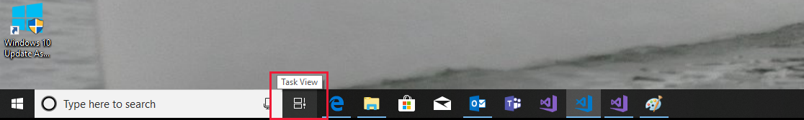

In this module, we demonstrate Windows 10 Timeline and show you how you can improve the appearance of your apps in Timeline by using Adaptive Cards. 

Before we start, examine your current Timeline. Select the **Task View** icon to the right of the search bar in the Windows 10 taskbar.

Your timeline for the past 30 days appears. The items you are currently working on appear with large icons at the top of the screen. Older items appear with smaller images at the bottom of the screen. The Timeline slider is on the right edge of the screen. Notice how some Timeline images don't have much detail and could be more interesting.

Many of the apps you run in Windows 10 appear in Timeline, but unless the apps contain an adaptive card, they use a default image. In this module, we look at how you can define your own adaptive card to create something more interesting.

### Adaptive Cards in Timeline

The Adaptive Cards feature used in Windows 10 Timeline is simpler than the more sophisticated cards discussed in the related module, [Introducing Adaptive Cards](/learn/modules/writing-adaptive-cards/). A Timeline card needs only a title, some descriptive text, and a background image. Your choice of an attractive and appropriate background image is important. No extra coding is involved, so it's a matter of your taste in art and design.

For this module, you can use any Universal Windows Platform (UWP) app that you wrote previously in Visual Studio 2017. For example, we add an adaptive card to the [Astronomy Picture of the Day](/learn/modules/build-internet-connected-windows10-apps/) app we built in a previous tutorial. We show you where to download that app in the next step, in case you want to use it, too.

### Personalized apps

One of the key objectives of Windows 10 apps is for apps to be personalized. One aspect of personalization is the capability to save and restore personal settings. The Astronomy Picture of the Day sample demonstrates this aspect. Another aspect is the particular entries in Timeline, which are a unique, eclectic series of events that are specific to a given user.

Windows 10 Timeline covers the past month of activity. Select any one of the cards to load and run an app, display an image, or initiate whatever process gets back to that task. Timeline is a useful feature if you ever forget what you were doing.

The following programming tutorial teaches you how to use the personalization feature. After you learn how to use this feature for one app, you can add it to other apps.

Let's start by locating the working UWP app. You use Timeline to do this. Next, we load some useful resources. We add an inspiring image and some relevant text to an adaptive card, and then see it in Windows 10 Timeline. You can use any UWP app for this module, but the Astronomy Picture of the Day is the one we use.