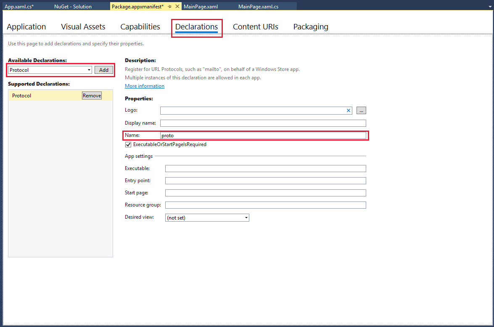
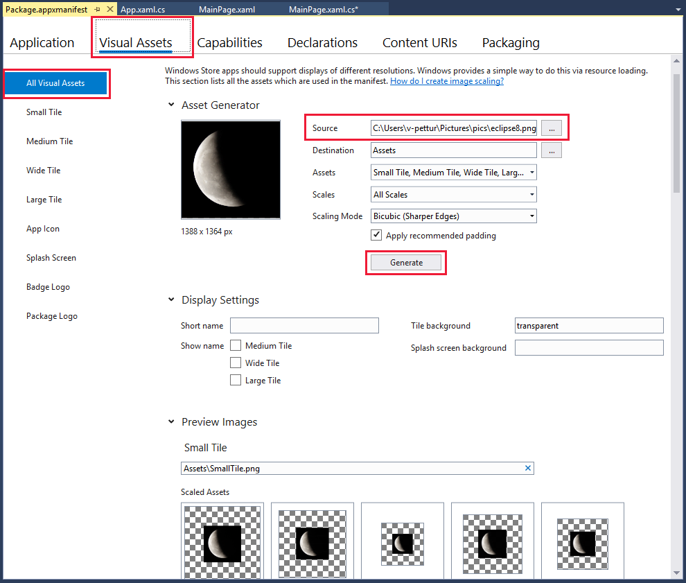
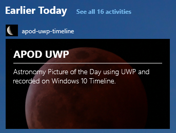

In this unit, you will:


- Use Visual Studio 2017 to add an adaptive card and record the necessary user activity so that the card appears in Windows 10 Timeline.
- Learn the minimum amount of user activity recording that's necessary to keep track of an app.
- Create an adaptive card that's appropriate and uses only a few lines of code.
- Learn about the protocol declarations that are needed to bind the user activity to Timeline selection events.

In this unit, you will not:

- Build a complete app.
- Learn about user activity recording that's not required by our singular objective.

There are four main steps to work through, so let's get started.

### Open an existing UWP project

1. Using Visual Studio 2017, open the existing project for which you want to create an adaptive card for Timeline. In this example, we use the Universal Windows Platform (UWP) version of the Astronomy Picture of the Day from an earlier module. To download the source for that project, use [this GitHub repo](https://github.com/MicrosoftDocs/mslearn-write-internet-connected-Windows-apps). If you need help with GitHub, see [this module](/learn/modules/get-started-with-visual-studio-for-windows10-app-dev/4-advanced-features).

2. On the **Tools** menu, select **NuGet Package Manager** > **Manage NuGet Packages for Solution**. If the **AdaptiveCards** package isn't already installed, select **Browse**. Search for **AdaptiveCards**, and then install the package.

3. Open the **MainPage.xaml.cs** file, and make sure that the following namespace statements are added to the top of the file.

    ```cs
        using Windows.UI.Shell;
        using Windows.ApplicationModel.UserActivities;
        using AdaptiveCards;
        using System.Threading.Tasks;
    ```

4. In the global variables for the **MainPage** class, add the following script. The user activity session tracks the use activity that we need. It also declares an adaptive card that we can use to create a nice visual for Timeline.
    
    ```cs
            // To support Timeline, we need to record user activity and create an adaptive card.
            UserActivitySession _currentActivity;
            AdaptiveCard apodTimelineCard;
    ```


### Add the Timeline-specific code

In this section, we finish most of the programming necessary for this unit, but not all. Protocol declarations are also needed for this code to work as intended.

1. In the constructor for the class, call a setup method before you exit the constructor. Name it **setupForTimelineAsync()**.
    
    ```cs
        public MainPage()
        {
            ...
    
            setupForTimelineAsync();
        }
    ```

2. Add the body of the **setupForTimelineAsync** method. It must be an **async** method because the call to generate user activity is also asynchronous.

    
    ```cs
            private async void setupForTimelineAsync()
            {
                // First create the adaptive card.
                CreateAdaptiveCardForTimeline();
    
                // Second record the user activity.
                await GenerateActivityAsync();
            }
    ```

3. Now create an adaptive card that's nice to look at. The key element is the background image. All we did in the code here is link to a dramatic background and overlay a title and description on the image. There are a few parameters to be aware of. **Wrap** is set to **true** for both text blocks to allow for some wrapping, even for the title. Text fonts are set appropriately for a title and description. A **Separator** is added so that a line appears under the title.

    ```cs
            private void CreateAdaptiveCardForTimeline()
            {
                // Create an adaptive card specifically to reference this app in Windows 10 Timeline.
                apodTimelineCard = new AdaptiveCard("1.0")
                {
                    // Select a good background image.
                    BackgroundImage = new Uri("https://docs.microsoft.com/learn/media/wolf-moon.png")
                };           
    
                // Add a heading to the card, which allows the heading to wrap to the next line if necessary.
                var apodHeading = new AdaptiveTextBlock
                {
                    Text = "APOD UWP",
                    Size = AdaptiveTextSize.Large,
                    Weight = AdaptiveTextWeight.Bolder,
                    Wrap = true,
                    MaxLines = 2
                };
                apodTimelineCard.Body.Add(apodHeading);
    
                // Add a description to the card, and note that it can wrap for several lines.
                var apodDesc = new AdaptiveTextBlock
                {
                    Text = "Astronomy Picture of the Day using UWP, and recorded on Windows 10 Timeline.",
                    Size = AdaptiveTextSize.Default,
                    Weight = AdaptiveTextWeight.Lighter,
                    Wrap = true,
                    MaxLines = 3,
                    Separator = true
                };
                apodTimelineCard.Body.Add(apodDesc);
            }
    ```

4. To track user activity, a channel is created and named. The name **APOD-UWP** is significant and is unique to this app. The **ActivationUri** property is set to a unique name, too. Call the method to create the adaptive card, and set the result as the visual content of the user activity. Setting the content type is good practice. After that, the activity is saved, and we can create the user activity session.
    
    ```cs
             private async Task GenerateActivityAsync()
            {
                // Get the default UserActivityChannel and query it for our UserActivity. If the activity doesn't exist, one is created.
                UserActivityChannel channel = UserActivityChannel.GetDefault();
    
                // The text here should be treated as a title for this activity and should be unique to this app.
                UserActivity userActivity = await channel.GetOrCreateUserActivityAsync("APOD-UWP");
    
                // Populate required properties: DisplayText and ActivationUri are required.
                userActivity.VisualElements.DisplayText = "APOD-UWP Timeline activities";
    
                // The name in the ActivationUri must match the name in the protocol setting in the manifest file (except for the "://" part).
                userActivity.ActivationUri = new Uri("proto://");
    
                // Build the adaptive card from a JSON string.
                userActivity.VisualElements.Content = AdaptiveCardBuilder.CreateAdaptiveCardFromJson(apodTimelineCard.ToJson());
    
                // Set the mime type of the user activity, in this case, an application.
                userActivity.ContentType = "application/octet-stream";
    
                // Save the new metadata.
                await userActivity.SaveAsync();
    
                // Dispose of any current UserActivitySession, and create a new one.
                _currentActivity?.Dispose();
                _currentActivity = userActivity.CreateSession();
            }
    ```

    > [!NOTE]
    > For full programming information on user activities, see [Windows.
    ApplicationModel.User activities namespace](/uwp/api/windows.applicationmodel.useractivities).
    

5. Make a note of the **ActivationUri** name you entered. In this case, it's **proto**.

 ### Set up the protocol declarations

 When the card is clicked in Timeline, we want the app to open. For this action to happen, things need to be connected.
 
 1. To enable the functionality, add the **OnActivated** method in the App.xaml.cs file. Typically, it's added after the **OnSuspending** method. This method detects whether the activation is a protocol. If it's a protocol, the app opens. No other changes must be made to this file.

     ```cs
            protected override void OnActivated(IActivatedEventArgs e)
            {
                if (e.Kind == ActivationKind.Protocol)
                {
                    if (Window.Current.Content == null)
                    {
                        Window.Current.Content = new MainPage();
                    }
                }
                Window.Current.Activate();
            }
    
     ```

 2. To link everything together, open the Package.appx manifest file and select **Declarations**. For the type of declaration, in the **Available Declarations** drop-down list, select **Protocol** > **Add**. In the **Properties** section, enter **ActivationUri** (**proto**) as the **Name** property. Then click anywhere on the page to save this information. You don't need to change any other entries. The following image shows how the page looks after the protocol is successfully added.

    

 3. In the manifest file, you can improve the visuals a bit more. Select **Visual Assets** > **All Visual Assets**. Load a **Source** image that, when scaled, is suitable to use as an icon for your app. Select **Generate**. It's okay to overwrite the existing default icons. Using a new image creates a collection of icons that the app can use in various situations. For the astronomy app, the following image was selected.

    

4. Save and close the manifest file.

 ### Run the app, and check out Timeline

1. Run the app. Nothing should look different than before you did this extra work.

2. Close the app, and open Timeline. Can you see your adaptive card? Can you see the visual asset you loaded as the icon for the card? Does your app start when you click the card? If so, you completed this unit successfully. 

    

> [!NOTE]
> Your card might not be in Timeline where you expect to find it. Look around in the proximity of recent activity to locate it.