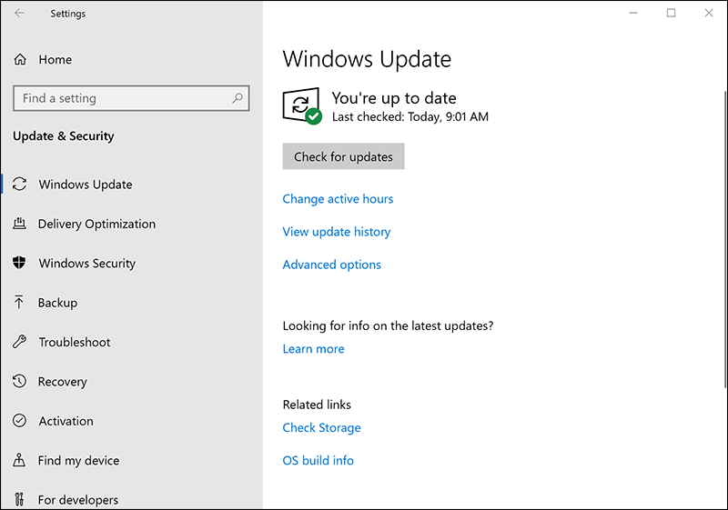
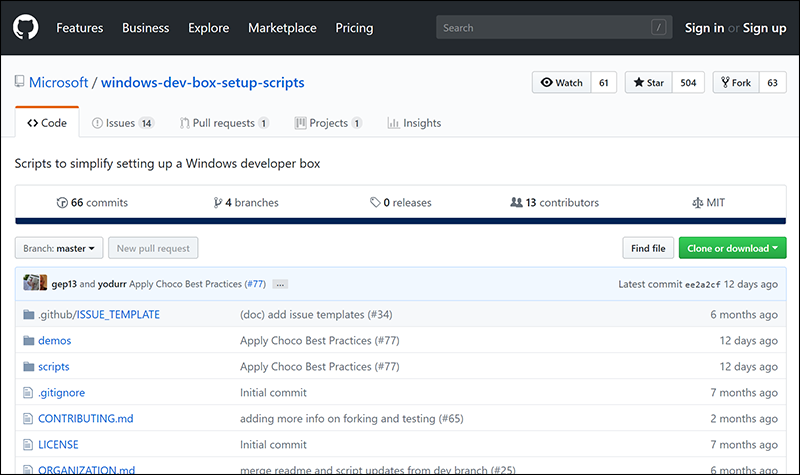
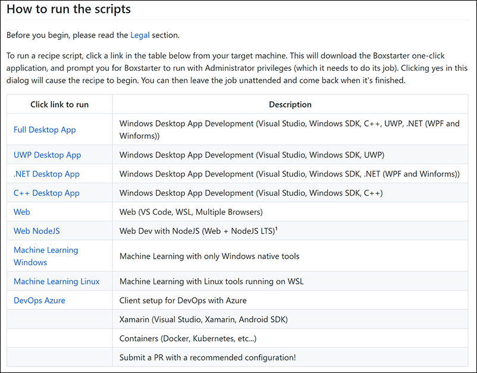

Ready to install Visual Studio? Let's do it. Before you start though, you'll need to make sure that your computer is running the latest version of Windows 10. Then follow a link and the installation will be performed automatically.

## Make sure Windows 10 is up to date

To ensure that you're running the latest version of Windows:

1. Go to **Settings**.
1. Select **Update & Security**.

   
1. Select **Check for updates**.
1. Let any updates get installed.

## Go to the installation script page on GitHub

1. In Microsoft Edge, go to [Scripts to simplify setting up a Windows developer box](https://github.com/Microsoft/windows-dev-box-setup-scripts) on GitHub.

   

1. Scroll down to the "How to run the scripts" table:

   

1. Select the **Full Desktop App** link.
1. Follow the instructions.
 
> [!NOTE]
> To work properly, these installation scripts require the Microsoft Edge web browser.

## What the script installs

Just in case you're curious, the script installs the following tools:

* Visual Studio 2017 Community edition
* Visual Studio Code
* Git
* The Visual Studio Azure workload
* The Visual Studio UWP workload
* The Visual Studio Managed desktop workload
* The Visual Studio Native desktop workload
* Windows Template Studio
* GitHub UWP samples

The script also turns on Developer Mode on Windows 10.

## If the script doesn't work

If something doesn't work, or you'd rather install the tools yourself, see the next unit to learn how to install the tools manually.
