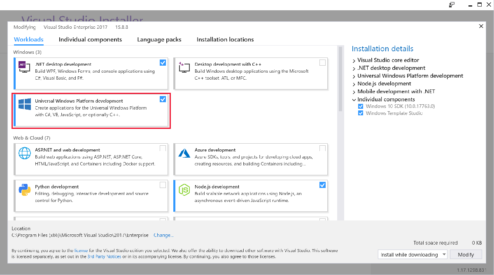
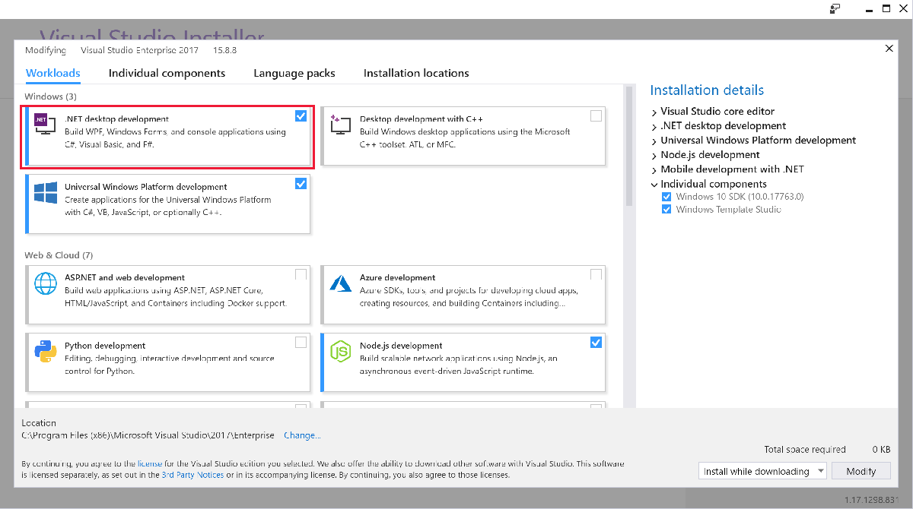
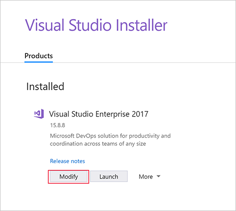

If the automatic process in the previous module isn't for you, here's how to manually install Visual Studio.

> [!NOTE]
> If you've already installed Visual Studio, you can skip this unit.

## Download Visual Studio

Visual Studio comes in several versions. If you're an experienced developer, you might already be using Visual Studio Professional or Visual Studio Enterprise. These paid versions of the program provide additional features for advanced scenarios. However, all the features you need to develop Windows apps are available in the free **Visual Studio Community** version.

* [Download Visual Studio](https://go.microsoft.com/fwlink/p/?LinkID=534189)

## Install Visual Studio

The installation process is handled by the Visual Studio Installer, which walks you through the process. The default settings provide most of what you need. However, during installation, you're prompted to choose workloads that correspond to the type of Windows apps you want to develop.

* If you're considering writing Universal Windows Platform (UWP) apps, select **Universal Windows Platform development**.

   

* If you're considering writing WPF or Windows Forms apps, select **.NET desktop development**.

   

You can select more than one option. You can also install additional workloads by restarting Visual Studio Installer.

You can restart Visual Studio Installer via the Start menu, or from the **New project** pane within Visual Studio.

## Install the Windows 10 SDK

By default, new installations of the Universal Windows Platform development workload in Visual Studio install the latest version of the Windows 10 software development kit (SDK). If you've already installed the Windows 10 SDK, you can update it on the **Individual components** tab of Visual Studio Installer.

Alternatively, you can [download the latest version of the SDK online](https://developer.microsoft.com/windows/downloads/windows-10-sdk).

We recommend upgrading to the latest SDK version whenever possible. By developing with the latest SDK, you're using the latest Windows app development features. You can also develop apps for previous versions of Windows 10.

## Other useful tools

* [Windows Template Studio](https://marketplace.visualstudio.com/items?itemName=WASTeamAccount.WindowsTemplateStudio).
* [Git](https://git-scm.com)
