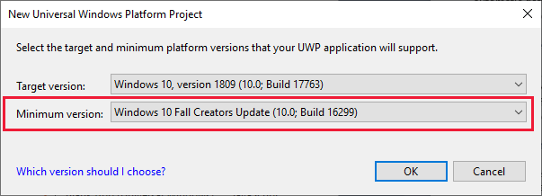
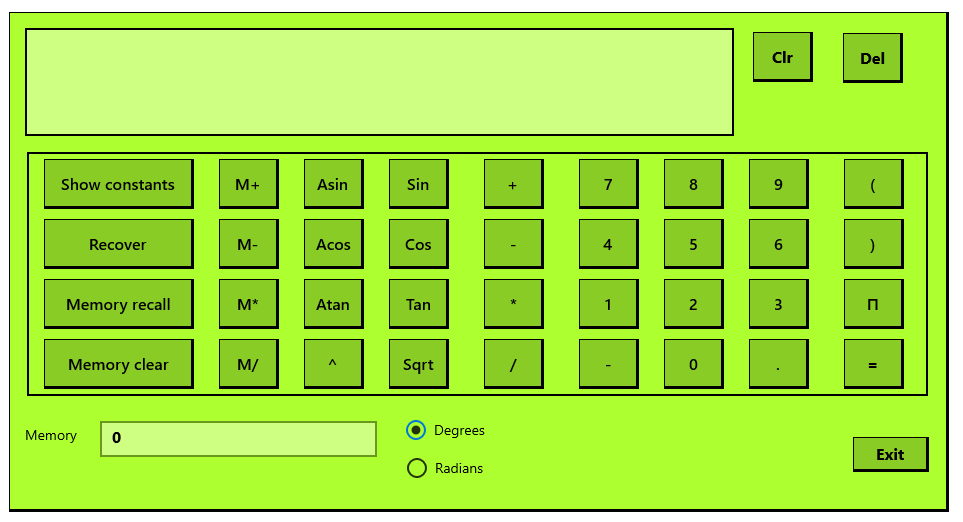

It can be difficult to make your Windows apps inclusive. By inclusive we mean accessible - even friendly - to users with an impairment that makes using a highly visual mouse-driven app a challenge in itself.

The range of accessibility concerns can be a little daunting. The most common are visual impairments - including poor vision, difficulty in focusing on a close-up computer screen, color-blindness, and a partial or complete blindness. Other impairments include partial or complete deafness, motor deficiencies, learning difficulties, and forms of physical and mental illness that might hinder a user's success with an app.

In this module, we'll focus on using audio features to create an inclusive experience. We'll learn how to configure an app to be read by Narrator, and how to handle input via speech recognition. If you're interested the basics of identifying inclusivity issues and crafting a more inclusive UI, check out our other module on inclusive design for Windows developers.

## Getting started

We'll use a scientific calculator app in this module, so we can show how to make Narrator and speech input work in a technically complex scenario. If you've already completed our previous module on inclusive design for Windows devs, you'll already have this app downloaded and ready to go. If you haven't, here's what you need to do:

1. Open Visual Studio, and create a new **Windows Universal** project using the **Blank App** template, called **InclusiveScientificCalculator**. Make sure to use this name exactly, to match the code we'll get from GitHub.

2. When prompted about the versions of Windows that the app should support, change the minimum version from the default to the one shown in the following image. There are some newer features of Windows that we need to include.

3. Navigate to [this GitHub repo](https://github.com/MicrosoftDocs/mslearn-write-inclusive-Windows-apps), and open the `MainPage.xaml` file. Select all the contents of the file, and copy and paste it over the entire contents of the MainPage.xaml file in your project.

4. At the same location on GitHub, open the `MainPage.xaml.cs` file. Again, replace all the contents of your file with the contents of the file on GitHub. It's quite a lot of code, over 1000 lines of C#.

5. Select **Start without debugging** from the **Debug** menu of Visual Studio. You should see something like the following image. If not, double-check that everything was copied correctly.

If this is your first time using this app, feel free to explore the features. We won't be directly changing the UI in this module, though, so don't worry too much about the specifics.
