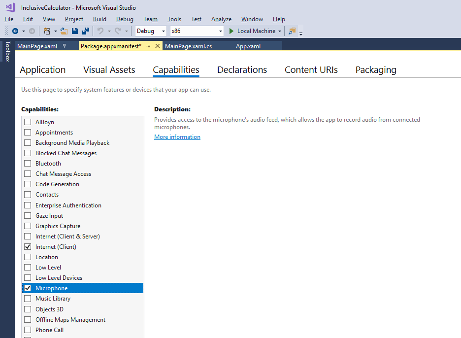

If we want to do better than the default Windows speech recognition, we'll need to code an app-specific speech recognition system designed to handle whole-sentence input.

This is quite a lot of coding work, so it might instead be worth the time to improve the **AutomationProperties.Name** properties of your app and retest it against the Windows speech recognizer. It's true that we already have a system that's accessible for this input method, if a little clumsy. But for truly smooth voice input in a specialized context, we'll need to make this custom system.

### References

For a full list of commands, refer to [Windows speech recognition commands](https://support.microsoft.com/help/12427/windows-speech-recognition-commands).

### Getting permission to take input from a microphone and run speech recognition on that input

We need to set several permissions and capabilities before we can start using custom speech recognition.

1. In Visual Studio, with the calculator project loaded, open the Package.appxmainifest file, then select **Capabilities**. Turn on the **microphone** capability.



2. Setting this capability provides access to the microphone's audio feed. Save and close the manifest file.

3. This is all that is required of the app, but not all that is required for speech recognition to work. The user must enable both the microphone and speech recognition for the app, and the latter is disabled by default. The developer is also the user when testing, so type in "privacy settings" to the Windows search bar.


4. Select **Speech** and ensure that **Online speech recognition** is on. Select **Microphone** and ensure **Allow apps to access your microphone** is on. Close or minimize the settings window.

We'll try turning these settings off later, just to test that we've handled these situations correctly in our app.

### Adding code to match words and phrases to UI elements

Quite a lot of code has to be added to support a custom speech recognizer, but let's start with the using statements and global variables.

1. Add the following using statements to the top of your code.

```cs
using Windows.Media.SpeechRecognition;
using Windows.Media.Capture;
```

2. Add the following global variables and one new enumeration.

```cs
        enum eElements
        {
            Button,
            ToggleSwitch,
            Unknown
        }

        bool isRecognitionAvailable;
        SpeechRecognizer speechRecognizer;
```

3. To handle the permissions issues described above, add the following class to your code. One call to **RequestMicrophonePermission** will check all the necessary permissions. This is generic code and can be used in any app you develop for Windows 10 to support speech recognition permissions through a microphone, though it doesn't handle Cortana/Dictation privacy.

```cs
        public class AudioCapturePermissions
        {
            // If no microphone is present, an exception is thrown with the following HResult value.
            private static readonly int NoCaptureDevicesHResult = -1072845856;

            /// <summary>
            ///  Note that this method only checks the Settings->Privacy->Microphone setting, it does not handle
            /// the Cortana/Dictation privacy check.
            /// </summary>
            /// <returns>True, if the microphone is available.</returns>
            public async static Task<bool> RequestMicrophonePermission()
            {
                try
                {
                    // Request access to the audio capture device.
                    var settings = new MediaCaptureInitializationSettings
                    {
                        StreamingCaptureMode = StreamingCaptureMode.Audio,
                        MediaCategory = MediaCategory.Speech,
                    };
                    var capture = new MediaCapture();

                    await capture.InitializeAsync(settings);
                }
                catch (TypeLoadException)
                {
                    // Thrown when a media player is not available.
                    var messageDialog = new Windows.UI.Popups.MessageDialog("Media player components are unavailable.");
                    await messageDialog.ShowAsync();
                    return false;
                }
                catch (UnauthorizedAccessException)
                {
                    // Thrown when permission to use the audio capture device is denied.
                    var messageDialog = new Windows.UI.Popups.MessageDialog("Permission to use the audio capture device is denied.");
                    await messageDialog.ShowAsync();
                    return false;
                }
                catch (Exception exception)
                {
                    // Thrown when an audio capture device is not present.
                    if (exception.HResult == NoCaptureDevicesHResult)
                    {
                        var messageDialog = new Windows.UI.Popups.MessageDialog("No Audio Capture devices are present on this system.");
                        await messageDialog.ShowAsync();
                        return false;
                    }
                    else
                    {
                        throw;
                    }
                }
                return true;
            }
        }
```

4. It's good practice to have a setting that turns speech recognition features on and off. Define another toggle switch in the `MainPage.xaml` file. Note we're setting the keyboard accelerator **L** (for "Listener") to trigger the toggle. Add this just before the **ListConstants** entry.

```xml
        <ToggleSwitch x:Name="ToggleSpeechRecognition"
            Margin="685,409,0,0"
            HorizontalAlignment="Left"
            VerticalAlignment="Top"
            Header="Speech recognition"
            IsOn="False"
            Toggled="ToggleSpeechRecognition_Toggled">
            <ToggleSwitch.KeyboardAccelerators>
                <KeyboardAccelerator Key="L" Modifiers="None" />
            </ToggleSwitch.KeyboardAccelerators>
        </ToggleSwitch>
```

5. Now define the **ToggleSpeechRecognition_Toggled** event named in the xaml, and some supporting methods, in the `MainPage.xaml.cs` file again.

```cs
        private async Task InitSpeechRecognition()
        {
            isRecognitionAvailable = await AudioCapturePermissions.RequestMicrophonePermission();

            if (isRecognitionAvailable)
            {
                // Create an instance of SpeechRecognizer.
                speechRecognizer = new SpeechRecognizer();

                // Compile the dictation grammar by default.
                await speechRecognizer.CompileConstraintsAsync();

                speechRecognizer.UIOptions.ShowConfirmation = true;
            }
            else
            {
                ToggleSpeechRecognition.IsOn = false;
                isRecognitionAvailable = false;
            }
        }

        private async void ToggleSpeechRecognition_Toggled(object sender, RoutedEventArgs e)
        {
            if (ToggleSpeechRecognition.IsOn)
            {
                await InitSpeechRecognition();
                await StartListening();
            }
            else
            {
                isRecognitionAvailable = false;
            }
        }

        private async Task StartListening()
        {
            if (isRecognitionAvailable)
            {
                try
                {
                    // Start recognition.
                    var speechRecognitionResult = await speechRecognizer.RecognizeWithUIAsync();
                    ParseSpokenCalculationAsync(speechRecognitionResult.Text);

                    // Turn off the Toggle each time.
                    ToggleSpeechRecognition.IsOn = false;
                }
                catch (Exception ex)
                {
                    var messageDialog = new Windows.UI.Popups.MessageDialog(ex.Message);
                    await messageDialog.ShowAsync();
                    ToggleSpeechRecognition.IsOn = false;
                    isRecognitionAvailable = false;
                }
            }
        }
```

6. The **ParseSpokenCalculation** method is given a speech recognized string as input. To process this string, we need to add a large chunk of app-specific code.

This code takes spoken sentence and tries to match phrases and words from that sentence to the buttons, toggle switches, or constants of our app. Words that don't match are ignored. The following code is a brute force approach to the problem.

Paste the following code into your app.

```cs
        private bool FindConstantFromSpeech(string spokenText, ref string value)
        {
            bool isLocated = false;
            int n = 0;
            string[] nameValue;

            // Remove the word "constant" from the start of the spoken text.
            spokenText = spokenText.Remove(0, spokenText.IndexOf(' ')).Trim();

            while (n < ListConstants.Items.Count && !isLocated)
            {
                nameValue = ListConstants.Items[n].ToString().Split('=');

                if (spokenText == nameValue[0].Trim().ToLower())
                {
                    value = nameValue[1].Trim();
                    isLocated = true;
                }
                else
                {
                    ++n;
                }
            }
            return isLocated;
        }

        private async void SayCurrentCalculationAsync()
        {
            if (TextDisplay.Text.Length == 0)
            {
                await SayAsync("The current calculation is empty.");
            }
            else
            {
                await SayAsync($"The current calculation is: {TextDisplay.Text}.");
            }
        }

        private async void ParseSpokenCalculationAsync(string spokenText)
        {
            spokenText = spokenText.ToLower().Trim();
            if (spokenText.Length == 0)
            {
                return;
            }

            // First check for specific control phrases.
            if (spokenText == "say memory")
            {
                await SayAsync($"The current memory is: {TextMemory.Text}.");
            }
            else
                if (spokenText == "say calculation")
            {
                SayCurrentCalculationAsync();
            }
            else
                 if (spokenText.StartsWith("const"))
            {
                string value = "";
                if (FindConstantFromSpeech(spokenText, ref value))
                {
                    MathEntry(value, "Number");
                    SayCurrentCalculationAsync();
                }
                else
                {
                    await SayAsync("Sorry, I did not recognize that constant.");
                }
            }
            else
            {
                // Ensure + is a word in its own right.
                // Sometimes the speech recognizer will enter "+N" and we need "+ N".
                spokenText = spokenText.Replace("+", "+ ");
                spokenText = spokenText.Replace("  ", " ");

                double d;
                string[] words = spokenText.Split(' ');
                int w = 0;
                ToggleSwitch ts;
                object obj;
                var eType = eElements.Unknown;

                while (w < words.Length)
                {
                    try
                    {
                        // Is the word a number?
                        d = double.Parse(words[w]);
                        MathEntry(d.ToString(), "Number");
                    }
                    catch
                    {
                        try
                        {
                            // Is the word a ratio?
                            string[] ratio = words[w].Split('/');
                            d = double.Parse(ratio[0]) / double.Parse(ratio[1]);
                            MathEntry(d.ToString(), "Number");
                        }
                        catch
                        {
                            // Check if a word or phrase refers to a button, test phrases up to 4 words long.
                            // There are only buttons in gridButtons, so no need to test for anything else.
                            obj = FindElementFromString(GridButtons.Children, words, w, 4, ref w, ref eType);
                            if (obj != null)
                            {
                                Button_Click(obj, null);
                            }
                            else
                            {
                                // Controls can be up to three words in our app.
                                obj = FindElementFromString(GridCalculator.Children, words, w, 3, ref w, ref eType);
                                if (obj != null)
                                {
                                    switch (eType)
                                    {
                                        case eElements.Button:
                                            Button_Click(obj, null);
                                            break;

                                        case eElements.ToggleSwitch:
                                            ts = (ToggleSwitch)obj;
                                            ts.IsOn = !ts.IsOn;
                                            break;

                                        default:
                                            break;
                                    }
                                }
                            }
                        }
                    }
                    ++w;
                }
                if (mode != Emode.CalculateDone)
                {
                    SayCurrentCalculationAsync();
                }
            }
        }

        private bool IsMatchingElementText(eElements elementType, object obj, string textToMatch)
        {
            string name = "";
            string accessibleName = "";

            switch (elementType)
            {
                case eElements.Button:
                    var b = (Button)obj;
                    name = b.Content.ToString().ToLower();
                    accessibleName = b.GetValue(AutomationProperties.NameProperty).ToString().ToLower();
                    break;

                case eElements.ToggleSwitch:
                    var ts = (ToggleSwitch)obj;
                    name = ts.Header.ToString().ToLower();
                    accessibleName = ts.GetValue(AutomationProperties.NameProperty).ToString().ToLower();
                    break;
            }

            // Return true if the name or accessibleName matches the spoken text.
            if ((textToMatch == name && name.Length > 0) || (textToMatch == accessibleName && accessibleName.Length > 0))
            {
                return true;
            }

            return false;
        }

        private object FindElementFromString(UIElementCollection elements, string[] words, int startIndex, int maxConcatenatedWords, ref int updatedIndex, ref eElements elementType)
        {
            // Return true if the spoken text matches the text for a button.
            int n;
            Button b;
            ToggleSwitch ts;

            // Longer phrazes take precendence over shorter ones, so start with the longest allowed and work down.
            for (int c = maxConcatenatedWords; c > 0; c--)
            {
                if (startIndex + c - 1 < words.Length)
                {
                    // Build the phraze from the following words.
                    string txt = words[startIndex];
                    for (n = 1; n < c; n++)
                    {
                        txt += " " + words[startIndex + n];
                    }

                    // Test the word or phrase against the content/tag/name of each button.
                    for (int i = 0; i < elements.Count; i++)
                    {
                        // Is the UI element a button?
                        try
                        {
                            b = (Button)elements[i];
                            if (IsMatchingElementText(eElements.Button, (object)b, txt))
                            {
                                updatedIndex = startIndex + c - 1;
                                elementType = eElements.Button;
                                return (object)b;
                            }
                        }
                        catch
                        {
                            // UI element is not a button, is it a ToggleSwitch?
                            try
                            {
                                ts = (ToggleSwitch)elements[i];
                                if (IsMatchingElementText(eElements.ToggleSwitch, (object)ts, txt))
                                {
                                    updatedIndex = startIndex + c - 1;
                                    elementType = eElements.ToggleSwitch;
                                    return (object)ts;
                                }
                            }
                            catch
                            {
                                // Ignore the UI element.
                            }
                        }
                    }
                }
            }
            updatedIndex = startIndex;
            return null;
        }
```

> [!NOTE]
> To enter a constant, say "constant" then say the name of the constant in full.
> "Say memory" will enunciate the contents of the memory.
> "Say calculation" will enunciate the contents of the current calculation.

8. Build and run the app and turn on the speech recognition toggle switch.

9. With the microphone ready, say "what is 1.23456 times 2.789". What you say should appear on a dialog entitled **Listening**, which will close quickly after you stop speaking. The calculation should then appear in the display.


> [!NOTE]
> If the Listening dialog shows **Sorry, didn't catch that** then press the space bar to bring up the Listener again.

10. Try entering a number of simple calculations using your voice.

> [!NOTE]
> Just press the **L** key and say "clear" to wipe a wayward calculation.

11. Calculations can be constructed in parts, as only a slight pause is enough for the Listener to close and the input be parsed. For example, say "what is sine 30 times". Then select the **L** key, and when the Listener reappears say "the cosine of 30". Then select **L** again and say "equals". You should get the result.

12. Notice that noise words like "what is", "of", and "the" can be included in the sentence, but are correctly ignored.

13. Try making up equations (no problem if they make no mathematical sense!) that will test *all* of the buttons and toggle switches, including the **Clr**, **Del** buttons, memory storage buttons, constants, and everything else. This should help ensure that they're all being properly handled by the code.
