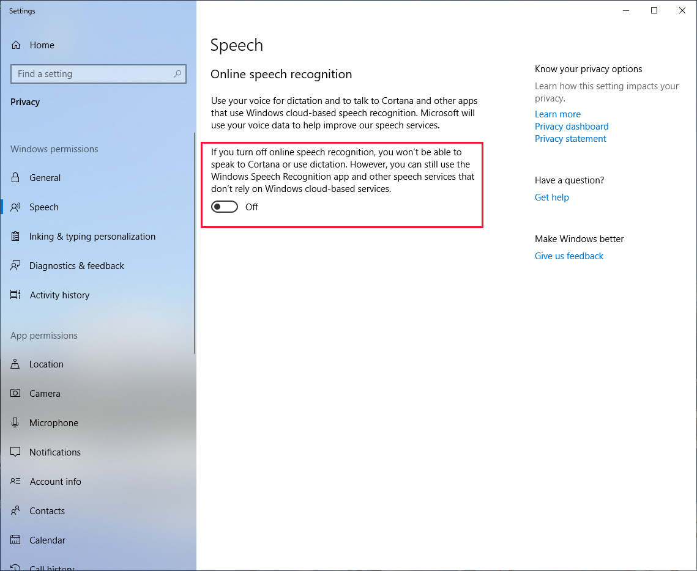
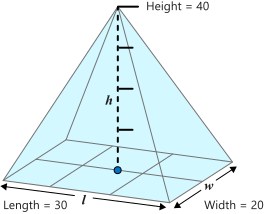
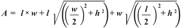

Security is important. When using specific capabilities, it isn't sufficient to check that an app has permissions just the once on initialization of the app.

Our app needs to respond to the situation where the user turns off a necessary permission while running the app. To check our app's functionality, we'll selectively turn off the two required permissions during use of the app, and ensure that it responds correctly.

1. Start the calculator, toggle on speech recognition, and say something simple that will be recognized.

2. Now turn off the **Allow apps to access your microphone** permission. To find this setting, type "privacy settings" into the Windows search bar, then select **Microphone** from the settings to the left.

3. Now press **L** and try to say something. You should get the error message **"Permission to use the audio capture device is denied.""**. If so, turn the permission back on and try again. Your spoken text should be accepted.

4. Leaving this permission on, go back to the privacy settings and turn off speech recognition (access this by selecting **Speech**). Then press **L** and try to enter speech.

5. You should get the error message **"The speech privacy policy was not accepted prior to attempting a speech recognition"**.

6. Turn the setting back on, and try again. Your speech input should be accepted.

7. For our last test type **L** to display the Listener dialog. Now change focus to another app or Windows feature. This should toggle off speech recognition and close the Listener dialog.

It's important that these tests work. Other tests you can try include disconnecting the microphone completely (though responding to hardware problems isn't an app requirement, but a good user experience nonetheless).

Now that we've confirmed that our permissions work, let's admire what we've built and put our completed accessibility app to full use.

### Thorough math testing

We're going to give the speech recognition system a real test here. If you're confident in your work and your testing so far, you can skip this. We're not building anything else, we're just seeing what we can do.

Let's consider this regular pyramid.

| Regular pyramid | Surface area equation |
|:--:|:--:|
|  | |

The surface area of a regular pyramid is calculated using the scary equation shown - this is our challenge.

1. First, enter this using the mouse pointer and buttons. Clear the calculation and enter: **20 * 30 + 30 Sqrt ( (20/2) ^ 2 + 40 ^ 2) + 20 Sqrt ( (30/2) ^ 2 + 40 ^ 2)**. With narration help on, a calculation like this more than fills our display text area.

2. Press **=**. Do you get the correct answer of **2691.33206221705**?

3. Now, let's try using voice recognition for this equation. It needs to be spoken in parts as the Listener has limits. Speak, clearly and in order, the following words. Correct any mistakes as you progress by saying "delete" or using the **Del** key appropriately. Use the **L** key to bring up the Listener each time - no need to wait until the current calculation is read out before pressing **L** again.

- "20 times 30 plus 30 square root open open"
- "20 divided by 2 close to the power of 2"
- "plus 40 to the power of 2 close"
- "plus 20 times square root open open"
- "30 divided by 2 close to the power of 2"
- "plus 40 to the power of 2 close equals"

4. Did you get the result of **2691.33206221705**? If so, then you've successfully built a custom speech recognition engine.

Fun, isn't it? Speech recognition is less frustrating than ever.

> [!NOTE]
> The code you entered in this module uses a brute-force exact-match algorithm. If you want to take speech recognition further, try investigating string matching algorithms such as the Levenshtein distance algorithm.

## Unit summary

You've learned the strengths and weaknesses of general Windows speech recognition and implemented code to make your own customized speech recognition - and the improvements in recognition that come with this approach. And hopefully, you've learned how much fun that can be.

Let's now summarize what you've learned from the whole module.
