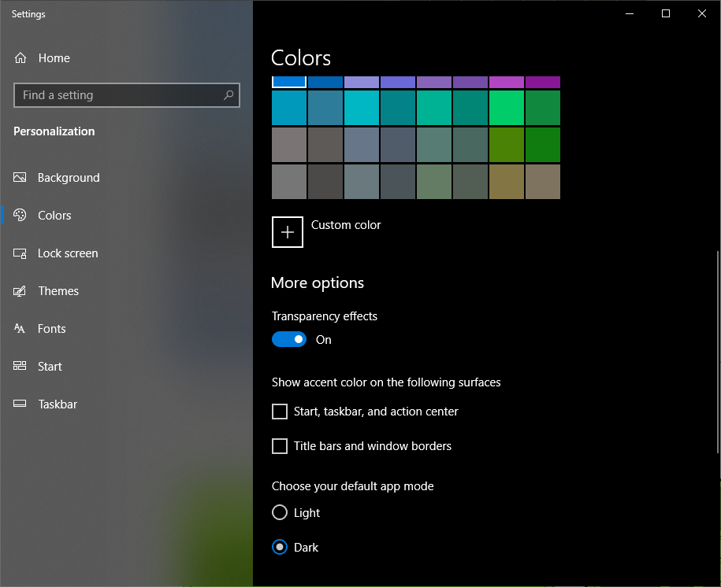
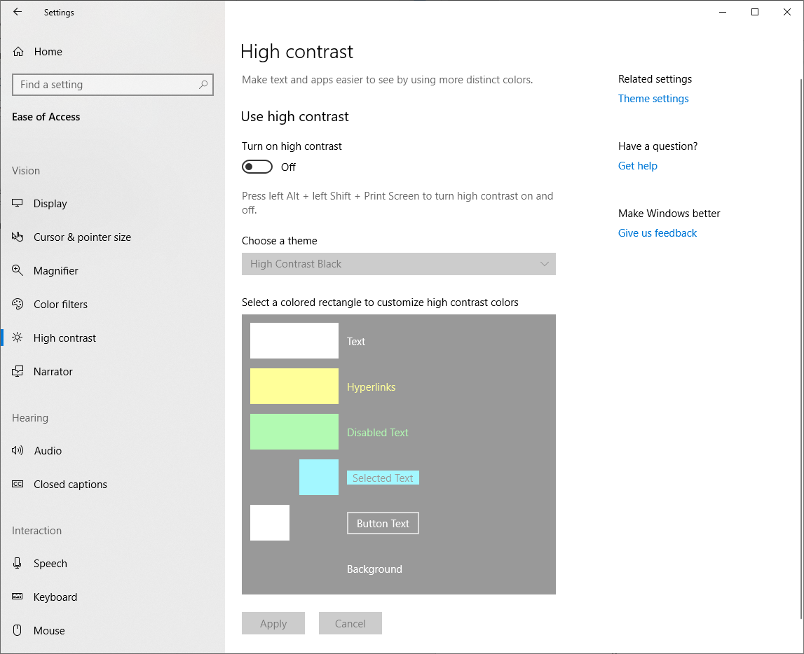
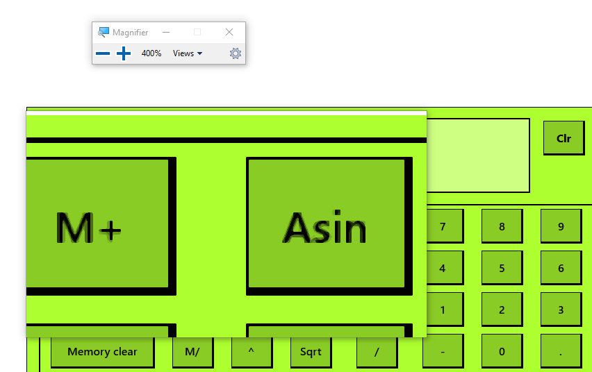

In this unit we start to investigate and develop a more inclusive version of this app, starting with something as simple as color.

In this unit, you'll learn:
- How to test the default Windows high contrast and color settings with your app.
- How to add XAML to your app to enhance the high contrast and color settings.
- How to use the Magnifier tool and the importance of font sizes in UI elements.

Make sure you've got the scientific calculator app from the last step up and running.

## App colors and font sizes

By the end of this unit our app should be more readable for those with impaired vision, and for those with color and contrast differentiation issues.

### Investigate color and magnification tools and settings

Let's start by using readily available Windows accessibility options on our unadjusted app. Many users interested in accessibility will know how to use these existing options, and you should consider how your app appears when these visual customizations are used.

1. Windows features built-in color themes, which allow you to change the appearance of your app without making any adjustments to the code itself. In the Search bar at the lower left corner of your screen, type "color settings" then select **Enter.** In the settings windows that appears, scroll down a bit until you can see the **Light** and **Dark** radio buttons. By default, the **Light** option should be set. For now, try setting the **Dark** mode.

2. The calculator will now look like the second image. Try entering a simple calculation. It's not a clear experience, is it?

| Color Scheme | Color Scheme |
|:--:|:--:|
|  |  |
| *Light*| *Dark* |

3. Turn the color setting back to **Light**, and minimize the color settings window. Type "high contrast" into the Windows search bar, and select **Turn high contrast on or off**. The high contrast settings screen should appear.

4. Select **Turn on high contrast**. You might notice that it takes some seconds for the high contrast settings to take effect.

5. Let's look at the four pre-defined high contrast settings. One after another, choose **High Contrast #1**, **High Contrast #2**, **High Contrast Black** and **High Contrast White**. The calculator will appear as follows.

| High Contrast Color Scheme | High Contrast Color Scheme |
|:--:|:--:|
|  |  |
| *High Contrast #1*| *High Contrast #2* |
|  |  |
| *High Contrast Black*| *High Contrast White* |

6. The #1 and #2 settings use high contrast yellow and green on black respectively. Notice how the use of black in our calculator keys renders the border lines invisible in several settings. The white setting is probably the most usable of these four default options, but the calculator still isn't visually pleasing in that theme.

7. Turn off high contrast in the settings window (or return to your normal development settings, if you normally use one of these modes).

8. Finally, type "magnifier" into the Windows search bar. Notice the result: a small magnified screen, and a short tool bar that presents magnification controls.

9. Try entering the following simple equation into the calculator using the magnifier. Select **Show constants**, locate the constant **Speed of light in miles/sec**, select division (**/**), enter **100**, enter **=**. Now, still using the magnifier, check the result. So, one-hundredth of the speed of light is about 1863 miles/sec. Close the magnifier by going over its own toolbar and select the **X**.

10. Using the magnifier, like using the color settings, is not always simple. While it's a useful tool for users to have access to, a more accessible app would reduce the number of users who might have to use it. Increasing font sizes is a good place to start with such improvements.

That completes our initial investigation of color and magnification. Now let's crack open the code and do something about the issues we have found.
