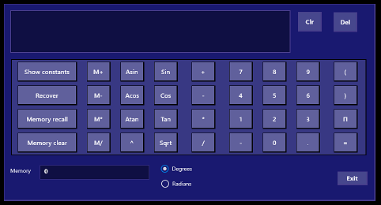
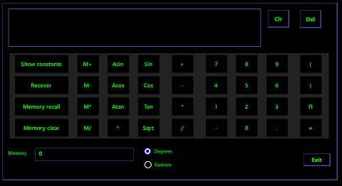
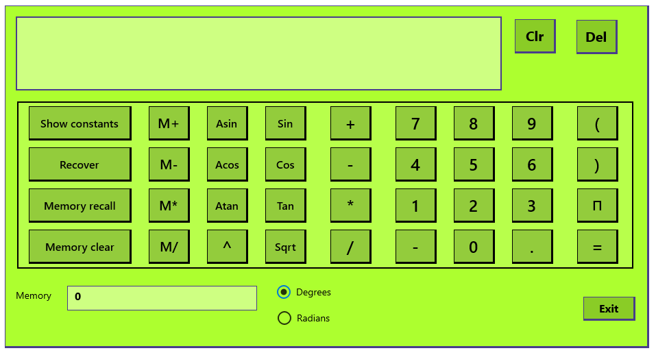

In the previous units, we learned how to use the default Windows color and high contrast setting modes. Let's go into our app's code to improve that experience.

A lot of work in making an app inclusive is done in the XAML files: `MainPage.xaml` and `App.xaml`. In order to make our app more flexible in its appearance when color settings are changed, we need to open up the `App.xaml` file. By default, it is as simple as this.

```xml
<Application
    x:Class="InclusiveScientificCalculator.App"
    xmlns="http://schemas.microsoft.com/winfx/2006/xaml/presentation"
    xmlns:x="http://schemas.microsoft.com/winfx/2006/xaml"
    xmlns:local="using:InclusiveScientificCalculator">

</Application>
```

1. Set the basic colors for light, dark and high contrast colors by changing the `App.xaml` file to the following. Note how we have a fixed color setting for light and dark, but a Windows setting (**SystemColorWindowColor**) for high contrast.

```xml
<Application
    x:Class="InclusiveScientificCalculator.App"
    xmlns="http://schemas.microsoft.com/winfx/2006/xaml/presentation"
    xmlns:x="http://schemas.microsoft.com/winfx/2006/xaml"
    xmlns:local="using:InclusiveScientificCalculator">

    <Application.Resources>
        <ResourceDictionary>
            <ResourceDictionary.ThemeDictionaries>
                <!--
                    Default is a fallback if a more precise theme isn't called
                    out below
                -->
                <ResourceDictionary x:Key="Default">
                    <SolidColorBrush x:Key="BrandedPageBackgroundBrush" Color="MidnightBlue" />
                </ResourceDictionary>

                <!--
                    Optional, Light is used in light theme.
                    If included, Default will be used for Dark theme
                -->
                <ResourceDictionary x:Key="Light">
                    <SolidColorBrush x:Key="BrandedPageBackgroundBrush" Color="GreenYellow" />
                </ResourceDictionary>

                <!--  HighContrast is used in all high contrast themes  -->
                <ResourceDictionary x:Key="HighContrast">
                    <SolidColorBrush x:Key="BrandedPageBackgroundBrush" Color="{ThemeResource SystemColorWindowColor}" />
                </ResourceDictionary>
            </ResourceDictionary.ThemeDictionaries>
        </ResourceDictionary>
    </Application.Resources>

</Application>
```

2. Before testing the app out, let's make some changes based on our initial investigation. Get rid of the hard-coded **GreenYellow** color and instead refer to our color settings. In the `MainPage.xaml` replace the **GridCalculator** entry with the following code.

```xml
     <Grid x:Name="GridCalculator"
        Width="940"
        Height="500"
        Margin="10,10,10,10"
        HorizontalAlignment="Stretch"
        VerticalAlignment="Stretch"
        Background="{ThemeResource BrandedPageBackgroundBrush}"
        BorderBrush="Black"
        BorderThickness="1,1,3,3"
        KeyDown="Grid_KeyDown">
```

3. Next, let's improve the color of our grid background buttons. Replace the **GridButtons** entry with the following code.

```xml
        <Grid x:Name="GridButtons"
            Width="Auto"
            Height="Auto"
            Margin="17,139,0,0"
            HorizontalAlignment="Left"
            VerticalAlignment="Top"
            Background="#22FFFFFF"
            BorderBrush="Black"
            BorderThickness="2,2,2,2">
```

4. We saw that black borders weren't helpful in some high contrast settings. Change the black borders of those elements *outside* of the grid of buttons to perhaps a **DarkSlateBlue**. Start by changing the **BorderBrush** entry for the **Clr** button to the following.

```cs
        BorderBrush="DarkSlateBlue"
```

> [!NOTE]
> A quick way to locate a UI element in a long XAML file is to click the element in the visual display.

5. Do the same (change the **BorderBrush** color to **DarkSlateBlue**) for the **Del** button, the **Exit** button, the **textDisplay** box, the **textMemory** box, and the **gridCalculator** grid.

6. Let's test these improvements. Enter "color settings" in the Windows search bar, and switch between the **Light** and **Dark** modes once again. Notice any improvement?

| Color Scheme | Color Scheme |
|:--:|:--:|
|  |  |
| *Light*| *Dark* |

7. Now "high contrast" in the Windows search bar. Select each of the four high contrast themes. Your scientific calculator should now look usable in all four themes, as shown in the following images.

| High Contrast Color Scheme | High Contrast Color Scheme |
|:--:|:--:|
|  |  |
| *High Contrast #1*| *High Contrast #2* |
|  |  |
| *High Contrast Black*| *High Contrast White* |

8. Without too much work, you've made your app significantly more inclusive to users with color differentiation issues. A little bit of manual work can go even further, though.

### Increase font sizes where you can

The font size of all the buttons in the calculator app is set at **16**. This isn't too small, but doesn't look great for a few keys with relatively small symbols.

1. Stay in the `MainPage.xaml` file, and search for **FontSize="16"**. Navigate to the following buttons:

- ButtonPow
- ButtonPlus
- ButtonMinus
- ButtonMultiply
- ButtonDivide
- Buttons0 through 9
- ButtonNegative
- ButtonPoint
- ButtonLeft
- ButtonRight
- ButtonEquals
- TextDisplay

In each of them, use the Quick Replace feature to change the searched-for text to **FontSize='24'**.

> [!NOTE]
> Some fonts are hard to read on a computer screen, and are a bad choice for your UI. That's why we're sticking with the default **Segoe UI**, which was specifically designed to be read on a screen. If you *need* to use a different font, be sure to test your app to make sure it's still the right size, and is still easy to read.

2. Not all buttons can have a font size greater than 16 and still appear uncropped. Now search for **FontSize="16"** and replace it with **FontSize="20"** for the following buttons and text output:

- ButtonMemoryPlus
- ButtonMemoryMinus
- ButtonMemoryMultiply
- ButtonMemoryDivide
- ButtonPi
- ButtonClr
- ButtonDel

(To locate the first one, you can select the **Memory plus** button.)

3. Run the app. The buttons should look more substantial, and thus easier to use.



## Unit Summary

You've learned how to set color and high contrast themes, and how to code your apps to sync well with the Windows settings. You've adjusted your calculator font sizes to make the screen just a little bit clearer. Users with tired or slightly impaired vision or color differentiation will appreciate this kind of inclusivity.

The next unit goes deeper into Windows inclusivity features, for users with more demanding vision issues or motor abilities.
