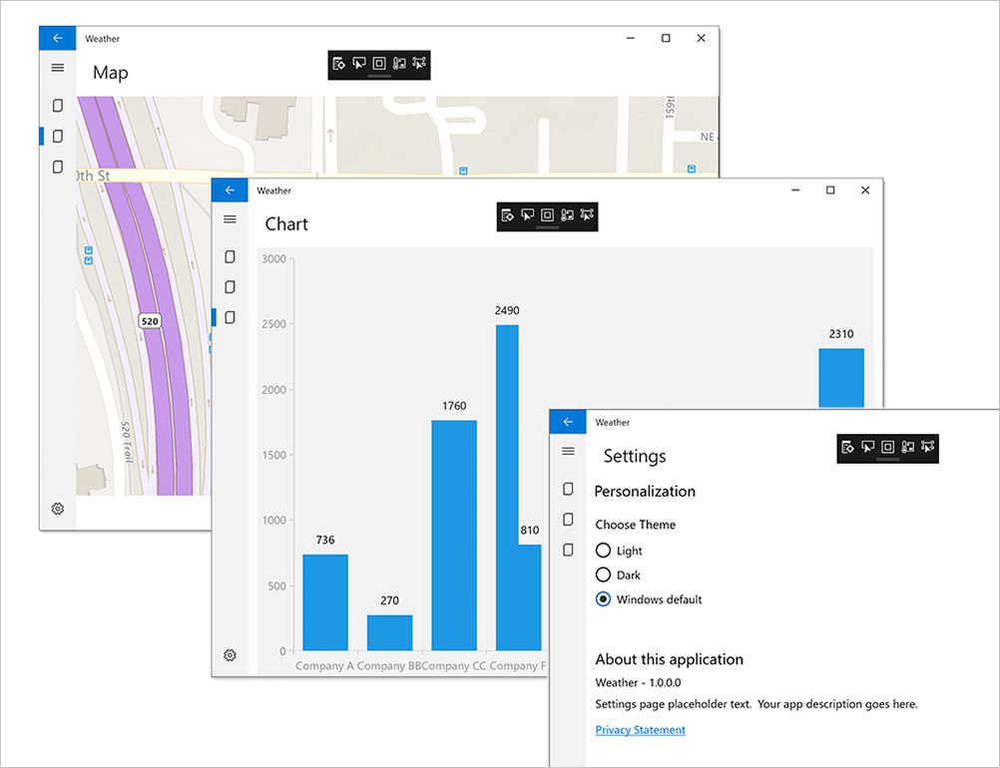

## What are we going to cover?

> [!VIDEO https://www.microsoft.com/videoplayer/embed/RE2MmZf]

In this module, you're going to learn how to write the same app in three different ways, by using three different Windows technologies. You'll be using C# but combining it with three development frameworks: the Universal Windows Platform (UWP), Windows Presentation Foundation (WPF), and Windows Forms.

We'll then introduce Windows Template Studio (WTS), and you'll see how quickly you can produce the core of a modern app with minimal effort.

## A tale of three platforms

Over the years, different technologies and requirements have led to the development of many ways of writing applications that run on Windows. The goal has always been the same: help developers create a user interface and generate essential boilerplate code, leaving them to add the unique functionality that makes their apps useful. No one wants to write code that displays text pixel by pixel or draws the shapes that make up a menu or window. Developers want to have consistent, proven, reliable code that handles all these features (and a *lot* more!) already available.

To that end, Microsoft has created many tools and libraries. The three we're going to look at in this learning path are UWP, WPF, and Windows Forms. You'll see how all three provide similar approaches for building basic applications.

### Universal Windows Platform

Windows 10 introduces the [Universal Windows Platform](/windows/uwp/get-started/universal-application-platform-guide) (UWP), which provides a common app platform on every device that runs Windows 10. The UWP core APIs are the same on all Windows devices. If your app uses only the core APIs, it will run on any Windows 10 device, whether it's a desktop PC, Xbox, a mixed-reality headset, or something else.

UWP is best if you're targeting Windows 10 and you want unencumbered access to the latest Windows 10 APIs and features. UWP also provides the other benefits of a modern application platform. These benefits include a XAML-based UI model with built-in support for adapting to DPI and screen size changes, a security model in which users explicitly grant apps access to device capabilities, and a packaging model that supports clean installations and the ability to publish directly to the Microsoft Store.

### Windows Presentation Foundation

[Windows Presentation Foundation](/visualstudio/designers/getting-started-with-wpf) (WPF) is a UI framework for creating desktop client applications. The WPF development platform supports a broad set of application development features, including an application model, resources, controls, graphics, layout, data binding, documents, and security. It's a subset of the .NET Framework, so if you've already built applications with the .NET Framework by using ASP.NET or Windows Forms, the programming experience should be familiar. WPF uses the Extensible Application Markup Language (XAML) to provide a declarative model for application programming.

WPF and Windows Forms are best if you need to target OS versions earlier than Windows 10 and you want to have a higher level of coding productivity than C++ and Win32. You can also share some .NET Framework code and libraries with other Microsoft platforms by using portable class libraries.

### Windows Forms

[Windows Forms](/dotnet/framework/winforms/) is a smart-client technology for the .NET Framework, a set of managed libraries that simplify common application tasks like reading and writing to the file system. When you use a development environment like Visual Studio, you can create Windows Forms smart-client applications that display information, request input from users, and communicate with remote computers over a network. Windows Forms is an older development platform and lacks some of the features provided by WPF and UWP.

We can't talk about writing Windows apps without mentioning one more option: Win32.

### Win32 (Windows API) and C++

The Win32 API (more accurately called the Windows API) enables applications to use the features of Windows. By using this API, you can develop applications that run successfully on all versions of Windows while still taking advantage of the features and capabilities unique to each version. Win32 is a good choice if you need to achieve the highest levels of performance or efficiency, access native OS features, or target DirectX technologies. 

This approach lets you achieve the best performance for your app by taking direct control over memory allocation and performance-oriented CPU features like SSE or AVX instructions. It's the best way to target DirectX technologies for low-level, high-performance graphics access. You can share C++ code between all types of Windows applications and with non-Windows platforms. The tradeoff is that, compared to C# and UWP for example, it can take a fair amount of work to implement even basic features.

> [!NOTE]
> For more information about selecting a development platform see [Choose Your Platform](/windows/desktop/choose-your-technology).

## The app you'll write

The app you're going to create in this module is a simple one. It will display some text and change some colors when you select a button.

It's not going to win any awards, but it will demonstrate the similarities and differences among the development platforms.

When you've had your fill, you can move on to trying out Windows Template Studio. With WTS, you'll build an app that looks a little more impressive:

Ready to start?
