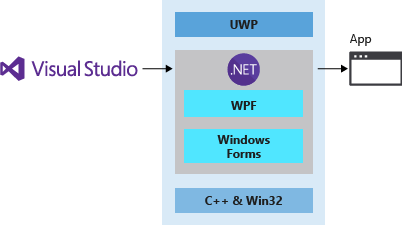
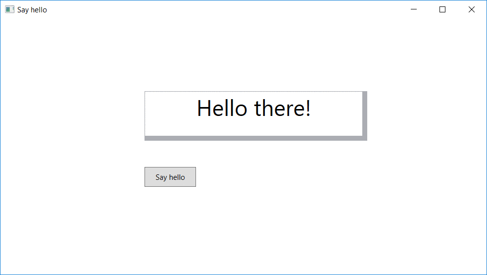

## What are we going to cover?

> [!VIDEO https://www.microsoft.com/videoplayer/embed/RE2MmZf]

In this module, you're going to learn how to write the same app in three different ways, by using three different Windows technologies. You use C#, but combine it with three development frameworks: the Universal Windows Platform (UWP), Windows Presentation Foundation (WPF), and Windows Forms.

We then introduce Windows Template Studio (WTS), and you can see how quickly you can produce the core of a modern app with minimal effort.

## A tale of three platforms

Over the years, different technologies and requirements have led to the development of many ways of writing applications that run on Windows. The goal has always been the same: help developers create a user interface and generate essential boilerplate code, leaving them to add the unique functionality that makes their apps useful. No one wants to write code that displays text pixel by pixel or draws the shapes that make up a menu or window. Developers want to have consistent, proven, reliable code that handles all these features (and a *lot* more!) already available.

To that end, Microsoft has created many tools and libraries. The three we're going to look at in this learning path are UWP, WPF, and Windows Forms. All three provide similar approaches for building basic applications.

### Universal Windows Platform

Windows 10 introduced the [Universal Windows Platform](/windows/uwp/get-started/universal-application-platform-guide) (UWP), which provides a common app platform on every device that runs Windows. The UWP core APIs are the same on all Windows devices. If your app uses only the core APIs, it runs on any Windows 10 device, whether it's a desktop PC, Xbox, a mixed-reality headset, or something else.

UWP is best if you're targeting Windows and you want unencumbered access to the Windows APIs and features. UWP also provides the other benefits of a modern application platform. These benefits include:

- An Extensible Application Markup Language (XAML)-based UI model with built-in support for adapting to DPI and screen size changes.
- A security model in which users explicitly grant apps access to device capabilities.
- A packaging model that supports clean installations and the ability to publish directly to the Microsoft Store.

### Windows Presentation Foundation

[Windows Presentation Foundation](/visualstudio/designers/getting-started-with-wpf) (WPF) is a UI framework for creating desktop client applications. The WPF development platform supports a broad set of application development features, including:

- An application model
- Resources
- Controls
- Graphics
- Layout
- Data binding
- Documents
- Security

It's part of the Windows-specific libraries in .NET, so if you have already built applications with .NET by using ASP.NET Core or Windows Forms, the programming experience should be familiar. WPF uses XAML to provide a declarative model for application programming.

WPF and Windows Forms are best if you want to have a higher level of coding productivity than C++ and Win32. Because the non-UI parts of modern .NET are now cross-platform, you can also share some .NET code and libraries with other platforms, including macOS and Linux.

### Windows Forms

[Windows Forms](/dotnet/desktop/winforms/) is an open-source, graphical user interface for .NET, a standard set of base class libraries and APIs that simplify common application tasks. When you use a development environment like Visual Studio, you can create Windows Forms smart-client applications that display information, request input from users, and communicate with remote computers over a network. The current Windows Forms platform is based on an older .NET Framework UI platform and lacks some of the features provided by WPF and UWP.

Those three platforms are the subjects of our focus in this training module. Before we get started, though, let's take a quick look at two other options: WinUI and Win32.

### WinUI and the Windows App SDK

[WinUI 3](/windows/apps/winui/winui3/) is the native UI platform component that ships with the [Windows App SDK](/windows/apps/windows-app-sdk/) (decoupled from the Windows SDK). The Windows App SDK provides a unified set of APIs and tools that can be used to create production desktop apps that target Windows 10 and later, and can be published to the Microsoft Store.

>[!NOTE]
>At this time, there are two generations of the Windows UI Library (WinUI): [WinUI 2 for UWP](/windows/apps/winui/winui2/) and WinUI 3 in the Windows App SDK. While both can be used in production-ready apps on Windows 10 and later, each have different development targets. See [Comparison of WinUI 3 and WinUI 2](/windows/apps/winui/#comparison-of-winui-3-and-winui-2).

We can't talk about writing Windows apps without mentioning one more option: Win32.

### Win32 (Windows API) and C++

The Win32 API (more accurately called the Windows API) enables applications to use the features of Windows. By using this API, you can develop applications that run successfully on all versions of Windows while still taking advantage of the features and capabilities unique to each version. Win32 is a good choice if you need to achieve the highest levels of performance or efficiency, access native OS features, or target DirectX technologies.

This approach lets you achieve the best performance for your app by taking direct control over memory allocation and performance-oriented CPU features like SSE or AVX instructions. It's the best way to target DirectX technologies for low-level, high-performance graphics access. You can share C++ code between all types of Windows applications and with non-Windows platforms. The tradeoff is that, for example, compared to C# and WPF, it can take a fair amount of work to implement even basic features.

> [!NOTE]
> For more information, see [Writing apps for Windows: Selecting a development technology](/windows/apps/get-started/).

## The app you write

The app you're going to create in this module is a simple one. It displays some text and changes some colors when you select a button.

It's not going to win any awards, but it demonstrates the similarities and differences among the development platforms.

When you've had your fill, you can move on to trying out Windows Template Studio. With WTS, you build an app that looks a little more impressive.

Ready to start?
