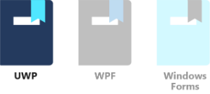
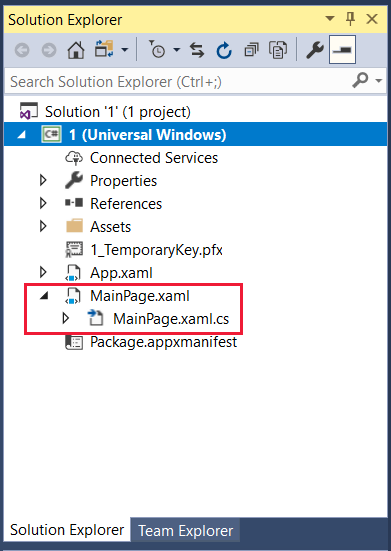
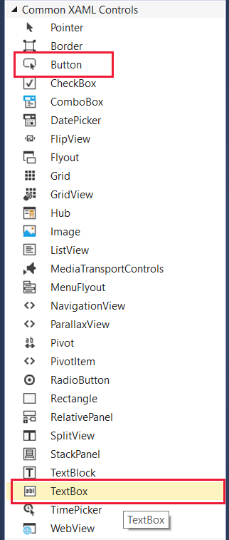
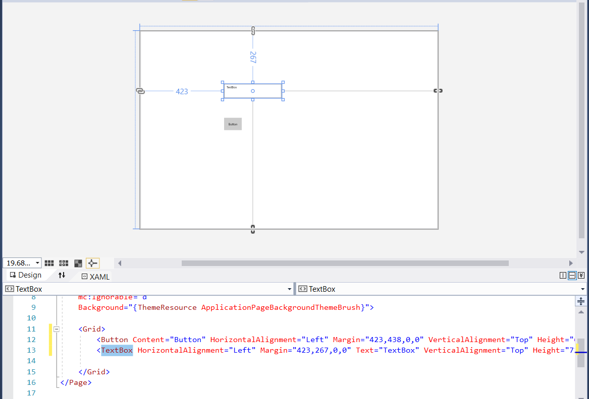
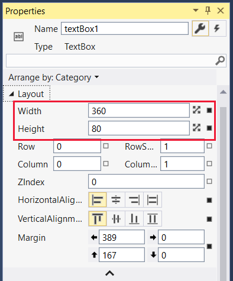
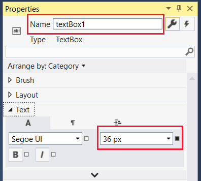
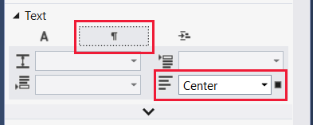
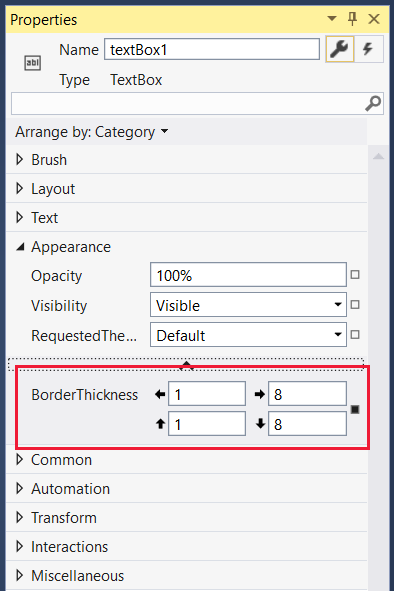

Universal Windows Platform (UWP) in Visual Studio is a technology that enables a single app to run on any device: desktop, laptop, tablet, Xbox, Surface Hub, or HoloLens device. There are many similarities between developing for UWP and developing for Windows Presentation Foundation (WPF), but there are some subtle differences too. This tutorial covers these differences, and it's a first step into the world of UWP programming.

In this unit, we:

- Use Visual Studio to create a new UWP project.
- Add UI and code elements to the project to create a fun variation of a "hello world" program. The "Hello there!" text and the border change color randomly each time you select the **Say hello** button.
- Learn how to set properties and create events.

> [!VIDEO https://www.microsoft.com/videoplayer/embed/RE2NKJ1]

> [!NOTE]
> We're assuming you have set up your computer with Windows and Visual Studio 2022, as described in the Learn module *Introduction to Windows 10 development*.

### UWP "Say hello" tutorial

#### Create the project

1. Open Visual Studio and select **File** > **New** > **Project** from the menu. Then select **C#** as the project language. Next, select the **Blank App (Universal Windows)** project type. In the **Name** field, enter a friendly name like **SayHello**. Select **Create** when you're done.

    > [!NOTE]
    > Just select **OK** when the **New Universal Windows Platform Project** dialog box presents you with the options of selecting **Target** and **Minimum** versions of UWP. The default selections will work just fine for this project.

    :::image type="content" source="../media/1-create-uwp-app.png" alt-text="Screenshot that shows the Configure your new project window for a Blank App (Universal Windows) with the create button selected.":::

2. When the project opens, it's a good idea to make sure that the **Solution Explorer** and **Properties** panes are open. They're located, by default, on the right side of Visual Studio. If they aren't visible, open the **View** menu and select both of them.

3. In **Solution Explorer**, make sure you can see the names of the two files we're working on: MainPage.xaml and its *code-behind* file, MainPage.xaml.cs. Select **MainPage.xaml** to open it.

    

#### Design the UI

1. If the **Toolbox** panel isn't already open, select the **View** menu, and then select **Toolbox**. In the **Toolbox**, select **Common XAML Controls**.

    

2. Drag a **Button** onto the lower part of the designer layout. Then drag a **TextBox** to the upper part of the layout and drag its corners out a bit so it looks like you see here:

    

    > [!NOTE]
    > Notice how button and **Toolbox** entries are added to **&lt;Grid&gt;** in the XAML definition that appears below the layout.

3. Now we want to set some properties on these UI elements. Select the button so that its properties appear in the **Properties** pane. Change the **Name** to something simple like **SayHelloButton**, and change the **Content** (by expanding **Common**) to **Say hello**.

    

    > [!NOTE]
    > Notice how the **Name** property is added to the **Button** entry in the XAML definition that appears below the layout. The XAML definition is updated automatically as you change properties in the designer.

4. We need to attach an event to the button. You can select the button itself, but that only works if the designer layout is in the required state. A more certain way to enter an event is to open the events available for that UI item. You do that by selecting the icon shown here in the **Properties** pane and then select the entry for the **Click** event. Doing so automatically creates the named event **SayHelloButton_Click**, adds the appropriate code entry in the MainPage.xaml.cs file, and opens the file for you.

    

5. We don't enter any code yet, so select **MainPage.xaml** in the main view. Keep working on the UI for now.

6. Select the text box you created in the designer to bring up its properties. We're going to make quite a few changes to the properties for the text box. If the events are showing in the **Properties** pane, select the wrench icon next to the name to return to the named properties.

7. Change the **Name** entry to **textBox1**, and then, in the **Layout** properties, change **Width** and **Height** to **360** and **80**, respectively.

    

8. Collapse the **Layout** section.

9. In the **Text** size list, change the point size to **36**: something nice and visible!

    

10. The font tab, labeled with an **A**, is open by default for the **Text** section. Select the paragraph icon and change the alignment to **Center**.

    

11. Collapse the **Text** section and expand **Appearance**. Select the down arrow at the bottom of the exposed list of appearance properties to expose the full list. Change the border thickness to **1** for the left and top borders and to **8** for the right and bottom borders. Now the box has a bit of a drop shadow effect!

    

12. Collapse **Appearance** and expand **Common**. Enter the text for the text box: something friendly like **Hello there!**.

    

You're almost finished with the UI elements for your app. The **&lt;Grid&gt;** entry in your XAML file should look like the following:


> [!NOTE]
> For the record, yes, you can edit the XAML directly, changing numerical values or even adding entire UI elements. We won't do that in this tutorial.

#### Write the code behind

1. We can now move from the UI to the code for our app. It's time to reopen the MainPage.xaml.cs file. Select the file either above the main view or in **Solution Explorer**. The **class MainPage** should look like the following:

    ```csharp
    public sealed partial class MainPage : Page
    {
        public MainPage()
        {
            this.InitializeComponent();
        }

        private void SayHelloButton_Click(object sender, RoutedEventArgs e)
        {

        }
    }
    ```

2. Let's make sure we have all the necessary **using** statements. Check that you have the following, and add them if you don't. In particular, make sure the **using Windows.UI;** statement is there. When you're finished editing the file, you can optionally remove any unnecessary **using** statements that Visual Studio included when it created the project. Unused namespaces appear in gray.

    ```csharp
    using System;
    using Windows.UI;
    using Windows.UI.Xaml;
    using Windows.UI.Xaml.Controls;
    using Windows.UI.Xaml.Media;
    ```

3. The app renders the hello text in a random color each time the button is selected. So we need to add a class-level **Random** object and the **GetRandomBytes** method that randomly fills in values that we use as RGB settings. Copy and paste this code, or type it in yourself, so that your **class MainPage** looks like this:

    ```csharp
    public sealed partial class MainPage : Page
    {
        private Random rand;

        public MainPage()
        {
            this.InitializeComponent();
            rand = new Random();
        }

        private byte[] GetRandomBytes(int n)
        {
            // Fill an array of bytes of length "n" with random numbers.
            var randomBytes = new byte[n];
            rand.NextBytes(randomBytes);
            return randomBytes;
        }

        private void SayHelloButton_Click(object sender, RoutedEventArgs e)
        {

        }
    }
    ```

4. Finally, we need to call **GetRandomBytes** from the button click event, create a random color from the returned array of bytes, and then change the text box properties to that color. Your completed **SayHelloButton_Click** method should look like the following:

    ```csharp
        private void SayHelloButton_Click(object sender, RoutedEventArgs e)
        {
            byte[] rgb = GetRandomBytes(3);

            // Create a solid color brush using the three random numbers.
            var randomColorBrush = new SolidColorBrush(Color.FromArgb(255, rgb[0], rgb[1], rgb[2]));

            // Set both the text color and the text box border to the random color.
            textBox1.BorderBrush = randomColorBrush;
            textBox1.Foreground = randomColorBrush;
        }
    ```

5. Take a second or two to check over your code. If there's anything underlined in red, something isn't right. It could be a misspelled word or a piece of code where it shouldn't be.

#### Run

Let's compile and run the program!

1. In Visual Studio, on the **Debug** menu, select **Start Without Debugging**, or just select the F5 key. If you've entered everything correctly, you should see a running app similar to this one:

    

2. Select the **Say hello** button repeatedly to see the "Hello there!" text and border change to random colors.

If that's what you see, well done! You've finished this tutorial. If not, carefully reexamine your code and UI property settings for something that's gone amiss.
