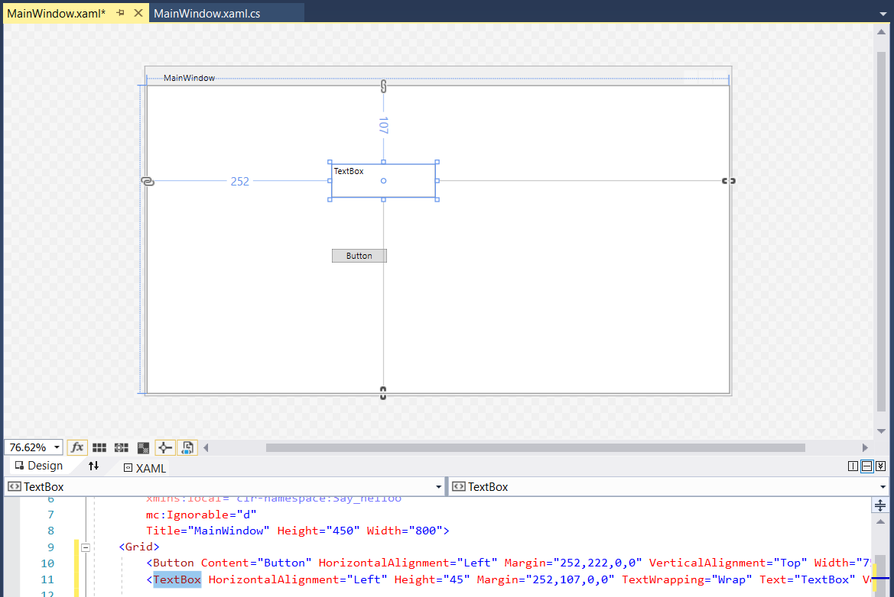
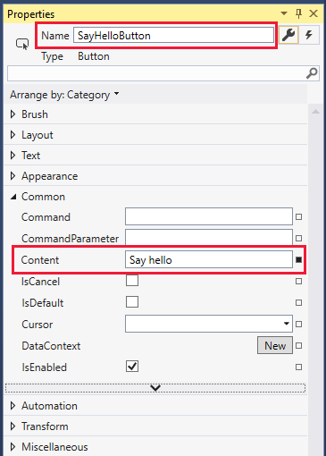
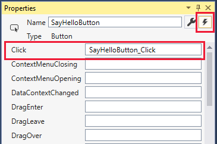
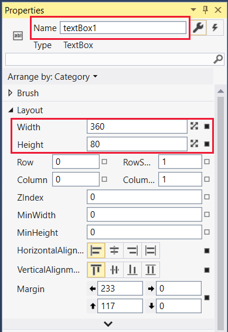
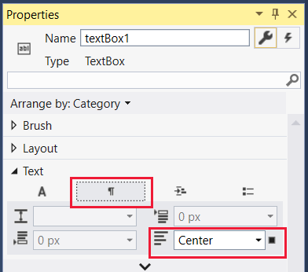
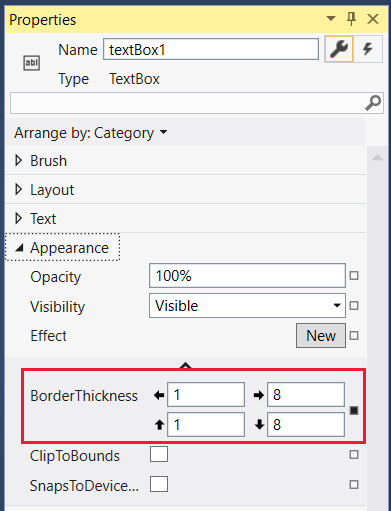
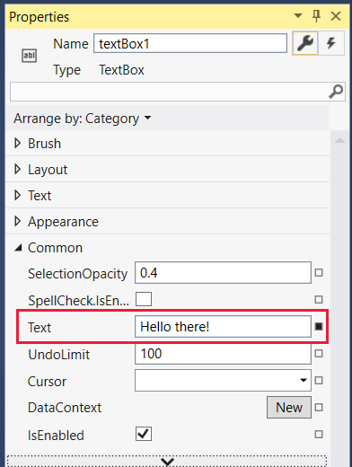
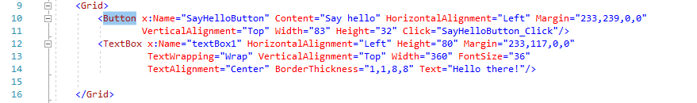
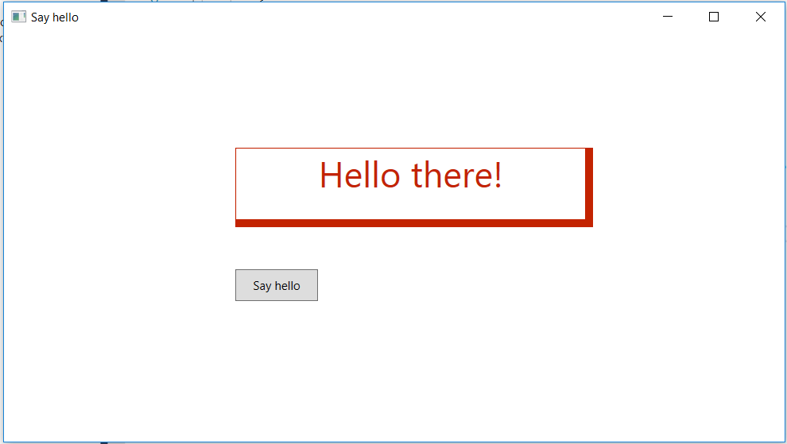

Windows Presentation Foundation (WPF) in Visual Studio provides developers with an API interface for building apps for desktop, notepad, and tablet computers. WPF is built on the powerful DirectX graphics system and provides many great UI features and effects with little programming effort.

In this unit, we:

- Use Visual Studio to create a WPF project.
- Add UI and code elements to the project to create a fun variation of a "hello world" program. The "Hello there!" text and the border change color randomly each time you select the **Say hello** button.
- Learn how to set properties and create events.

> [!VIDEO https://www.microsoft.com/videoplayer/embed/RE2NFxG]

> [!NOTE]
> We're assuming you've set up your computer with Windows and Visual Studio, as described in the Learn module *Introduction to Windows 10 development*.

### WPF "Say hello" tutorial

#### Create the project

1. Open Visual Studio and select **File** > **New** > **Project** from the menu. Select **C#** as the project language. Next, select the **WPF Application** project type, and, in the **Name** field, enter a friendly name like **Say hello**. Select **Next** when you're done.

    :::image type="content" source="../media/2-create-wpf-app.png" alt-text="Screenshot that shows the Configure your new project window for a WPF App with the Next button selected.":::

2. Select your **.NET** version, and then select **Create**.

3. When the project opens, it's a good idea to make sure that the **Solution Explorer** and **Properties** panes are open. They're located, by default, on the right side of the Visual Studio window. If they aren't visible, open the **View** menu and select both of them.

4. In **Solution Explorer** make sure you can see the names of the two files we're working on: MainWindow.xaml and its *code behind* file, MainWindows.xaml.cs. Select **MainWindow.xaml** to open it.

    

#### Design the UI

1. If the **Toolbox** isn't open, select the **View** menu, and then select **Toolbox**. In the **Toolbox**, select **Common WPF Controls**.

    

2. Drag a **Button** onto the lower part of the designer layout. Then drag a **TextBox** to the upper part of the layout, and drag its corners out a bit so it looks like what you see here:

    

    > [!NOTE]
    > Notice how button and **TextBox** entries are added to **&lt;Grid&gt;** in the XAML definition that displays below the layout.

3. Next, we want to update the text that appears in the title bar of the window. Select the **Window** in the designer layout so that its properties are visible in the **Properties** pane, and then, change the **Title** to **Say hello**.

4. Now we want to set some properties on the new UI elements. Select the button so that its properties appear in the **Properties** pane. Change the **Name** to something simple like **SayHelloButton**, and change the **Content** in the **Common** properties to **Say hello**.

    

5. We need to attach an event to the button. You can select the button itself, but that only works if the designer layout is in the required state. A more certain way to enter an event is to open the events available for that UI item. You do that by selecting the lightning bolt icon shown here in the **Properties** pane and then simply selecting the entry for the **Click** event. Doing so automatically creates the named event **SayHelloButton_Click**, adds the appropriate code entry in the MainWindow.xaml.cs file, and opens the file for you.

    

6. We don't enter any code yet, so select **MainWindow.xaml** in the main view. We're continuing to work on the UI for now.

7. Select the text box you created in the designer to bring up its properties. We're going to make quite a few changes to the properties for the text box. If the events are showing in the **Properties** pane, select the wrench icon next to the name to return to the named properties.

8. Change the **Name** entry to **textBox1**, and then, in the **Layout** properties, change **Width** and **Height** to **360** and **80**, respectively.

    

9. Collapse the **Layout** section.

10. In the **Text** size list, change the point size to **36**: something nice and visible!

    

11. The font tab, labeled with an **A**, is open by default for the **Text** section. Select the paragraph icon and change the alignment to **Center**.

    

12. Collapse the **Text** section and expand **Appearance**. Select the down arrow at the bottom of the exposed list of appearance properties to expose the full list. Change the border thickness to **1** for the left and top borders and to **8** for the right and bottom borders. Now the box has a bit of a drop shadow effect!

    

13. Collapse **Appearance** and expand **Common**. Enter the text for the text box: something friendly like **Hello there!**.

    

You're almost finished with the UI elements for your app. The **&lt;Grid&gt;** entry in your XAML file should look like the following:

   

   > [!NOTE]
   > You can edit the XAML directly, changing numerical values or even adding entire UI elements. We won't do that in this tutorial.

#### Write the code behind

1. We can now move from the UI to the code for our app. It's time to reopen the MainWindow.xaml.cs file. Select the file from above the main view or in **Solution Explorer**. The **class MainWindow** should look like the following:

    ```csharp
    public partial class MainWindow : Window
    {
        public MainWindow()
        {
            InitializeComponent();
        }

        private void SayHelloButton_Click(object sender, RoutedEventArgs e)
        {

        }
    }
    ```

2. Let's make sure we have all the necessary **using** statements. Make sure you have the ones shown here, and add them if you don't. After you're finished editing the file, you can optionally remove any unnecessary **using** statements that Visual Studio included when it created the project. (Unused namespaces appear in gray.)

    ```csharp
    using System;
    using System.Windows;
    using System.Windows.Media;
    ```

3. The app renders the hello text in a random color each time the button is selected. So we need to add a class-level **Random** object and the **GetRandomBytes** method that randomly fills in values that we use as RGB settings. Copy and paste this code, or type it in yourself, so that your **class MainWindow** looks like this:

    ```csharp
    public partial class MainWindow : Window
    {
        private Random rand;

        public MainWindow()
        {
            InitializeComponent();
            rand = new Random();
        }

        private byte[] GetRandomBytes(int n)
        {
            // Fill an array of bytes of length "n" with random numbers.
            var randomBytes = new byte[n];
            rand.NextBytes(randomBytes);
            return randomBytes;
        }

        private void SayHelloButton_Click(object sender, RoutedEventArgs e)
        {

        }
    }
    ```

4. Finally, we need to call **GetRandomBytes** from the button click event, create a random color from the returned array of bytes, and then change the text box properties to that color. Your completed **SayHelloButton_Click** method should look like the following:

    ```csharp
        private void SayHelloButton_Click(object sender, RoutedEventArgs e)
        {
            byte[] rgb = GetRandomBytes(3);

            // Create a solid color brush using the three random numbers.
            var randomColorBrush = new SolidColorBrush(Color.FromArgb(255, rgb[0], rgb[1], rgb[2]));

            // Set both the text color and the text box border to the random color.
            textBox1.BorderBrush = randomColorBrush;
            textBox1.Foreground = randomColorBrush;
        }
    ```

5. Take a second or two to check over your code. If anything is underlined in red, something isn't right. It could be a misspelled word or a piece of code where it shouldn't be.

#### Run

Let's compile and run the program!

1. In Visual Studio, on the **Debug** menu, select **Start Without Debugging** (or **Start Debugging**, though we're not doing any debugging in this tutorial), or just select the F5 key. If you've entered everything correctly, you should see a running app similar to this one:

    

2. Select the **Say hello** button repeatedly to see the **Hello there!** text and border change to random colors.

If that's what you see, well done! You've finished this tutorial. If not, carefully reexamine your code and UI property settings for something that's gone amiss.
