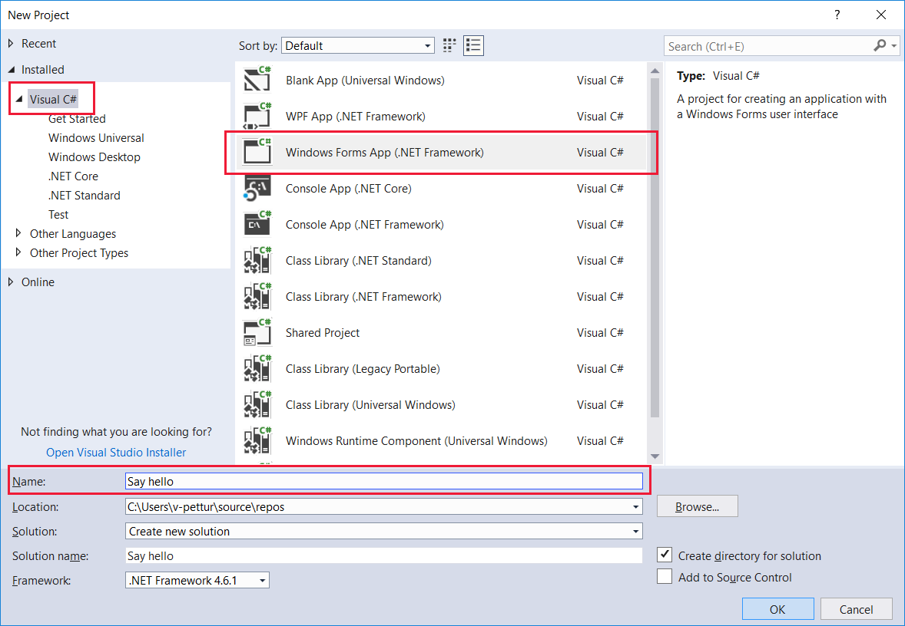
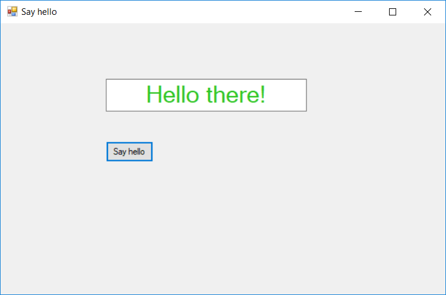

Windows Forms, based on the venerable Win32 API, is still a popular UI technology for developing tools and utilities that don't require anything fancy. Apps built with Windows Forms run on Windows desktop, notebook, and tablet computers and have a familiar appearance to just about everybody who has used a computer.

In this unit, we will:
- Use Visual Studio to create a Windows Forms project.
- Add UI and code elements to the project to create a fun variation of a "hello world" program. The "Hello there!" text will change color randomly each time you select the **Say hello** button.
- Learn how to set properties and create events.

> [!VIDEO https://www.microsoft.com/videoplayer/embed/RE2NNlQ]

> [!NOTE]
> We're assuming you've set up your computer with Windows 10 and Visual Studio, as described in the Learn module *Introduction to Windows 10 development*.

### Windows Forms "Say hello" tutorial

#### Create the project

1. Open Visual Studio and select **File** > **New** > **Project** from the menu. With **Visual C#** selected as the project language, find and select **Windows Forms App (.NET Framework)** from the project options. Change the **Name** to something friendly like **Say hello**, and select **OK** when you're done.



2. By default, the **Toolbox**, **Solution Explorer**, and **Properties** panes will be open. If any of them isn't, open it from the **View** menu. Next, you'll use the **Toolbox** to add a button and a text box to the UI. Expand the **Common Controls** list in the **Toolbox**.


#### Build the UI

1. With the **Properties** pane for **Form1** open, change the **Text** entry from **Form1** to **Say hello**. From the other side of the screen, drag a **Button** from the **Toolbox** to the lower part of the form, and add a **TextBox** to the upper part. Then widen the text box a bit, so your design looks like this one:


2. Select the button to bring up its properties. Change the **Name** to **SayHelloButton**, and then scroll down the properties and change the **Text** property to **Say hello**.


3. We need to attach an event to the button. You can attach the event either by selecting the button in Design view or by selecting the event icon in **Properties** and then either selecting the Enter key or selecting the **Click** event entry. Do one of these. (The event list method is shown in the following image.) Whichever method you choose, Visual Studio will automatically add outline code for the event **SayHelloButton_Click** to your .cs file and open that file. Take a quick look, and then go back to Design view for now, so we can set more UI properties.


4. Select the text box in Design view to open its properties. If you used the event list method to add the button event, you need to select the wrench and document icon (shown in the following image) in **Properties** to revert to the named list of properties for the UI element. Leave the **Name** entry as **textBox1**. Select the plus sign to the left of **Font** to expand the font properties, and then change the font **Size** to **24**. Next, scroll down the properties a bit and change the **Text** property to **Hello there!** and **TextAlign** to **Center**.


#### Add the code

1. Now switch the main view so you're looking at Form1.cs.

```csharp
    public partial class Form1 : Form
    {
        public Form1()
        {
            InitializeComponent();
        }

        private void SayHelloButton_Click(object sender, EventArgs e)
        {

        }
    }
```

2. Let's make sure we have all the necessary **using** statements. Check that you have the ones shown here, and add them if you don't. You can optionally remove any unnecessary **using** statements that Visual Studio included when it created the project. (Unused namespaces appear in gray). Don't remove the **System.Drawing** statement. We'll need it soon.

```csharp
using System;
using System.Drawing;
using System.Windows.Forms;
```


3. To get random text colors to appear, you need to add global variable **Random rand**. You need to initialize it in the **Form1** constructor method and enter a method to fill a short byte array with random numbers. Copy and paste, or type in, these lines from the following code:

```csharp
    public partial class Form1 : Form
    {
        Random rand;

        public Form1()
        {
            InitializeComponent();
            rand = new Random();
        }

        private byte[] GetRandomBytes(int n)
        {
            //  Fill an array of bytes of length "n" with random numbers.
            var randomBytes = new byte[n];
            rand.NextBytes(randomBytes);
            return randomBytes;
        }

        private void SayHelloButton_Click(object sender, EventArgs e)
        {

        }
    }
```

4. To change the text color each time the **Say hello** button is selected, add the body of the **SayHelloButton_Click** method to your program.

```csharp
        private void SayHelloButton_Click(object sender, EventArgs e)
        {

            //  Declare an array of bytes and fill it with random numbers
            byte[] rgb = GetRandomBytes(3);
            textBox1.ForeColor = Color.FromArgb(255, rgb[0], rgb[1], rgb[2]);
        }
```

5. Take a second or two to look over your code. If anything is underlined in red, something isn't quite right. It could be a misspelled word or a piece of code where it shouldn't be.

#### Run!

Let's compile and run the program!

1. In Visual Studio, on the **Debug** menu, select **Start Without Debugging** (or **Start Debugging**, though we're not doing any debugging in this tutorial), or just select the F5 key. If you've entered everything correctly, you should see a running app very similar to this one:



2. After a few seconds of build time, repeatedly select **Say hello** and watch the **Hello there!** text change color.

If that's what you see, well done! You've finished this tutorial. If not, carefully reexamine your code and UI property settings for something that's gone amiss.
