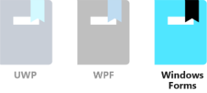
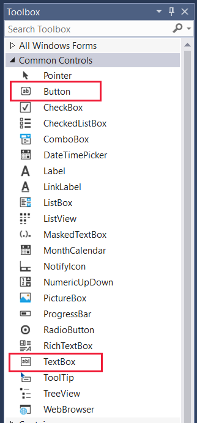
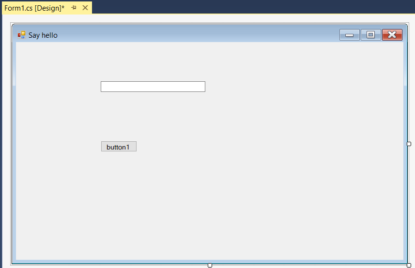
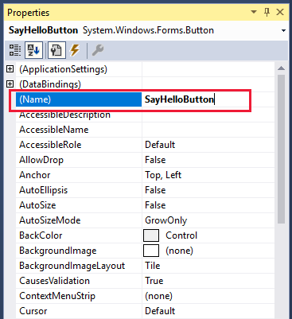
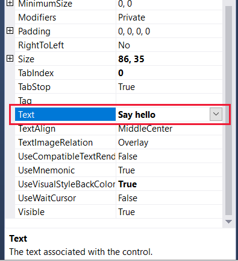
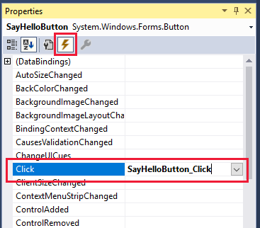
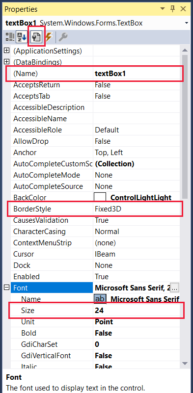
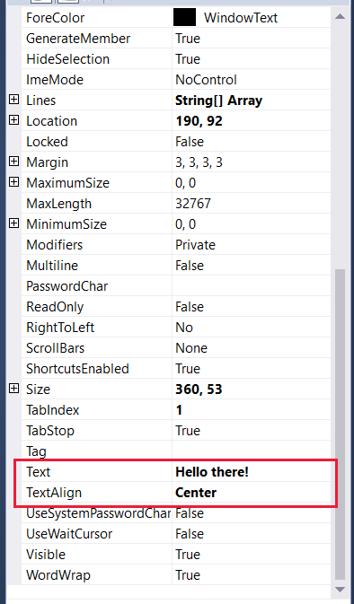

Windows Forms, based on the venerable Win32 API, is still a popular UI technology for developing tools and utilities that don't require anything fancy. Apps built with Windows Forms run on Windows desktop, notebook, and tablet computers and have a familiar appearance to just about everybody who has used a computer.

In this unit, we will:

- Use Visual Studio to create a Windows Forms project.
- Add UI and code elements to the project to create a fun variation of a "hello world" program. The "Hello there!" text changes color randomly each time you select the **Say hello** button.
- Learn how to set properties and create events.

> [!VIDEO https://www.microsoft.com/videoplayer/embed/RE2NNlQ]

> [!NOTE]
> Your computer should be set up with Windows and Visual Studio, as described in the Learn module *Introduction to Windows 10 development*.

### Windows Forms "Say hello" tutorial

#### Create the project

1. Open Visual Studio and select **File** > **New** > **Project** from the menu. With **C#** selected as the project language, find and select **Windows Forms App** from the project options. Change the **Name** to something friendly like **Say hello**, and select **Next** when you're done.

    :::image type="content" source="../media/3-create-windows-forms-app.png" alt-text="Screenshot that shows the Configure your new project window for a Windows Forms App with the Next button selected.":::

2. Select your **.NET** version, and then select **Create**.

3. By default, the **Toolbox**, **Solution Explorer**, and **Properties** panes are open. If they aren't, open them from the **View** menu. Expand the **Common Controls** list in the **Toolbox**.

    

#### Build the UI

1. With the **Properties** pane for **Form1** open, change the **Text** entry from **Form1** to **Say hello**. From the other side of the screen, drag a **Button** from the **Toolbox** to the lower part of the form, and add a **TextBox** to the upper part. Then widen the text box a bit, so your design looks like this one:

    

2. Select the button to bring up its properties. Change the **Name** to **SayHelloButton**, and then scroll down the properties and change the **Text** property to **Say hello**.

    

    

3. We need to attach an event to the button. You can attach the event by selecting the button in Design view or by selecting the event icon in **Properties**, and then select the Enter key or select the **Click** event entry. Whichever method you choose, Visual Studio automatically adds the outline code for the event **SayHelloButton_Click** to your Form1.cs file and opens the file. Take a quick look, and then go back to Design view.

    

    > [!NOTE]
    > If you accidentally closed the Design view, you can open it again by simply double-clicking **Form1.cs** in the **Solution Explorer**. Opening a Windows Forms form in Design view is the default action in Visual Studio.

4. Select the text box in Design view to open its properties. If you used the event list method to add the button event, select the wrench and document icon in **Properties**. Leave the **Name** entry as **textBox1**. Select the plus sign next to **Font**, and then change the font **Size** to **24**. Next, scroll down the properties a bit and change the **Text** property to **Hello there!** and **TextAlign** to **Center**.

    
    

#### Add the code

1. Now switch the main view so you're looking at Form1.cs.

    ```csharp
    public partial class Form1 : Form
    {
        public Form1()
        {
            InitializeComponent();
        }

        private void SayHelloButton_Click(object sender, EventArgs e)
        {

        }
    }
    ```

2. To get random text colors to appear, you need to add class-level variable **Random rand**. You need to initialize it in the **Form1** constructor method and enter a method to fill a short byte array with random numbers. Copy and paste, or type in, the following lines of code:

    ```csharp
    public partial class Form1 : Form
    {
        private Random rand;

        public Form1()
        {
            InitializeComponent();
            rand = new Random();
        }

        private byte[] GetRandomBytes(int n)
        {
            // Fill an array of bytes of length "n" with random numbers.
            var randomBytes = new byte[n];
            rand.NextBytes(randomBytes);
            return randomBytes;
        }

        private void SayHelloButton_Click(object sender, EventArgs e)
        {

        }
    }
    ```

3. To change the text color each time the **Say hello** button is selected, add the body of the **SayHelloButton_Click** method to your program.

    ```csharp
        private void SayHelloButton_Click(object sender, EventArgs e)
        {
            // Declare an array of bytes and fill it with random numbers
            byte[] rgb = GetRandomBytes(3);
            textBox1.ForeColor = Color.FromArgb(255, rgb[0], rgb[1], rgb[2]);
        }
    ```

4. Take a moment to review your code. If anything is underlined in red, something isn't right. It could be a misspelled word or a bit of misplaced code.

#### Run

Let's compile and run the program!

1. In Visual Studio, on the **Debug** menu, select **Start Without Debugging**, or just select the F5 key. If you've entered everything correctly, you should see a running app similar to this one:

    

2. After a few seconds of build time, repeatedly select **Say hello** and watch the **Hello there!** text change color.

If that's what you see, well done! You've finished this tutorial. If not, carefully reexamine your code and UI property settings for something that's gone amiss.
