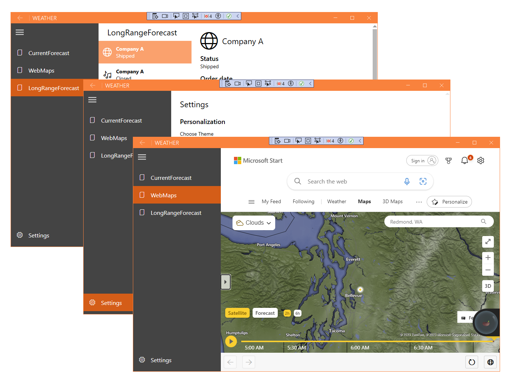

Template Studio for WPF is a Visual Studio extension that accelerates the creation of Windows Presentation Foundation (WPF) apps through a wizard-based experience. The resulting WPF project contains well-formed, readable code that incorporates the latest Windows features while implementing proven patterns and best practices.

## What can you do with Template Studio?

Template Studio does the hard work of creating the code you would otherwise have to write manually every time you start writing a WPF app. As long as you have a clear idea of the structure of your app before you begin, you can use the wizard to go step by step through the process of adding features and views to your project. After you're done, you can continue adding code that implements the functionality that's unique to your project.

## Install Template Studio

If you used the installation script in the *Installing tools automatically* module, Template Studio is ready and waiting for you. If you need to install the tools yourself, go to [this Visual Studio extensions site](https://marketplace.visualstudio.com/items?itemName=TemplateStudio.TemplateStudioForWPF) and select **Download**.

## Create an app with Template Studio

Let's look at the process of creating a hypothetical app by using Template Studio. Feel free to follow along on your own computer.

First, let's sketch out the app's features. It can help to literally sketch on a piece of paper the features the app has, and the way the views are interconnected. For this example, let's imagine we're building a weather forecast app. At the end of this tutorial, we have a skeleton of the app, ready for you to add the important weather-related features.

Our app will:

- Use the **Navigation View** control to switch among different views.
- Show weather symbols for the week on a blank page.
- Use a map within a WebView control to show the current weather forecast area.
- Show the long range forecast by using a list-detail format.
- Include a Settings page to let the user change settings.
- Use notifications to warn the user about dangerous weather.

Now that we've determined these details, we're ready to use the Template Studio wizard to create our project.

1. To open the Template Studio wizard, create a project in Visual Studio by selecting **File** > **New**  > **Project**. You can find Template Studio as **Template Studio for WPF**.
1. Name your app **Weather**, and select **Create** to start the wizard.
    :::image type="content" source="../media/4-create-template-studio-app.png" alt-text="Screenshot that shows the Configure your new project window for a Template Studio app in Visual Studio.":::
1. The Template Studio wizard opens.
1. On the **Project type** page, select**Navigation Pane**, and then select **Next**.
    :::image type="content" source="../media/4-select-project-type.png" alt-text="Screenshot that shows selecting the Navigation Pane on the Project type page of the Template Studio, and the Next button selected.":::
1. On the **Design pattern** page, select **Code behind**, and then select **Next**.
1. The **Pages** page is where things get interesting. Each page type can be added to your app. You can change the page name and order in the panel to the right. You can see that a blank page called **Main** is added by default. Our weather symbols are on this page, so change the name to **CurrentForecast**.
1. Now add a **WebView** page, a **ListDetails** page, and a **Settings** page.
       :::image type="content" source="../media/4-select-pages.png" alt-text="Screenshot that shows all of the pages added to the app and the Next button selected.":::
1. Select **Next**. You can add some more advanced Windows features on the **Features** page. For now, add **Toast Notifications**.
      :::image type="content" source="../media/4-add-toast-notifications.png" alt-text="Screenshot that shows the Toast Notification feature added to the app and the Create button selected.":::
1. For this module, skip **Services** and **Testing**. Select **Create** to generate your project.
1. To load some weather information in the WebView control, open WebMapsPage.xaml.cs in the Views folder and change the string value of `DefaultUrl` to `https://www.msn.com/en-us/weather/maps/cloud/in-Redmond,WA`.

Now that your project's code is created, you can select **Run** or the F5 key to build and run the project.

You can see that you already have quite an impressive app working. All you need to do is add the functionality. Easy!
