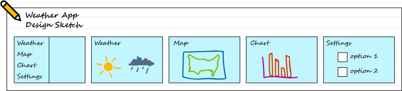
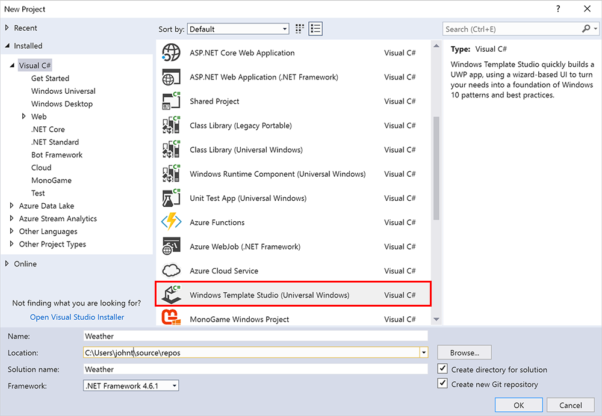
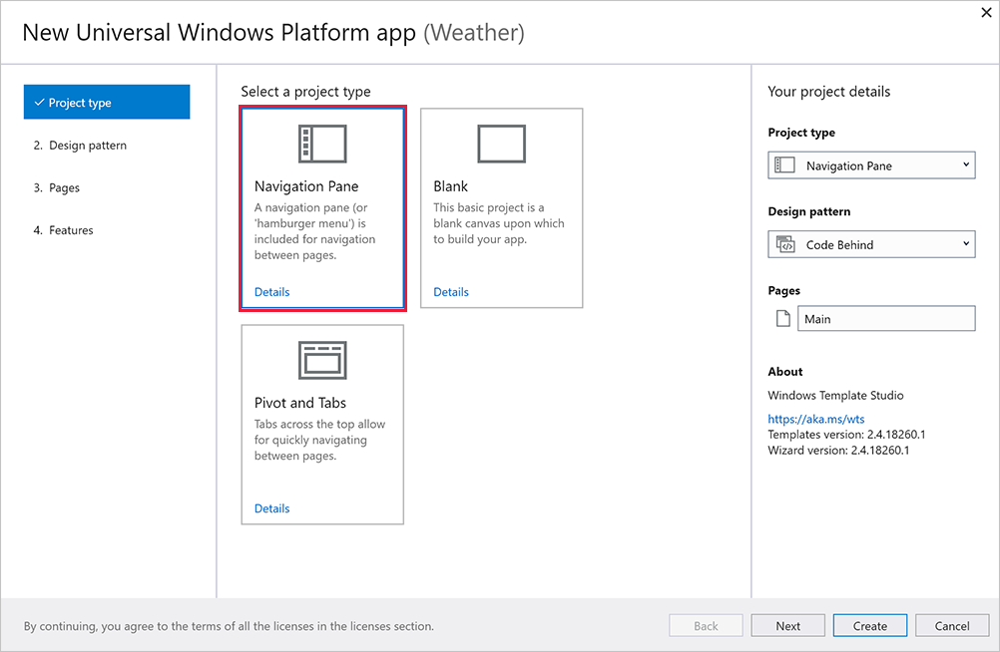
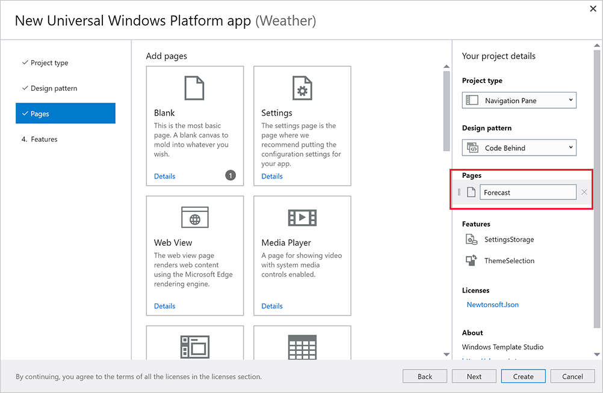
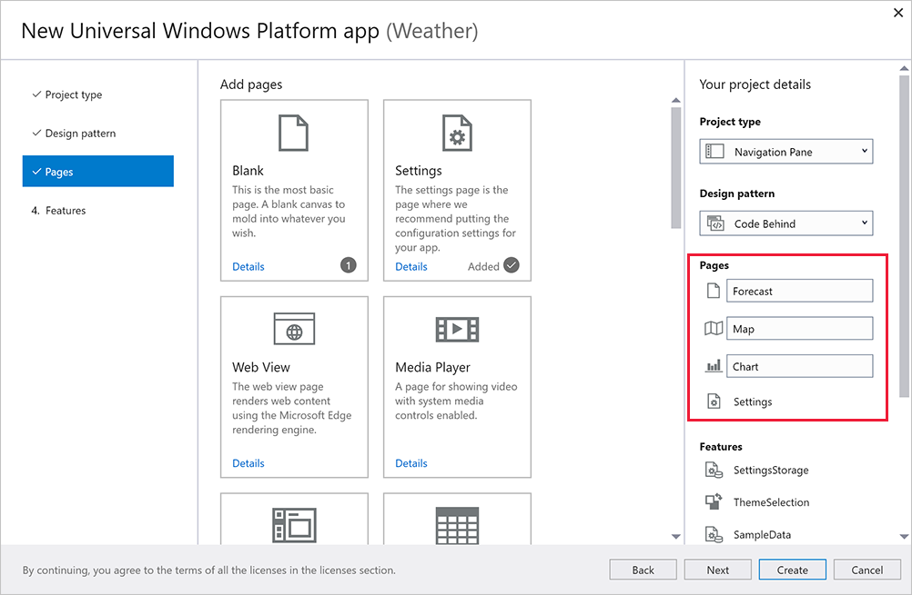
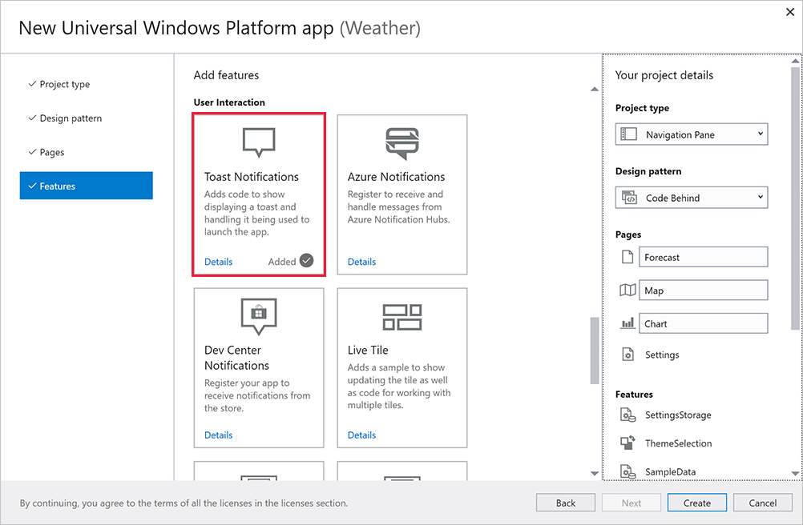

Windows Template Studio is a Visual Studio extension that accelerates the creation of Universal Windows Platform (UWP) apps through a wizard-based experience. The resulting UWP project contains well-formed, readable code that incorporates the latest Windows 10 features while implementing proven patterns and best practices.

## What can you do with Windows Template Studio?

Windows Template Studio does the hard work of creating the code you would otherwise have to write manually every time you start writing a Windows 10 UWP app. As long as you have a clear idea of the structure of your app before you begin, you can use the wizard to go step by step through the process of adding features and views to your project. After you're done, you can continue adding code that implements the functionality that's unique to your project.

## Install Windows Template Studio

If you used the installation script in the *Installing tools automatically* module, Windows Template Studio will be ready and waiting for you. If you need to install the tools yourself, go to [this Visual Studio extensions site](https://marketplace.visualstudio.com/items?itemName=WASTeamAccount.WindowsTemplateStudio) and select **Download**.

## Create an app with Windows Template Studio

Let's look at the process of creating a hypothetical app by using Windows Template Studio. Feel free to follow along on your own computer.

First, let's sketch out what the app will look like when we're done. It can help to literally sketch on a piece of paper the features the app will have, and the way the views will be interconnected. For this example, let's imagine we're building a weather forecast app. At the end of this tutorial, we'll have a skeleton of the app, ready for you to add the important weather-related features.

Here's the rough design drawing:

Our app will:

* Use the **Navigation View** control to switch among different views.
* Show weather symbols for the week on a blank page.
* Use a map view to show the current weather forecast area.
* Show a chart of previous weather data.
* Include a Settings page to let the user change settings.
* Use notifications to warn the user about dangerous weather.

Now that we've determined these details, we're ready to use the Windows Template Studio wizard to create our project.

1. To open the Windows Template Studio wizard, create a project in Visual Studio by selecting **File** > **New**  > **Project**. You'll find Windows Template Studio under **Visual C#** as **Windows Template Studio (Universal Windows)**. 
    
1. Name your app **Weather**, and start the wizard by selecting **OK**.
1. The Windows Template Studio wizard will open. (It may need to update its templates first.) You'll see this page:
     
1. Start by selecting a **Project type**. Make sure **Navigation Pane** is selected.
1. Skip over **Design pattern**. (The default setting, **Code behind**, is fine.)
1. Select **Pages**. This is where things get interesting. Each of these page types can be added to your app. The page name and order can changed in the panel to the right. You'll see that a blank page called **Main** is added by default. We'll draw our weather symbols on this page, so change the name to **Forecast**.
      
1. Now add a **Map** page, a **Chart** page, and a **Settings** page. When you're done, your project should look like this one:
       
1. You can add some more advanced Windows 10 features on the **Features** page. For now, we'll add **Toast Notifications**.
      
1. We're done! Select **Create** to generate your project.

Now that your project's code is created, you can select **Run** or the F5 key to build and run the project.

You'll see that you already have quite an impressive app working. All you need to do is add the functionality. Easy!

## Next steps

We'll end our discussion of the weather app here. If you want to continue working on it, you can download weather data for specific locations from several online sources: [here's a list](https://www.programmableweb.com/news/top-10-weather-apis/analysis/2014/11/13).
