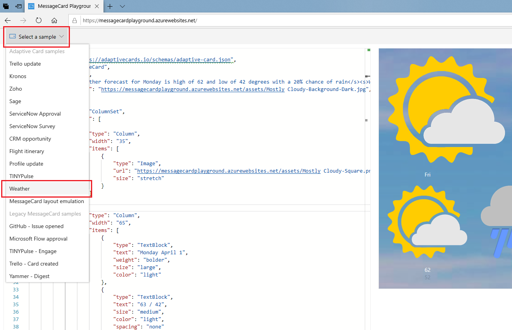

### Overview of Adaptive Cards

Adaptive Cards communicate information at a glance, and their user interface allows users to view and interact with the cards. You can share Adaptive Cards with any number of contacts, across a variety of devices and platforms, including notifications on Windows, Android, and iOS. To create Adaptive Cards, you use JSON scripts.

Adaptive Cards convey useful information and allow users to provide a quick response without having to open an app. These cards can enable greater engagement with your personal contacts: groups such as customers, company colleagues, club members, friends, and so on.

For example, you can create an Adaptive Card that's not only interactive and fun but also addresses an issue you would like your group to respond to. When you send out that card, the recipients can interact with it and easily perform a task that provides you with a useful response. There are many other compelling uses of Adaptive Cards. In another module, you'll see how they can be used in conjunction with Microsoft Windows 10 Timeline.

First, let's look at some sample JSON scripts for Adaptive Cards. Open another browser window at the following location:

[https://messagecardplayground.azurewebsites.net/](https://messagecardplayground.azurewebsites.net/)

Use the **Select a sample** list to choose a sample, and then examine the JSON script and its visual interpretation. You can see that it was built by using simple graphics and a column type layout. Also note the types of applications you can create: weather updates, requests for approval, flight schedules, surveys, and so on. A singular focus is key to the successful use of Adaptive Cards.

 

### Adaptive Card layout

The typical layout of an Adaptive Card consists of a title, perhaps some descriptive text, and then one or more columns of detail. This type of layout works in many situations. Because each column can contain other columns and containers, you can create cards of greater complexity by nesting objects inside each other. By varying the fonts, font sizes, colors, spacing, background images, and so on, you can create different results.

|  |
|:--:|
| _A three-column layout_ |

Column and text sizes are mostly determined by the system that's rendering the card, and they aren't specifically stated. For example, the widths of the three columns in the previous image are determined by the width of the whole card, taking into account the specified *spacing* between each element. Spacing (and font size) is not specified in pixels, but by using enumerations with terms such as `"Small"`, `"Medium"`, and `"Large"`.

|  | 
|:--:|
| _A two-column layout, with the title, description, and fact set in one column and an image in the other_ |

Within each column, elements are ordered vertically. These elements can be:

- Blocks of text (which may be as simple as a title)
- Single images
- Fact sets (bulleted or numbered lists)
- Inputs (text, numbers, times, dates, toggles, check boxes)
- Image sets (a gallery of images)
- Media sources (one or more _posters_ that link to online video sources)

*Actions* are the key to making Adaptive Cards engaging. You can associate actions with the whole card, a single column or container, or a single image of an image set. Actions are triggered when an element is selected, and they can open a URL, submit data, or show another card.

For example, you can use the *Open URL* action to direct a user to a new or updated product page. The *Submit* action encapsulates data entered by the user and sends it back to your server. The *Show card* action helps you subdivide complex messages into easily understandable chunks. There's no limit to how many Adaptive Cards you can nest with the *Show card* action.

Completing the following units will give you a good grasp of the column layout, the elements, the inputs, and the actions you can use to create Adaptive Cards.

#### Supported platforms and hosts

Adaptive Cards SDKs are available for these platforms:

- Windows: Universal Windows Platform (UWP), Windows Presentation Foundation (WPF), .NET
- Android
- iOS
- Web

The following hosts are compatible with Adaptive Cards:

- Bot Framework (WebChat)
- Microsoft Teams
- Cortana Skills
- Outlook Actionable Messages
- Windows 10 Timeline

### Summary

After looking at the sample scripts, you can see the connection between the JSON script and the elements and column layout of the rendered cards.