## Create your own Adaptive Card

One of the features of Adaptive Cards is that the API is small and concise. The code that we're going to write in this module incorporates all the main features into one app.

In this unit, we'll:

- Use Visual Studio 2017 to create an Adaptive Cards app in either Windows Presentation Foundation (WPF) or Universal Windows Platform (UWP).
- Write code to demonstrate all the user input options available.
- Write code to demonstrate all the actions that you can apply to user selections.

The steps to share an Adaptive Card across your group of contacts will be addressed in a later module.

There's both a UWP and WPF version of Adaptive Cards, so select your preference. The APIs are similar, but not identical. UWP is best if you're targeting Windows 10 and you want unencumbered access to the latest Windows 10 APIs and features. WPF is best if you need to target OS versions before Windows 10 and perhaps want to include other .NET Framework components. Both use Extensible Application Markup Language (XAML) to define UI elements.

::: zone pivot="wpf"

### Create the project

With Visual Studio 17 open, create a WPF C# project. Give the project a meaningful name, like **AdaptiveCards_WPF**.

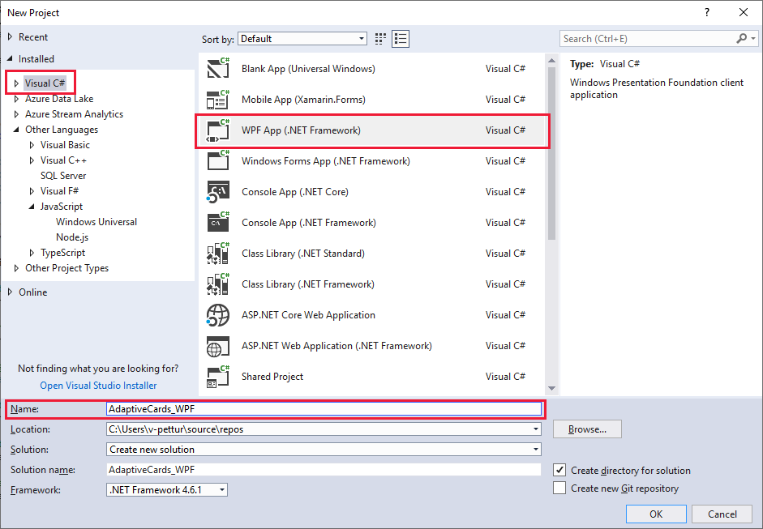

### Install the required packages

1. Go to **Tools** > **NuGet Package Manager** > **Manage NuGet Packages for Solution**. You'll see the list of installed packages (if any).

1. Select **Browse** to bring up the list of available packages.

1. In the search box, type **AdaptiveCards**, and then go through the process of installing these three packages:

   - `AdaptiveCards`
   - `AdaptiveCards.Rendering.Wpf`
   - `AdaptiveCards.Rendering.Wpf.Xceed`

   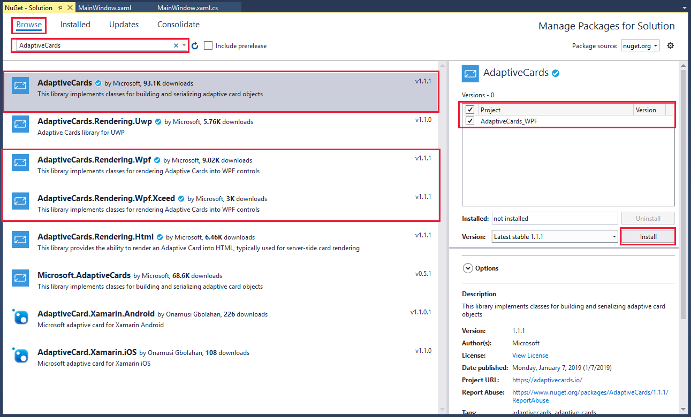

1. Validate the installation by checking the **Installed** page. You should see the three packages listed, as shown in the following image:

   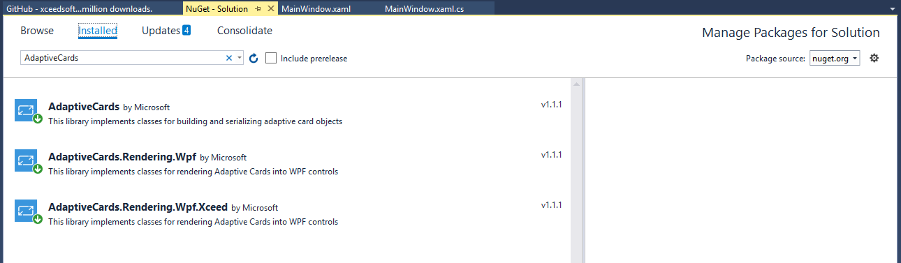

### Build the UI

The UI for this sample is simple: one `Frame` and one `TextBox`. This section shows how to add these two components to our XAML definition. A layout with a frame above a text box is what we want, like the one shown in the following image:

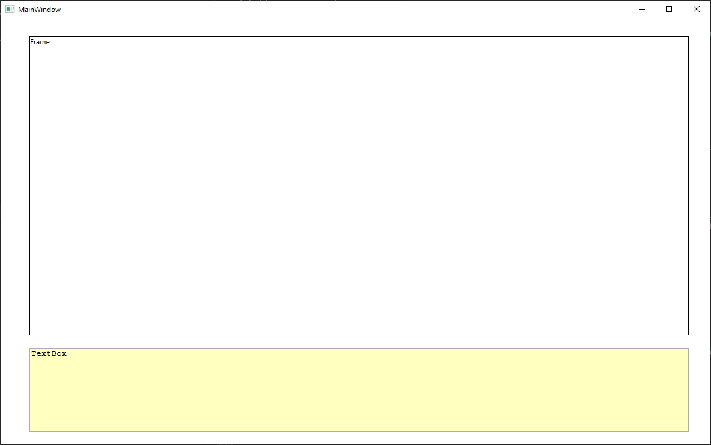

1. Open the *MainWindow.xaml* file and then open **All WPF Controls**. Before dragging over any UI elements, expand the size of the main window by editing the XAML itself. Search for `Title="MainWindow"`, and then give the window a width of 1200 and a height of 750.

   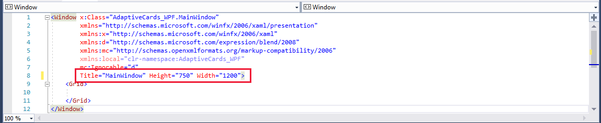

1. Now we'll place a `Frame` element at the top of the window. In the **Properties** pane for the frame:

   1. Change the name of the element to **CardFrame**.
   1. Open the **Brush** category, and set **BorderBrush** to a solid color.
   1. In the **Appearance** category, set **BorderThickness** to **1**.

   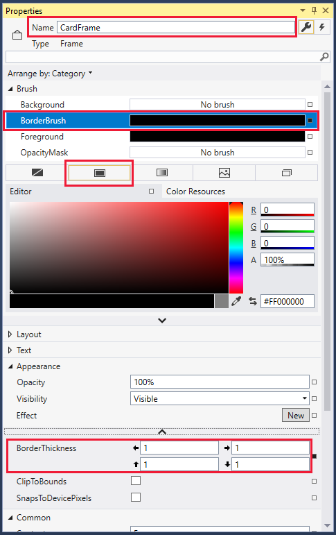

1. In the **Layout** category, set **Width** to **1100** and **Height** to **500**.

1. Drag a `TextBox` element into the window underneath the frame. In the **Properties** pane for the text box:

    1. Change its name to **ResultTextBox**.
    1. Change the background color to **255**, **255**, **192**, **100%** (as we've done in other units to indicate a read-only text box).
    1. Set the **Width** property of the text box to **1100** to match the frame width.
    1. Set **Height** to **140** to accommodate at least 7 lines of text.

   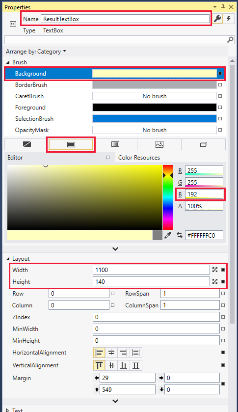

1. In the **Text** category, set the font to a monospaced font, like **Courier New**, and set the size to **14 px**. Because the text box is for output only, select the **IsReadOnly** check box. A monospaced font makes it easy to align columns of text in a table format.

   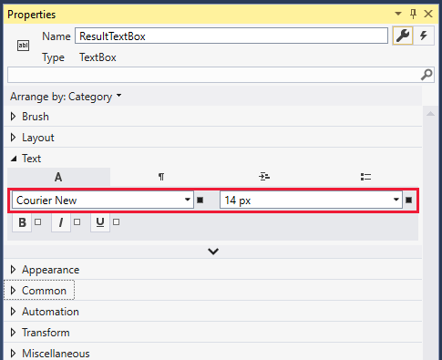

1. As a first test of the app, go to the **Debug** menu and select **Start Without Debugging**. Do you get an aligned layout with the frame above the text box, like the one shown at the start of this section? If not, align the elements as needed.

That's all the basic UI that we need. We don't need to set any events on these elements because input handling is managed through the Adaptive Cards code.

### Add code to render the card

We'll build and test our Adaptive Card in stages. Our card will have four columns. The first column will contain one example of each type of user input (date, time, number, text, and so on). The other three columns will contain images, each with an example of an associated action. The card will also have a title and some introductory text. So, for stage one, let's render the opening text.

1. We need to make sure we have all the resources available to us, including the `AdaptiveCard` NuGet packages we installed earlier in this unit. At the top of the *MainWindow.xaml.cs* file, make sure your list of `using` statements includes all the following:

   ```cs
   using System;
   using System.Collections.Generic;
   using System.Linq;
   using System.Windows;
   using AdaptiveCards;
   using AdaptiveCards.Rendering.Wpf;
   using System.Diagnostics;
   ```

1. Add two global variables to the `MainWindow` class. These variables declare a renderer and the main card.

    ```cs
        AdaptiveCardRenderer renderer;
        AdaptiveCard mainCard;
    ```

1. Change the `MainWindow` constructor method so that it creates a renderer, enables use of the `Xceed` package we installed earlier, creates a main card, and then renders the main card. The following code also includes a debugging version check.

    ```cs
        public MainWindow()
        {
            InitializeComponent();

            // Create a card renderer.
            renderer = new AdaptiveCardRenderer();

            // We're using the Xceed package, so enable the enhanced input.
            renderer.UseXceedElementRenderers();

            // Debugging check: Verify the schema version this renderer supports.
            AdaptiveSchemaVersion schemaVersion = renderer.SupportedSchemaVersion;

            // Create the main card.
            CreateMainCard();

            // Render the card and enable the actions.
            RenderCard(mainCard);
        }
    ```

1. Now we need to add the methods that we're calling. First, we create and identify the main card, and then we add some descriptive text in two text blocks. We set a few parameters on the text: its size and `IsSubtle`, which tones down the otherwise solid black color of the text.

    ```cs
       private void CreateMainCard()
        {
            // Create the main card, and provide a required Id.
            mainCard = new AdaptiveCard
            {
                Id = "Main card"
            };

            // Add the title text to the card and set a few attributes.
            mainCard.Body.Add(new AdaptiveTextBlock
            {
                Text = "Adaptive Cards inputs and actions",
                Size = AdaptiveTextSize.ExtraLarge,
                IsSubtle = true
            });

            // Add a description of the card, in a smaller font.
            mainCard.Body.Add(new AdaptiveTextBlock
            {
                Text = "Click on the images to demo the three actions",
                Size = AdaptiveTextSize.Medium,
                IsSubtle = true
            });
        }
    ```

1. Finally, we need to add a method to display the card. Note that we're taking the `AdaptiveCard displayCard` reference as a parameter (so that we can use this method to display other cards). The first step is to render the card by using the renderer that we installed and initialized earlier. The second step is key; note the reference to **CardFrame**, the name we gave to the `Frame` element of our UI. It's critical to set the `Content` attribute of the frame to the `FrameworkElement` of the renderer. The rest of the method handles renderer warnings and any exceptions thrown by the rendering process.

    ```cs
        private void RenderCard(AdaptiveCard displayCard)
        {
            try
            {
                // Render the card.
                RenderedAdaptiveCard renderedCard = renderer.RenderCard(displayCard);

                // Get the FrameworkElement and attach it to our Frame element in the UI.
                CardFrame.Content = renderedCard.FrameworkElement;

                // Debugging check: Look for any renderer warnings.
                // This includes things like an unknown element type found in the card
                // or the card exceeded the maximum number of supported actions, and so on.
                IList<AdaptiveWarning> warnings = renderedCard.Warnings;

                for (int i = 0; i < warnings.Count; i++)
                {
                    Console.WriteLine(warnings[i].Message);
                }

            }
            catch (AdaptiveException ex)
            {
                // Display what went wrong.
                ResultTextBox.Text = ex.Message;
            }
        }
    ```

1. Many of the critical elements of Adaptive Cards are now in place, so let's test what we have so far. On the **Debug** menu, select **Start Without Debugging** and examine the output. Does your running app look like the following image?

   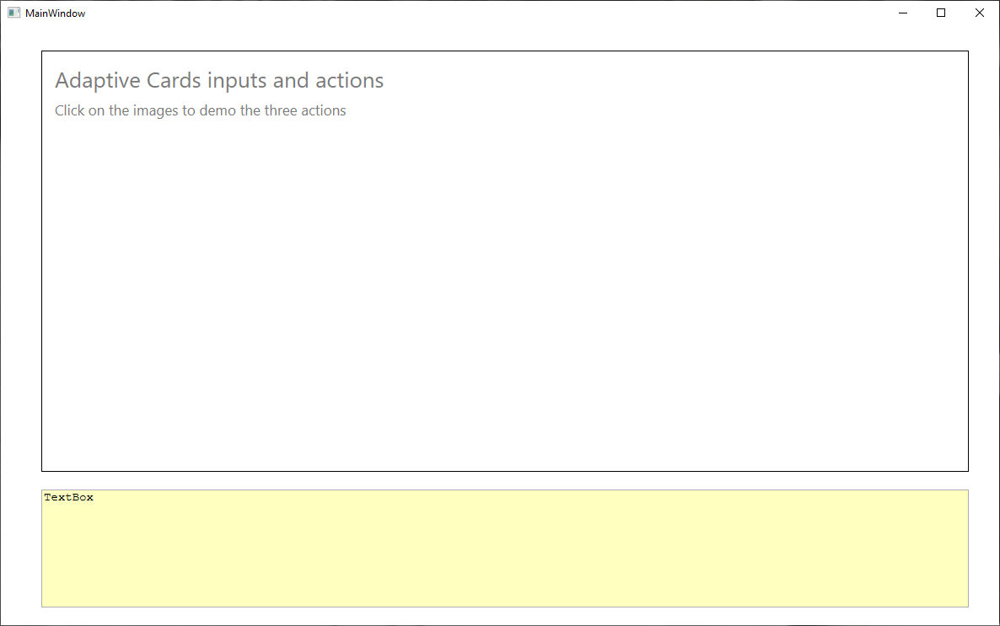

1. If the card doesn't render correctly, go back and check the code and UI steps carefully. If all is good, close the app, and let's write some more code.

### Add code to render an input column

Our card will have four columns. The first one will demonstrate all the options for user input. Let's add this column now.

1. To contain our four columns, we need an `AdaptiveColumnSet` object. Add this object to the list of globals at the start of our class.

    ```cs
    AdaptiveColumnSet mainColumnSet;
    ```

1. In the `CreateMainCard` method, add the code to initialize this column set, call a method to create an input column, and then add the column set to the main card. Make sure you add the following code after the code you already have in this method.

    ```cs
            // Create a column set to contain the input and image columns.
            mainColumnSet = new AdaptiveColumnSet
            {
                Separator = true,
                Spacing = AdaptiveSpacing.Large
            };           

            // Add a column that contains one of each type of input. Note that this column doesn't have an associated action.
            AddInputColumn("Adaptive inputs");

            // Add the column set to the card.
            mainCard.Body.Add(mainColumnSet);
    ```

1. Now we'll create a substantially longer method, the one to add an input column with all the allowed user inputs. Note the order of events: we create an `AdaptiveColumn`, create a list of all the single-entry input types, and then use the `AddRange` method to add this list to the column.

   Then we create a list of *choices*. Choices are similar to option buttons (also known as radio buttons), except that choices appear as check boxes. Multiple check boxes can be selected if `IsMultiSelect` is set to `true`. Note the creation of the `choiceOptions` list to get the exact type we need for the `AdaptiveChoiceSetInput` type. Finally, we add the input column to the column set.

   > [!NOTE]
   > You can add elements individually by using the `Add` method instead of using the `AddRange` method to add all the elements at once. To add three or more elements, you should use a list with `AddRange`, or else the elements will be added individually.

    ```cs
        private void AddInputColumn(string title)
        {
            // Create a column.
            var col = new AdaptiveColumn();

            // Create a collection of all the single-entry input types.
            AdaptiveElement[] inputCollection =
            {
                new AdaptiveTextBlock
                {
                    Text = title,
                    Size = AdaptiveTextSize.Large
                },
                new AdaptiveDateInput
                {
                    Id = "Date",
                    Placeholder = "Enter a date"
                },
                new AdaptiveNumberInput
                {
                    Id = "Number",
                    Placeholder = "Enter a number between 5 and -5",
                    Max = 5,
                    Min = -5
                },
                new AdaptiveTextInput
                {
                    Id = "Text",
                    Placeholder = "Enter some text"
                },
                new AdaptiveTimeInput
                {
                    Placeholder = "Enter a time",
                    Id = "Time"
                },
                new AdaptiveToggleInput
                {
                    Id = "Toggle",
                    Title = "Toggle on or off",
                    ValueOn = "On",
                    ValueOff = "Off"
                }
            };

            // Add the single-entry input types to the column.
            col.Items.AddRange(inputCollection);

            // Create a collection for the choice input set.
            AdaptiveChoice[] choiceCollection =
            {
                new AdaptiveChoice
                {
                    Title = "Choice 1",
                    Value = "10"
                },
                new AdaptiveChoice
                {
                    Title = "Choice 2",
                    Value = "20"
                },
                new AdaptiveChoice
                {
                    Title = "Choice 3",
                    Value = "30"
                }
            };
            var choiceOptions = new List<AdaptiveChoice>(choiceCollection);

            // Add the choice input set to the column.
            col.Items.Add(new AdaptiveChoiceSetInput
            {
                Id = "ChoiceSet",
                Choices = choiceOptions,

                // Enable multiple selections.
                IsMultiSelect = true
            });

            // Add the column to the column set.
            mainColumnSet.Columns.Add(col);
        }
    ```

1. Run the program again. If all goes well, you should be able to select a date, enter a number between -5 and 5, enter some text, enter a time, and set some check boxes. When you set these inputs, nothing happens beyond the changes in the UI because we haven't yet added any actions.

   Note how you get a calendar for setting the date and can select times from a list. These friendlier user-input options are available because we added the `Xceed` package during the setup of this project. Without this package, the date and time input options are regular text boxes.

   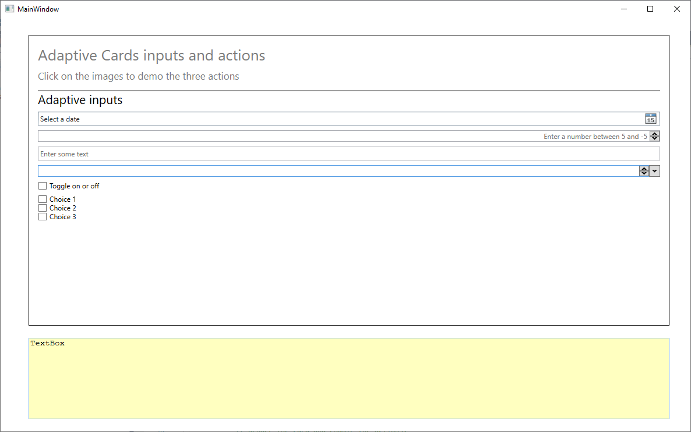

   Also observe how the input column expands to fill the whole card. This behavior will change when we add our image-action columns.

### Add code to render the image columns

Three actions are available to Adaptive Cards: an action that opens a URL, a submit action that handles data, and an action that shows another adaptive card. Now we'll attach each of these actions to its own image column, so that we can write code to demonstrate how each option works.

1. Let's start with a method to add an image column. Add the following `AddImageColumn` method to your class. This method creates a column, defines a list of elements, adds the list to the column, and then adds the column to the column set.

    ```cs
        private void AddImageColumn(AdaptiveColumnSet columnSet, string imageUrl, string title)
        {
            // Create a column.
            var col = new AdaptiveColumn
            {
                Spacing = AdaptiveSpacing.Large
            };

            AdaptiveElement[] elementCollection =
            {
                new AdaptiveTextBlock
                {
                    // Add the title.
                    Text = title,
                    Size = AdaptiveTextSize.Large
                },
                new AdaptiveTextBlock
                {
                    // Add a text block containing the name of the image, extracted from its path.
                    Text = System.IO.Path.GetFileNameWithoutExtension(imageUrl),
                    Size = AdaptiveTextSize.Medium
                },
                new AdaptiveImage
                {
                    // Add the image to the column, and set its Id to be the URL, to ensure a unique Id.
                    Id = imageUrl,
                    Url = new Uri(imageUrl)
                }
            };

            // Add the text and image to the column.
            col.Items.AddRange(elementCollection);

            // Add the column to the column set.
            columnSet.Columns.Add(col);
        }
    ```

1. Now, complete the `CreateMainCard` method so that it contains the code to create three image columns, and add an action to each.

    ```cs
        private void CreateMainCard()
        {
            // Create the main card and provide a required Id.
            mainCard = new AdaptiveCard("1.0")
            {
                Id = "Main card"
            };

            // Add the title text to the card and set a few attributes.
            mainCard.Body.Add(new AdaptiveTextBlock
            {
                Text = "Adaptive Cards inputs and actions",
                Size = AdaptiveTextSize.ExtraLarge,
                IsSubtle = true
            });

            // Add a description of the card in a smaller font.
            mainCard.Body.Add(new AdaptiveTextBlock
            {
                Text = "Click on the images to demo the three actions",
                Size = AdaptiveTextSize.Medium,
                IsSubtle = true
            });

            // Create a column set to contain the input and image columns.
            mainColumnSet = new AdaptiveColumnSet
            {
                Separator = true,
                Spacing = AdaptiveSpacing.Large
            };

            // Add a column containing one of each type of input. Note that this column doesn't have an associated action.
            AddInputColumn("Adaptive inputs");

            // Add the first image, with an Open URL action.
            AddImageColumn(mainColumnSet, "https://learn.microsoft.com/training/media/tanager.jpg", "Open URL action");
            mainColumnSet.Columns[1].SelectAction = new AdaptiveOpenUrlAction
            {
                Url = new Uri("https://www.bing.com")
            };

            // Add the second image, with a Submit action.
            AddImageColumn(mainColumnSet, "https://learn.microsoft.com/training/media/songbird-pair.jpg", "Submit action");
            mainColumnSet.Columns[2].SelectAction = new AdaptiveSubmitAction
            {
                Id = "SubmitAction1",
                Data = "AdaptiveSubmitAction"
            };

            // Add the third image, with a Show Card action.
            AddImageColumn(mainColumnSet, "https://learn.microsoft.com/training/media/eagle-in-tree.jpg", "Show Card action");
            mainColumnSet.Columns[3].SelectAction = new AdaptiveShowCardAction
            {
                Card = showCard
            };

            // Add the column set to the card.
            mainCard.Body.Add(mainColumnSet);
        }
    ```

1. Note that the `Card = showCard` line shows a syntax error. We need to declare a second card. So, add this line to our list of global variables.

    ```cs
    AdaptiveCard showCard;
    ```

1. Then we need to create the show card itself. For now, we'll keep this simple, but in the next unit, we'll add a whole range of elements to bring this card to life. Add the following method:

    ```cs
         private void CreateShowCard()
        {
            // Create a card to display when the Show Card action is chosen.
            showCard = new AdaptiveCard("1.0")
            {
                Id = "Show card"
            };

            // Add the title text to the card and set a few attributes.
            showCard.Body.Add(new AdaptiveTextBlock
            {
                Text = "Show card",
                Size = AdaptiveTextSize.ExtraLarge,
                IsSubtle = true
            });
        }
    ```

1. Now call this method from the `MainWindow` constructor, making sure to call it before the call to create the main card. (A null reference error will occur if the calls are the other way around).

    ```cs
            // Create the show card first, because it's referenced in the main card.
            CreateShowCard();
    ```

1. If you run the program now, you should see the four columns nicely rendered, and the images should be highlighted if you move the cursor over them. However, nothing will happen when you click the images. We still need to add that event handler.

    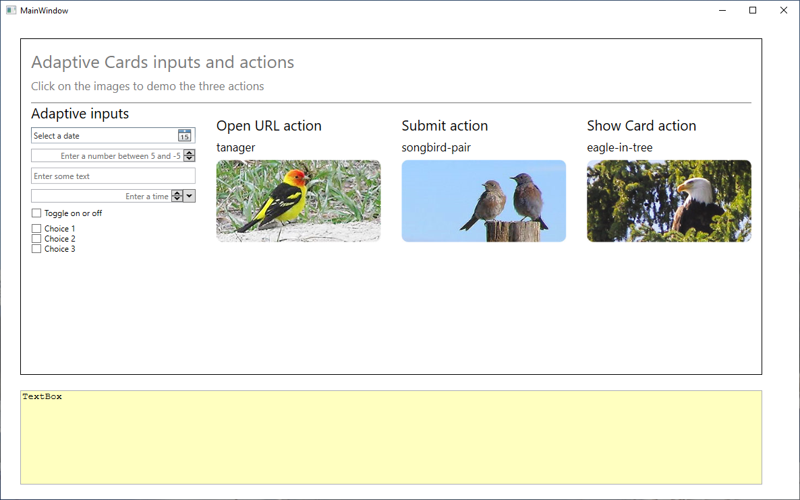

1. Add the following `CardActionHandler` method to handle the three actions. The *Open URL* action does just that; it opens the URL provided by the action as a separate process. The *Submit* action lists the selected user input as a table in the text box, and the *Show Card* action renders the card referenced in that action.

    ```cs
        private void CardActionHandler(RenderedAdaptiveCard sender, AdaptiveActionEventArgs e)
        {
            // Clear the text box entry.
            ResultTextBox.Text = "";

            // Handle the three adaptive card actions.
            if (e.Action is AdaptiveOpenUrlAction openUrlAction)
            {
                ResultTextBox.Text = "You chose AdaptiveOpenUrlAction";

                // Open the URL in a separate process.
                Process.Start(openUrlAction.Url.ToString());
            }
            else if (e.Action is AdaptiveSubmitAction submitAction)
            {

                // Create a dictionary of name-value pairs.
                var inputs = sender.UserInputs.AsDictionary();
                string key;

                ResultTextBox.Text = $"You chose {submitAction.Data}:";

                // Show all the user input, aligned as a table.
                for (int n = 0; n < inputs.Count; n++)
                {
                    key = $"\nkey = { inputs.ElementAt(n).Key }";
                    ResultTextBox.Text += key.PadRight(20) + $" value = { inputs.ElementAt(n).Value } ";
                }
            }
            else if (e.Action is AdaptiveShowCardAction showCardAction)
            {
                ResultTextBox.Text = "You chose AdaptiveShowCardAction";

                // Render the card referenced in the action in the same UI Frame element as the main card.
                RenderCard(showCardAction.Card);
            }
        }
    ```

1. Add the following lines to the `RenderCard` method, after setting the `CardFrame.Content` attribute:

    ```cs
            // Attach the handling method for the card's actions.
            renderedCard.OnAction += CardActionHandler;
    ```

1. Now run the program. If you click the *Open URL* action, Bing.com should open in a separate window. The *Submit* action now lists user input in a tabular form in the text box, and the *Show Card* action renders our show card.

1. Set some dates, times, and other inputs, and then click the *Submit* action each time. Note how the input is picked up in our table.

   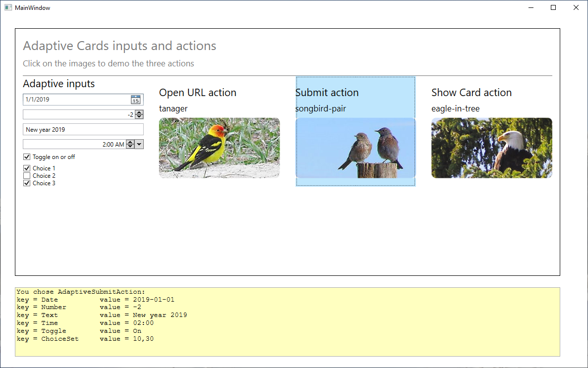

   Navigation between the two cards is also now available through the arrows shown in the upper-left corner of the `Frame` element.

::: zone-end

::: zone pivot="uwp"

### Create the project

With Visual Studio 17 open, create a UWP C# project. Give the project a meaningful name, like **AdaptiveCards_UWP**.

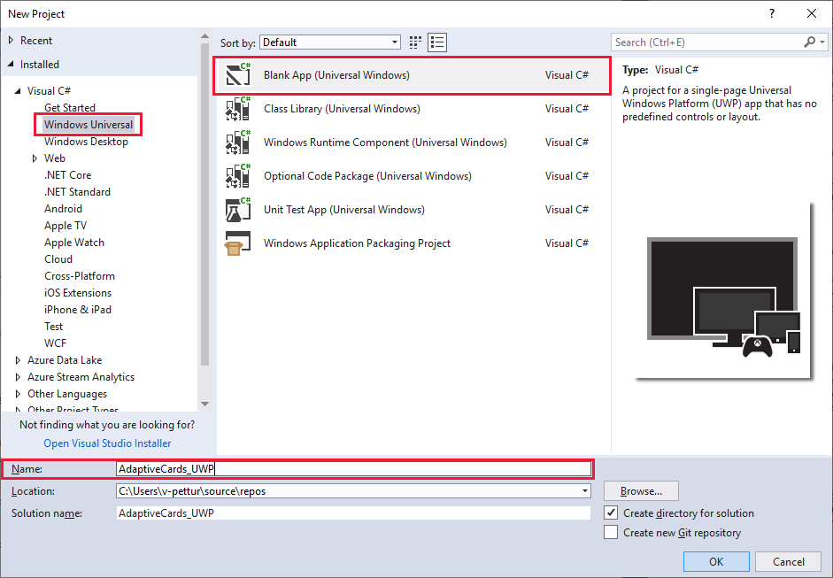

### Install the required packages

1. Go to **Tools** > **NuGet Package Manager** > **Manage NuGet Packages for Solution**. You'll see the list of installed packages (if any).
1. Select **Browse** to open the list of available packages.
1. In the search box, type **AdaptiveCards**, and then go through the process of installing the one package: `AdaptiveCards.Rendering.Uwp`. 

   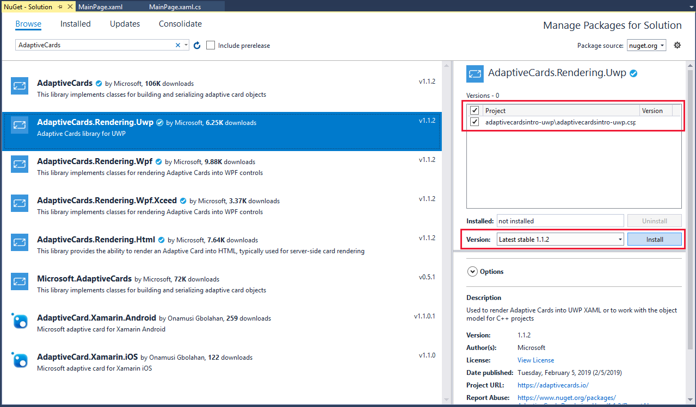

### Build the UI

The UI for this sample is simple: one `Frame` and one `TextBox`. In this section, we'll add these two components to our XAML definition. A layout like the following is what we want:

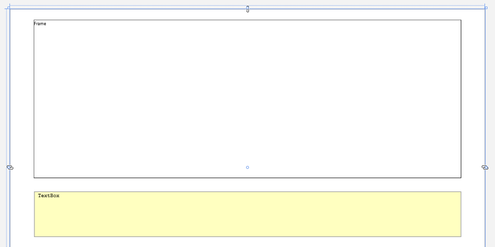

1. Open the *MainWPage.xaml* file, and then open **All XAML Controls**. Place a `Frame` element at the top of the window. In the **Properties** pane for the frame:

    1. Change the name of the element to **CardFrame**.
    2. Open the **Brush** category, and set **BorderBrush** to a solid color.
    3. In the **Appearance** category, set **BorderThickness** to **1**.

   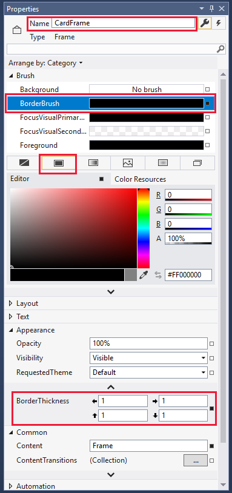

1. In the **Layout** category, set **Width** to **1350** and **Height** to **500**.

1. Drag a `TextBox` element into the window underneath the frame. In the **Properties** pane for the text box:

   1. Change its name to **ResultTextBox**.
   1. Change the background color to **255**, **255**, **192**, **100%** (as we've done in other units to indicate a read-only text box).
   1. Set **Width** to **1350** to match the frame width.
   1. Set **Height** to **140** to accommodate at least 7 lines of text.

   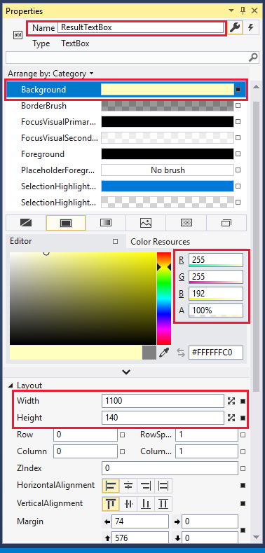

1. In the **Text** category, set the font to a monospaced font, like **Courier New**, and set the size to **14 px**. Because the text box is for output only, select the **IsReadOnly** check box. A monospaced font makes it easy to align columns of text in a table format.

   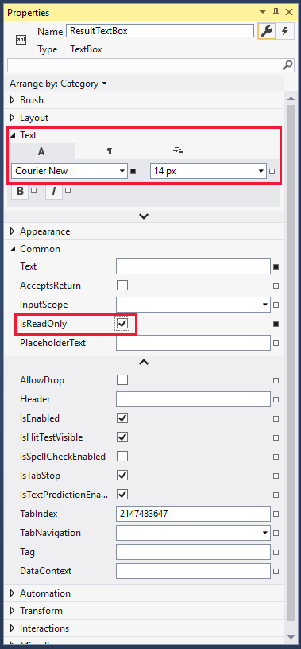

1. As a first test of the app, go to the **Debug** menu and select **Start Without Debugging**. Do you get an aligned layout with the frame above the text box, like the one shown at the start of this section? If not, align the elements as needed.

That's all the basic UI that we need. We don't need to set any events on these elements because input handling is managed through the Adaptive Cards code.

### Add code to render the card

We'll build and test our Adaptive Card in stages. Our card will have four columns. The first column will contain one example of each type of user input (date, time, number, text, and so on). The other three columns will contain images, each with an example of an associated action. The card will also have a title and some introductory text. So, for stage one, let's render the opening text.

1. We need to make sure we have all the resources available to us, including the `AdaptiveCard.Rendering.Uwp` package we installed earlier in this unit. At the top of the *MainPage.xaml.cs* file, make sure your list of `using` statements includes all the following:

    ```cs
    using System;
    using System.Collections.Generic;
    using System.Linq;
    using Windows.UI.Xaml.Controls;
    using AdaptiveCards.Rendering.Uwp;
    using Windows.Data.Json;
    using Windows.System;
    ```

1. Add two global variables to the `MainPage` class. These variables declare a renderer and the main card.

    ```cs
        AdaptiveCardRenderer renderer;
        AdaptiveCard mainCard;
    ```

1. Change the `MainPage` constructor method so that it creates a renderer, sets the host configuration of the renderer, creates a main card, and then renders the main card.

    ```cs
        public MainPage()
        {
            this.InitializeComponent();

            // Create a card renderer.
            renderer = new AdaptiveCardRenderer();

            // Set several attributes on the renderer, including the font family and sizes.
            var hostConfig = new AdaptiveHostConfig
            {
                FontFamily = "Calibri",
                FontSizes =
                {
                    Default = 20,
                    Small = 15,
                    Medium = 25,
                    Large = 30,
                    ExtraLarge = 40,
                }
            };

            // Set the host config properties on the renderer.
            renderer.HostConfig = hostConfig;

            // Create the main card.
            CreateMainCard();

            // Rendering the card enables the actions.
            RenderCard(mainCard);
        }
    ```

1. Now we need to add the methods that we're calling. First, we create the main card, then we add some descriptive text in two text blocks. We set a few parameters on the text: the size and `IsSubtle`, which tones down the otherwise solid black color of the text.

    ```cs
        private void CreateMainCard()
        {
            // Create the main card.
            mainCard = new AdaptiveCard();

            // Add the title text to the card and set a few attributes.
            mainCard.Body.Add(new AdaptiveTextBlock
            {
                Text = "Adaptive Cards inputs and actions",
                Size = TextSize.ExtraLarge,
                IsSubtle = true
            });

            // Add a description of the card in a smaller font.
            mainCard.Body.Add(new AdaptiveTextBlock
            {
                Text = "Click on the images to demo the three actions",
                Size = TextSize.Medium,
                IsSubtle = true
            });
        }
    ```

1. Finally, we need to add a `RenderCard` method to display the card. Note that we're taking the `AdaptiveCard inputCard` reference as a parameter (so that we can use this method to display other cards). The first step is convert the card to a JSON string, and then we render the card by using the renderer that we installed and initialized earlier. The next step is key; note the reference to **CardFrame**, the name we gave to the `Frame` element of our UI. It's critical to set the `Content` attribute of the frame to the `FrameworkElement` of the renderer. The rest of the method handles renderer warnings and any exceptions thrown by the rendering process.

    ```cs
        private void RenderCard(AdaptiveCard inputCard)
        {
            try
            {
                // Convert the card to be rendered to a JSON string.
                JsonObject jobj = JsonObject.Parse(inputCard.ToJson().ToString());

                // Render the card from the JSON object.
                RenderedAdaptiveCard renderedCard = renderer.RenderAdaptiveCardFromJson(jobj);

                // Get the FrameworkElement and attach it to our Frame element in the UI.
                CardFrame.Content = renderedCard.FrameworkElement;

                // Debugging check: Report any renderer warnings.
                // This includes things like an unknown element type found in the card
                // or the card exceeded the maximum number of supported actions, and so on.
                IList<IAdaptiveWarning> warnings = renderedCard.Warnings;

                for (int i = 0; i < warnings.Count; i++)
                {
                    ResultTextBox.Text += warnings[i].Message + "\n";
                }
            }
            catch (Exception ex)
            {
                // Display what went wrong.
                ResultTextBox.Text = ex.Message;
            }
        }
    ```

1. Many of the critical elements of Adaptive Cards are now in place, so let's test what we have so far. On the **Debug** menu, select **Start Without Debugging** and examine the output. Does your running app look like the following image?

    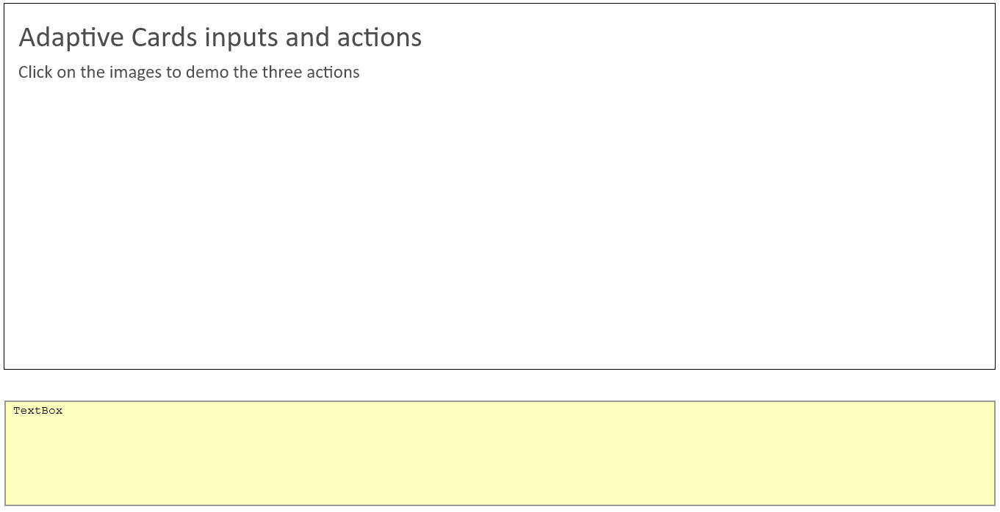

1. If the card doesn't render correctly, go back and check the code and UI steps carefully. If all is good, close the app, and let's write some more code.

### Add code to render an input column

Our card will have four columns. The first one will demonstrate all the options for user input. Let's add this column now.

1. To contain our four columns, we need an `AdaptiveColumnSet` object. Add this object to the list of globals at the start of our class.

    ```cs
    AdaptiveColumnSet mainColumnSet;
    ```

1. In the `CreateMainCard` method, add the code to initialize this column set, call a method to create an input column, and then add the column set to the main card. Add the following code after the code you already have in this method.

    ```cs
            // Create a column set to contain the input and image columns.
            mainColumnSet = new AdaptiveColumnSet
            {
                Separator = true,
                Spacing = Spacing.Large,
            };

            // Add a column that contains one of each type of input.
            AddInputColumn("Adaptive inputs");

            // Add the column set to the card.
            mainCard.Body.Add(mainColumnSet);
    ```

1. Now we'll create a substantially longer method, the one to add an input column with all the allowed user inputs. Note the order of events: we create an `AdaptiveColumn`, and then we create all the entry types by using the `Add` method to add the entries to the column.

   Then we create a list of *choices*. Choices are similar to option buttons (also known as radio buttons), except that choices appear as check boxes. Multiple check boxes can be selected if `IsMultiSelect` is set to `true`. Finally, we add the choice set to the input column, and then we add the input column to the column set.

    ```cs
        private void AddInputColumn(string title)
        {
            // Create a column.
            var col = new AdaptiveColumn();

            col.Items.Add(new AdaptiveTextBlock
            {
                Text = title,
                Size = TextSize.Large
            });

            col.Items.Add(new AdaptiveDateInput
            {
                Id = "Date",
                Placeholder = "Enter a date"
            });

            col.Items.Add(new AdaptiveNumberInput
            {
                Id = "Number",
                Placeholder = "Enter a number"
            });

            col.Items.Add(new AdaptiveTextInput
            {
                Id = "Text",
                Placeholder = "Enter some text"
            });

            col.Items.Add(new AdaptiveTimeInput
            {
                Placeholder = "Enter a time",
                Id = "Time"
            });

            col.Items.Add(new AdaptiveToggleInput
            {
                Id = "Toggle",
                Title = "Toggle on or off",
                ValueOn = "On",
                ValueOff = "Off"
            });

            // Create a collection for the choice input set.
            var choiceSet = new AdaptiveChoiceSetInput
            {
                Id = "ChoiceSet",
                IsMultiSelect = true,
            };

            // Create the individual choices.
            choiceSet.Choices.Add(new AdaptiveChoiceInput
            {
                Title = "Choice 1",
                Value = "10"
            });
            choiceSet.Choices.Add(new AdaptiveChoiceInput
            {
                Title = "Choice 2",
                Value = "20"
            });
            choiceSet.Choices.Add(new AdaptiveChoiceInput
            {
                Title = "Choice 3",
                Value = "30"
            });

            // Add the choice set to the column.
            col.Items.Add(choiceSet);

            // Add the column to the column set.
            mainColumnSet.Columns.Add(col);
        }
    ```

1. Run the program again. If all goes well, you should be able to select a date, enter a number, enter some text, choose a time, and select some check boxes. When you set these inputs, nothing happens beyond the changes in the UI because we haven't yet added any actions.

   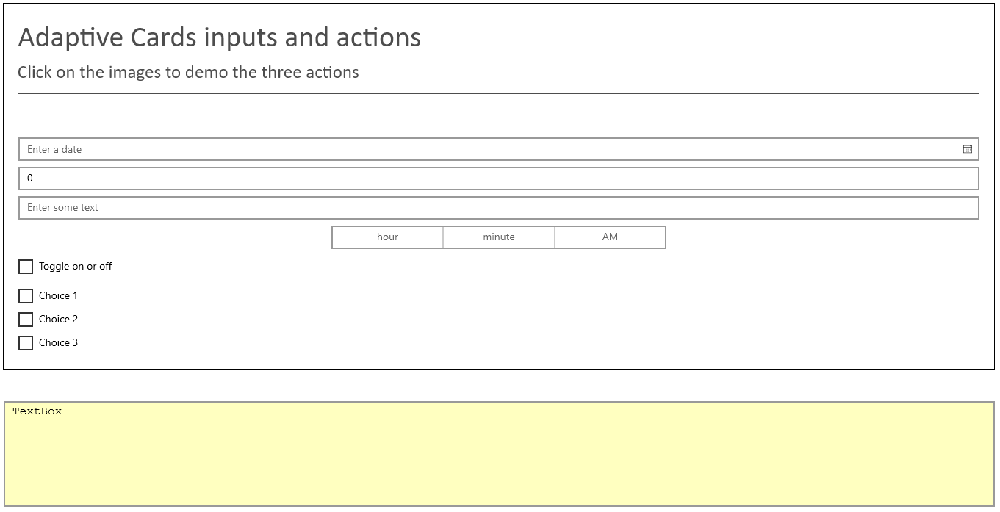

### Add code to render the image columns

Three actions are available to Adaptive Cards: an action that opens a URL, a submit action that handles data, and an action that shows another adaptive card. Now we'll attach each of these actions to their own image column, so that we can write code to demonstrate how each option works.

1. Let's start with a method to add an image column. Add the following `AddImageColumn` method to your class. This method creates a column, defines a list of elements, adds the list to the column, and then adds the column to the column set.

    ```cs
        private void AddImageColumn(AdaptiveColumnSet columnSet, string imageUrl, string title)
        {
            // Create a column.
            var col = new AdaptiveColumn
            {
                Spacing = Spacing.Large
            };

            col.Items.Add(new AdaptiveTextBlock
            {
                // Add the title.
                Text = title,
                Size = TextSize.Large
            });

            col.Items.Add(new AdaptiveTextBlock
            {
                // Add a text block that contains the name of the image, extracted from its path.
                Text = System.IO.Path.GetFileNameWithoutExtension(imageUrl),
                Size = TextSize.Medium
            });

            col.Items.Add(new AdaptiveImage
            {
                // Add the image to the column and set its Id to be the URL.
                Id = imageUrl,
                Url = imageUrl
            });

            // Add the column to the column set.
            columnSet.Columns.Add(col);
        }
    ```

1. Now complete the `CreateMainCard` method so that it contains the code to create three image columns, and add an action to each.

    ```cs
        private void CreateMainCard()
        {
            // Create the main card.
            mainCard = new AdaptiveCard
            {
            };

            // Add the title text to the card and set a few attributes.
            mainCard.Body.Add(new AdaptiveTextBlock
            {
                Text = "Adaptive Cards inputs and actions",
                Size = TextSize.ExtraLarge,
                IsSubtle = true
            });

            // Add a description of the card in a smaller font.
            mainCard.Body.Add(new AdaptiveTextBlock
            {
                Text = "Click on the images to demo the three actions",
                Size = TextSize.Medium,
                IsSubtle = true
            });

            // Create a column set to contain the input and image columns.
            mainColumnSet = new AdaptiveColumnSet
            {
                Separator = true,
                Spacing = Spacing.Large,
            };

            // Add the column set to the card.
            mainCard.Body.Add(mainColumnSet);

            // Add a column that contains one of each type of input.
            AddInputColumn("Adaptive inputs");

            // Add the first image, with an Open URL action.
            AddImageColumn(mainColumnSet, "https://learn.microsoft.com/training/media/tanager.jpg", "Open URL action");
            mainColumnSet.Columns[1].SelectAction = new AdaptiveOpenUrlAction
            { 
                Id = "OpenURLAction",
                Url = new Uri("https://www.bing.com")
            };

            // Add the second image, with a Submit action.
            AddImageColumn(mainColumnSet, "https://learn.microsoft.com/training/media/hawk.jpg", "Submit action");
            mainColumnSet.Columns[2].SelectAction = new AdaptiveSubmitAction
            {
                Id = "SubmitAction1",
            };

            // Add the third image, with a Show Card action.
            AddImageColumn(mainColumnSet, "https://learn.microsoft.com/training/media/visitor.jpg", "Show Card action");
            mainColumnSet.Columns[3].SelectAction = new AdaptiveShowCardAction
            {
                Id = "ShowCardAction",
                Card = showCard
            };
        }
    ```

1. Note that the `Card = showCard` line shows a syntax error. We need to declare a second card. Add this line to our list of global variables:

    ```cs
    AdaptiveCard showCard;
    ```

1. Then we need to create the show card itself. For now, we'll keep this simple, but in the next unit, we'll add a whole range of elements to bring this card to life. Add the following method:

    ```cs
        private void CreateShowCard()
        {
            // Create a card to display when the Show Card action is chosen.
            showCard = new AdaptiveCard();

            // Add the title text to the card and set a few attributes.
            showCard.Body.Add(new AdaptiveTextBlock
            {
                Text = "Show card",
                Size = TextSize.ExtraLarge,
                IsSubtle = true,
            });
        }
    ```

1. Now call this method from the `MainPage` constructor, making sure to call it before the call to create the main card. (A null reference error will occur if the calls are the other way around).

    ```cs
            // Create the show card first, as it is referenced in the main card.
            CreateShowCard();
    ```

1. If you run the program now, you should see the four columns nicely rendered, and the images should be highlighted if you move the cursor over them. However, nothing will happen when you click the images. We still need to add that event handler.

   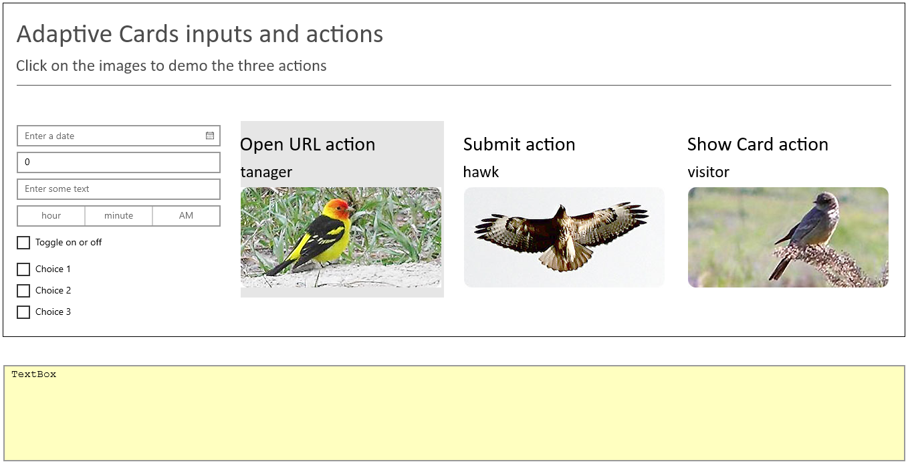

1. Add the following `CardActionHandler` method to handle the three actions. The *Open URL* action does just that; it opens the URL provided by the action as a separate process. The *Submit* action lists the selected user input as a table in the text box, and the *Show Card* action renders the card referenced in that action.

    ```cs
        // Make sure to set the method as async.
        private async void CardActionHandler(RenderedAdaptiveCard sender, AdaptiveActionEventArgs e)
        {
            // Clear the text box.
            ResultTextBox.Text = "";

            // Handle the three adaptive card actions.
            if (e.Action is AdaptiveOpenUrlAction openUrlAction)
            {
                ResultTextBox.Text = "You chose AdaptiveOpenUrlAction";

                // Open the URL.
                await Launcher.LaunchUriAsync(openUrlAction.Url);
            }
            else if (e.Action is AdaptiveSubmitAction submitAction)
            {
                ResultTextBox.Text = "You chose AdaptiveSubmitAction:";

                // Create a set of name-value pairs. 
                var inputs = sender.UserInputs.AsValueSet();
                string key;

                // Show all the user input, aligned in a table.
                for (int n = 0; n < inputs.Count; n++)
                {
                    key = $"\nkey = { inputs.ElementAt(n).Key }";
                    ResultTextBox.Text += key.PadRight(20) + $" value = { inputs.ElementAt(n).Value } ";
                }
            }
            else if (e.Action is AdaptiveShowCardAction showCardAction)
            {
                ResultTextBox.Text = "You chose AdaptiveShowCardAction";

                // Render the card referenced in the action in the same UI Frame as the main card.
                RenderCard(showCardAction.Card);
            }
        }
    ```

1. Add the following lines to the `RenderCard` method, after setting the `CardFrame.Content` attribute:

    ```cs
                // Attach the handling method for the card's actions.
                renderedCard.Action += CardActionHandler;
    ```

1. Now run the program. If you click the *Open URL* action, Bing.com should open in a separate window. The *Submit* action now lists user input in a tabular form in the text box, and the *Show Card* action renders our show card.

1. Set some dates, times, and other inputs, and then click the *Submit* action each time. Note how the input is picked up in our table.

   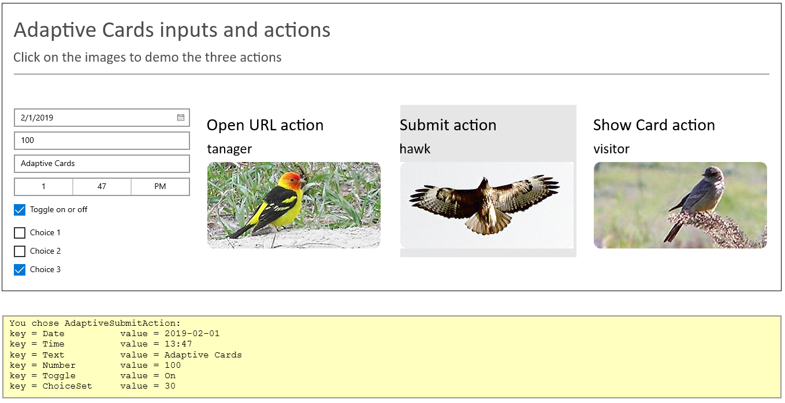

::: zone-end

### Summary

You've completed an example that contains all the inputs and actions available through the Adaptive Cards API. You've been able to test each user input and each action, and you've seen the user engagement that this interaction adds.

The next unit of this module adds the significant remaining features of the Adaptive Cards API.

#### Resources

For a detailed technical description of Adaptive Cards, see [Adaptive Cards overview](/adaptive-cards/).
