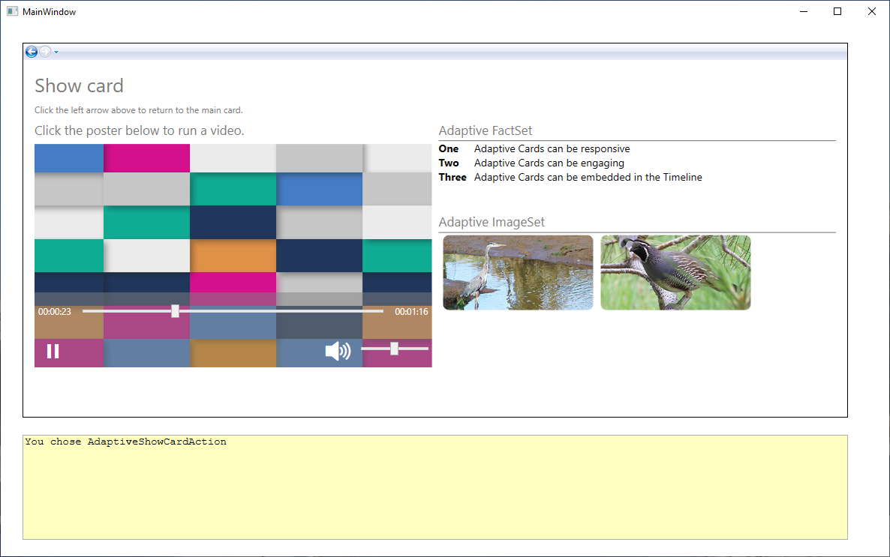
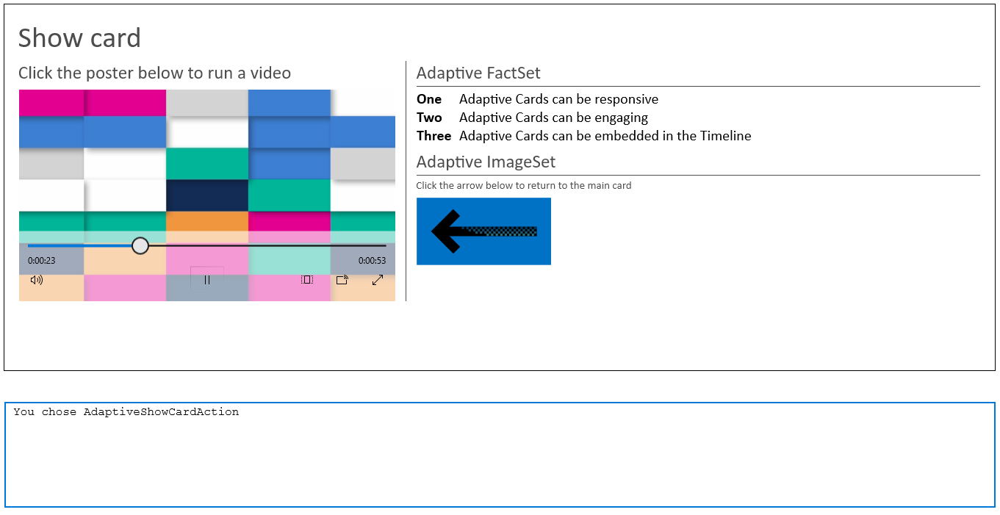

To finish this module, we're going to use the show card to demonstrate several Adaptive Card elements that we didn't use in the earlier units. These new elements include:

- Rendering a video.
- Displaying a fact set (a numbered or bulleted list).
- Displaying an image set. Each image in an image set can have an associated action.

In this unit, we'll write code and learn about these features of the Adaptive Cards API: video rendering, fact sets, and image sets.

### Load our show card with additional features of Adaptive Cards

::: zone pivot="wpf"

1. Change the `CardActionHandler` method to handle some different *Submit* actions:

    ```cs
        private void CardActionHandler(RenderedAdaptiveCard sender, AdaptiveActionEventArgs e)
        {
            // Clear the text box entry.
            ResultTextBox.Text = "";

            // Handle the three adaptive card actions.
            if (e.Action is AdaptiveOpenUrlAction openUrlAction)
            {
                ResultTextBox.Text = "You chose AdaptiveOpenUrlAction";

                // Open the URL in a separate process.
                Process.Start(openUrlAction.Url.ToString());
            }
            else if (e.Action is AdaptiveSubmitAction submitAction)
            {
                switch (submitAction.Id)
                {
                    case "SubmitAction1":
                        // Create a dictionary of name-value pairs.
                        var inputs = sender.UserInputs.AsDictionary();
                        string key;

                        ResultTextBox.Text = $"You chose {submitAction.Data}:";

                        // Show all the user input aligned as a table.
                        for (int n = 0; n < inputs.Count; n++)
                        {
                            key = $"\nkey = { inputs.ElementAt(n).Key }";
                            ResultTextBox.Text += key.PadRight(20) + $" value = { inputs.ElementAt(n).Value } ";
                        }
                        break;

                    case "SubmitAction2":
                    case "SubmitAction3":
                        ResultTextBox.Text = $"You chose {submitAction.Data}";
                        break;
                }
            }
            else if (e.Action is AdaptiveShowCardAction showCardAction)
            {
                ResultTextBox.Text = "You chose AdaptiveShowCardAction";

                // Render the card referenced in the action in the same UI Frame as the main card.
                RenderCard(showCardAction.Card);
            }
        }
    ```

1. We're going to change the `CreateShowCard` method to support the additional features that we're including, starting with rendering a video. Replace the existing `CreateShowCard` method with the following code. After the title text, this new `CreateShowCard` method creates a column set to contain two columns, and then it sets the widths of those columns.

    ```cs
        private void CreateShowCard()
        {
            // Create a card to display when the Show Card action is chosen.
            showCard = new AdaptiveCard("1.0")
            {
                Id = "Show card"
            };

            // Add the title text to the card and set a few attributes.
            showCard.Body.Add(new AdaptiveTextBlock
            {
                Text = "Show card",
                Size = AdaptiveTextSize.ExtraLarge,
                IsSubtle = true
            });

            // Add some text about how to return to the main card.
            showCard.Body.Add(new AdaptiveTextBlock
            {
                Text = "Click the left arrow above to return to the main card.",
                Size = AdaptiveTextSize.Small,
                IsSubtle = true
            });

            // For this card, create two columns. Set the first to be 60 percent of the card's width, the second to be 40 percent.
            var showColumnSet = new AdaptiveColumnSet();
            var showColumn1 = new AdaptiveColumn
            {
                Width = "3",
            };
            var showColumn2 = new AdaptiveColumn
            {
                Width = "2",
            };

            // The first column links to a video.
            showColumn1.Items.Add(new AdaptiveTextBlock
            {
                Text = "Click the poster below to run a video.",
                Size = AdaptiveTextSize.Medium,
                IsSubtle = true
            });

            // Create a list of media, with a single entry in the list.
            AdaptiveMediaSource[] mediaCollection =
            {
                new AdaptiveMediaSource
                {
                    MimeType = "video/mp4",
                    Url = "http://adaptivecardsblob.blob.core.windows.net/assets/AdaptiveCardsOverviewVideo.mp4"
                }
            };
            var mediaList = new List<AdaptiveMediaSource>(mediaCollection);

            // Add the element to display the media source.
            showColumn1.Items.Add(new AdaptiveMedia
            {
                Id = "MediaSource",
                Poster = "https://adaptivecards.io/content/poster-video.png",
                Sources = mediaList
            });

            // Add the first column to the column set.
            showColumnSet.Columns.Add(showColumn1);

            // The second column shows examples of a fact set and an image set.
            showColumn2.Items.Add(new AdaptiveTextBlock
            {
                Text = "Adaptive FactSet",
                Size = AdaptiveTextSize.Medium,
                IsSubtle = true
            });

           // *** Add the FactSet code here. ***

           // *** Add the ImageSet code here. ***

            // Add the second column to the column set.
            showColumnSet.Columns.Add(showColumn2);

            // Add the column set to the card.
            showCard.Body.Add(showColumnSet);
        }
    ```

    Note how the width of the first column is set to **3**, and the width of the second to **2**. This means that the first column will occupy three fifths (60 percent) of the space available for the two columns, and the second column will occupy two fifths (40 percent) of the available space. Width settings are relative units.

    For the video-rendering element, there is a *poster* entry: a graphic that's shown when the video isn't being played. This poster acts as an icon that users can click to play the video. Note also that you don't need to do much more to render a video--quite a nice feature of Adaptive Cards!

    Finally, note the comments that indicate where we'll add some code in the following steps.

1. Run the program. Select the *Show Card* action, and then play the video.

   > [!NOTE]
   > With Windows Presentation Framework (WPF) UI `Frame` elements, you can use the arrows in the upper-left corner to navigate between the two cards.

1. Let's add the fact set. Replace the comment `// *** Add the FactSet code here. ***` with the following code:

    ```cs
            // The second column shows an example of a fact set.
            showColumn2.Items.Add(new AdaptiveTextBlock
            {
                Text = "Adaptive FactSet",
                Size = AdaptiveTextSize.Medium,
                IsSubtle = true
            });

            //  Create a list of facts.
            AdaptiveFact[] factCollection =
            {
                new AdaptiveFact
                {
                    Title = "One",
                    Value = "Adaptive Cards can be responsive"
                },
                new AdaptiveFact
                {
                    Title = "Two",
                    Value = "Adaptive Cards can be engaging"
                },
                new AdaptiveFact
                {
                    Title = "Three",
                    Value = "Adaptive Cards can be embedded in the Timeline"
                },
            };
            var factList = new List<AdaptiveFact>(factCollection);

            // Add the fact set to the column.
            showColumn2.Items.Add(new AdaptiveFactSet
            {
                Id = "FactSet",
                Facts = factList,
                Separator = true
            });
    ```

1. Run the app again. When you select the *Show Card* action, the fact set should be rendered neatly. The **Title** text is rendered in bold by default, and the **Value** text is vertically aligned.

1. Now we'll add an image set. Image sets are picture galleries, and they have the added power of enabling you to add an action to each image. In the following code, that action is simply to send a *Submit* action that reports which image has been selected. Replace the `// *** Add the ImageSet code here. ***` comment with the following code:

    ```cs
            // The second column also gives an example of an image set.
            showColumn2.Items.Add(new AdaptiveTextBlock
            {
                Text = "Adaptive ImageSet",
                Size = AdaptiveTextSize.Medium,
                IsSubtle = true,
                Spacing = AdaptiveSpacing.ExtraLarge
            });

            // Create a list of images. In an image set, the images can have associated actions.
            AdaptiveImage[] imageCollection =
            {
                new AdaptiveImage
                {
                   Url = new Uri("https://learn.microsoft.com/training/media/heron.jpg"),
                   PixelHeight = 100,
                   SelectAction = new AdaptiveSubmitAction
                   {
                       Id = "SubmitAction2",
                       Data = "Image One"
                   }
                },
                new AdaptiveImage
                {
                   Url = new Uri("https://learn.microsoft.com/training/media/grouse-pair.jpg"),
                   PixelHeight = 100,
                   SelectAction = new AdaptiveSubmitAction
                   {
                       Id = "SubmitAction3",
                       Data = "Image Two"
                   }
                }
            };
            var imageList = new List<AdaptiveImage>(imageCollection);

            // Add the image set to the column.
            showColumn2.Items.Add(new AdaptiveImageSet
            {
                Id = "ImageSet",
                Images = imageList,
                Separator = true
            });
    ```

1. Run the completed app. Select the *Show Card* action, and play the video. Click the image set to see some simple text responses.

    

You've completed the WPF version of this module and should now have a good understanding of the range of options that Adaptive Cards offer.

::: zone-end

::: zone pivot="uwp"

1. Change the `CardActionHandler` method to handle some different *Submit* actions.

    ```cs
        // Make sure to set the method as async.
        private async void CardActionHandler(RenderedAdaptiveCard sender, AdaptiveActionEventArgs e)
        {
            // Clear the text box.
            ResultTextBox.Text = "";

            // Handle the three adaptive card actions.
            if (e.Action is AdaptiveOpenUrlAction openUrlAction)
            {
                ResultTextBox.Text = "You chose AdaptiveOpenUrlAction";

                // Open the URL contained in the action.
                await Launcher.LaunchUriAsync(openUrlAction.Url);
            }
            else if (e.Action is AdaptiveSubmitAction submitAction)
            {
                switch (submitAction.Id)
                {
                    case "SubmitAction1":

                        ResultTextBox.Text = "You chose AdaptiveSubmitAction:";

                        // Create a set of name-value pairs.
                        var inputs = sender.UserInputs.AsValueSet();
                        string key;

                        // Show all the user input aligned in a table.
                        for (int n = 0; n < inputs.Count; n++)
                        {
                            key = $"\nkey = { inputs.ElementAt(n).Key }";
                            ResultTextBox.Text += key.PadRight(20) + $" value = { inputs.ElementAt(n).Value } ";
                        }
                        break;

                    case "SubmitAction2":

                        // The user has selected to display the main card again.
                        ResultTextBox.Text = "You chose to return to the main card";
                        RenderCard(mainCard);
                        break;
                }
            }
            else if (e.Action is AdaptiveShowCardAction showCardAction)
            {
                ResultTextBox.Text = "You chose AdaptiveShowCardAction";

                // Render the card referenced in the action in the same UI Frame as the main card.
                RenderCard(showCardAction.Card);
            }
        }
    ```

1. We're going to change the `CreateShowCard` method to support the options that we're including, starting with rendering a video. Replace the existing `CreateShowCard` method with the following code. After the title text, the new `CreateShowCard` method creates a column set to contain two columns, and then it sets the widths of those columns.

    ```cs
        private void CreateShowCard()
        {
            // Create a card to display when the Show Card action is chosen.
            showCard = new AdaptiveCard
            {
            };

            // Add the title text to the card and set a few attributes.
            showCard.Body.Add(new AdaptiveTextBlock
            {
                Text = "Show card",
                Size = TextSize.ExtraLarge,
                IsSubtle = true,
            });

            // Create a column set to contain two columns.
            var showColumnSet = new AdaptiveColumnSet();

            // Create the first column.
            var showColumn1 = new AdaptiveColumn
            {
                Separator = true,
                Spacing = Spacing.Large,
                Width = "2",
            };

            // Set up the first column to render a video.
            showColumn1.Items.Add(new AdaptiveTextBlock
            {
                Text = "Click the poster below to run a video",
                Size = TextSize.Medium,
                IsSubtle = true
            });

            var media = new AdaptiveMedia
            {
                Id = "MediaSource",
                Poster = "http://adaptivecards.io/content/poster-video.png",
                Height = HeightType.Auto,
            };

            media.Sources.Add(new AdaptiveMediaSource
            {
                MimeType = "video/mp4",
                Url = "https://adaptivecardsblob.blob.core.windows.net/assets/AdaptiveCardsOverviewVideo.mp4"
            });

            // Add the media element to the column.
            showColumn1.Items.Add(media);

            // Add the column to the column set.
            showColumnSet.Columns.Add(showColumn1);

            // Create a second column.
            var showColumn2 = new AdaptiveColumn
            {
                Separator = true,
                Spacing = Spacing.Large,
                Width = "3",
            };

           // *** Add the FactSet code here. ***

           // *** Add the ImageSet code here. ***

            // Add the second column to the column set.
            showColumnSet.Columns.Add(showColumn2);

            // Add the column set to the card.
            showCard.Body.Add(showColumnSet);
        }
    ```

    Note how the width of the first column is set to **2**, and the width of the second to **3**. This means that the first column will occupy two fifths (40 percent) of the space available for the two columns, and the second column will occupy three fifths (60 percent) of the available space. Width settings are relative units.

    For the video-rendering element, there is a *poster* entry: a graphic that's shown when the video isn't being played. This poster acts as an icon that users can click to play the video. Note also that you don't need to do much more to render a video--quite a nice feature of Adaptive Cards!

    Finally, note the comments about where we'll add some code in the next steps.

    > [!NOTE]
    > Video posters and rendering might not be sized correctly if you don't set the widths of the columns.

1. Run the program. Select the *Show Card* action, and then play the video.

1. Let's now add the fact set. Replace the comment `// *** Add the FactSet code here. ***` with the following code:

    ```cs
            // The second column shows an example of a fact set.
            showColumn2.Items.Add(new AdaptiveTextBlock
            {
                Text = "Adaptive FactSet",
                Size = TextSize.Medium,
                IsSubtle = true
            });

            //  Create a list of facts.
            var factSet = new AdaptiveFactSet
            {
                Separator = true,
            };
            factSet.Facts.Add(new AdaptiveFact
            {
                Title = "One",
                Value = "Adaptive Cards can be responsive"
            });
            factSet.Facts.Add(new AdaptiveFact
            {
                Title = "Two",
                Value = "Adaptive Cards can be engaging"
            });
            factSet.Facts.Add(new AdaptiveFact
            {
                Title = "Three",
                Value = "Adaptive Cards can be embedded in the Timeline"
            });

            // Add the fact set to the column.
            showColumn2.Items.Add(factSet);

    ```

1. Run the app again. When you select the *Show Card* action, the fact set should be rendered neatly. The **Title** text is rendered in bold by default, and the **Value** text is vertically aligned.

1. Now we'll add an image set. Image sets are picture galleries, and they have the added power of enabling you to add an action to each image. In the following code, that action is simply to send a *Submit* action that returns to the main card. Replace the `// *** Add the ImageSet code here. ***` comment with the following code:

    ```cs
            // The second column also shows an example of an image set.
            showColumn2.Items.Add(new AdaptiveTextBlock
            {
                Text = "Adaptive ImageSet",
                Size = TextSize.Medium,
                IsSubtle = true
            });

            // Add some text about how to return to the main card.
            showColumn2.Items.Add(new AdaptiveTextBlock
            {
                Text = "Click the arrow below to return to the main card",
                Size = TextSize.Small,
                IsSubtle = true,
                Separator = true,
            });

            // Create the image set.
            var imageSet = new AdaptiveImageSet
            {
                Id = "ImageSet",
            };

            // Add one or more images to the image set.
            imageSet.Images.Add(new AdaptiveImage
            {
                Url = "https://learn.microsoft.com/training/media/back-arrow.png",
                SelectAction = new AdaptiveSubmitAction
                {
                    Id = "SubmitAction2",
                }
            });

            // Add the image set to the column.
            showColumn2.Items.Add(imageSet);
    ```

1. Run the completed app.

    

You've completed the Universal Windows Platform (UWP) version of this module and should now have a good understanding of the range of options that Adaptive Cards offer.

::: zone-end
