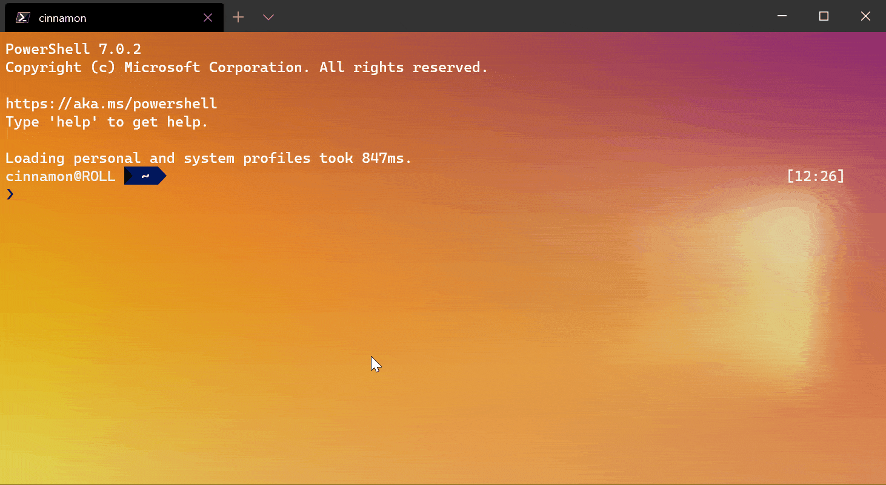

Windows Subsystem For Linux (WSL) is a tool provided by Microsoft to run Linux natively on Windows.

## Why WSL?

Whether you’re a seasoned developer or a student just beginning to learn code, one of the most important choices you need to make is the type of hardware, environment, and tools to invest in using.

As a developer, you will need to access specific coding tools, languages, and frameworks. You may want to install Python and a web development framework like Django, work with JavaScript on a NodeJS backend, or install a cross-platform project that uses React. Generally speaking, these programming languages will work on all operating systems. However, there are many scenarios that may prefer one operating system to another. Building Windows native desktop apps works best using Windows, but building a web app that will be deployed to a custom Linux server or production-ready virtual machine (VM) may be best to build and test using Linux and Bash command line tools.

As the employee of a company or student in a school, access to productivity tools is also essential to consider. Throughout the day many of us need to use Outlook for email and calendar scheduling, Office for creating Word docs, Excel spreadsheets, and PowerPoint presentations, and then need to jump on Microsoft Teams for online meetings and chats.

Rather than using two separate machines -- Windows to run productivity tools and Linux to run development tools, some developers choose to dual-boot. Logging in and out of operating systems every time you want to switch tasks takes a lot of time though. Some developers run Linux on a VM, but this often results in slow performance issues. Many developers also want to work both in a Linux environment with tools like Bash AND use popular Windows development tools like Visual Studio, Visual Studio Code, Windows Terminal, PowerToys, and Windows Package Manager (winget).

WSL enables you to run any Linux distribution, with a full Linux kernel, completely integrated with your Windows environment. The Windows and Linux integration offers highly efficient performance that enables Bash to run alongside CMD or PowerShell, use Visual Studio Code to debug project code running on a local Linux server, or even run a Linux GUI app version of the Microsoft Edge web browser alongside a Windows version of Microsoft Edge to test that your web app works well on both. It’s designed to be a seamless experience, essentially providing a full Linux shell that can interact with your Windows filesystem.

## Is WSL right for me?

In this module, you'll take an broad look at WSL and its capabilities. You'll gain a solid foundation for understanding what WSL has to offer and whether it is the right fit for your needs.

The main goals of this module are to:

- Describe the main components and features that make WSL unique.
- Compare the two versions of WSL architecture - WSL 1 and WSL 2, explaining why both are supported and the scenarios for using one or the other.
- Compare WSL to a traditional VM.
- Outline a high-level view of a WSL development environment and workflow.
- Summarize the support for companies interested in creating custom WSL images, as well as the security and control options.

By the end of this module, you should be able to determine whether WSL is a good fit for your coding and development needs.
