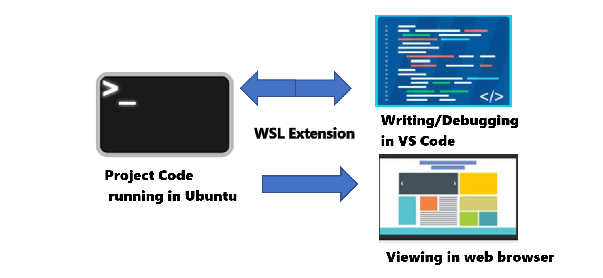

The ability to use both Linux and Windows on a single device means you can use your favorite tools from either system. In this section, we'll recommend some of the tools, command line utilities, coding languages and frameworks that best support a smooth development environment when using WSL. You'll need to keep in mind that you're working between two different file systems. To achieve the best performance from your environment, there are a few best practices to consider for your workflow.

## Basics of a WSL development workflow

To begin, let's look at some of the standard development tools, command line utilities, code languages/frameworks, and practices involved in a WSL development workflow.

### Developer tool recommendations

Your choice of tools is highly dependent on what type of development work you plan to use them for. There are a few that we specifically recommend for a WSL workflow, especially if you're just getting started using WSL, including:

- **Code Editor**: Visual Studio Code with the WSL extension

    VS Code is a free, open source, code editor, sometimes also called an IDE or Integrated Development Environment. It supports debugging, syntax highlighting, intelligent code completion (IntelliSense), built-in Git commands, and an expansive marketplace of extensions that enable you to install additional support tools.

    One reason for recommending VS Code is the WSL extension. This extension enables VS Code's user interface to run on Windows, while your commands, extensions, debugging, code autocomplete, linting, etc. will all work on Linux. Without this extension, you would run into performance and compatibility issues when working between the Windows and Linux file systems. With the extension, you can run your Linux code projects in an encapsulated environment, isolated from Windows. The tools, languages, compilers, and extensions you run in the Linux environment won't modify or disrupt anything installed in your Windows environment.

    :::image type="content" source="../media/wsl-in-vscode.png" alt-text="Screen capture of project code stored in Ubuntu opened in VS Code with the WSL Extension.":::

- **Command line and utilities**: Windows Terminal with customized Bash + PowerShell

    Windows Terminal is now the default command line host for Windows 11, so any Linux distributions that you install will automatically have a profile created in Windows Terminal. This profile can be customized with whatever sort of text size, fonts, colors, etc. that you prefer. Bash is the command line interpreter that comes with almost all Linux distributions. It can be used with utility tools for things like searching files and directories, displaying system performance information, analyzing available disk space, monitoring your network interface, as well as for automating tasks via scripts. PowerShell serves the same purposes, but for Windows. One of the great things about WSL is that you can mix both Bash and PowerShell commands and scripts together. With Windows Terminal, you can run multiple Bash and PowerShell command lines at the same time, side by side in tabs or window panes.

    :::image type="content" source="../media/wsl-in-terminal.gif" alt-text="Screen capture of Windows Terminal with a PowerShell command line open, then adding a window pane for Ubuntu and Kali Linux.":::

- **Code languages and app frameworks**: Install project code on the Linux file system using a package manager

    On Windows, software has traditionally been installed using executable (.exe) files and using the Settings GUI to manage or remove software (Settings > Apps & Features). On Linux, "package managers" handle the process of installing, upgrading, configuring, and removing software. When working in Linux with WSL, you'll want to use a package manager to install code languages and app framework on the Linux file system directory associated with the distribution you're using. The default WSL distribution, Ubuntu, uses the "apt" package manager (short for "Advanced Package Manager"). You should always install the languages/frameworks/tools that you'll be using on the same file system where you'll create your project code.
    Tips for working between file systems and how to achieve the best performance are covered in more depth in another WSL training module.

### A typical development workflow

Once you've installed the tools you need for your WSL development environment, a typical workflow might look like this:

1. Open Ubuntu (or your preferred Linux distribution) in the default Windows Terminal.

2. Install your code language, framework using the package manager for your distribution. (Something like `sudo apt install <software>`).

3. You may also need to use a command line utility to download software if it's not available from the distribution's package manager. A useful utility, which comes with many Linux distributions, is cURL (short for Client URL). It can be used for downloading software or any sort of data transfer between the command line and a server that uses URL syntax. It's also commonly used for automated tasks, since it is designed to work without user interaction.

4. Create a directory to store your app project in your Ubuntu command line (`mkdir app-project`). Store project files that you will be running in Linux on your Linux file system (not on the Windows file system) for better performance. Enter the command `pwd` to show your directory path. If you're using Bash and the path contains `/mnt/c/`, it means that you're currently in the Windows file system (mounted C drive). Enter `cd ~` to change directories to the home directory of your Linux file system. If you're using PowerShell and the path contains `\\wsl.localhost\Ubuntu\home\<username>\app-project`, this is pointing to the Ubuntu distribution directory on the Linux file system hosted by WSL. (You can also use the command: `explorer.exe .` to view your files from either file system in Windows File Explorer.)

    

5. Open your project directory in Visual Studio Code using the WSL extension by entering the command: `code .`. The VS Code Remote Server will start and your project code, running on Linux, will open in VS Code, running on Windows. You will now have access to VS Code features like Intellisense code completion, debugging, and linting, powered by the tools and compilers installed on Linux.

6. Once you have made updates to your code, you'll be able to run it in your Linux distribution, but view it using a web browser on Windows with a localhost address (for example, `localhost:3000`). WSL supports hot-reload, so rather than needing to reload your entire app when you make a change, you can just refresh the files that were changed without losing the state of the app.

## Common scenarios for using a WSL

A few common situations or scenarios where a developer may want to use WSL include:

- A beginner who wants to learn coding on both Windows and Linux environments.
- A professional developer who wants access to Linux and Windows tools.
- Any organization that wants to operationalize a Continuous Integration and Continuous Delivery (CICD) workflow, testing updates on a local machine before deploying code updates to the cloud.
- Anyone who wants to use Docker for creating containers, Git for version control, GPU acceleration for Machine Learning, databases (like MySQL, PostgreSQL, MongoDB, Redis, SQLite), or have access to both Linux GUI apps and Windows at the same time.
- A company that wants to create customized WSL images for distribution to all of their machines so that employees have secure access to both Windows and Linux.

:::image type="content" source="../media/wsl-cicd.png" alt-text="Diagram of a CICD workflow using WSL, GitHub, and a Linux VM.":::

There are also a few limitations to be aware of with WSL, including:

- WSL is designed for development and includes some features that may make it challenging to use in production scenarios.

- WSL uses a lightweight utility VM that starts, stops, and manages resources automatically. If you're trying to use it as a web server, the VM could shut down to clean up resources because it's detecting that no users are active. It is generally recommended to use a Linux distribution more specifically designed to be a web server for deployment scenarios.

- WSL automatically gives file access to Windows files and Windows paths. This access is appended to your path by default, which could cause unexpected behavior for certain Linux applications compared to a traditional Linux environment.

More details on these limitations are covered in the WSL documentation FAQs.

To wrap up our introduction to WSL, let's try actually using some basic Linux commands!
