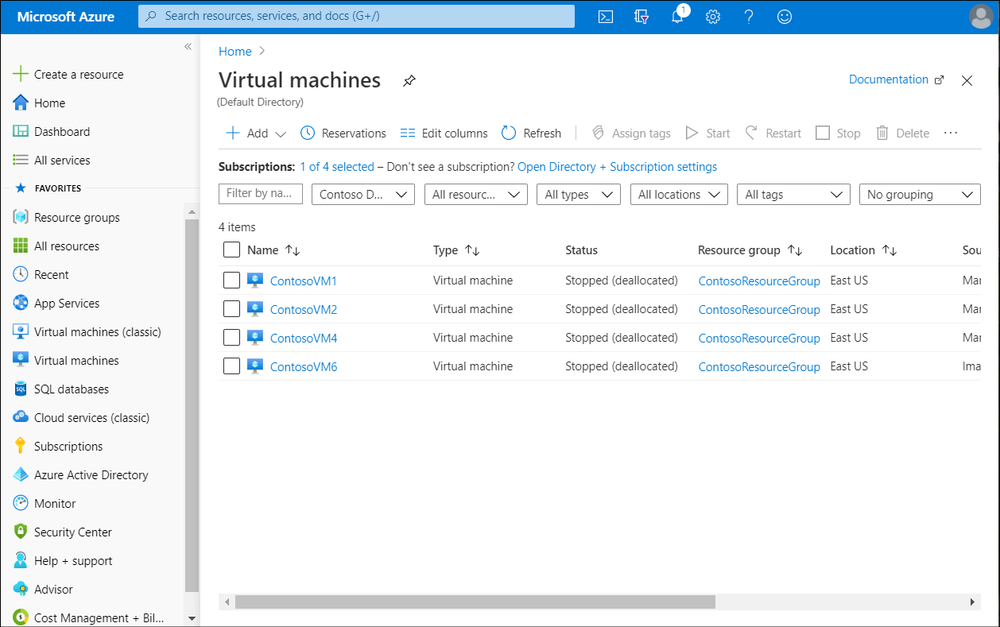
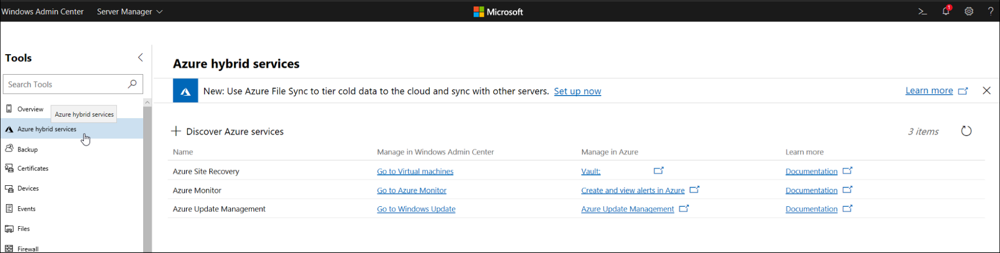
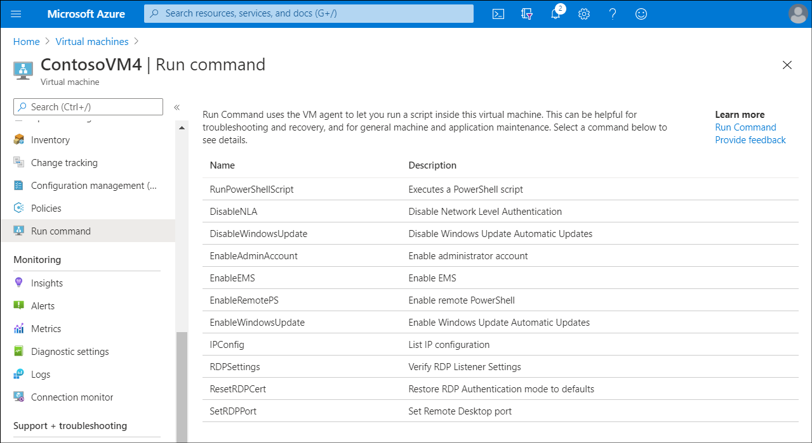
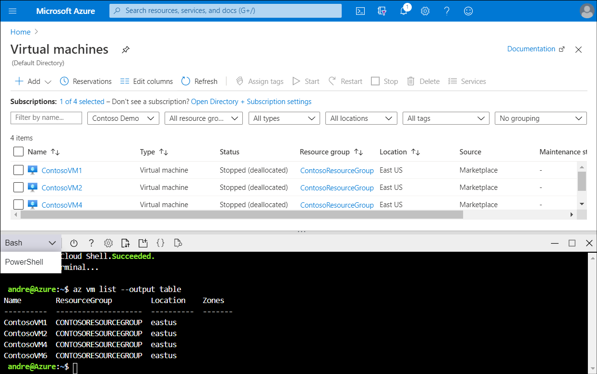
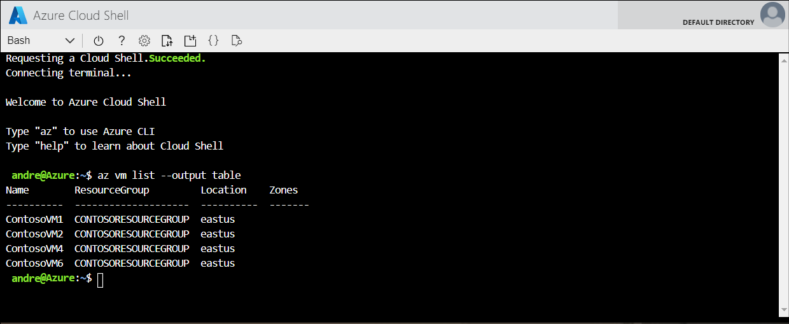

At Contoso, the server operations team is used to performing remote management of their on-premises servers. They understand that it's more efficient to remotely administer and maintain servers than it is to interactively administer them using locally installed tools. They realize that for the Windows IaaS VMs being deployed in Azure, they must rely solely on remote management to administer and maintain cloud-based resources. As lead engineer, you've set up a short presentation on the available management tools for the new hybrid environment that exists at Contoso.

## What is the Azure portal?

The *Azure portal* is a web-based, unified console that provides an alternative to command-line tools. With the Azure portal, you can manage your Azure subscription using a graphical user interface (GUI). The first thing you observe after you sign in to the portal is Azure Home. This page compiles resources that help you get the most from your Azure subscription. It also has links to free online courses, documentation, core services, and useful sites for staying current and managing updates to your organization.

The Azure portal menu and page header are global elements that are always present. These persistent features are the shell for the user interface associated with each service or feature, and the header provides access to global controls. The configuration page (sometimes referred to as a *blade*) for a resource might also have a resource menu to help you move between features.



## What is Windows Admin Center?

The Azure hybrid services tool in Windows Admin Center consolidates all the integrated Azure services into a single location where you can explore all the available Azure services in your on-premises or hybrid environment. The capabilities that the Azure hybrid services tool provides includes:

- Extend storage capacity. You can extend storage capacity by using one of the following methods:
  - Syncing your file server with the cloud.
  - Migrating storage to an Azure VM.
- Extend compute capacity. You can extend compute capacity by using one of the following methods:
  - Creating a new Azure VM.
  - Providing cloud witness for cluster.
- Simplify network connectivity between your on-premises and Azure network. You can simplify network connectivity by:
  - Connecting your on-premises servers to an Azure virtual network (VNet).
  - Making Azure VMs seem like your on-premises network.
  - Monitoring all the servers in your environment.
  - Centrally managing operating system updates.
  - Improving your security posture.
  - Ensuring compliance across your hybrid environment.
  - Performing backups using Azure Backup.

[](../media/m23-windows-admin-center.png#lightbox)

> [!IMPORTANT]
> Windows Admin Center requires connectivity to your Azure VMs. you'll need to either assign a public IP address to a VM, set up a gateway, or establish a virtual private network (VPN) connection from the Windows Admin Center computer to Azure.

## What is Azure PowerShell?

Windows PowerShell is a technology that consists of a scripting language and the corresponding engine responsible for script processing. You can extend PowerShell capabilities by importing software libraries, known as *modules*. Modules encapsulate Windows PowerShell code in the form of functions and compiled assemblies, referred to as *cmdlets*. This principle also applies when you work with Azure. You can use Windows PowerShell in combination with **Azure PowerShell** modules to connect to an Azure subscription and provision and manage Azure services.

To manage Azure resources by using Windows PowerShell, you must first install the **Azure PowerShell** modules that provide this functionality. For the most part, this will be the `Az` modules, which include cmdlets that implement features of Azure Resource Manager resource providers. For example, Compute provider cmdlets, which facilitate the deployment and management of Azure VMs, reside in the Az.Compute module.

> [!NOTE]
> Deploying and managing Azure resources and services might require using other modules.

After you install the Azure PowerShell modules, you can connect the Azure PowerShell session to the Azure subscriptions that you want to manage. To establish this connection, you first need to authenticate by using an account that exists in the Azure AD tenant that is associated with the target subscription.

> [!TIP]
> When managing Azure Resource Manager resources, you authenticate by running the `Connect-AzAccount` cmdlet.

You can use Azure PowerShell directly from Azure Cloud Shell in the Azure portal. This approach offers several benefits. It eliminates the need to install Azure PowerShell modules on your local computer, and also guarantees that you're using the latest release of Azure PowerShell.

> [!TIP]
> This method also doesn't require a separate sign-in because it uses the same credentials that you use to authenticate to your Azure subscription in the Azure portal.

## What is Azure CLI?

Azure Command-Line Interface (Azure CLI) provides a command-line, shell-based interface that you can use to interact with your Azure subscriptions. Azure CLI offers many of the same features as the Azure PowerShell modules, although the functionality might differ. Azure CLI is available on Windows, Linux, and macOS. You can install Azure CLI directly on Windows or within a Windows Subsystem for Linux.

After you install the Azure CLI, you can connect to the Azure subscriptions that you want to manage. Similar to the Azure PowerShell modules, to establish such a connection you must first authenticate by using either a Microsoft account or a work or school account that exists in the Azure AD tenant associated with the target subscription. To initiate the authentication process, run the following command from a command prompt or Windows PowerShell command prompt.

```AzureCLI
az login
```


> [!TIP]
> Azure CLI runs from the Windows command prompt or Windows PowerShell.

## What is the Run Command?

Azure Compute provides a feature named *Run Command* that enables you to run scripts inside VMs. The Run Command feature uses the VM agent to run PowerShell scripts within an Azure Windows VM. You can use these scripts for general machine or application management.

> [!TIP]
> The **Run Command** feature enables VM and application management and troubleshooting using scripts. It's available even when the machine isn't reachable. For example, if the guest firewall doesn't have the Remote Desktop Protocol (RDP) or Secure Shell (SSH) port open.



### Available PowerShell commands

You can launch a number of PowerShell commands against your Windows VMs using *Run command*.

The following table describes the list of commands available for Windows VMs.

|Name|Description|
|------------------------|------------------------------------------------------------|
|**RunPowerShellScript**|Runs a PowerShell script. You can use the RunPowerShellScript command to run any custom script that you want.|
|**DisableNLA**|Disables Network Level Authentication (NLA)|
|**DisableWindowsUpdate**|Disables Automatic Updates through Windows Update.|
|**EnableAdminAccount**|Checks if the local administrator account is disabled, and if so, enables it.|
|**EnableEMS**|Enables Emergency Management Services (EMS) to allow for serial console connection in troubleshooting scenarios.|
|**EnableRemotePS**|Configures the machine to enable remote PowerShell.|
|**EnableWindowsUpdate**|Enables Automatic Updates through Windows Update.|
|**IPConfig**|Displays detailed information for the IP address, subnet mask, and default gateway for each adapter bound to Transmission Control Protocol (TCP)/IP.|
|**RDPSettings**|Checks registry settings and domain policy settings. Suggests policy actions if the machine is part of a domain, or modifies the settings to default values.|
|**ResetRDPCert**|Removes the Transport Layer Security (TLS)/Secure Socket Layer (SSL) certificate tied to the RDP listener and restores the RDP listener security to default. Use this script if you notice any issues with the certificate.|
|**SetRDPPort**|Sets the default or user-specified port number for Remote Desktop connections. Enables firewall rules for inbound access to the port.|

## What is Azure Cloud Shell?

*Azure Cloud Shell* is an interactive, authenticated, browser-accessible shell for managing Azure resources. It provides the flexibility of choosing the shell experience that best suits the way you work, either **Bash** or **PowerShell**. You can launch Azure Cloud Shell from within the Azure portal. When you select the link on the menu bar, the shell opens in the same window. From there, you can choose the shell experience you're most comfortable with.



> [!NOTE]
> Cloud Shell requires an Azure file share to be mounted.

The following table describes the features of Azure Cloud Shell.

|Feature|Description|
|----------------------------------------------|------------------------------------------------------------ |
|Browser-based shell experience|Cloud Shell enables you to use a browser to access a command-line environment.|
|Choice of preferred shell experience|You can choose between Bash or PowerShell.|
|Authenticated and configured Azure workstation|Cloud Shell is managed by Microsoft and provides popular command-line tools and language support. Cloud Shell also securely and automatically authenticates for access to your Azure resources through Azure CLI or Azure PowerShell cmdlets.|
|Integrated Cloud Shell editor|Cloud Shell provides an integrated graphical text editor.|
|Integrated with `learn.microsoft.com`|You can use Cloud Shell directly from documentation hosted on `learn.microsoft.com`. Cloud Shell is integrated in Microsoft Learn, Azure PowerShell, and Azure CLI documentation. Select the **Try It** button in a code snippet, and the shell opens for you to run the code in the **Focus mode** window.|
|Connect your Azure Files storage|When you run Cloud Shell for the first time, Cloud Shell prompts you to create a resource group, a storage account, and an Azure Files share on your behalf. This is a one-time step and these resources will be automatically attached for all future sessions.|

> [!TIP]
> You can also launch Cloud Shell by navigating to [Azure Cloud Shell](https://aka.ms/Azure-Cloud-Shell?azure-portal=true).



### Additional reading about Azure Cloud Shell

You can learn more by reviewing the following documents:

- [Tutorial: Create and Manage Windows VMs with Azure PowerShell](https://aka.ms/tutorial-manage-vm?azure-portal=true).
- [Tools installed in Cloud Shell](https://aka.ms/tools-installed-in-cloud-shell?azure-portal=true).

### Try it with Azure Cloud Shell

If you'd like to try managing VMs using Azure CLI, you can use the exercise in the following Learn module.

- [Manage virtual machines with the Azure CLI](https://aka.ms/manage-virtual-machines-with-the-azure-cli?azure-portal=true).

These exercises run within the context of a sandbox and don't require an Azure subscription.