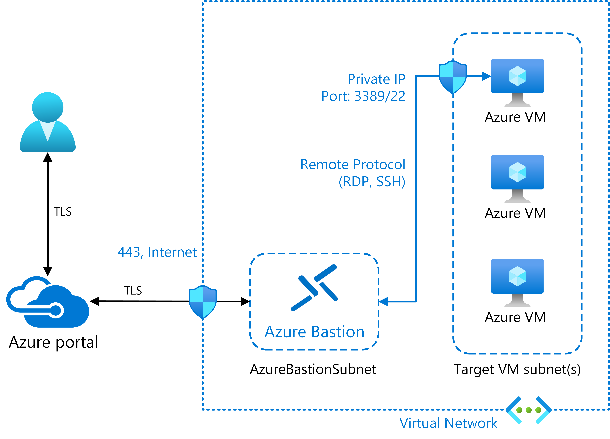
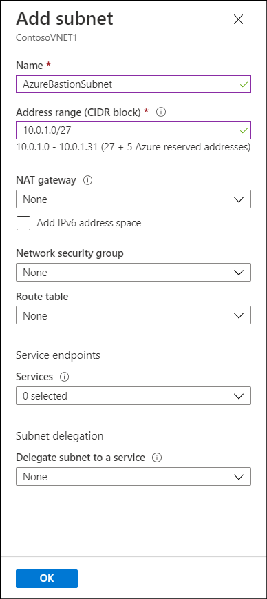
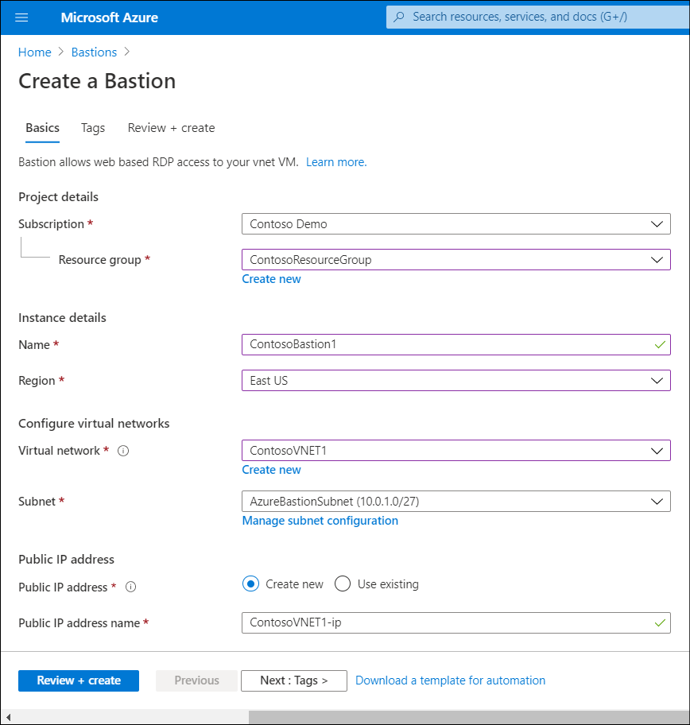
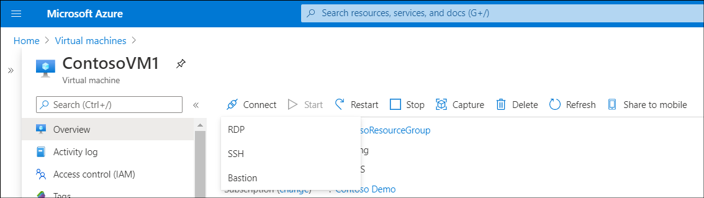
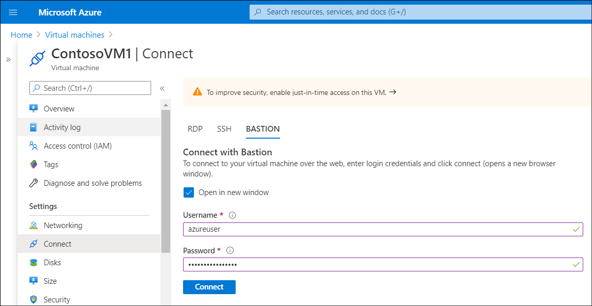

Contoso IT staff want the ability to connect to their IaaS VMs in Azure from the Azure portal directly and securely. You suggest Azure Bastion, a platform as a service (PaaS) service that provides direct RDP and SSH connectivity to VMs in the Azure portal over TLS. Contoso can provision Azure Bastion inside their VNet.

> [!TIP]
> When you connect to your VMs via Azure Bastion, the VMs don't need a public IP address.

## How it works

RDP and SSH are often the primary means used to connect to remote IaaS VMs. However, due to protocol vulnerabilities, it's highly undesirable to expose the RDP/SSH ports to the internet.

To help mitigate this threat, you can deploy bastion hosts (also known as *jump-servers*) at the public side of your perimeter network.

Using Azure Bastion helps protect Contoso's VMs by avoiding the need to expose RDP and SSH ports to the internet, while still providing the security and convenience of using both RDP and SSH. For any VNet that you provision, Azure Bastion provides secure RDP and SSH connectivity to all the VMs in that VNet.

> [!NOTE]
> You don't need to install any additional client, agent, or software on your managed VMs.

> [!NOTE]
> You deploy Azure Bastion per VNet rather than per subscription or account.

Bastion host servers:

- Are designed and configured to withstand attacks.
- Provide RDP and SSH connectivity to your Azure workloads behind the bastion.

The following diagram displays the architecture of a typical Azure Bastion deployment. In this diagram:

1. The bastion host is deployed in the VNet.

     > [!NOTE]
     > The protected VMs and the bastion host are connected to the same VNet, although in different subnets.

1. A user connects to the Azure portal using any HTML5 browser over TLS.
1. The user selects the VM to connect to.
1. The RDP/SSH session opens in the browser.

The following table describes the features that are available after you deploy Azure Bastion.

|Feature|Description|
|----------------------------------------------------------|------------------------------------------------------------|
|RDP and SSH via the Azure portal|You can get to the RDP and SSH session directly in the Azure portal.|
|Remote Session over TLS and firewall traversal for RDP/SSH|Azure Bastion uses an HTML5 web client so that you get an RDP/SSH session over TLS on port 443. This enables the traffic to traverse firewalls securely.|
|No Public IP required on the Azure VM|Azure Bastion opens the RDP/SSH connection to your Azure VM using private IP on your VM.|
|No hassle of managing network security groups (NSGs)|Because Azure Bastion connects to your VMs over private IP, you can configure your NSGs to allow RDP/SSH from Azure Bastion only. You don't need to apply any NSGs on the Azure Bastion subnet.|
|Protection against port scanning|Your VMs are protected against port scanning by rogue and malicious hackers because you don't need to expose your VMs to the internet.|
|Hardening in one place only|Azure Bastion is at the perimeter of your VNet, so you don’t need to worry about hardening the individual VMs in your VNet.|

## Deploy a bastion host

To deploy an Azure Bastion host by using the Azure portal, start by creating a subnet in the appropriate VNet. This subnet must:

- Be named AzureBastionSubnet
- Have a prefix of at least /26
- Be in the VNet you intend to protect with Azure Bastion

1. To create the required subnet, in the Azure portal, locate and open the VNet in which you intend to deploy Azure Bastion. One way to do this is to review the properties of one of the VMs that you want to protect:

    1. In the VM, in the navigation pane, select **Networking**.
    2. In the details pane, select the configured **Virtual network/subnet** link. This displays the **Virtual network** blade.

2. Next, to create the subnet:

    1. On the **Virtual network** blade, in **Settings**, select **Subnets**.
    2. In the **Subnets** pane, select **+ Subnet**.
    3. In the **Add subnet** blade, enter the name **AzureBastionSubnet**, and then configure the appropriate **Address range (CIDR block)**. This must have a prefix of at least /26.
    4. Select a **Network security group** if necessary, and then select **OK**.

    

3. Finally, create Azure Bastion using the following procedure:

    1. In the Azure portal, search for and select **Bastions**.
    2. In the **Bastions** blade, select **Create Bastion**.
    3. On the **Create a Bastion** blade, enter the following information, and then select **Review + create**.
        - Subscription
        - Resource group
        - Name
        - Region
        - Virtual network
        - Subnet
        - Public IP address

         

    4. When prompted, select **Create**.

### Connect to a Windows VM using Azure Bastion

To connect to a VM through Azure Bastion, you'll require:

- A Reader role on the VM.
- A Reader role on the network information center (NIC) with the private IP of the VM.
- A Reader role on the Azure Bastion resource.
- The VM to support an inbound connection over TCP port 3389 (RDP).

Use the following procedure:

1. Navigate to the VM to which you want to connect.
2. Select the VM, and on the **Virtual machine** blade, select **Connect**.

     

3. In the **Connect** drop-down list, select **Bastion**.
4. Enter the credentials of a user with appropriate permissions, and then select **Connect**. The RDP connection to this VM via Bastion opens directly in the Azure portal using port 443 and the Bastion service.

## Additional reading

You can learn more by reviewing the following document.

- [Create an Azure Bastion host using Azure PowerShell](https://aka.ms/create-an-azure-bastion-host-using-azure-powershell?azure-portal=true).
