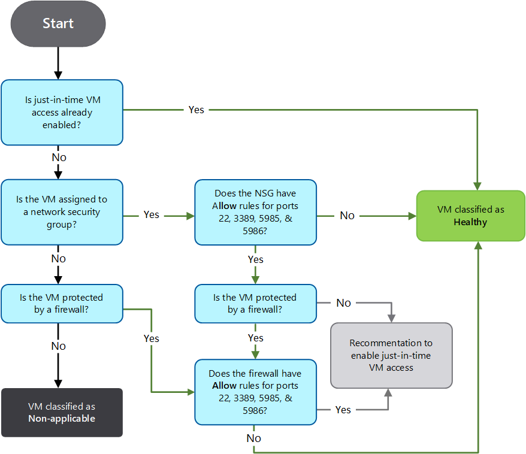
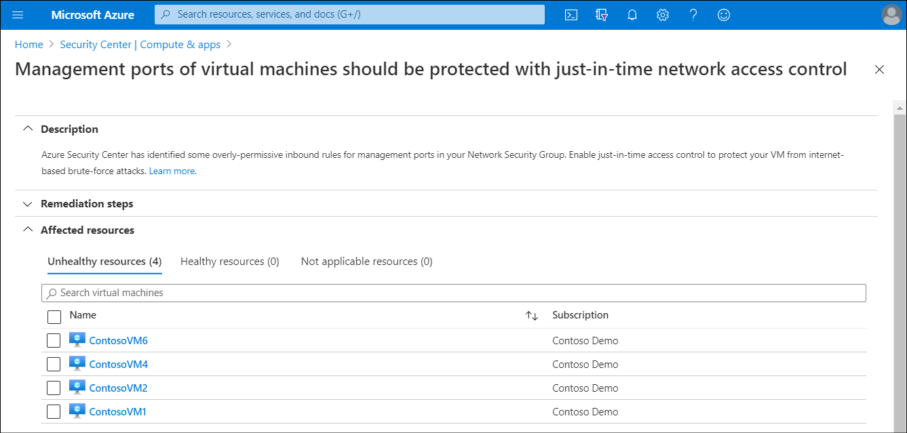
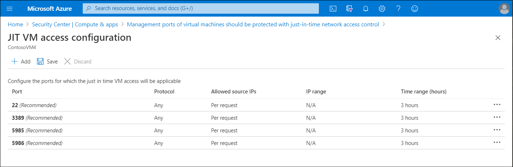
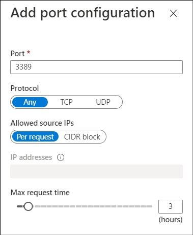
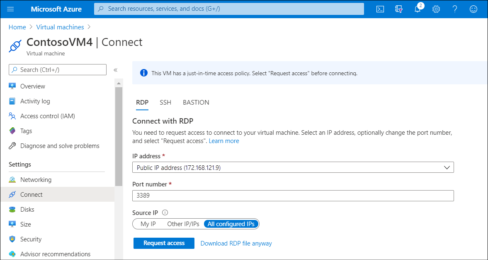
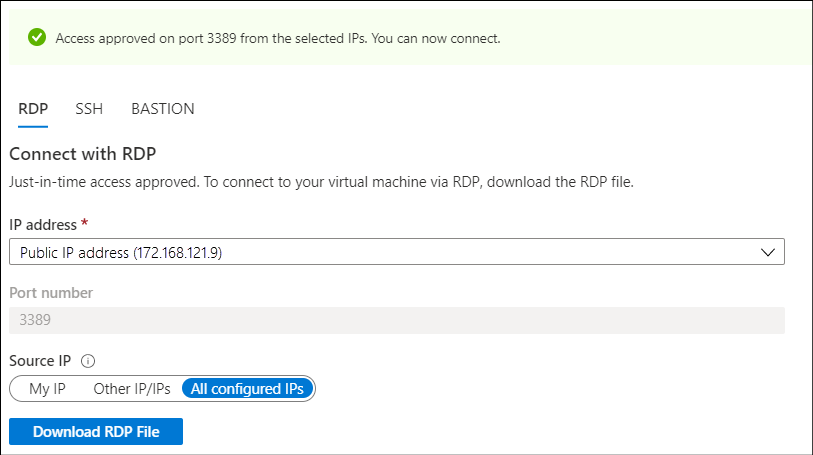

The security specialists at Contoso know that all their VMs are potentially at risk from malicious hackers that actively hunt for security weaknesses. These persons search for open ports such as RDP and SSH. Although using Azure Bastion can help mitigate these risks, the specialists would like to know more about other mitigations that Azure can offer. You decide to investigate Security Center's JIT VM access feature. By using JIT, you can lock down the inbound traffic to your VMs, helping to reduce exposure to attacks while still providing the ability to connect to VMs when needed.

## How does JIT administration work?

You enable JIT for VMs through the Security Center. You can then define the network ports that are to be secured for inbound communications on your VMs. Security Center imposes a *deny all inbound traffic* rule for your selected ports by using the NSG and Azure Firewall rules. Together, these elements help to protect your VMs by screening the management ports.

If an administrator needs to perform a management task on a protected VM, Security Center verifies that the user has the required role-based access control (RBAC) permissions for that VM, and then approves the request and reconfigures the NSGs and Azure Firewall. These changes allow inbound traffic to the selected ports from the relevant IP address, for the specified period of time.

Security Center applies flow logic to determine how to categorize your VMs.
Security Center classifies a device as **healthy** by checking:

- If JIT access already enabled on the VM
- If the VM is assigned to an NSG that doesn't have Allow rules for ports 22, 3389, 5985, and 5986
- If the VM is protected by a firewall that doesn't have Allow rules for ports 22, 3389, 5985, and 5986

If the VM isn't already JIT-enabled, and isn't assigned to an NSG, and also isn't protected by a firewall, then Security Center classifies the VM as **not applicable**. Otherwise, Security Center recommends enabling JIT for the VM.

The following diagram describes the flow process.

Using this logic, Security Center might decide that a VM can benefit from JIT. As a result of this determination, the VM is moved to the **Unhealthy resources** tab in the Security Center **Recommendations** blade for **Management ports of virtual machines should be protected with just-in-time network access control**.

> [!TIP]
> You can access this information in Security Center by selecting the **Compute & apps** link in **RESOURCE SECURITY HYGIENE** section. Then select **Management ports of virtual machines should be protected with just-in-time network access control**.

## Enable JIT on your VMs

You can enable JIT from within Security Center. Use the following procedure:

1. From the list of VMs displaying on the **Unhealthy resources** tab, select any that you want to enable for JIT, and then select **Remediate**.

     

2. On the **JIT VM access configuration** blade, for each of the ports listed:
     1. Select and configure the port using one of the following ports:
          - 22
          - 3389
          - 5985
          - 5986
     1. Configure the protocol **Port**, which is the protocol number.
     1. Configure the **Protocol**:
          - Any
          - TCP
          - UDP
     1. Configure the **Allowed source IPs** by choosing between:
          - Per request
          - Classless Interdomain Routing (CIDR) block
     1. Choose the **Max request time**. The default duration is 3 hours.

     

3. If you made changes, select **OK**.
4. When you've finished configuring all ports, select **Save**.

Alternatively, you can navigate to the VM in the Azure portal. On the selected VM's **Virtual machine** blade, select both **Security** in the navigation pane, and the link for **Management ports of virtual machines should be protected with just-in-time network access control**.

### Request access to a JIT-secured VM

If you attempt to connect to a VM that isn't protected with JIT, you'll receive a warning in the **Connect** blade.

> [!TIP]
> You can select this warning link to enable JIT.

However, if JIT is enabled for a VM and you attempt to connect to it, Azure instructs you to request access. You can do this by selecting **Request access**.

After you select **Request access**, it takes up to a minute for Security Center to enable access, assuming that you've the relevant permissions. After access is granted, a message displays instructing you that you've access over the desired port.

## Try it

If you'd like to try setting up JIT for your VMs, you can attempt the [Exercise - enable JIT VM access](https://aka.ms/3-exercise-jit-vm-access?azure-portal=true). You'll need an Azure subscription to use it. If you don't have one, you can [get a free trial Azure subscription](https://aka.ms/Azure_free_account?azure-portal=true). After completing the exercise, delete any resource groups that you've created.

> [!NOTE]
> Make sure to select a subscription that's enrolled in the standard tier of Security Center, or has an active 30-day trial for Security Center.
