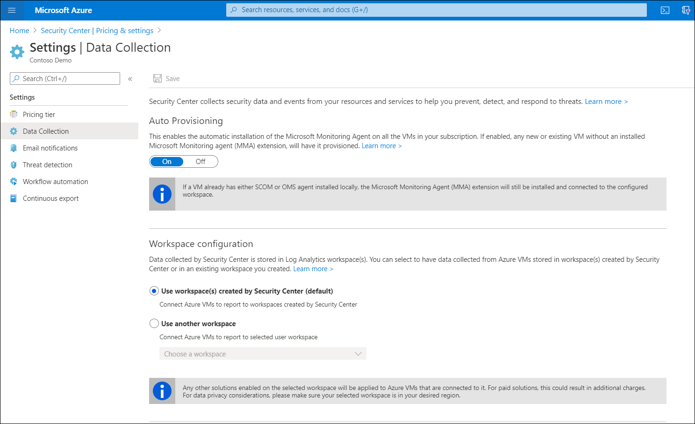
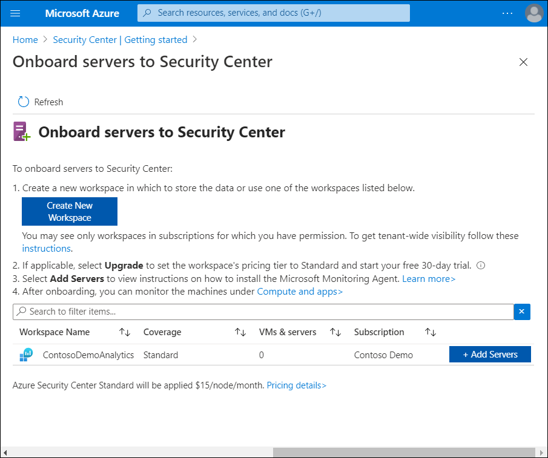
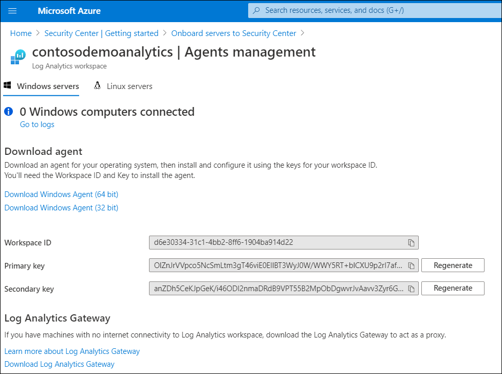
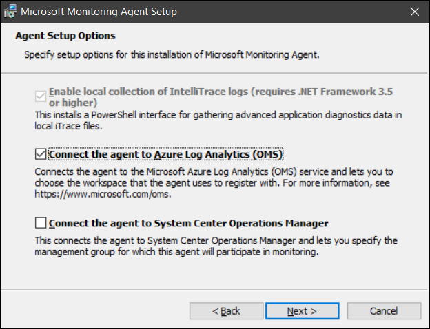
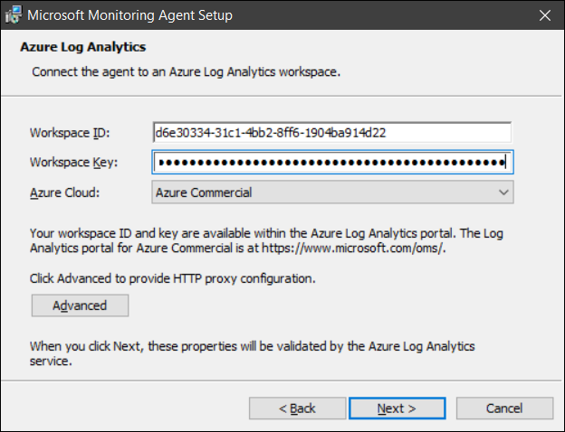

IT staff at Contoso want to use Security Center to help secure their VM workloads and their on-premises servers. To onboard their VMs and on-premises servers to Security Center, they must complete the following tasks:

- Enable the Standard pricing tier
- Enable automatic provisioning
- Onboard their VMs and servers

> [!NOTE]
> Standard pricing must be enabled for Security Center and any associated Log Analytics workspaces.

## Enable the Security Center Standard pricing tier

To use Security Center advanced capabilities or to use it with on-premises servers, you'll need to enable the Security Center Standard pricing tier in your Azure subscriptions. Subscriptions that aren't upgraded to the Standard pricing tier are listed in the Security Center dashboard. If you already have a default **Log Analytics** workspace, you'll also need to upgrade it to the Standard pricing tier.

To switch to Standard tier pricing, use the following procedure:

1. In the Azure portal, select **Security Center**.
2. In the navigation pane, select **Pricing & settings**.
3. In the details pane, select your subscription.
4. Select **Standard**, and then select **Save**.
5. If necessary, repeat these steps for any Log Analytics workspaces you want to use with Security Center.

## Enable automatic provisioning

If you enable automatic provisioning, Security Center installs the Log Analytics agent on your existing Azure VMs and on any Azure VMs that you create in the future. When you enable automatic provisioning, you choose to store data either in the default Log Analytics workspace that Security Center creates, or in an existing workspace. If no workspaces display, create a new one or upgrade an existing one.

To enable automatic provisioning, use the following procedure:

1. In the Azure portal, select **Security Center**.
2. In the navigation pane, select **Pricing & settings**.
3. In the details pane, select your subscription, and then in the navigation pane, select **Data Collection**.
4. In the details pane, under **Auto Provisioning**, select **On**. You can also select the preferred Log Analytics workspace under the **Workspace configuration** heading.
5. Select **Save**.

    

## Onboard your on-premises servers and computers

After upgrading Security Center to the Standard tier for your subscriptions, you can onboard your on-premises computers. This requires that you download the Log Analytics agent and install it on the computers. Use the following procedure to install the required agents:

1. In the Azure portal, select **Security Center**.
2. In the navigation pane, select **Getting started**.
3. In the details pane, select the **Install Agents** tab. Agents should be installed on your VMs already, and so the **Install agents** button is greyed out and unavailable.
4. Select the **Get Started** tab.
5. In the details pane, beneath the **Add non-Azure servers** heading, select **Configure**.
6. On the **Onboard servers to Security Center** blade, if necessary, select **Create New Workspace**.
7. Create a new Log Analytics workspace.
8. Select **+ Add Servers** in the selected workspace.

    

9. On the **Agents management** blade, select the appropriate link for the agent you require. Typically, you will select **Download Windows Agent (64 bit)**.
10. Copy the **Workspace ID** and **Primary key**. You'll need those to install the agent.

    

11. Copy the downloaded agent to your on-premises servers.
12. Run the **MMASetup-AMD64.exe** file to install the agent.
13. When prompted, in the **Microsoft Monitoring Agent Setup wizard** on the **Azure Setup Options** page, select the **Connect the agent to Azure Log Analytics (OMS) check box**, and then select **Next**.

    

14. On the **Azure Log Analytics** page, enter the **Workspace ID** and the  **Primary key** that you previously copied.

    

15. Go through the remaining steps to complete the installation process.

## Onboard Windows servers and computers to Defender ATP

Threat protection in Security Center is provided by its integration with Defender ATP. Combined with Security Center, they provide a complete Endpoint Detection and Response (EDR) solution. You can onboard your Windows Server 2019 or Windows 10 computers to Defender ATP by using:

- A local script
- Group Policy
- Microsoft Endpoint Configuration Manager
- Virtual desktop infrastructure onboarding scripts for non-persistent machines

## Additional reading

You can learn more by reviewing the following documents:

- [Log Analytics agent overview](https://aka.ms/log-analytics-agent?azure-portal=true).
- [Onboard devices to the Microsoft Defender ATP service](https://aka.ms/onboard-configure?azure-portal=true).
