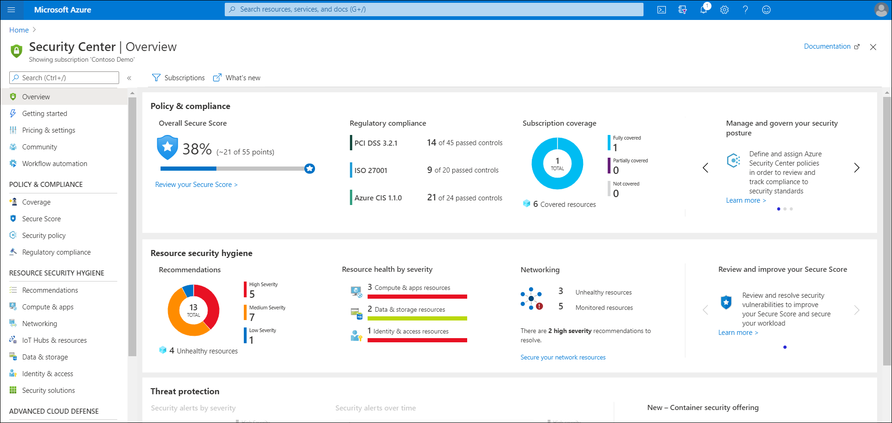
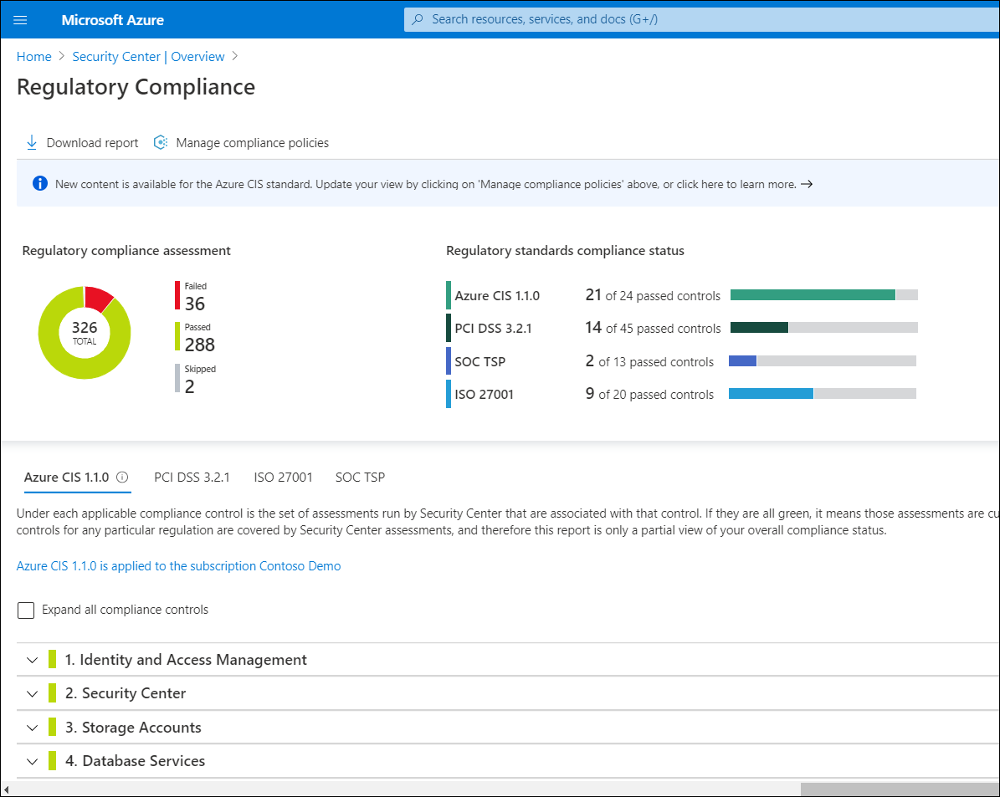
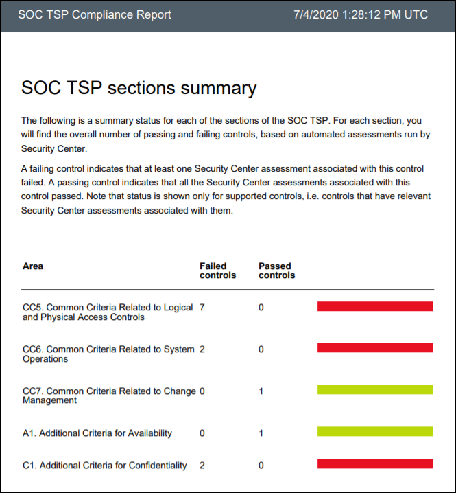
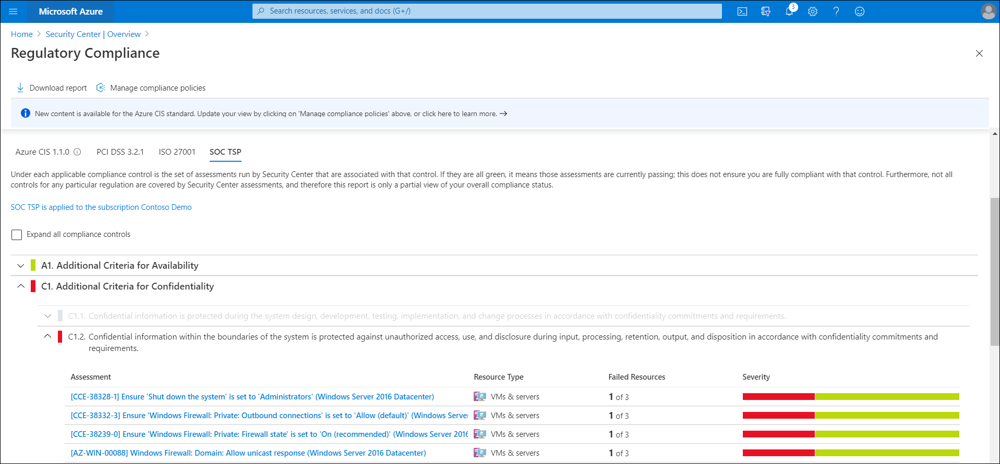
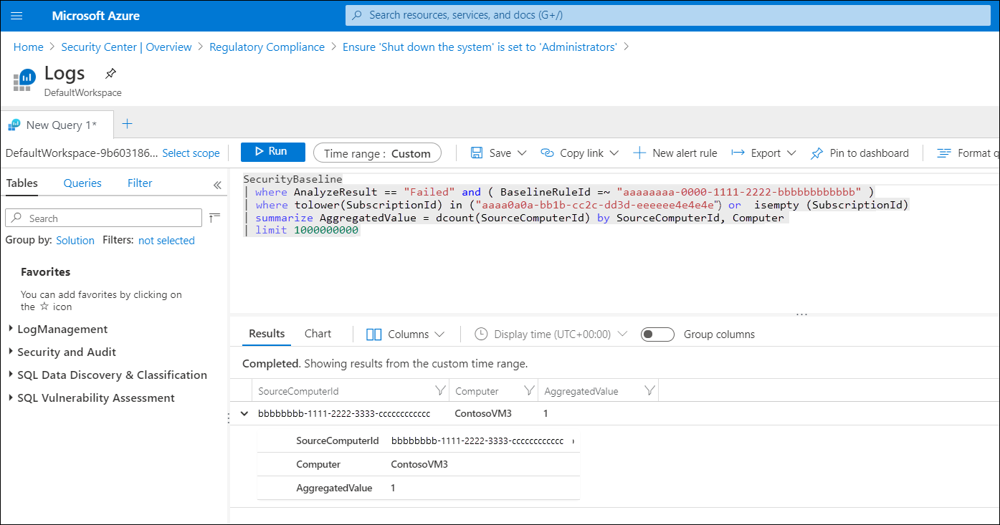
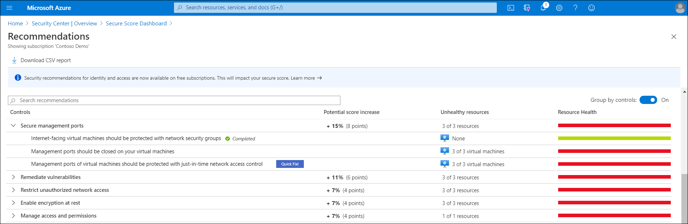
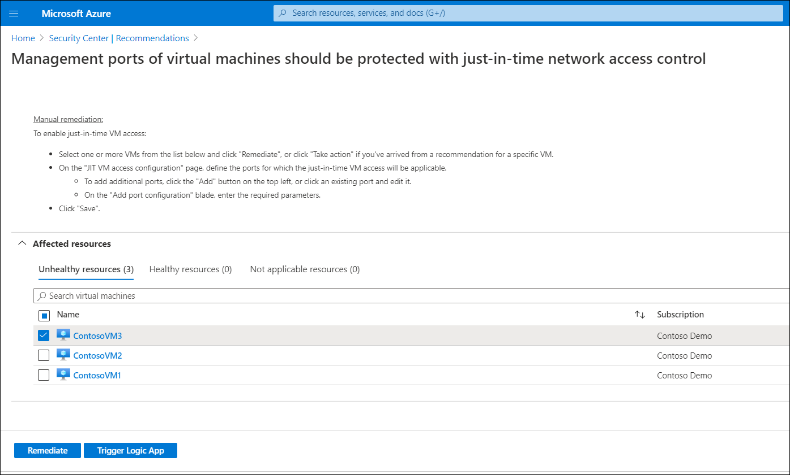
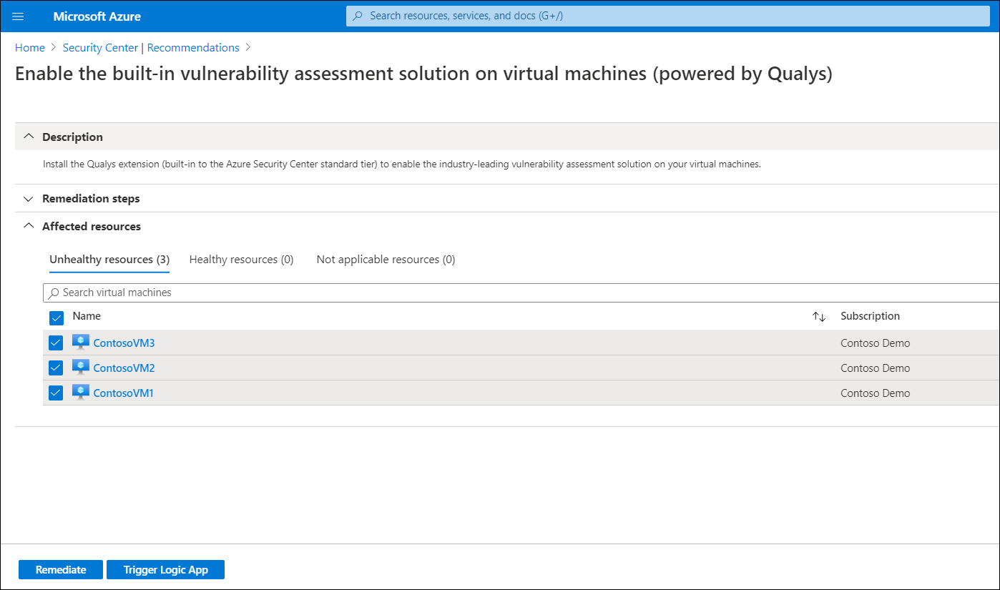
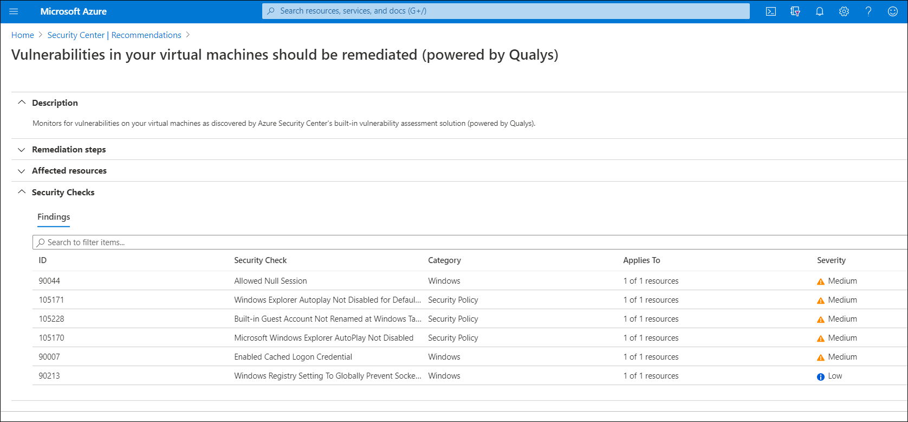

The engineering team at Contoso decides to perform a trial of Security Center. As part of the trial, they have a number of VM resources that they want to protect. From the **Overview** blade of the **Security Center**, the team members review the overall security picture. The team notices that the **Overall Security Score** is just 38 percent. They also notice that under the **Resource security hygiene** heading, there are a significant number of recommendations. They decide to attempt to tighten up security on their resources.

## Audit your VM’s regulatory compliance

The team starts with reviewing regulatory compliance. Under the **Regulatory compliance** heading, they review the following measurements: **PCI DSS 3.2.1**, **ISO 27001**, and **Azure CIS 1.1.0**. A member of the team selects the **Regulatory compliance** tile and additional information displays.

The following table describes the compliance standards against which you can measure your security.  

|Compliance standard|Description|
|-------------------|-----------|
|**PCI DSS 3.2.1**|The Payment Card Industry Data Security Standard (PCI DSS) addresses security issues for organizations that manage credit card payments, and is intended to reduce card fraud.|
|**ISO 27001**|Part of the International Standards Organization (ISO) 27000 family of standards, 27001 defines a system that can bring management to IT systems. To be certified to have met this standard's criteria, organizations must submit to an audit.|
|**Azure CIS 1.1.0**|The Center for Internet Security (CIS) is an organization involved in developing best practice for securing It system. The Azure CIS 1.1.0 standard is devised to help ensure that organizations can secure their resources in the Azure cloud.|
|**SOC TSP**|The Service Organization Controls (SOC) framework is a standard for controls that focuses on safeguarding the confidentiality and privacy of information stored and processed in the cloud.|

To review your compliance posture relative to these standards, use the following procedure:

1. In the Azure portal, in **Security Center**, on the **Regulatory compliance** blade, select **Download now >**.
2. On the **Download report** blade, in the **Report standard** list, select the compliance standard. For example, select **SOC TSP** and then select **Download**.
3. Open the downloaded PDF and review its contents.

    

To review compliance remediation details, on the **Regulatory Compliance** blade, use the following procedure:

1. Select the appropriate tab for the relevant standard. For example, select **SOC TSP**.

     

2. To review additional details about a recommendation, select it from the **Assessment** list, and then select **View affected machines**.

     

## Remediate security recommendations

It's important to do more than just review how your organization compares with security and compliance standards. You should also seek to tighten your security to try and meet those standards. To access and apply security recommendations, in the Azure portal, in **Security Center**, select the **Overall Secure Score** tile. Use the following procedure to apply recommendations for your subscription:

1. On the **Secure Score Dashboard**, select the appropriate subscription, and then select **View recommendations**.
2. On the **Recommendations** blade, you can download a CSV report. You can also expand the details for listed recommendations.

    

3. Select a specific recommendation, and then on the recommendation blade (the name of which varies based on the recommendation title), you can expand **Remediation steps** and review the manual steps required to address the security issue. You can then switch to those resources and apply the remediation steps.

    > [!TIP]
    > In some circumstances, you can apply a quick fix by selecting **Remediate** on the specific recommendation. This applies the remediation automatically when you select.

4. You can also apply a logic app to fix the listed resources. To do this, select the affected resources, and then select **Trigger Logic App**.

    

5. On the **Logic App Trigger** blade, after the logic apps load, select the appropriate logic app, and then select **Trigger**.

## Run a vulnerability assessment against your Windows Server IaaS VM

You can use Security Center to perform a vulnerability assessment on your VMs. First, however, you must install a vulnerability assessment solution on the required resources.

### Install the vulnerability assessment solution

Azure provides a built-in vulnerability assessment solution. To enable this on your VMs, use the following procedure:

1. Open  **Security Center**, and then select **Recommendations**.
2. On the **Recommendations** blade, if necessary, select an appropriate subscription.
3. In the **Controls** list, expand **Remediate vulnerabilities**, and then select the **Enable the built-in vulnerability assessment solution on virtual machines (powered by Qualys)** recommendation.

    

4. Select all VMs that you want to apply the assessment to, and then select **Remediate**.

    

5. On the **Remediate resources** blade, select **Remediate *n* resources**. The process might take a few minutes or longer depending on the number of resources being remediated.

> [!TIP]
> In addition to the built-in vulnerability scanner, you can also install third-party scanners.

### Perform the vulnerability assessment

After you install the vulnerability assessment, you can perform the assessment. To begin the assessment:

1. On the **Enable the built-in vulnerability assessment solution on virtual machines (powered by Qualys)** blade, refresh the display and wait until all resources display on the **Healthy resources** tab. (This can take a few minutes or longer.)
2. After the resources display on the **Healthy resources** tab, verify that scanning begins automatically.

> [!NOTE]
> Scans run at four-hour intervals. You cannot change this setting.

After Security Center identifies vulnerabilities, they are presented as recommendations. To review the findings and remediate the identified vulnerability, use the following procedure:

1. Open **Azure Security Center** and go to the **Recommendations** page.
2. Select **Remediate vulnerabilities**, and then select **Vulnerabilities in your virtual machines should be remediated (powered by Qualys)**.

Security Center displays all the findings for all VMs in the currently selected subscriptions. These findings are listed in order of severity. To learn more about a specific vulnerability, select it.

> [!TIP]
> To filter the findings by a specific VM, open the **Affected resources** section, and then select the VM. Alternatively, you can select a VM from resource health, and review all the relevant recommendations for that resource.

## Additional reading

You can learn more by reviewing the following documents:

- [Tutorial: Improve your regulatory compliance](https://aka.ms/improve-regulatory-compliance?azure-portal=true).
- [Vulnerability assessments for your Azure Virtual Machines](https://aka.ms/vulnerability-assessment-recommendations?azure-portal=true).
