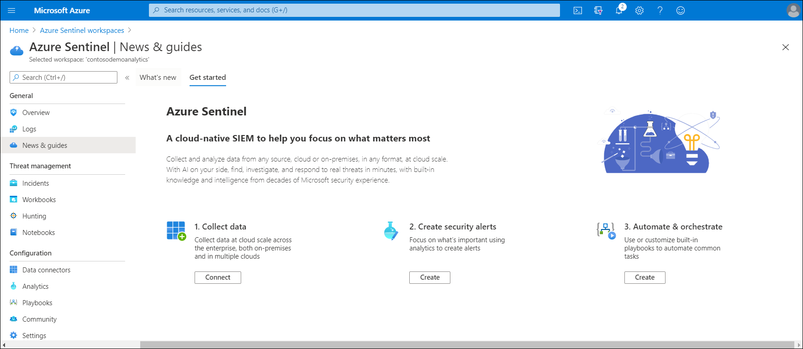
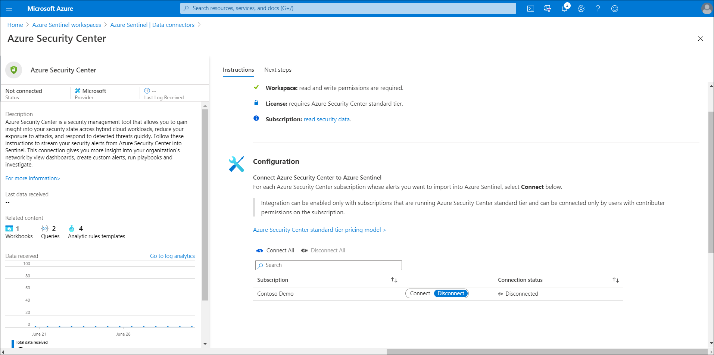

In addition to assessing and addressing problems with their hybrid environment's security configuration, Contoso must also monitor for new problems and threats, and respond appropriately. Azure Sentinel is both a SIEM and SOAR solution that's designed for hybrid environments.

> [!NOTE]
> SIEM solutions provide storage and analysis of logs, events, and alerts that other systems generate, and you can configure these solutions to raise their own alerts. SOAR solutions support the remediation of vulnerabilities and the overall automation of security processes.

## What is Sentinel?

Sentinel meets the needs of both SIEM and SOAR solutions through:

- Collecting data across cloud-based and on-premises users, devices, apps, and infrastructure.
- Using AI to identify suspicious activity.
- Detecting threats with fewer false positives.
- Responding to incidents quickly and automatically.

### Prerequisites for Sentinel

To enable Sentinel, you'll need:

- A **Log Analytics** workspace.

    > [!TIP]
    > Sentinel can't use the same **Log Analytics** workspace as Security Center.

- Contributor permissions or greater in the subscription and workgroup for your Sentinel workspace.
- Appropriate permissions on any resources that you connect to Sentinel.

### Data connections

Sentinel can connect natively to Security Center, providing coverage for your cloud and on-premises servers. In addition, Sentinel data connection support includes:

- Native service-to-service connections. Sentinel integrates natively to these Azure and non-Azure services:
  - Azure activity logs
  - Azure AD audit logs
  - Azure AD Identity Protection
  - Azure Advanced Threat Protection (Azure ATP)
  - AWS CloudTrail
  - Microsoft Cloud App Security
  - DNS servers
  - Microsoft 365
  - Defender ATP
  - Microsoft web application firewall
  - Windows Defender Firewall
  - Windows security events
- External solution connections through APIs. Sentinel can connect to data sources through APIs for the following solutions:
  - Barracuda
  - Barracuda CloudGen Firewall
  - Citrix Analytics for Security
  - F5 BIG-IP
  - Forcepoint DLP
  - squadra technologies secRMM
  - Symantec ICDx
  - Zimperium
- External solution connections through an agent. Sentinel can connect via an agent to data sources that support the Syslog protocol. The Sentinel agent can install directly on devices or on a Linux server that can receive events from other devices. Support for connecting through an agent includes the following devices and solutions:
  - Firewalls, internet proxies, and endpoints
  - Data loss prevention (DLP) solutions
  - DNS machines
  - Linux servers
  - Other cloud providers

### Permissions

Access in Sentinel is managed through role-based access control (RBAC) roles. These roles give you the ability to manage what users can observe and do within Sentinel:

- Global roles. The built-in Azure global roles&mdash;Owner, Contributor, and Reader&mdash;grant access to all Azure resources, including Sentinel and Log Analytics.
- Sentinel-specific roles. The built-in roles that are specific to Sentinel are:
  - Azure Sentinel Reader. This role can get data, incidents, dashboards, and information about Sentinel resources.
  - Azure Sentinel Responder. This role has all the capabilities of the Azure Sentinel Reader role and can also manage incidents.
  - Azure Sentinel Contributor. In addition to the capabilities of the Azure Sentinel Responder role, this role can create and edit dashboards, analytics rules, and other Sentinel resources.
- Other roles. Log Analytics Contributor and Log Analytics Reader are built-in roles that are specific to Log Analytics. These roles grant permissions only to the **Log Analytics** workspace. If you don't have the global Contributor or Owner roles, you'll need the Logic App Contributor role to create and run playbooks in response to alerts.

### Implement Azure Sentinel

To implement Sentinel:

1. In the Azure portal, search for and select **Azure Sentinel**.
2. On the Azure Sentinel workspaces blade, select **Connect workspace**, and then choose the appropriate workspace.
3. Select **Add Azure Sentinel**. The workspace is modified to include Sentinel.
4. On the **Azure Sentinel** blade, in **News & guides**, select the **Get started** tab.

    

5. Select **Connect** to begin collecting data.
6. Select the appropriate connector. For example, select **Azure Security Center**.
7. Select **Open connector page**.
8. Review the prerequisite information, and when ready, select **Connect**.

    

## What is SIEM?

SIEM solutions store and analyze log data that comes from external sources. You connect data sources from Azure and external sources in your organization, including on-premises resources. Azure Sentinel then provides a default dashboard that helps you analyze and visualize those events. The dashboard displays data about the number of events you have received, the number of alerts generated from that data, and the status of any incidents created from those alerts.

Sentinel uses built-in and custom detections to alert you to potential security threats&mdash;for example, attempts to access Contoso's organization from outside their infrastructure or when data from Contoso appears to be sent to a known malicious IP address. It also enables you to create incidents based on these alerts.

Sentinel provides you with built-in and custom workbooks to help you analyze incoming data. *Workbooks* are interactive reports that include log queries, text, metrics, and other data. Microsoft incident creation rules enable you to create incidents from alerts that other services such as Azure Security Center generate.

To implement SIEM functionality in Sentinel:

- Enable Azure Sentinel.
- Create a data connection.
- Create a custom rule that generates an alert.

## What is SOAR?

SOAR solutions enable you to manage or orchestrate analysis of data that you have collected about security threats, coordinate your response to those threats, and create automated responses. Azure Sentinel's SOAR capabilities are tied closely to its SIEM functionality.

Use the following best practices to implement SOAR in Sentinel:

- When you create analytics rules that raise alerts, also configure them to create incidents.
- Use the incidents to manage the investigation and response process.
- Group related alerts into an incident.

### Investigate incidents

In Sentinel, you can review how many incidents are open, how many are being worked on, and how many are closed. You can even reopen closed incidents. You can get the details of an incident, such as when it occurred and its status. You can also add notes to an incident and change its status so that progress is easier to understand. Incidents can be assigned to specific users.

### Respond to alerts with security playbooks

Sentinel enables you use security playbooks to respond to alerts. *Security playbooks* are collections of procedures based on Azure Logic Apps that run in response to an alert. You can run these security playbooks manually in response to your investigation of an incident, or you can configure an alert to run a playbook automatically.

## Additional reading

You can learn more by reviewing the following documents:

- [Permissions in Azure Sentinel](https://aka.ms/sentinel-roles?azure-portal=true).
- [Overview – What is Azure Logic Apps?](https://aka.ms/logic-apps-overview?azure-portal=true).
- [Quickstart: On-board Azure Sentinel](https://aka.ms/quickstart-onboard?azure-portal=true).
- [Tutorial: Create custom analytic rules to detect suspicious threats](https://aka.ms/tutorial-detect-threats-custom?azure-portal=true).
