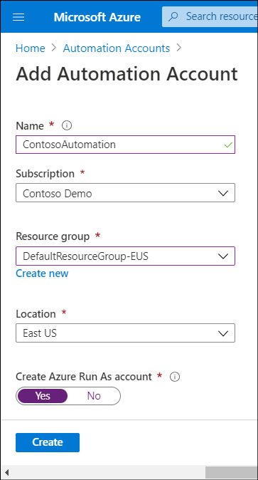
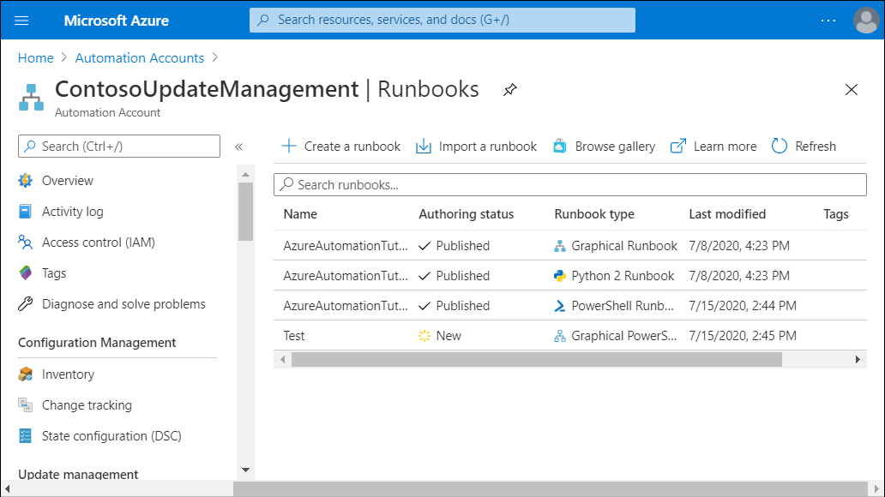
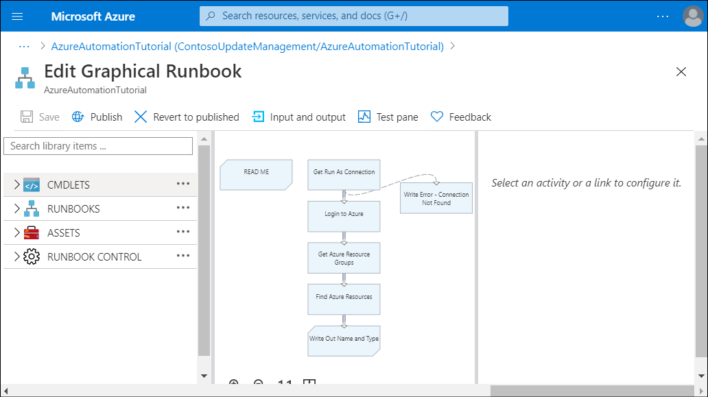

*Azure Automation* is an Azure service that provides the ability to automate frequent, time-consuming, and error-prone administrative tasks. Contoso IT administrators can run Azure Automation runbooks on any server that runs Windows Server with connectivity to Azure. This includes the servers that reside in their on-premises datacenters or are hosted by third-party cloud providers.

> [!NOTE]
> A *runbook* is a collection of procedures and operations that a system administrator might carry out.

Azure Automation integrates with Log Analytics, enabling Contoso administrators to manage operating system updates, simplify their server inventory, and track changes to server configuration.

## What is Azure Automation?

The primary purpose of Azure Automation is automating repetitive and long-running tasks, both in Azure and for on-premises servers. Azure Automation relies on scripts and workflows to implement runbooks that execute these tasks. This gives you the flexibility to automate practically any noninteractive procedure and script it with Azure PowerShell or Python 2. You can also use DSC, which helps maintain a consistent configuration for managed resources by relying on PowerShell configuration scripts.

Azure Automation also offers a large number of ready-to-use runbooks in addition to several solutions, including:

- Update Management
- Inventory
- Change Tracking

> [!TIP]
> A large collection of sample scripts and workflows are available from the Runbooks gallery, which is accessible directly from the Azure portal.

## Azure Automation architecture

The core component of Azure Automation is an account. An Automation Account serves as a container for a variety of related automation components.

You can create multiple Automation accounts per Azure subscription. This helps with scenarios where you might want to separate the management of your development and production environments, with each of them containing different settings. You can define these settings by using assets described in the following table.

|Asset|Description|
|------------|------------------------------------------------------------|
|**Modules**|These are PowerShell modules that you import into an Automation account. Modules determine the groups of cmdlets and activities that are available when you create PowerShell scripts and workflows.|
|**Python 2 Packages**|These are Python 2 packages that are the equivalent of PowerShell modules and serve the functionality by providing a set of features you can leverage when creating Python 2-based scripts.|
|**Schedules**|By using schedules, you can execute runbooks automatically rather than on demand, either once at a designated date and time, or in a recurring manner.|
|**Certificates**|This category consists of certificates uploaded to an Azure Automation account. One common reason for using certificates is to facilitate certificate-based authentication.|
|**Connections**|Connections contain the information required for a runbook to authenticate to an Azure subscription, or to an external service or application.|
|**Variables**|This category contains values that you want to reference in your scripts. By using variables, you avoid the need to modify your runbooks directly (potentially multiple times) if the referenced value changes.|
|**Credentials**|Credentials consist of a combination of the user name and password.|

## Overview of Azure Automation runbooks

Assets are the building blocks of Automation runbooks. A *runbook* represents a collection of tasks that perform a custom process. You implement runbooks by using PowerShell scripts, Python 2 scripts, or Windows PowerShell workflows. Runbooks execute scripts and workflows either on demand or according to an arbitrary schedule. Each unit of runbook execution is referred to as a *job*.

### PowerShell workflows

PowerShell workflows resemble PowerShell scripts. However, the way they operate is considerably different because they rely on Windows Workflow Foundation rather than on Microsoft .NET Framework. As a result, there are unique rules that dictate how you author Windows PowerShell Workflow activities. While this increases complexity, workflows provide several benefits.

One of the unique characteristics of workflows is the ability to recover automatically from failures, for example, from a managed nodes reboot. This automatic recovery relies on *checkpoints*, which are designated points in the workflow where the workflow engine should save the current status of the execution. In addition, workflows can execute groups of commands in parallel, instead of sequentially as with typical PowerShell scripts. This is useful for runbooks that perform several independent tasks that take a significant amount of time to complete.

### Types of runbooks

In general, there are two types of Azure Automation runbooks, based on how you create and edit their content:

- Graphical. You can create and edit graphical runbooks only by using the graphical editor interface available in the Azure portal. Graphical runbooks simplify implementing PowerShell runbooks and workflows. For workflows, they offer built-in visual elements representing checkpoints and parallel processing.
- Textual. You can create and edit textual runbooks either by using the textual editor available in the Azure portal, or by using an external tool and then importing the runbooks into Azure.

> [!CAUTION]
> Your choice of runbook type is important because you can't perform conversions between the graphical and textual types.

Although you can't perform conversions between the two types of runbooks, you can, however, convert between graphical PowerShell runbooks and graphical PowerShell workflows when importing them into an Automation account. However, PowerShell workflow-based runbooks take longer to start because they must be compiled first.

> [!TIP]
> In addition to authoring, you also have the option to export and import runbooks. This provides a convenient method of copying the runbooks across Automation accounts. You can use this approach with both graphical and textual runbooks.

## Managing Azure Automation runbooks

Any runbook residing in an Automation account has a specific authoring status depending on its stage of development:

- Newly created. A newly created runbook that you have not yet published is assigned the New authoring status automatically. In this stage, you can modify and test it, but you can't schedule its execution. You also don't have the option to revert any changes that you save.
- Published. After you successfully complete testing on a runbook, you can publish it, which automatically assigns the runbook the Published authoring status. This is the typical status of a production-ready runbook. At this point, you can schedule its execution. You can also start a published runbook by submitting an HTTP POST request to a URL, which is referred to as a *webhook*. You create a webhook by using either the Azure portal or Azure PowerShell.
- In edit. If you decide to make changes to a published runbook and open it in the textual or graphical editor, it will be assigned the In edit status. This status allows you to modify and test it, and any changes that you save won't affect the published version. In addition, you have the option to revert the edited version back to the published one.

### Testing a runbook

To test a runbook, in the Azure portal, use the following procedure:

1. Select the appropriate Automation Account, and then select **Runbooks**.
2. Select any runbook that you want to test.

     

3. In the **Runbook** blade, select **Edit**.

     

4. In the selected runbook, select **Test pane**.

     

Testing allows you to validate the runbook operation before making the runbook available for use. This makes it possible to test the runbook without overwriting an existing published version of the runbook. Depending on the runbook type, you can initiate testing from the graphical or textual editor, and then monitor its results in the **Output** pane.

> [!CAUTION]
> During a test, the edited runbook will actually run its activities.

After you validate a runbook, you can publish it directly from the graphical or textual editor in the Azure portal. At that point, you can link it to one or more schedules with different recurrence settings (one time, monthly, weekly, hourly, and daily) and expiration dates. You do have the option to enable or disable individual schedules without affecting other schedules linked to the same runbook. You can also modify any of the runbook's input parameters and run settings.

You also have the option to execute a published runbook on demand. Invoking execution creates an automation job. A runbook job represents a single execution of a runbook. You can run multiple instances of the same runbook simultaneously or according to overlapping schedules.
