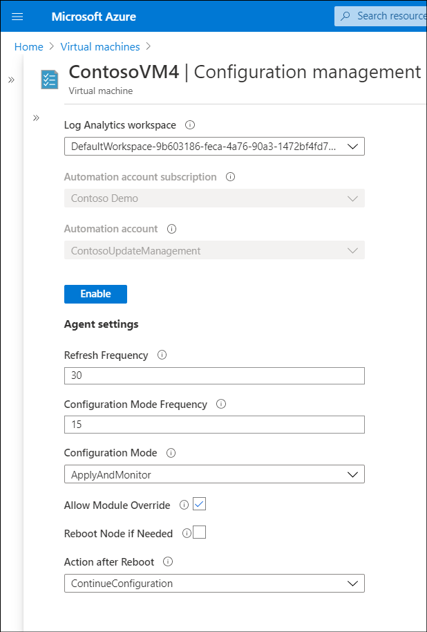
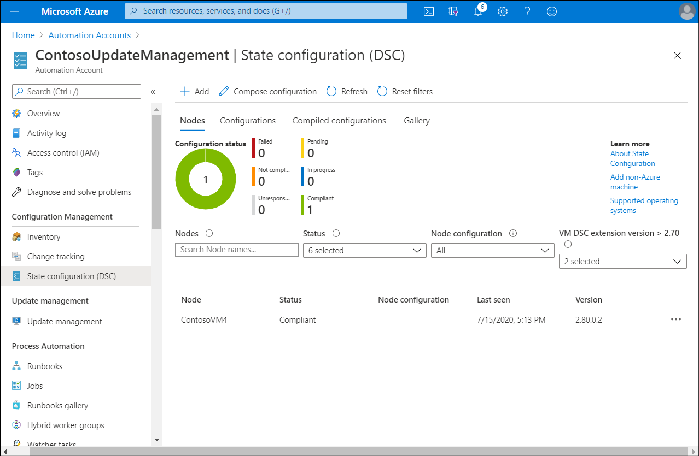
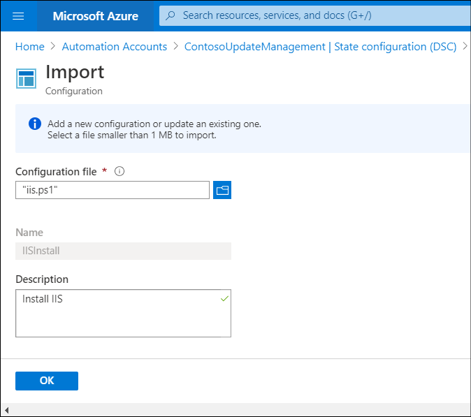
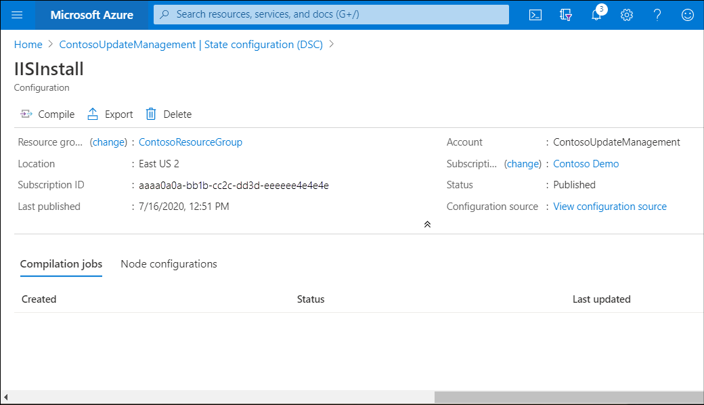
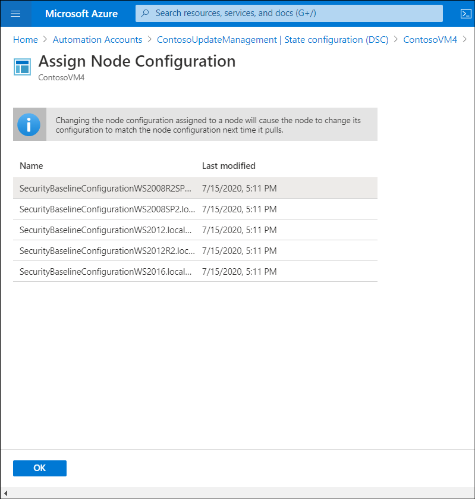
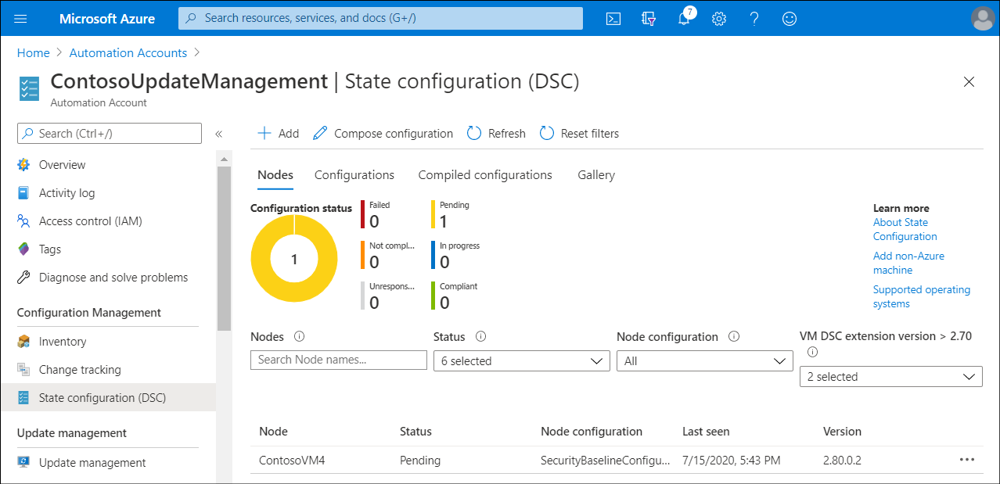

Azure Automation State Configuration will enable Contoso to ensure that their VMs remain in a consistent state. That state might include specific applications and configuration. Contoso could use PowerShell DSC to implement declarative configuration management through a combination of PowerShell scripts and operating system features.

> [!NOTE]
> A declarative programming language separates intent (*what you want to do*) from execution (*how do you want to do it*).

## Overview of Azure Automation with DSC

Windows-based DSC relies on the Local Configuration Manager (LCM) component. This component serves as the execution engine of the Windows PowerShell DSC scripts.

### What is LCM?

LCM is responsible for coordinating the implementation of settings defined in DSC scripts and monitoring their ongoing status. Like DSC, LCM is an integral part of all currently supported versions of Windows operating systems. The LCM is responsible for updating the state of a managed machine (node), such as a VM to match a desired state. Every time the LCM runs, it completes the following steps:

1. **Get**: Gets the current state of the node.
2. **Test**: Compares the current state of a node against the desired state by using a compiled DSC script (.mof file).
3. **Set**: Updates the node to match the desired state described in the .mof file.

You configure the LCM when you register onboard a VM with Azure Automation.

### Deployment options for DSC

You can deploy DSC configuration in either push mode or pull mode, as described in the following table.

|Mode|Description|
|----|------------------------------------------------------------|
|Push|In this mode, you manually send, or *push*, the desired configurations toward one or more managed computers. The LCM component makes sure that the state on each managed computer matches what your configuration specifies.|
|Pull|In this mode, a *pull server* holds your configuration information. The LCM component on each managed computer polls the pull server periodically (the default is 15 minutes intervals), to get the latest configuration details. The pull server then sends the details about any configuration changes back to each managed computer.|

> [!TIP]
> Azure Automation includes a managed, Azure-resident DSC pull server that allows you to store DSC configurations, and to onboard managed computers to which these configurations should apply.

> [!NOTE]
> Managed computers can include on-premises computers and VMs hosted by other cloud providers.

### Requirements for DSC with Windows computers

There are a number of requirements that your environment must meet in order to use DSC with Windows. These are:

- Operating system. The managed computers must be running Windows 8.1 or later, or Windows Server 2012 R2 or later.
- Windows Remote Management. Windows Remote Management (WinRM) must be enabled on managed computers.
- Network. If managed computers are in a private network, DSC needs the following port and URLs to communicate with Azure Automation:

  - Port: Only TCP 443 is required for outbound internet access.
  - Global URL: `*.azure-automation.net`
  - Agent service: `https://.agentsvc.azure-automation.net`

### Register a VM with Azure Automation

To control a VM with DSC, you must first onboard the VM, or *node*, with Azure Automation. To do this, use the following procedure:

1. Open the Azure portal, and then select **Virtual machines**.
2. Select the appropriate VM, which must be running.
3. In the **Operations** section of the navigation pane, select **Configuration management**.
4. On the **Configuration management** blade, choose the appropriate **Log Analytics workspace** (and its location), **Automation account subscription**, and **Automation account**.

    > [!TIP]
    > You can create a new **Log Analytics workspace**.

    

    > [!NOTE]
    > If you have only a single Automation Account, then the **Automation account subscription** and **Automation account** are implied when you choose the associated Log Analytics workspace.

5. Configure the following values, and then select **Enable**:
    - **Refresh Frequency**. Represents the frequency (in minutes) at which the PS DSC LCM contacts the Azure Automation DSC pull server to download the latest node configuration.
    - **Configuration Mode Frequency**. Represents the frequency (in minutes) at which the background application of DSC attempts to implement the current node configuration on the target node.
    - **Configuration Mode**. The PS DSC configuration mode. The modes available are:
      - **ApplyOnly**. LCM executes the script only once.
      - **ApplyAndMonitor**. LCM executes the script only once, but then monitors the resulting configuration and records any configuration drift in logs.
      - **ApplyAndAutoCorrect**. LCM executes the script in regular intervals, automatically correcting any configuration drift.
    - **Allow Module Override**. Controls whether new configurations downloaded from the Azure Automation DSC pull server are allowed to overwrite the old modules already on the target node.
    - **Reboot Node if Needed**. Select to reboot the node if needed to fully apply the configuration.
    - **Action after Reboot**. The action to perform after a reboot, which are:
      - ContinueConfiguration
      - StopConfiguration

> [!NOTE]
> It takes around 15 minutes to onboard a VM.

## How to use DSC

After you have onboarded the appropriate VMs to DSC, you can start using DSC to manage your VMs' desired state.

[](../media/m2-view-state-configuration.png#lightbox)

With DSC, you can define the desired state of:

- An operating system
- An application

> [!TIP]
> You can also use DSC with Azure Resource Manager templates to deploy VMs with a standard configuration. Learn more at [Desired State Configuration extension with Azure Resource Manager templates](https://aka.ms/dsc-extension-with-arm-templates).

You can use a script to define your DSC, or you can create a DSC by using the Azure portal. After you have created and compiled your configuration, you can assign it to nodes, which will receive that configuration.

### Upload a script to implement DSC

The DSC implementation often starts with creating a configuration script (.ps1) that describes that desired state. The following example is a simple example of a configuration. In this case, the script checks for the presence of Internet Information Service (IIS) and installs it if necessary.

```PowerShell
configuration IISInstall
{
    node "localhost"
    {
        WindowsFeature IIS
        {
            Ensure = "Present"
            Name = "Web-Server"
        }
    }
}
```

> [!NOTE]
> Alternatively, you can create a configuration by combining pre-defined configuration blocks called *composites*, which are included in each Azure Automation account.

You can add the configuration to the Automation account by using either the Azure portal or Azure PowerShell. To add a script by using the portal, use the following procedure:

1. In the Azure portal, browse to your Automation account.
2. Select **State configuration (DSC)**, and then, on the **Configurations** tab, select **+ Add**.
3. In the **Configuration file** field, browse and select your script.
4. Enter a description, and then select **OK**.

> [!TIP]
> Your configuration scripts can reference Automation assets.



The scope of functionality that you can manage with Azure Automation DSC depends on the DSC resources available in the Automation account. A built-in set of resources matches those in the standard PowerShell DSC, but you can also import additional resources by uploading PowerShell integration modules that contain their definitions. The upload functionality is available in the Azure portal. You can also use Azure PowerShell to upload the modules.

### Compile the configuration

After you create a configuration script, you must compile it, which you perform in the Azure portal. Compilation generates one or more .mof files that contain configurations applicable to target nodes. These files are automatically uploaded to a DSC pull server. To compile your configuration, use the following procedure:

1. In the Azure portal, browse to your Automation account.
2. Select **State configuration (DSC)**, and then, on the **Configurations** tab, select the configuration you uploaded.
3. On the **Configuration** blade, select **Compile**.
4. When prompted, select **Yes**.



### Compose a configuration in the Azure portal

You don't have to use scripts. Instead, you can use the Azure portal to create a configuration. To create a configuration by using the Azure portal, use the following procedure:

1. On the home page, select **Automation Accounts**.
2. Select the appropriate Automation Account.
3. In the **Configuration Management** section of the navigation pane, select **State configuration (DSC)**.
4. On the **State configuration (DSC)** blade, select **Compose configuration**.
5. On the **Basics** tab of  the **Compose configuration** blade, enter a name for your configuration. For example, enter **Install_Components**.
6. In the **Composite resources** list, select one or more predefined configurations. For example, select **WindowsFeatureSet**, and then select **Next**.
7. On the **Source code** tab, modify the PowerShell script as required to perform the desired configuration, and then select **Next**. (For example, you could modify the PowerShell code to install the necessary Windows features.)
8. On the **Parameters** tab, enter any required parameters, and then select **Save and compile**.

### Assign a configuration

To assign a compiled configuration, regardless of how you created it, use the following procedure:

1. In the portal, on the **State configuration (DSC)** blade, select the node you want to configure.
2. On the **VM_name** blade, select **Assign node configuration**.
3. In the list of configurations, select the appropriate configuration, and then select **OK**.

    

4. Close the **VM_name** blade, and from the **State configuration (DSC)** blade, monitor the assignment.

    [](../media/m2-view-state-configuration-2.png#lightbox)
