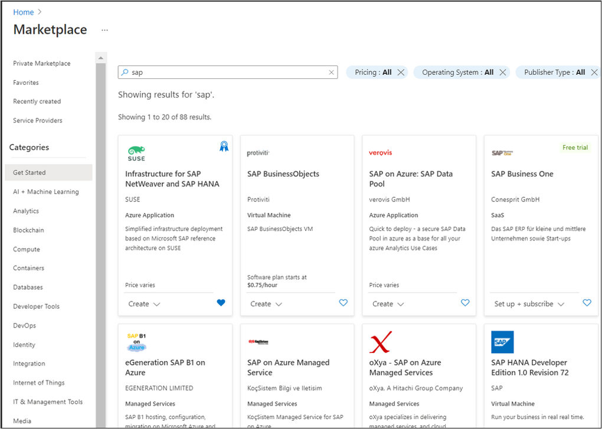
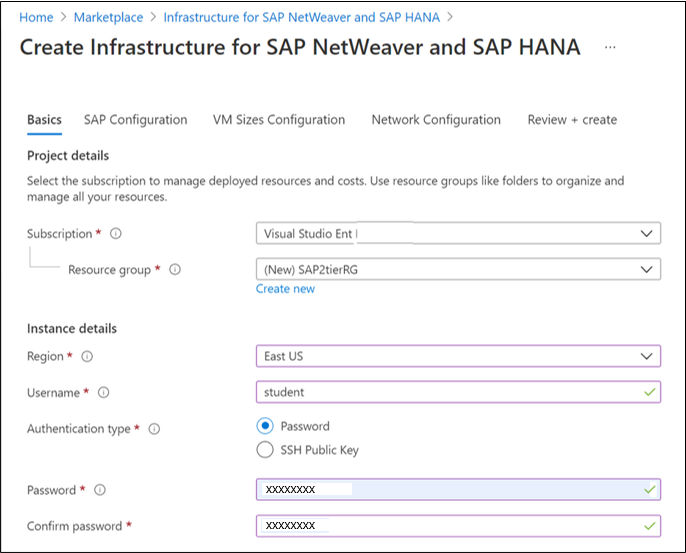
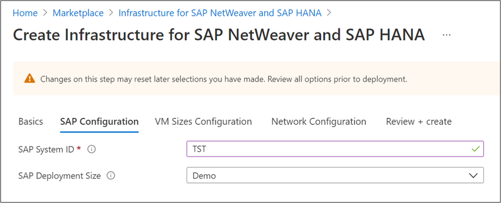
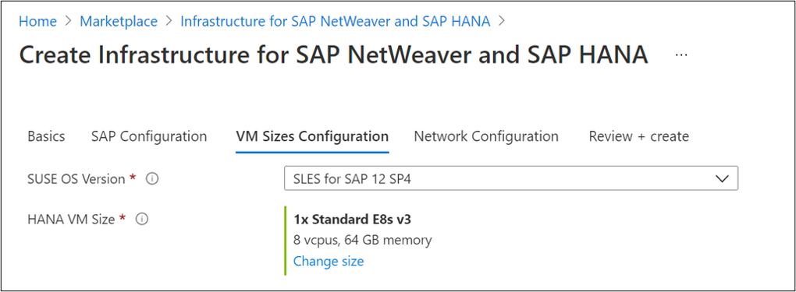
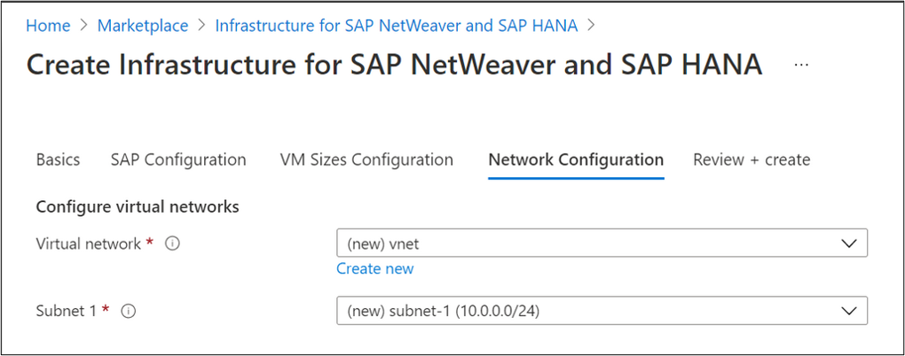
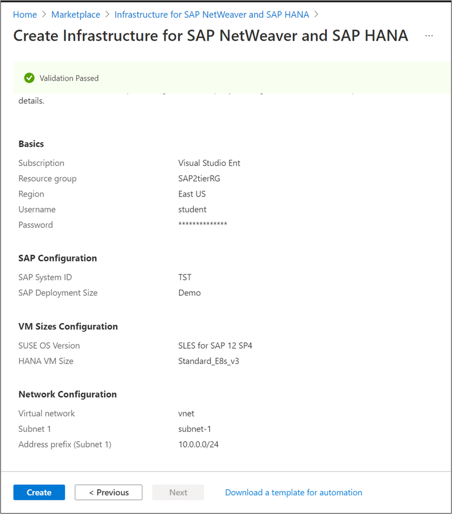
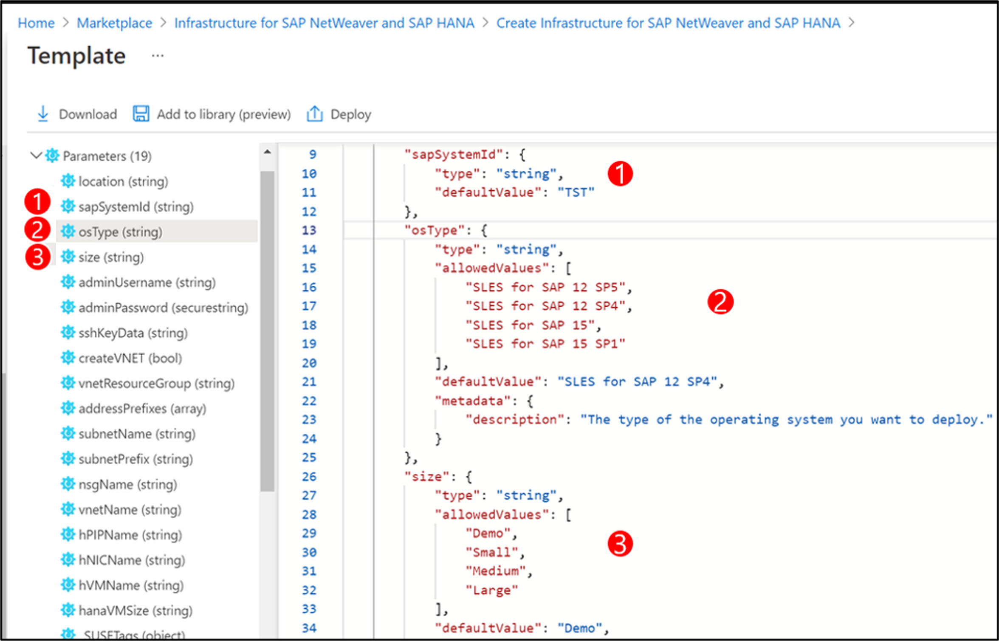
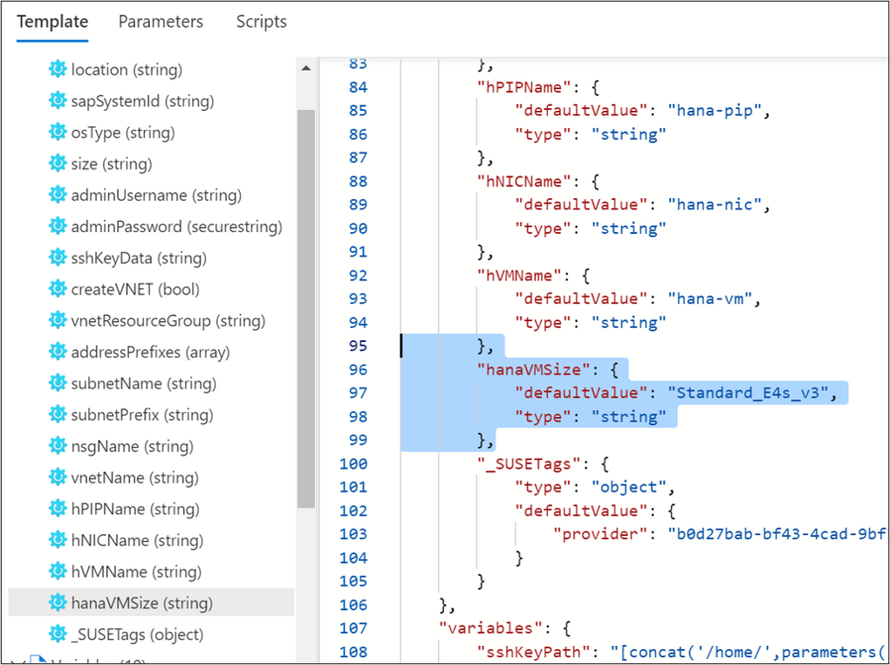
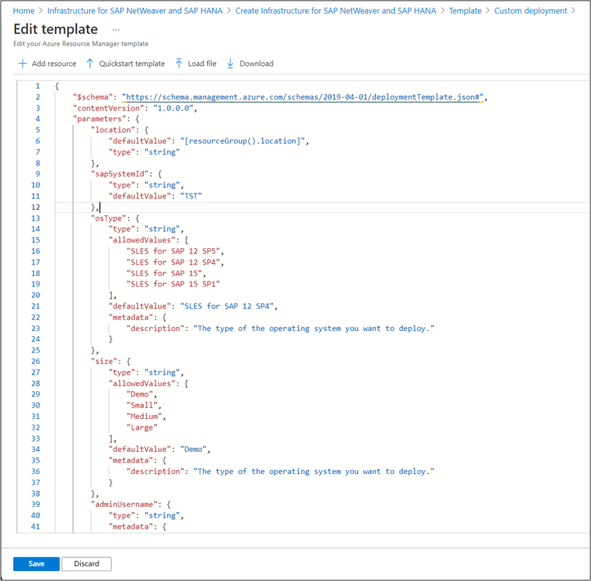
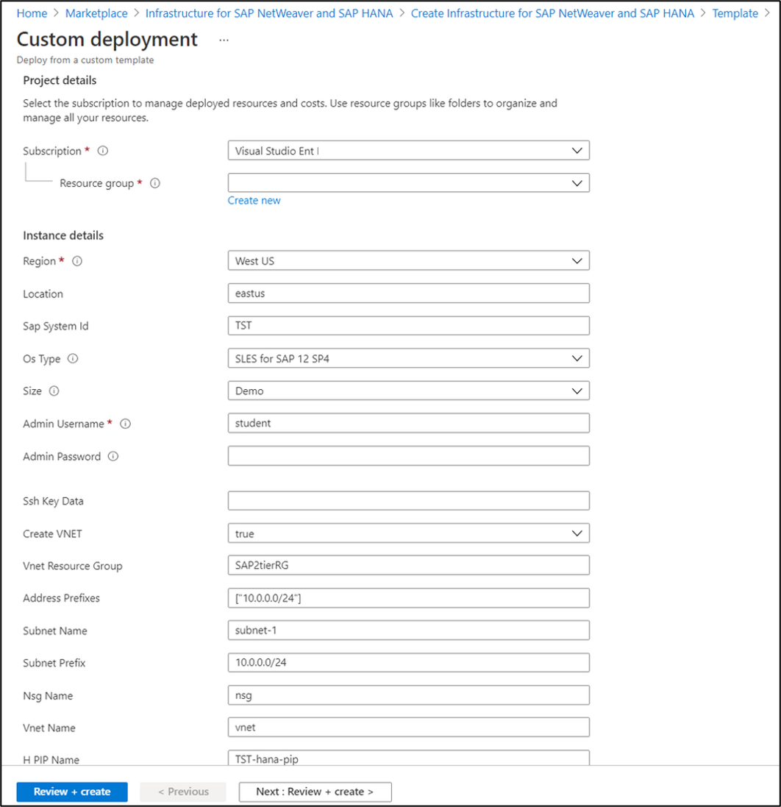

ARM Templates for deployments of infrastructure for SAP on Azure can be complex, so you will want to use existing resources. The [Azure Quickstart Templates](https://azure.microsoft.com/resources/templates/) and the [Azure Marketplace](https://portal.azure.com/#blade/Microsoft_Azure_Marketplace/MarketplaceOffersBlade/selectedMenuItemId/home) in the Azure portal are good resources to search for examples.
 
## Using a Marketplace Template: Infrastructure for SAP NetWeaver and SAP HANA example

If you start a deployment of a Marketplace item, you can use and modify the existing templates that underlie them. In this example, you will provide additional information and edit the template through the portal, and you can download the resulting template and parameter files for future use.

### Azure Marketplace

1. Sign into the [Azure portal](https://portal.azure.com) and navigate to the Marketplace.

2. Search for **SAP** and browse the results.

3. From the list of results, select **Infrastructure for SAP NetWeaver and SAP HANA**.



### Basics tab

1. Choose your subscription from the **Subscription** drop-down menu.

2. Next to **Resource group**, select **Create new**, and name your new resource group **SAP2tierRG**.

3. Enter the following information in the **Instance details** section:

    - Region: **East US**
    - Username: **student**
    - Authentication type: **Password**
    - Enter and confirm a password.

4. Go to the next tab: **SAP Configuration**.
 


### SAP Configuration tab

1. Enter the SAP System ID: **TST**

2. For the SAP Deployment Size drop-down list, select **Demo**.

3. Go to the next tab: **VM Sizes Configuration**.



### VM Sizes Configuration tab

1. Keep the default settings:

    - SUSE OS Version: **SLES for SAP 12 SP4**
    - HANA VM Size: **1x Standard E8s v3**

2. Go to the next tab: **Network Configuration**.



### Network Configuration tab

1. Keep the default settings:

    - Virtual network: **(new) vnet**
    - Subnet 1: **(new) subnet-1 (10.0.0.0/24)**

2. Go to the next tab: **Review + create**.



### Validation

1. Review the validation results and fix any errors.

2. Select **Download a template for automation**.



## Review the updated template 

 Review the references for the 5 resource structures:

- [Microsoft.Storage storageAccounts template reference](/azure/templates/Microsoft.Storage/2018-07-01/storageAccounts)
- [Microsoft.Network publicIPAddresses template reference](/azure/templates/Microsoft.Network/2018-08-01/publicIPAddresses)
- [Microsoft.Network virtualNetworks template reference](/azure/templates/Microsoft.Network/2018-08-01/virtualNetworks)
- [Microsoft.Network networkInterfaces template reference](/azure/templates/Microsoft.Network/2018-08-01/networkInterfaces)
- [Microsoft.Compute virtualMachines template reference](/azure/templates/Microsoft.Network/2018-08-01/virtualNetworks)

Examine the Resource Manager template to get a better understanding of its structure and the resources defined by the template. Below is a section from the top of the template.



| # | Information |
|---|---|
| 1 | `sapSystemID` |
| 2 | Allowed `osType` |
| 3 | Allowed `size` |

1. Read through the template to identify any items that an administrator might want to changed. For example, the default value for `hanaVMSize`. 

2. Select **Deploy**. This updates the original Marketplace template, with the information you provided in the Azure portal.

3. Alternatively, if you want to store the updated template stored locally, select **Download**.



## Edit template 

1. Select **Edit template** to open the ARM template in edit mode.

    > [!NOTE]
    > You can also select **Edit parameters**.
    
    

2. On the **Edit template** page, make any changes that you want to the ARM template and parameters JSON. For example, remove **Large** from the `allowedValues` under `size`.

3. Select **Save**.

4. If you want to save a local copy of the template after you make a change, select **Download** to download the file.

5. Alternatively, select **Deploy** and deploy your custom template based on the Azure Marketplace **Infrastructure for SAP NetWeaver and SAP HANA** item.
 


## Generating Azure Resource Manager Templates from deployments

To access ARM Templates for your previous deployments, navigate to **Settings** > **Deployments**, select your resource group, and select a deployment from the list. You will see an overview of the deployment resources and can select **Template** to download the Template and Parameters or deploy the template in the portal.
 


## Deploying Azure Resource Manager using the CLI

You can deploy a template that you have downloaded using the CLI with your Azure credentials locally or using Bash ClouldShell CLI. For more information about the parameter file, see [Create Resource Manager parameter file](/azure/azure-resource-manager/templates/parameter-files).

To pass a local parameter file, use @ to specify a local file named *parameters.json*.

```azurecli
az deployment group create 
  --name ExampleDeployment \
  --resource-group <Resource Group Name> \
  --template-file template.json \
  --parameters '@ parameters.json' 
```

## Clean up resources

If you created any resources with deployments, clean up the resources you deployed by deleting the resource group:

1. From the Azure portal, select **Resource group** from the left menu.

2. Enter the resource group name in the **Filter by name** field.

3. Select the resource group name.

4. Select **Delete resource group** from the top menu.