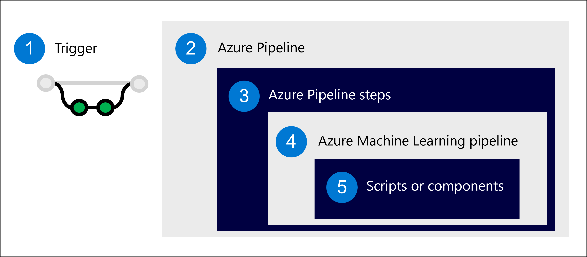
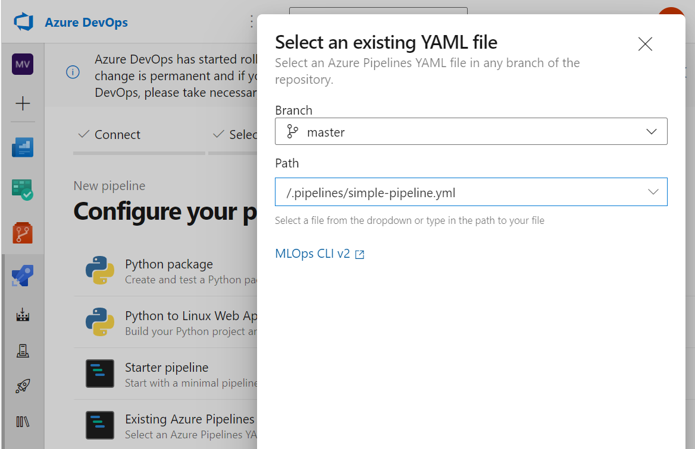
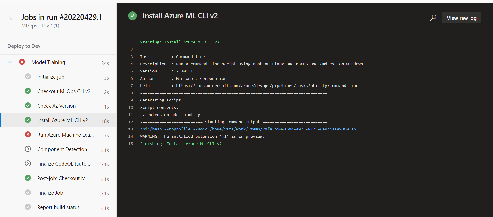

One option to automate workflows is to use **Azure Pipelines**, which is part of the  Azure DevOps Services. With Azure Pipelines, you can automatically build, test, and deploy your code.

Within a machine learning project, you can use Azure Pipelines to create any Azure Machine learning workspace assets like the workspace itself, data assets, compute clusters, or jobs to run Azure Machine Learning pipelines.

> [!Note]
> To use Azure Pipelines with Azure Machine Learning pipelines, you need to [connect Azure DevOps to your Azure Machine Learning workspace through a **service connection**](/learn/modules/introduction-development-operations-principles-for-machine-learn/4-integrate-azure-development-operations-tools).

You'll learn how to use Azure Pipelines to run an Azure Machine Learning pipeline.

## Create an Azure Pipeline

Azure Pipelines helps you to automate your work by executing steps whenever a trigger occurs. To use Azure Pipelines to automate machine learning workloads, you'll trigger an Azure Machine Learning pipeline with Azure Pipelines. 



1. **Trigger** an Azure Pipeline. Commonly with a change to the repo (commit or pull request).
2. Run the **Azure Pipeline**, a group of jobs which consist of steps.
3. A **step** initiates an Azure Machine Learning pipeline.
4. An **Azure Machine Learning pipeline** runs scripts or Azure Machine Learning components.
5. A **script** or **component** represents a machine learning task.

To create the Azure Pipeline, you define the steps you want to include in a YAML file. In the YAML file of the Azure Pipeline, you'll include:

- **Trigger**: What event initiates the pipeline.
- **Stage**: A group of jobs commonly aligned with different development environments (dev/test/prod).
- **Job**: A set of steps, which run on an **agent**. For machine learning workloads, you'll likely use a **Microsoft-hosted Ubuntu agent**.
- **Step**: A script or task you want to execute. For example, a CLI command, which initiates an Azure Machine Learning pipeline (`az ml job create`).

> [!Tip]
> Learn more about [key concepts used in Azure Pipelines](/azure/devops/pipelines/get-started/key-pipelines-concepts).

To run an Azure Machine Learning pipeline when any change to the Azure Repo is made, you may use a YAML file like this:

```yml
trigger: 
- main

stages:
- stage: deployDev
  displayName: 'Deploy to development environment'
  jobs:
    - deployment: publishPipeline
      displayName: 'Model Training'
      pool:
        vmImage: 'Ubuntu-18.04'
      environment: dev
      strategy:
       runOnce:
         deploy:
          steps:
          - template: aml-steps.yml
            parameters:
              serviceconnectionname: 'spn-aml-workspace-dev'
```

The job in the pipeline uses the `aml-steps.yml` to list the steps that should be executed. To run an Azure Machine Learning pipeline that is defined in `pipeline-job.yml` you can use the CLI (v2). To run the Azure Machine Learning pipeline as a step in the Azure Pipeline, you'll:

1. Install the Azure Machine Learning extension for the CLI.
2. Use the `az ml job create` command to run the pipeline job in Azure Machine Learning.

The `aml-steps.yml` file for the installation and Azure Machine Learning job initiation may look like this:

```yaml
parameters:
- name: serviceconnectionname
  default: ''

steps:
- checkout: self

- script: az extension add -n ml -y
  displayName: 'Install Azure ML CLI v2'

- task: AzureCLI@2
  inputs:
    azureSubscription: ${{ parameters.serviceconnectionname }}
    scriptType: bash
    scriptLocation: inlineScript
    workingDirectory: $(Build.SourcesDirectory)
    inlineScript: |
      cd src
      az ml job create --file aml_service/pipeline-job.yml --resource-group dev-ml-rg --workspace-name dev-ml-ws
  displayName: 'Run Azure Machine Learning Pipeline'
```

As shown in the example, you can use parameters throughout the pipeline definitions (like `serviceconnectionname`) to make the YAML files more reusable for other projects.

## Run a pipeline with Azure DevOps

After you've created the YAML files and stored it in your Azure Repo, you can configure Azure DevOps to run the pipeline.



1. Within Azure DevOps, navigate to the **Pipelines** tab and select **Pipelines**.
2. Create a **New pipeline**.
3. Select **Azure Repos Git** as the location of your code.
4. Choose the repo that contains your code.
5. Choose **Existing Azure Pipelines** YAML file.
6. Choose the path that points to the YAML file you created for the Azure Pipeline.
7. After you review the pipeline, you can **Save and run**. 

The pipeline is triggered by a commit to the **main** branch. When you configure the pipeline, Azure Pipelines will commit a change to the **main** branch, which will trigger the pipeline to run for the first time. Anytime after set-up, you can trigger the pipeline by pushing commits to the repo from Visual Studio Code or Azure Repos.



When you select on a job, you can view its process. Each step in a job is reflected in the navigation pane on the left. The overview will show which steps ran successfully and which failed. Any potential error messages will show in the command line interface when you select that step. By reviewing the output, you'll be able to troubleshoot the error.

When a task triggers an Azure Machine Learning pipeline to run, you'll also be able to review the pipeline run in the Azure Machine Learning workspace to view any metrics or errors that may be of interest to you.
