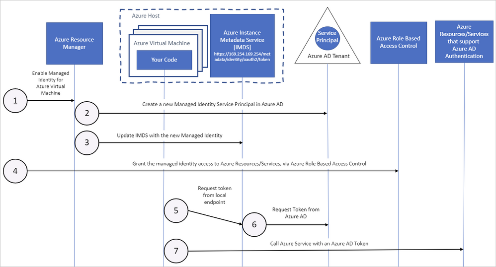

*Azure Role-Based Access Control (Azure RBAC)* is an authorization system that allows fine-grained access management of Azure Machine Learning resources. It enables you to manage team members' access to Azure cloud resources by assigning roles. These roles determine what assets team members can use in the workspace, and what they can do with those resources. This can be important if your team works with sensitive data such as hospital records that contain private medical information, or if you wish to restrict access to critical assets for junior team members within Azure Machine Learning. Using these roles, you can realistically reflect your organization's structure, ensuring responsibilities and critical assets are portioned to the correct individuals.

## User roles

Azure RBAC roles can be assigned to individuals and groups. The rights assigned to each group are allocated as a permission-based system, with set access and restrictions being clearly defined. This control is applied at the workspace level and can only be changed by administrators or owners of the specific workspace within Azure Machine Learning. An Azure Machine Learning workspace, like other Azure resources, comes with three default roles when it is created. You can add users to the workspace and assign one of these roles:

- **Owners** have full access to the workspace, including the ability to view, create, edit, or delete assets in a workspace. Owners can also change role assignments.
- **Contributors** can view, create, edit, or delete assets in a workspace. For example, contributors can create an experiment, create or attach a compute cluster, submit a run, and deploy a web service.
- **Readers** can only perform read-only actions in the workspace. Readers can list and view assets, including datastore credentials in a workspace. Readers can't create or update these assets.

### Custom roles

If the default roles do not meet your organization's need for more selective access control, you can create your own Custom roles. Custom roles give you the flexibility to develop permission-based rules for individuals' or groups that provide access while defining your own security stipulations to secure data or resources. You can make a role available at a specific workspace level, a specific resource group level, or a subscription level by defining the scope of your custom role, which we can see in the example JSON below.

Custom roles can be created by defining possible actions permitted and NotActions to restrict specific activities or access. You can create custom roles using Azure portal, Azure PowerShell, Azure CLI, or the REST API. Below we can see a custom role JSON request for a Data Scientist:

```
{
    "Name": "Data Scientist Custom",
    "IsCustom": true,
    "Description": "Can run experiment but can't create or delete compute or deploy production endpoints.",
    "Actions": [
        "Microsoft.MachineLearningServices/workspaces/*/read",
        "Microsoft.MachineLearningServices/workspaces/*/action",
        "Microsoft.MachineLearningServices/workspaces/*/delete",
        "Microsoft.MachineLearningServices/workspaces/*/write"
    ],
    "NotActions": [
        "Microsoft.MachineLearningServices/workspaces/delete",
        "Microsoft.MachineLearningServices/workspaces/write",
        "Microsoft.MachineLearningServices/workspaces/computes/*/write",
        "Microsoft.MachineLearningServices/workspaces/computes/*/delete", 
        "Microsoft.Authorization/*",
        "Microsoft.MachineLearningServices/workspaces/computes/listKeys/action",
        "Microsoft.MachineLearningServices/workspaces/listKeys/action",
        "Microsoft.MachineLearningServices/workspaces/services/aks/write",
        "Microsoft.MachineLearningServices/workspaces/services/aks/delete",
        "Microsoft.MachineLearningServices/workspaces/endpoints/pipelines/write"
    ],
    "AssignableScopes": [
        "/subscriptions/<subscription_id>/resourceGroups/<resource_group_name>/providers/Microsoft.MachineLearningServices/workspaces/<workspace_name>"
    ]
}

```

Note the *Actions* and *NotActions* above which define the permissions for the custom role and the assigned scope that is at the specific workspace level. In this example, the data scientist’s actions are defined through a wildcard (represented by the * sign) which extends a permission to everything that matches the action string you provide. So, in the above example the wildcard string adds all permissions related to any read, write, action, or deletion within the workspace.

However, if we look at the NotActions above, we can see restrictions on the deletion or creation of workspaces or new compute resources, amongst others. These restrictions take precedence over explicitly allowed actions.

## System

A common challenge for developers is the management of secrets and credentials used to secure communication between different components. Azure Machine Learning relies on **Azure Active Directory (Azure AD)** for authentication and/or communication between other Azure cloud resources. Azure AD is a cloud-based identity and access management service that helps your employees' sign-in and access cloud resources on Azure.

### Authentication with Azure AD

In general, there are three authentication workflows that you can use when connecting to the workspace:

**Interactive**: You use your account in Azure Active Directory to either manually authenticate or obtain an authentication token. Interactive authentication is used during **experimentation and iterative development.** It enables you to control access to resources (such as a web service) on a per-user basis.

**Service principal:** You create a service principal account in Azure Active Directory, and use it to authenticate or obtain an authentication token. A service principal is used when you need an automated process to authenticate to the service. For example, a continuous integration and deployment script that trains and tests a model every time the training code changes needs ongoing access and so would benefit from a service principal account.

**Azure CLI session:** You use an active Azure CLI session to authenticate. Azure CLI authentication is used during **experimentation and iterative development**, or when you need an **automated process to authenticate** to the service using a pre-authenticated session. You can log in to Azure via the Azure CLI on your local workstation, without storing credentials in code or prompting the user to authenticate.

**Managed identity:** When using the Azure Machine Learning SDK on an Azure Virtual Machine, you can use a managed identity for Azure. This workflow allows the VM to connect to the workspace using the managed identity, without storing credentials in code or prompting the user to authenticate. Azure Machine Learning compute clusters can also be configured to use a managed identity to access the workspace when training models.

### Managed Identities

When configuring the Azure Machine Learning workspace in a trustworthy manner, it is vital to ensure that different cloud services associated with the workspace have the correct level of access. Managed identities allow you to authenticate services by providing an automatically managed identity for applications or services to use when connecting to Azure cloud services. Managed identities work with any service that supports Azure AD authentication, and provides activity logs so admins can see user activity such as log-in times, when operations were started, and by whom.

There are two types of managed identities:

- **System-assigned:** Some Azure services allow you to enable a managed identity directly on a service instance. When you enable a system-assigned managed identity, an identity is created in Azure AD tied to that service instance's lifecycle. By design, only that Azure resource can use this identity to request tokens from Azure AD, and when the resource is deleted, Azure automatically deletes the identity for you.
- **User-assigned:** You may also create a managed identity as a standalone Azure resource. You can create a user-assigned managed identity and assign it to one or more instances of an Azure service. The identity is managed separately from the resources that use it and will persist if a resource using it is removed. For simplicity, we recommend using system-assigned roles unless you require a custom access solution.

Once you have a managed identity, you can request tokens via a token endpoint on a resource such as a virtual machine. These tokens then work with users existing authorization from Azure RBAC to permit them to do actions, such as pull keys from Azure Key Vault or any other secret. Similarly, suppose that user has an Azure RBAC role that permits using an Azure storage solution. In that case, that token can be used to authenticate and either read or push data to storage without any credentials in their code. Operations on managed identities may be performed by using an Azure Resource Manager (ARM) template, the Azure portal, the Azure CLI, PowerShell, and REST APIs.

Below we can see the typical workflow for a managed identity within a virtual machine:



#### Identities with compute clusters

Azure Machine Learning compute clusters can use managed identities to authenticate access to Azure resources within Azure Machine Learning without including credentials in your code. This is useful to quickly provide the minimum required permissions to access resources while securing other critical resources. For example, during machine learning workflow, the workspace needs access to Azure Container Registry for Docker images, and storage accounts for training data. By default, the System-assigned identity is enabled directly on the Azure Machine Learning compute clusters and these resources will all be available to use. Once the compute cluster is deleted, Azure will automatically clean up the credentials and the identity in Azure Active Directory. Compute clusters can also support custom user-assigned identities assigned to multiple resources and will persist after resources are deleted.

During cluster creation or when editing compute cluster details, in the Advanced settings, toggle Assign a managed identity and specify a system-assigned identity or user-assigned identity. Note that Azure Machine Learning compute clusters support only one system-assigned identity or multiple user-assigned identities, not both concurrently.

> [!NOTE] 
>
> Managed identities can only be used with Azure Machine Learning when using the Azure Machine Learning SDK on an Azure Virtual Machine or Azure Machine Learning compute cluster. This workflow allows the virtual machine to connect to the workspace using the managed identity instead of the individual user's Azure AD account, and without storing credentials in code.