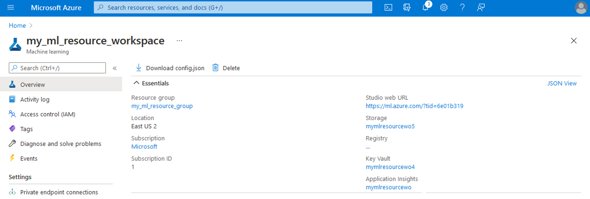

Most networked applications need to work with secrets, such as database connection strings or passwords. When performing machine learning on Azure, we normally use secrets to access training data or look at results. Particularly when working with private data, it’s important to make sure the secrets are properly managed.

## Don’t store secrets in source code

Storing secrets in source code is impractical and a security anti-pattern. This is for multiple reasons:

- Changing passwords means updating source code, which can mean rebuilding and republishing applications.
- Hard-coded secrets make it awkward to work with different environments, such as staging and production environments. This also increases the risk of inadvertent modification or destruction of production environment data during development.
- All people with access to the source code gain access to all secrets. This makes it near impossible to ensure that only senior team members have access to sensitive resources. It also means that any sharing, or leak, of your source code also provides outside parties with your security keys.
- Source control, such as git, will typically retain old passwords in history. This means future team members gain access to all historical passwords.

One of the best alternatives to storing secrets in source code is to make them available in the application environment. In this pattern, your application requests secrets from the environment and then uses these to connect to the requisite resources. The aforementioned drawbacks of storing secrets in source code are eliminated, so long as each environment has different secret values, such as different passwords to access certain resources.

## Azure Key Vault

Azure Key Vault provides secure storage of generic secrets for applications in Azure-hosted environments. Any type of secret can be stored, so long as its value is no larger than 25 kb and it can be read and returned as a string. Secrets are named, and their content type (such as password or certificate) can optionally be stored alongside the value to provide a hint that assists in its interpretation when retrieved.

Secrets stored in Azure Key Vault are encrypted, optionally at the hardware level. This is handled transparently, and requires no action from the user or the application requesting the secrets. They can also be temporarily disabled, and automatically activate or expire on a certain date.

## How Key Vault works with Azure Machine Learning

When you create an Azure Machine Learning workspace, this automatically creates a Key Vault. To view the Azure Key Vault associated with your workspace, open the workspace’s Overview tab. Your key vault appears on the right hand side.

> [!div class="mx-imgBorder"]
> 

When you first create your workspace, your Key Vault will be automatically created. The Key Vault can be accessed through your application. For example, you can use the Azure Shell to set an environmental variable holding Key Store’s name, and save a password to that key store like so:

```Bash
# export the name of the vault to an environmental variable 
export KEY_VAULT_NAME=<your-unique-keyvault-name> 
 
# Save a new secret, called ExamplePassword 
az keyvault secret set --vault-name $KEY_VAULT_NAME --name "ExamplePassword" --value "hVFkk965BuUv"
```

This password is stored securely and is encrypted. As an example, a Python application using Azure Machine Learning’s SDK can access this key as follows:

```Python
''' 
Simple example of obtaining a secret from the keyvault. 
Assumes azure-identity and azure-keyvault-secrets have been 
pip installed 
''' 
 
import os 
from azure.keyvault.secrets import SecretClient 
from azure.identity import DefaultAzureCredential 
 
# Get the key vault name 
keyVaultName = os.environ["KEY_VAULT_NAME"] 
  
 
# Create a client to access the secret 
credential = DefaultAzureCredential() 
client = SecretClient(vault_url= f"https://{keyVaultName}.vault.azure.net", credential=credential) 
 
# Get a secret and print it to the console 
# Note that printing out passwords is bad practice and only  
# performed here for learning purposes 
retrieved_secret = client.get_secret("ExamplePassword") 
print(f"Your secret is '{retrieved_secret.value}'")
```

The output is the original password that we stored:

```Bash
Your secret is 'hVFkk965BuUv' 
```

### Working with remote jobs

The above provides a generic solution to using Key Vault. Typically, with Azure Machine Learning, you'll be executing code through a remote run.

The standard flow for using secrets in this context is:

- Log in to Azure and connect to your workspace,
- Set a secret in Workspace Key Vault,
- Submit a remote job, then
- Within the remote job, get the secret from Key Vault and use it.

When using the Python SDK and a job, secrets can be easily accessed directly. This is because a submitted run is aware of its workspace. For example:

```Python
# Code in submitted job run 
from azureml.core import Experiment, Run 
 
run = Run.get_context() 
secret_value = run.get_secret(name=" ExamplePassword")
```

> [!div class="mx-imgBorder"]
> 

## Read more

For more information about using secrets to secure and access your data, we recommend these resources:

- [Azure Key Vault](/azure/key-vault)
- [The Keyvault class in the Python SDK](/python/api/azureml-core/azureml.core.keyvault.keyvault?view=azure-ml-py&viewFallbackFrom=azure-ml-py"\&preserve-view=true)
- [Using Secrets In Runs with Python](/azure/machine-learning/how-to-use-secrets-in-runs)
